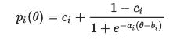

# 项目反应模型和神经网络？

> 原文：<https://towardsdatascience.com/item-response-model-and-neural-networks-bae4415b37bc?source=collection_archive---------5----------------------->

我必须承认的一点是，虽然多年来我一直断断续续地在我的一些工作中使用项目反应理论，但我认为我从未完全理解它的所有活动部分。

项目反应模型是用于通过测试评估“能力”的大型模型集的一部分。一个测试“项目”(即一个问题)，无论其结构如何，必然有两种可能的结果:应试者要么答对了，要么答错了。正确的概率是能力的函数。因此，换句话说，该模型将测试者的“能力”作为答对问题的预测指标。由于“测试”将包含大量的项目，考生的能力基本上是作为许多项目的加权平均值来衡量的。“能力”被转化为答对一个问题的概率的函数形式被假定为逻辑函数的形式，这多少有些武断。

总体思路应该会提醒你神经网络是如何工作的，即使 IRM 的工作方式并不完全相似(相差甚远)。人们可能会认为每个测试问题都是一种模式，它被“激活”以将潜在的“能力”(我们想要测量的)和观察到的结果联系起来——无论应试者的问题是对还是错。给问题分配权重类似于反向传播。(也许这并不令人震惊:作为一个概念，神经网络毕竟是认知心理学家的作品，他们也熟悉 IRM 背后的逻辑)。

IRM 潜在的更有趣的地方是它如何对待问题本身，除了它们是否被激活以及它们在多大程度上有助于获得“正确”的答案。它估计了每个问题的一些参数。由于这种媒介对插入方程不友好，为此我需要从维基百科复制并粘贴一张图片:

这是 IRM 三参数逻辑变量的函数形式。与“项目”相关的参数是 a、b 和 c，而θ是与应试者“能力”相关的参数给定相同的(假定的)能力水平，问题本身具有 3 个不同的特征。参数 b 捕捉“难度”，即对于给定能力的应试者来说，答对的难易程度。参数 c 捕捉“噪音”，即高能力考生得到“错误”答案或低能力考生得到“正确”答案的难易程度

然而，我之前没有想到的是参数 a，判别参数。在给定应试者的能力水平的情况下，通过调整激活函数的斜率(以及 P(正确|85+a)和 P(正确|85-a)之间的差异)，这捕获了该项目能够区分应试者能力(比如 85+a 和 85-a)的可能性。因此，IRM 的承诺是，通过利用基于参数 a 和 b 选择的问题的明智组合，可以构建一个侧重于特定能力范围的测试。

在某种意义上，将 IRM 直觉应用于 ML 问题比在测试环境中更容易。在测试问题中,“能力”是未知的。它们需要根据测试结果进行估计，并且使用能力估计值作为起点来估计单个测试项目的参数。在最大似然问题中，我们清楚地知道输入是什么。在每个分类问题(和神经网络应用)中，我们“知道”这些输入通过一些逻辑函数(或类似的函数)转化为结果，我们通过我们拥有的样本估计其参数:在纯逻辑模型中，我们估计“平均”数据、增强模型的参数，我们估计补充“主要”逻辑函数的附加模型/公式以解决分类误差，在神经网络中，我们估计一整串逻辑函数(作为各种节点的激活函数)，并根据每个逻辑函数对误差的贡献大小等迭代地对它们赋予权重。基于神经网络的模型更接近 IRM，至少在某种意义上，它估计了激活函数本身的一些参数，但它仍然有点幼稚，因为据我所知，它们是对整个样本(验证集)估计的参数。然而，似乎更合理的是，每个节点的辨别能力和相关的激活函数应该被概念化为输入的函数，并且用于特定组成的数据集的节点集合应该在此基础上被有策略地选择。让 IRM 适应 ML 环境指出了前进的方向——假设人们还没有这样做。

*大多数人把这个框架称为项目反应理论，缩写为 IRT。因为它只是一个概念框架，一个模型，而不是一个“理论”，称它为 IRM 似乎更合适一些，我坚持它。