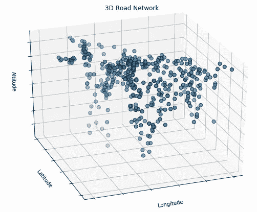
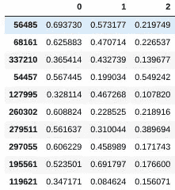

# 基于采样的迭代初始质心搜索 k 均值聚类算法

> 原文：<https://towardsdatascience.com/iterative-initial-centroid-search-via-sampling-for-k-means-clustering-2b505119ae37?source=collection_archive---------5----------------------->


“Black Night Sky” by [Shlomo Shalev](https://unsplash.com/@shlomo99?utm_source=medium&utm_medium=referral) on [Unsplash](https://unsplash.com?utm_source=medium&utm_medium=referral)

在这篇文章中，我们将着眼于使用迭代方法来搜索 k-means 聚类的一组更好的初始质心，并且将通过在我们的完整数据集的样本上执行这个过程来实现。

我们说的“更好”是什么意思由于 k-均值聚类旨在通过连续迭代收敛于聚类中心(质心)和基于距这些质心的距离的聚类成员的最优集合，直观地，这些初始质心的定位越最优，收敛所需的 k-均值聚类算法的迭代次数就越少。因此，考虑寻找一组更好的**初始质心位置是优化 k-means 聚类过程的有效方法。**

具体来说，我们要做的是从我们的完整数据集中提取一个数据样本，并对其运行 k-means 聚类算法的短期运行(不收敛)，短期运行将包括质心初始化过程，这是不必要的。我们将使用多个随机初始化的质心重复这些短时间运行，并将跟踪度量标准(类内平方和)的改进，以确定类成员的优度(或者至少是度量这种优度的有效度量标准之一)。与提供最低惯性的随机质心初始化迭代过程相关联的最终质心是质心集，我们将把该质心集带入我们的完整数据集聚类过程。

希望这项前期工作将为我们的完整聚类过程带来一组更好的初始质心，从而减少 k-means 聚类迭代次数，并最终减少完全聚类数据集所需的时间。

这显然不是优化质心初始化的唯一方法。在过去，我们已经讨论了[朴素分片质心初始化方法](https://www.kdnuggets.com/2017/03/naive-sharding-centroid-initialization-method.html)，一种用于最优质心初始化的确定性方法。对 k-means 聚类算法的其他形式的修改也采用了不同的方法来解决这个问题(参见 [k-means++](https://en.wikipedia.org/wiki/K-means%2B%2B) 进行比较)。

本帖将按如下方式处理我们的任务:

*   准备数据
*   准备我们的样品
*   执行质心初始化搜索迭代，以确定初始质心的“最佳”集合
*   使用结果对整个数据集执行聚类

为了更全面地理解实现的实用性，以后的文章将对质心初始化的各种方法的结果进行比较并报告。然而，现在让我们介绍和探索这种质心初始化的特殊方法。

# 准备数据

对于这个概述，我们将使用 [3D 道路网络数据集](https://archive.ics.uci.edu/ml/machine-learning-databases/00246/)。



由于这个特定的数据集没有缺失值，也没有类标签，我们的数据准备将主要包括归一化，同时删除一列来标识额外 3 列测量值来自的地理位置，这对我们的任务没有用处。更多详情参见[数据集描述](https://archive.ics.uci.edu/ml/datasets/3D+Road+Network+(North+Jutland,+Denmark))。

```
import numpy as np
import pandas as pd
from sklearn import preprocessing# Read dataset
data = pd.read_csv('3D_spatial_network.csv', header=None)# Drop first column (not required)
data.drop(labels=0, axis=1, inplace=True)# Normalize data (min/max scaling)
data_arr = data.values
sc = preprocessing.MinMaxScaler()
data_sc = sc.fit_transform(data_arr)
data = pd.DataFrame(data_sc)
```

让我们来看看我们的数据样本:

```
data.sample(10)
```



# 准备样品

接下来，我们将提取用于寻找“最佳”初始质心的样本。让我们明确一下我们到底在做什么:首先，我们从数据集中抽取一组样本；然后，我们将对此样本数据执行连续的 k-means 聚类，每次迭代将:

*   随机初始化 k 个质心并执行 n 次 k 均值聚类算法迭代
*   将记录每个质心的初始惯性(聚类内平方和),以及其最终惯性，并且在 n 次迭代中提供最大惯性增量的初始质心将被选为我们用于完整数据集聚类的初始质心

最后，我们将使用上一步中找到的初始聚类对整个数据集执行完整的 k-means 聚类。

2 个要点:

1.  为什么不使用惯性最大下降？(希望这一领域最初的势头能够持续下去。)。)这样做也是一个值得探索的有效选择(更改一行代码就可以做到这一点)。一个任意的初始实验选择，一个可能需要更多调查的选择。然而，对多个样本的重复执行和比较最初表明，惯性的最低值和最大下降值在大部分时间是一致的，因此决定*可能*实际上是任意的，但在实践中也是无关紧要的。
2.  特别澄清的是，我们没有从我们的数据集中多次采样(例如，质心初始化的每次迭代从我们的数据集中采样一次)。对于单个质心初始化**搜索**的所有迭代，我们采样一次。一个样本，我们将从中多次随机获取初始质心。与重复采样的想法形成对比，每次质心初始化迭代一次。

下面，我们设置:

*   样本量占整个数据集的比例
*   再现性的随机状态
*   数据集的聚类数(k)
*   k-means 算法的迭代次数(n)
*   在样本数据集上进行聚类时，尝试寻找最佳机会初始质心的次数

然后我们设置样本数据

```
# Some variables
SAMPLE_SIZE = 0.1
RANDOM_STATE = 42
NUM_CLUSTERS = 10     # k
NUM_ITER = 3          # n
NUM_ATTEMPTS = 5      # mdata_sample = data.sample(frac=SAMPLE_SIZE, random_state=RANDOM_STATE, replace=False)
data_sample.shape
```

现在，当我们有了数据样本(`data_sample`)时，我们准备好执行质心初始化的迭代以进行比较和选择。

# 样本数据聚类

因为 Scikit-learn 的 k-means 聚类实现不允许在聚类迭代之间容易地获得质心，所以我们必须对工作流进行一些修改。虽然`verbose`选项确实会将这方面的一些有用信息直接输出到 screen，并且重定向该输出，然后对其进行后解析，这将是获取我们所需要的信息的一种方法，但是我们要做的是编写我们自己的外部迭代循环来控制我们自己的 *n* 变量。

这意味着在每个聚类步骤运行之后，我们需要计算迭代次数，并在这些迭代之间捕获我们需要的内容。然后，我们将聚类迭代循环包装在质心初始化循环中，这将从我们的样本数据 m 次初始化 *k* 个质心。这是特定于我们的 k 均值质心初始化过程的特定实例化的超参数，超出了“常规”k 均值。

给定我们的上述参数，我们将我们的数据集聚类成 10 个聚类(NUM_CLUSTERS，或 *k* )，我们将运行我们的质心搜索 3 次迭代(NUM_ITER，或 *n* )，我们将尝试使用 5 个随机初始质心(NUM_ATTEMPTS，或 *m* )，之后我们将确定我们的“最佳”质心集，以初始化完整的聚类(在我们的情况下，度量是类内最小的平方和，或惯性)。

然而，在任何聚类之前，让我们看看在任何聚类迭代之前，我们的 k-means 的单个初始化是什么样的。

```
from sklearn.cluster import KMeanskm = KMeans(n_clusters=NUM_CLUSTERS, init='random', max_iter=1, n_init=1)#, verbose=1)
km.fit(data_sample)print('Pre-clustering metrics')
print('----------------------')
print('Inertia:', km.inertia_)
print('Centroids:', km.cluster_centers_)Pre-clustering metrics
----------------------
Inertia: 898.5527121490726
Centroids: [[0.42360342 0.20208702 0.26294088]
 [0.56835267 0.34756347 0.14179924]
 [0.66005691 0.73147524 0.38203476]
 [0.23935675 0.08942105 0.11727529]
 [0.58630271 0.23417288 0.45793108]
 [0.1982982  0.11219503 0.23924021]
 [0.79313864 0.52773534 0.1334036 ]
 [0.54442269 0.60599501 0.17600424]
 [0.14588389 0.29821987 0.18053109]
 [0.73877864 0.8379479  0.12567452]]
```

在下面的代码中，请注意，我们必须在每次迭代开始和结束时手动跟踪我们的质心，因为我们自己正在管理这些连续的迭代。然后，我们将这些末端质心作为初始质心送入下一次循环迭代，并运行一次迭代。有点乏味，而且令人恼火的是，我们不能直接从 Scikit-learn 的实现中得到这一点，但这并不困难。

```
final_cents = []
final_inert = []

for sample in range(NUM_ATTEMPTS):
    print('\nCentroid attempt: ', sample)
    km = KMeans(n_clusters=NUM_CLUSTERS, init='random', max_iter=1, n_init=1)#, verbose=1) 
    km.fit(data_sample)
    inertia_start = km.inertia_
    intertia_end = 0
    cents = km.cluster_centers_

    for iter in range(NUM_ITER):
        km = KMeans(n_clusters=NUM_CLUSTERS, init=cents, max_iter=1, n_init=1)
        km.fit(data_sample)
        print('Iteration: ', iter)
        print('Inertia:', km.inertia_)
        print('Centroids:', km.cluster_centers_)
        inertia_end = km.inertia_
        cents = km.cluster_centers_ final_cents.append(cents)
    final_inert.append(inertia_end)
    print('Difference between initial and final inertia: ', inertia_start-inertia_end)Centroid attempt:  0
Iteration:  0
Inertia: 885.1279991728289
Centroids: [[0.67629991 0.54950506 0.14924545]
 [0.78911957 0.97469266 0.09090362]
 [0.61465665 0.32348368 0.11496346]
 [0.73784495 0.83111278 0.11263995]
 [0.34518925 0.37622882 0.1508636 ]
 [0.18220657 0.18489484 0.19303869]
 [0.55688642 0.35810877 0.32704852]
 [0.6884195  0.65798194 0.48258798]
 [0.62945726 0.73950354 0.21866185]
 [0.52282355 0.12252092 0.36251485]]
Iteration:  1
Inertia: 861.7158412685387
Centroids: [[0.67039882 0.55769658 0.15204125]
 [0.78156936 0.96504069 0.09821352]
 [0.61009844 0.33444322 0.11527662]
 [0.75151713 0.79798919 0.1225065 ]
 [0.33091899 0.39011157 0.14788905]
 [0.18246521 0.18602087 0.19239602]
 [0.55246091 0.3507018  0.33212609]
 [0.68998302 0.65595219 0.48521344]
 [0.60291234 0.73999001 0.23322449]
 [0.51953015 0.12140833 0.34820443]]
Iteration:  2
Inertia: 839.2470653106332
Centroids: [[0.65447477 0.55594052 0.15747416]
 [0.77412386 0.952986   0.10887517]
 [0.60761544 0.34326727 0.11544127]
 [0.77183027 0.76936972 0.12249837]
 [0.32151587 0.39281244 0.14797103]
 [0.18240552 0.18375276 0.19278224]
 [0.55052636 0.34639191 0.33667632]
 [0.691699   0.65507199 0.48648245]
 [0.59408317 0.73763362 0.23387334]
 [0.51879974 0.11982321 0.34035345]]
Difference between initial and final inertia:  99.6102464383905...
```

完成之后，让我们看看我们在质心搜索中做得怎么样。首先，我们检查最终惰性的列表(或组内平方和)，寻找最低值。然后，我们将相关的质心设置为下一步的初始质心。

```
# Get best centroids to use for full clustering
best_cents = final_cents[final_inert.index(min(final_inert))]
best_cents
```

这是这些质心的样子:

```
array([[0.55053207, 0.16588572, 0.44981164],
       [0.78661867, 0.77450779, 0.11764745],
       [0.656176  , 0.55398196, 0.4748823 ],
       [0.17621429, 0.13463117, 0.17132811],
       [0.63702675, 0.14021011, 0.18632431],
       [0.60838757, 0.39809226, 0.14491584],
       [0.43593405, 0.49377153, 0.14018223],
       [0.16800744, 0.34174697, 0.19503396],
       [0.40169376, 0.15386471, 0.23633233],
       [0.62151433, 0.72434071, 0.25946183]])
```

# 运行全 k 均值聚类

现在，有了我们最好的初始质心，我们可以在我们的完整数据集上运行 k-means 聚类。由于 Scikit-learn 允许我们传入一组初始质心，我们可以通过下面比较简单的代码来利用这一点。

```
km_full = KMeans(n_clusters=NUM_CLUSTERS, init=best_cents, max_iter=100, verbose=1, n_init=1)
km_full.fit(data)
```

这种特殊的 k 均值运行在 13 次迭代中收敛:

```
...start iteration
done sorting
end inner loop
Iteration 13, inertia 7492.170210199639
center shift 1.475641e-03 within tolerance 4.019354e-06
```

为了比较，这里有一个完整的 k 均值聚类运行，只使用随机初始化的质心(“常规”k 均值):

```
km_naive = KMeans(n_clusters=NUM_CLUSTERS, init='random', max_iter=100, verbose=1, n_init=1)
km_naive.fit(data)
```

这次运行花费了 39 次迭代，具有几乎相同的惯性:

```
...start iteration
done sorting
end inner loop
Iteration 39, inertia 7473.495361902045
center shift 1.948248e-03 within tolerance 4.019354e-06
```

我将寻找 13 次迭代和 39 次迭代(或类似的)之间的执行时间差异留给读者。不用说，从长远来看，提前几个周期吃掉一个数据样本(在我们的例子中，是整个数据集的 10%)节省了相当多的周期，而不会牺牲我们的总体集群度量。

当然，在得出任何概括之前进行额外的测试是有保证的，在未来的帖子中，我将在各种数据集上对许多质心初始化方法进行一些实验，并与一些额外的度量进行比较，希望能够更清楚地了解如何优化无监督学习工作流。

这篇文章最初发表在 KDnuggets 上。