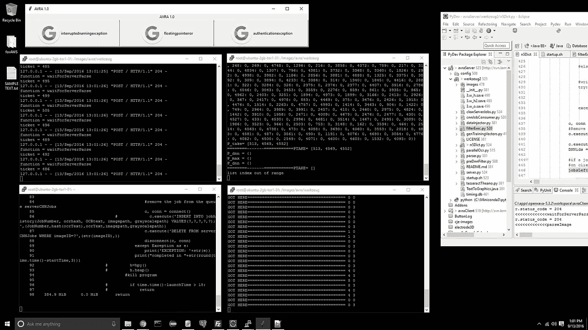

# 它还活着！构建通用人工智能是未来

> 原文：<https://towardsdatascience.com/its-alive-building-general-ai-is-the-future-ddd8f75d09dc?source=collection_archive---------5----------------------->

我的朋友们一次又一次地听到我这样说。人工智能正在走向超越人类自动化的认知“生活”。计算机(真的是人工智能)将开始采取主动，有目的地行动，而不是成为那个"[快速的白痴](http://www.anvari.org/shortjoke/Taglines_MR/1700_computer-com-pyoo-ter-n-incredibly-fast-idiot.html)"我们在过去几十年的计算机架构中已经非常了解这一点。我将在 7 月提交两篇关于这个主题的论文。一个关于无监督学习，另一个关于计算机视觉。两者都是关于人工智能主动远离人类。

这是一个大的想法:我们可以使用人工智能来为我们思考，就像一个帮助我们的伙伴一样。我们正朝着一个方向前进，在这个方向上，执行任务的认知压力将被人工智能人才的不断上升所抵消。具体来说，我们可以将人工智能作为一种工具来提高我们的生产力，从自动驾驶汽车(强化学习)到寻找屏幕错误信息的解决方案(监督或无监督学习)。

后一个例子是最近这些论文的主题。我和我的合作者开发了一种只使用屏幕图像来观察计算机屏幕的人工智能，并通过观察用户的行为来学习帮助用户。帮助以可点击按钮的形式提供。单击按钮会执行广告的操作。例如，查找与屏幕上的编译器错误信息相关的堆栈交换页面。人工智能将很快从任务自动化(帮助人类)的低级角色中爬出来，直接进入自我指导的活动。乍一看，这似乎是一件坏事，但放大来看，这可能会是一件好事。

An AI system that offers to help users perform actions with the click of a button.

一个自我激励的人工智能会是什么样子？我们来玩创世纪吧。它需要有一些像眼睛一样的感知能力。那将是一个或多个卷积神经网络(CNN)。它需要一些内部系统来根据过去预测未来。也许这将是一个 LSTM 系统。它将需要某种方法来学习基于经验的规则，比如用策略网络来指导信息系统开发的强化学习。它还可能有一个生成性对抗网络(GaN)来与自己对抗并模拟行动的结果。关系网络(RN)和视觉互动网络(VIN)也可以帮助推理。它将需要效应器和传感器与世界互动，我相信这些将是互联网接入，音频输入/输出，投影仪和/或屏幕。我不认为实际的机器人技术是人工智能的逻辑步骤。为什么要有身体？这只会让出行变得更加缓慢。我们不应该把 AI 拟人化。这是新的东西。

从这里到自我激励的人工智能的路径是模糊的，但不是不可能看到的。我不相信会是一些偶然发现的侥幸给我们带来自我激励的人工智能，就像[一个股票市场机器人失控](https://en.wikipedia.org/wiki/2010_Flash_Crash)。不，这将是研究人员有意为之。在科学领域，当某件事看似可能时，书呆子们就会去工作。我们快速行动，打破常规，最终展示一个演示。

不过，这是件好事。我不是一个煽动对人工智能恐惧的人。我认为看到人类是否能接受人工智能将是令人兴奋的。到目前为止，我们的社会在接受持续自动化和语音人工智能方面做得非常好。这最后一步——产生有自我意识的生物——可能是我们做过的最伟大的事情。我是作为三个孩子的父亲说这番话的；不是为了夸张。

不是所有的反超级智能，但未来看起来是光明的。是的，我们有道德和社会问题要解决。也许我们需要一个[全民基本收入](https://futurism.com/images/universal-basic-income-answer-automation/)。也许我们需要重新思考资本主义，转向星际迷航式的治理模式。谁知道呢。但至少现在，让我们坐下来欣赏这场表演。我们没有被卡住。进展非常快。

我很期待接下来会发生什么。

编码快乐！

-丹尼尔
[丹尼尔@lemay.ai](mailto:daniel@lemay.ai) ←打个招呼。
[LEMAY . AI](https://lemay.ai)
1(855)LEMAY-AI

您可能喜欢的其他文章:

*   [人工智能和不良数据](/artificial-intelligence-and-bad-data-fbf2564c541a)
*   [人工智能:超参数](/artificial-intelligence-hyperparameters-48fa29daa516)
*   [人工智能:让你的用户给你的数据贴上标签](https://medium.com/towards-data-science/artificial-intelligence-get-your-users-to-label-your-data-b5fa7c0c9e00)