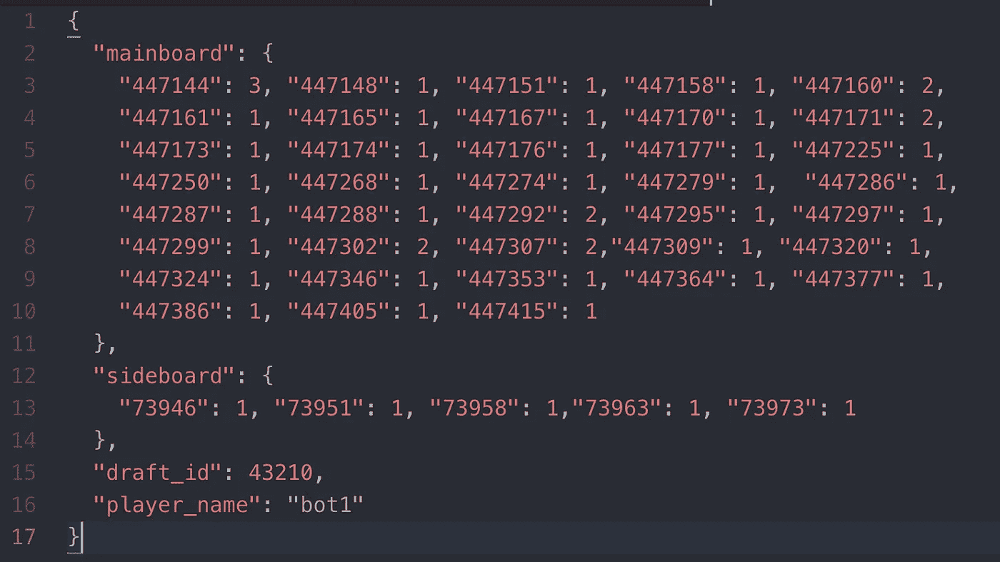
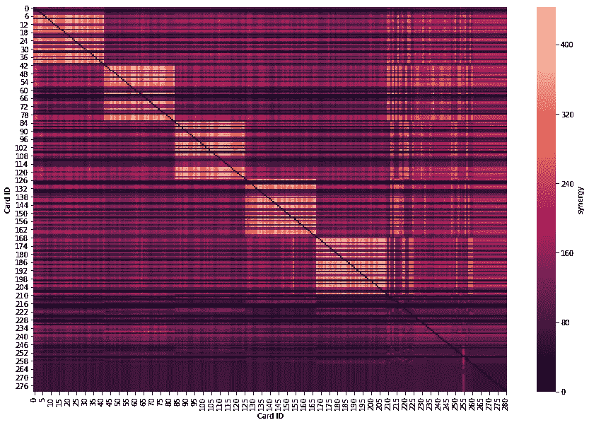
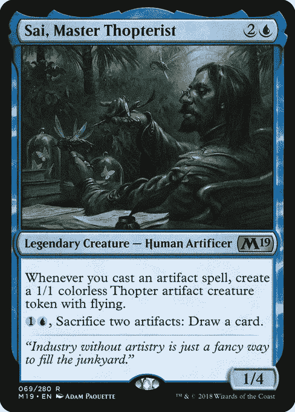
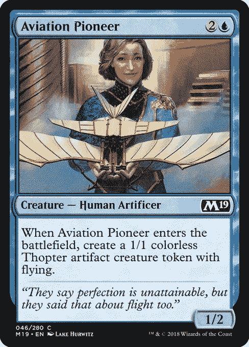
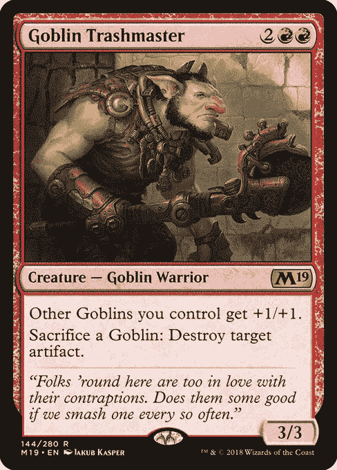
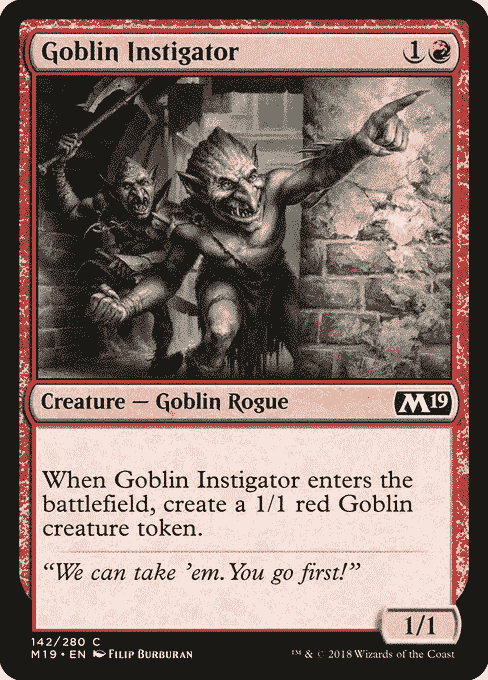
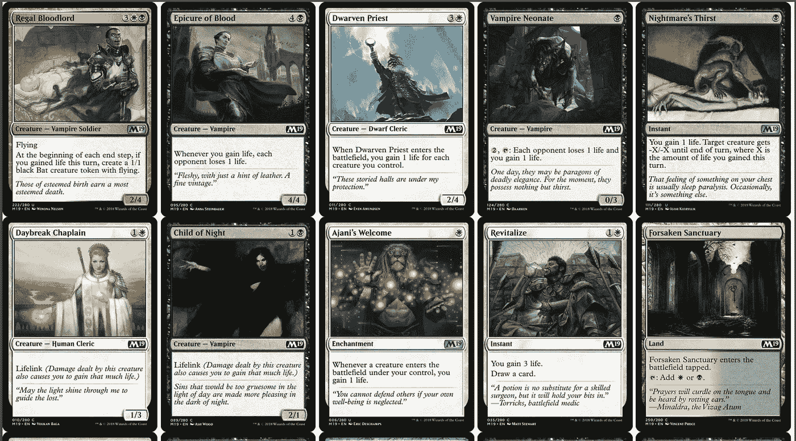
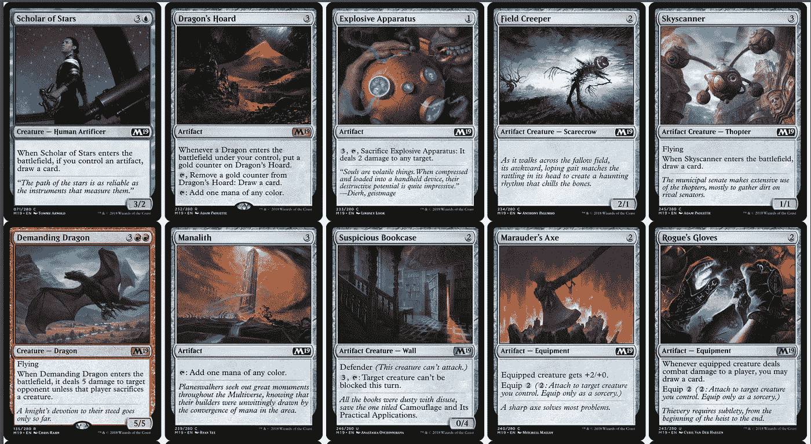
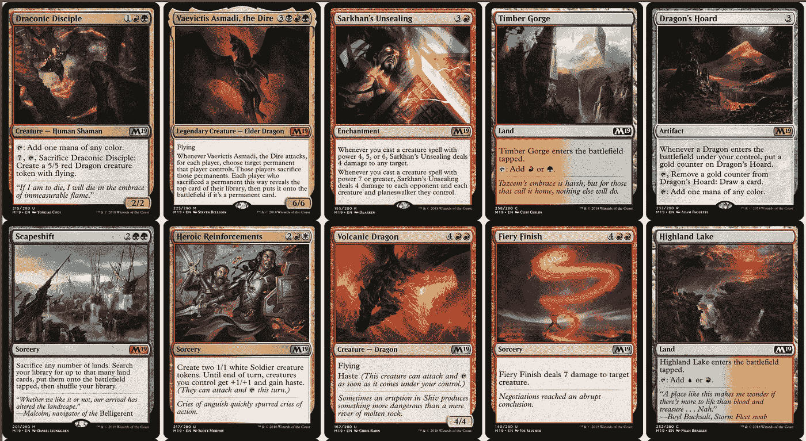

# 这是魔术:M19 的趋势

> 原文：<https://towardsdatascience.com/its-magic-data-science-lab-project-bbf73f2b6eef?source=collection_archive---------20----------------------->

## 分析万智牌甲板模式并根据过去的草稿预测起草顺序

# **一、背景**

该项目由[丹尼·沃](https://www.linkedin.com/in/danny-vo-357217135/)、[特洛伊·斯蒂德](https://www.linkedin.com/in/troy-stidd-9121b412a/)、[帕特里克·朱](https://www.linkedin.com/in/patrick-zhu1/)、[亚伦·李](https://www.linkedin.com/in/aaron-li-70a482149/)、[塞缪尔·张](https://www.linkedin.com/in/samuel-zhang-bb01874b/)打造。我们项目的代码可以在这个 [repo](https://github.com/patrickzhu7/DSLab) 中找到。对于我们的项目，我们选择寻找万智牌(MTG)领域的问题，因为我们的小组拥有一些领域知识，并且有可能将我们的爱好与数据探索问题/优化问题结合起来。

**背景**:你可以通过这个[链接](https://mtg.gamepedia.com/Booster_Draft)更正式的了解 MTG 的 Booster 草案格式。快速概述，MTG 的助推器包有 15 个独特的卡。在助推器草案期间，每个球员有 3 个助推器包。每个玩家将打开他们的第一个包，并选择一张卡片。然后他们会把剩下的牌传给下一个玩家，再选一张牌。这种情况一直持续到所有的牌都被挑完，剩下的牌包将在用完前一包中原来的 15 张牌后被打开。玩家将以 45 张牌结束选秀，他们将用这些牌组成他们的锦标赛牌组。

此外，一个重要的注意事项是，升压包来自特定的卡组。一些例子集是“终极大师”，“核心集 2019”等。升压包可能包含许多卡片。因此，在一个典型的助推器草案起草阶段，所有三个包将来自同一套。

**目标**:我们的目标是使用我们的数据，看看我们是否可以训练一个(些)模型来生成甲板原型，并为 MTG 的增强草案格式提出选秀建议。

# 二。数据

我们的数据集来自一个名为 [Top8Draft](http://www.top8draft.com/) 的网站，该网站使用机器学习对模拟草稿进行评分。我们联系了网站的所有者，他慷慨地给了我们 280，421 个模拟甲板的数据，用于我们的模型建筑。图 1 显示了一个样本面板(JSON 格式)。

Figure 1: Each deck from [Top8Draft](http://www.top8draft.com) has a set of a card IDs (which refers to a unique card from MTG) along with the frequency of the card in the specific deck.

我们使用一个名为 [Scryfall](https://scryfall.com/) 的公开可用的 MTG 卡片 API 将我们起草的卡片组分成各自的组。对于剩余的建模/数据探索，我们选择使用“核心集 2019”集(通常缩写为 M19)来限制可变性，使我们更容易生成可用的结果。

*注意:我们最初试图在所有甲板上运行我们的模型(没有分成组)，我们得到的原型(将在后面解释)没有意义，因为甲板原型来自各种组，而不是单个组。*

# 三。排名卡协同

为了探索我们的数据集，我们决定处理数据，尝试排名卡协同作用。利用用户草案是合理选择的假设，我们能够为 M19 集生成顶卡协同效应。我们通过计算一张卡片与其他卡片出现的频率来对卡片进行成对排序，然后通过卡片之间各自的计数来确定它们的排序。我们的发现如图 2 所示。

*观察:起初，我们注意到我们的原始协同得分严重偏向普通卡片，因为它们更经常出现在包中。为了解决这个问题，我们通过将分数除以每副牌的数量来“标准化”数据。这可能会使我们的数据偏向更稀有的卡片，但无论如何这是一个更好的解决方案，因为它们固有的卡片价值。理想情况下，如果我们有更多功能的数据，我们可以根据卡片的价值对其进行排序，但考虑到我们的数据限制，这是一个令人满意的解决方法。*

Figure 2: A “heatmap” representation of our synergy scores between cards. As you can probably see, there are blocks of high synergies along the main diagonal. This is expected because cards of the same color, or “card type,” are given IDs in sequential order. (made with Seaborn)

我们还以卡片形式收录了一些表现最佳的协同组合:

Figure 3: This was our highest synergy pair with a Rare card, Sai, and a common card. It’ s interesting to note that both of their abilities result in a 1/1 Thopter artifact creature.

Figure 4: Our next highest ranking pair has a similar construct of a Rare, Goblin Trashmaster, and a common, Goblin Instigator.

# 四。生成原型

**方法论**:我们使用了一个潜在的狄利克雷分配(LDA)模型来生成 M19 集合的“原型”。我们希望这将产生符合普通起草策略的特色套牌，并可能揭示一些关于起草的“隐藏”见解。我们这种方法的灵感来自于[这款笔记本](https://github.com/hlynurd/lda-for-magic/blob/master/lda-mtg-notebook.ipynb)，它以前是《海岸巫师》的特色。

更多关于 LDA 的正式解释可以通过[维基百科](https://en.wikipedia.org/wiki/Latent_Dirichlet_allocation)和 [TowardsDataScience](/topic-modeling-and-latent-dirichlet-allocation-in-python-9bf156893c24) 找到(其中包括一些例子)。LDA 是自然语言处理中常用的主题建模算法。我们选择了 LDA，因为它似乎是一种有趣的方式，可能产生 MTG 原型，或共同的甲板身份，给定类似于“文件”的甲板结构。

出于我们的目的，我们将卡片视为“文档”，将卡片本身视为“单词”，希望找到我们的“主题”，也就是我们的原型。我们使用 [gensim](https://radimrehurek.com/gensim/) ，一个主题建模库，用于我们的 LDA 模型。

对于狄利克雷参数，我们在*【1.0/原型】*原型*之前设置我们的 alpha，在*【1.0/原型】* unique_cards* 之前设置我们的 beta。(我们确信我们的每个文档都包含一个原型，这就是为什么 alpha 等于 1。对于我们的测试版，我们希望测试版随着独特卡的数量而扩展)。

对于我们的 M19 草案，我们在我们想要生成的原型数量上做了大量的尝试，发现当我们生成 30 个原型，每个原型有 45 张卡时，我们的结果是最好的。

下面以卡片的形式展示了一些产生的原型。为了可读性，我们只包括了每个原型大约 10 张卡片。原型的完整 PDF 可以在[报告](https://github.com/patrickzhu7/DSLab)中找到，或者通过[链接](https://drive.google.com/file/d/1b411MG9uphujtSWhaQE4wNYIqp5WLD0X/view)找到。

Figure 5: Archetype #1 is a white/black deck strategy built around the Uncommon card, Regal Bloodlord, which can be used as both white and black.

Figure 6: Archetype #2 is a Artifact Deck with some red/blue cards sprinkled in.

Figure 7: Archetype #4 appears to be a red/green deck which is built around the Legendary, Vaevictic Asmadi, and/or the Uncommon, Draconic Disciple.

*注意:PDF 中的卡片是按照它们出现在每个原型中的概率排序的。*

首先要注意的是，原型通常不超过两种原色(可能还有第三种或第四种第二色)。万智牌的每种颜色通常都有一些相关的属性。比如，抽牌通常和蓝色联系在一起，法术伤害通常和红色联系在一起。扩展集是为某些颜色设计的，以便与其他颜色很好地协同，因为草稿甲板通常是两种或三种颜色。

这些元素显示在上面的示例 LDA 原型中。即使有两种以上的颜色，像原型#4，第三和第四种颜色表现得很轻。

原型的另一个可能的焦点是卡片类型。如原型#2 所示，这些牌围绕着神器牌类型同生。魔法中的许多神器都是无色的，但即使是这个原型中的有色卡也会奖励玩家使用神器。

# 动词 （verb 的缩写）建议选秀权

起初，我们希望使用我们的原型结果来建议选秀，但是结果不会非常有用，因为原型没有明确说明卡的协同作用或卡的强度，这可能会迫使算法选择较弱的卡来尝试匹配特定的原型，而不是选择最好的。此外，该算法不需要任何机器学习，这对类本身没有太大帮助。

相反，我们尝试使用 XGBoost 多标签分类器来预测每回合使用哪张牌。我们的功能旨在存储当前棋盘和玩家手牌的“状态”。每一行都有玩家当前手里的牌(二进制—包括或不包括)以及当前牌包中的可用牌。我们基于从[顶部 8 草稿](http://www.top8draft.com/)刮取的 4000 份草稿日志来训练我们的模型。

*注意:起初我们有 25565 个从 Top8Draft 刮来的草图日志，然而因为每个草图包含 45 个“转弯”,我们有超过 110 万个可用的特征行。我们遇到了数据帧的内存限制，因此我们必须限制用于模型训练/测试的日志数量。虽然有 4，000 个草案日志，但我们仍有近 180，000 行数据。*

*假设:我们假设用户选秀是最佳选择，即使一般的 MTG 球员可能并不总是最佳选择。例如，玩家经常因为个人偏好特定的牌而打草稿，或者新手玩家可能不熟悉牌之间的协同作用。我们希望草稿的数量会减少次优草稿的影响，但是我们关于最优性的假设可能会直接降低我们的准确性。*

调优后，我们实现了大约 35，000 行的大约 63%的测试精度。相比之下，简单的猜测会产生大约 22%的正确率，我们的结果有非常显著的 p 值(μ:. 22；σ: .415;n: 35，532 个样本)。

我们的模型无法达到我们希望达到的 80%的正确率，但对于一个玩家来说，每 15 张牌中选择大约 9 张“最优”牌大约是一个普通 MTG 玩家的水平。随着更多的数据和可能更多的关于草稿质量的分析，该模型肯定可以改进以获得更好的准确性。

# 动词 （verb 的缩写）走向

将来，我们希望重新训练该模型以优化其建议，并探索其他 MTG 集。由于内存限制，我们只使用了 25，565 个草稿日志中的 4，000 个。然而，我们相信随着数据的增多，模型的准确性会显著提高。我们还希望将我们的卡片协同效应和卡片组原型发现与建议模型相结合。另一种选择是尝试神经网络方法，这也可以提高准确性或揭示关于数据集的新见解。虽然有许多路线继续这个项目，MTG 是一个复杂的游戏，我们只探讨了其中一个格式的一套。我们的技术可以重复使用，以探索游戏的其他方面，并可能向社区揭示新的、有见地的信息。