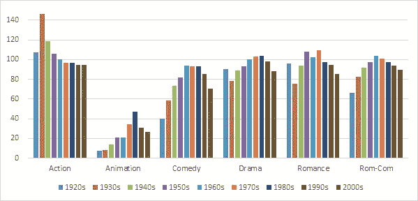
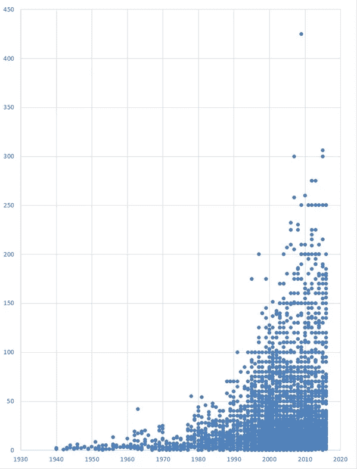
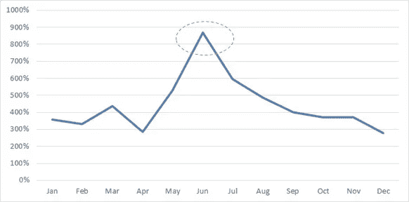
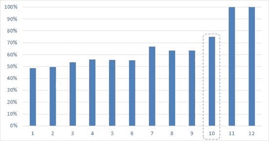

# 数据中的故事:伙计们，表演时间到了！

> 原文：<https://towardsdatascience.com/its-showtime-folks-d9fd274810c8?source=collection_archive---------10----------------------->

想到电影你会想到什么？关于故事情节、人物、对话、美丽的人和激动人心的地点？我也是。但由于沉浸在我碰巧从事的职业中，我也想到了那些不太明显的故事，那些关于电影业务的丰富数据可以揭示的故事，那些与电影院大厅内发生的事情一样引人入胜的故事！

在之前的 [**帖子**](https://medium.com/@shamliprakash_47201/what-do-i-do-d8bb51c8f48a) 中，我谈到了数据分析本质上是一门艺术(是的，我知道，这也涉及到许多科学和技术)，即发现并讲述隐藏在数据中的故事。为了说明我的意思，我想举一个恰当的例子。因为我碰巧是一个狂热的电影爱好者，有什么比电影院更好的地方开始。

**序幕**

在我开始之前，分享一些关于我所使用的数据和我所采取的广泛方法的初步笔记是很重要的。关于电影有相当数量的可用数据(我这里指的是免费提供的数据)，但是其中很多都不是很全面。我挑选了两个数据集，都可以在 StatCrunch(一个现在由 Pearson 拥有的统计分析工具)上找到。

1.  第一个数据集是从 IMDB 电影数据库创建的。它包括自 1920 年以来制作的大约 58，000 部电影。它有关于电影的基本信息，如名称，发行年份，类型，电影长度等。，以及一些客户评级信息(主要是投票数和平均。评级)。
2.  第二个数据集包括近几十年来制作的大约 4，500 部电影，其中包含电影何时上映、制作成本以及票房收入等信息。

为了像一个真正的分析项目那样做，我还将列举一些分析的局限性:

*   如上所述，这些数据集不是完整的，而是样本。因此，它们可能存在一定的采样偏差。
*   在进行任何分析之前，我所做的数据清理仅限于删除重复记录和缺少关键数据字段的记录。当然，还可以做更多的事情来提高数据完整性，但是对于我的目的来说，这已经足够了。
*   最后，请记住，本练习的目的是从较高的层面说明数据如何讲述有力的故事。所以，如果你想用这个来计划你的下一部大片，那么你要自担风险！

说完这些，让我们直接进入我们的故事。所以坐好，嚼点爆米花，想象一下…

**第 1 章:设定**

**(i)** **电影数量**:曾几何时，准确地说是回到 20 世纪 20 年代，制作的电影屈指可数。随着技术的飞跃(如 20 世纪 20 年代中期有声电影的引入)和电影作为一种有吸引力的经济主张的出现，这种情况迅速发生了变化。在过去的 80 年里，每年制作的电影数量几乎增长了 25 到 30 倍。

**(二)** **类型:**围绕电影的类型或类型也出现了有趣的趋势。例如，在电影制作的最初几十年，几乎没有任何动作电影被制作，而自 20 世纪 70 年代以来，动作电影的数量一直在稳步增长，这是以所有其他类型的电影为代价的。另一个有趣的现象是 20 世纪 30 年代和 40 年代喜剧电影的兴起。这是世界经历最艰难的时期(大萧条，第二次世界大战)。尽管这似乎有悖常理，但它符合一个众所周知的事实，即在大萧条最糟糕的几年里，当失业率达到创纪录高位时，数百万人仍然涌向剧院，可能是为了逃避现实。

**(iii)** **电影长度**:动作片在作为最长的电影类型开始后，已经在 90 分钟的甜蜜点上安顿下来。戏剧和爱情也是如此。一般来说，喜剧通常要短一点。电影的长度随着时间的推移而演变，通常从较短开始，随着时间的推移而增加，最后逐渐减少到今天的长度。

在大约 58，000 部电影中，只有 245 部(即 0.4%)超过了 200 分钟(即 3 小时 20 分钟，换句话说，loooong！).这种长电影的频率一直在稳步下降，其中很多是非英语电影。

Image 1: *Distribution over time of movie length by genre (# of Minutes)*

第二章:给我钱！

就像一个好的故事在搭建好舞台后会变得更有趣一样，我们在这里也会这样做。还有比金钱话题更有趣的，所以让我们直接开始吧。*(注意:这种特殊的分析是基于约 4500 部电影的较小样本数据集，其中成本和收入数据是可用的)。*

预算:制作一部电影的费用一直在稳步增长。这当然是意料之中的——毕竟，做任何事情所需要的钱都在增加(这叫做通货膨胀，废话！).然而，它仍然是有趣的，因为这种增长已经远远超过了仅仅由通货膨胀所能解释的。其他可能导致这种情况的因素包括更大的技术游戏、名人文化(即大人物的高薪)、从工作室/布景拍摄到现实生活场景的范式转变等。

Image 2: Scatter chart for movie budgets over time (in USD Millions)

如果你像我一样好奇的话，右上角的那个点就是《阿凡达》(2009 年，预算 4.25 亿美元)。紧随其后的是几部大预算电影，如《星球大战》Ep。VII:《原力觉醒》(2015 年，3.06 亿美元预算)、《加勒比海盗:在世界的尽头》(2007 年，3 亿美元预算)和《幽灵党》(2015 年，3 亿美元预算)。

毫不奇怪，如果我们在预算中应用一个类型过滤器，最惊人的增长是动作和动画电影。

**(ii)** **Returns** :先不说成本，现在让我们来谈谈收入。让我写下数据揭示的一些重要信息:

*   在现有的数据集中，有 281 部电影取得了超正常的回报(即大于 1000%)。其中 242 部(86%)是在不到 2000 万美元的低预算下制作的。唯一一部有如此回报的大预算电影是《泰坦尼克号》(预算:2 亿美元，全球总票房:22 亿美元；1004%的回报)。
*   另有 384 部电影取得了非常高的收益(在 500%到 1000%之间)。许多大预算电影都落在这个桶里，例如八部哈利波特电影中的七部，阿凡达，侏罗纪公园，复仇者联盟，冰雪奇缘，星球大战 Ep VII，四部饥饿游戏电影中的两部等。
*   很大一部分人(几乎三分之一)在海外收藏中赚的钱比美国国内收藏多。175 部电影海外票房是国内票房的 10 倍以上。

这里有一个奖励——历史上获得最大回报的电影是 1972 年的《深喉》(惊喜！).制作预算为 25，000 美元，据说其全球收藏约为。4500 万美元(有人估计甚至更多)——这是 179，900%的回报率。这意味着，如果你在这部电影的制作中投资 1000 美元，你会从中赚到 180 万美元——客观地说，这比你在苹果公司刚上市时投资苹果股票的回报要高得多！

关于回报的话题，另一个有趣的观察是关于时机。即使在 5 月和 12 月等几个月，看电影的总支出较高，但 6 月的回报最高，明显高于其他月份。这是因为低预算电影在 6 月上映还是因为它们更成功，这需要进一步的探索，我还没有做过。无论如何，对你来说，最重要的当然是在六月上映你一直想看的电影！

Image 3: Average %age Return by Month

**(三)** **一败涂地**:既然我们已经谈论了电影业务的成本和回报，那么我们来仔细看看那些没有真正抓住观众兴趣或金钱的电影怎么样。

*   破产电影的总损失高达 150 亿美元(仅在我们的小样本数据中)。
*   榜单中最大的输家是耗资 2.75 亿美元的《独行侠》(2013)。它勉强收回成本。这个故事的寓意——约翰尼·德普不是所有问题的答案(尽管，如果我们完全诚实的话，通常他肯定是！)
*   1980 年后，赔钱的电影数量显著增加。显然，对此的简单解释是，正在制作的电影总数本身显著增加。
*   数据显示，随着电影上映日期向月末移动，失败电影的分布要高得多，超过 40%的失败电影在当月 21 日至 31 日之间上映。

**第三章:只有文字……**

数据分析最有趣的方面之一是对非结构化文本数据的分析。使用各种技术来实现这一点，包括复杂的自然语言处理(NLP)元素。不过，为了我今天故事的目的，我坚持一些相对简单的分析，希望能展示单词调查的力量。

**(一)** **文本元素:**对电影名字的基本参数的研究揭示了一些好奇的事情。让我们来看看:

*   电影名字开头最常见的字母是 ***T*** 。它远远高于其他字母，这要感谢所有以“the”开头的电影。不过 T 之后最常见的字母依次是***S******M******B***和 ***A*** 。
*   如果电影名称以 ***Z*** 开头，则电影翻牌的概率最高。在我们的数据集中，以字母 Z 开头的电影有 40%失败了，而整个数据集中的失败率为 27%。
*   另一方面，如果电影名称以 ***X*** ， ***N*** ， ***Q*** 或一个数字开头(最后数据支持命理学！).一些例子——大人物拿破仑(2004 年，11，431%的回报率)、诺丁山(1999 年，766%的回报率)、老无所依(2007 年，556%的回报率)、四重奏(2012 年，411%的回报率)、x 战警(2000 年，295%的回报率)、xXx (2002 年，282%的回报率)等。
*   电影标题的字数和获得高回报的概率之间似乎存在直接的关联。

Image 4: *%age of movies with greater than 100% return on budget by # of words in movie title*

例如，在我们的数据集中，75%的片名为 10 个单词的电影都非常成功。以下是一些名字:

*   《指环王:王者归来》(1114%)
*   《指环王:魔戒相交》(714%)
*   加勒比海盗:黑珍珠号的诅咒(408%)
*   亚历山大和可怕的，可怕的，不好的，非常糟糕的一天(262%)
*   忍者神龟 2:软泥的秘密(215%)
*   纳尼亚传奇:黎明踏浪号的航行(170%)

**(ii)****有一种 NLP 技术叫做 ***【单词袋】*** 。不严格地说，单词包模型将对文本字段中不同单词的出现次数进行数字计数，以便从中进行推断。我在我们的数据集上做了一个粗略的版本，就像任何文本分析通常的情况一样，即使是这个简单的探索也揭示了一些有趣的事情。**

*   **如果你忽略了一些常用词(如‘The’，‘A’，‘An’，‘In’，‘To’等)。)，在电影片名中出现次数最多的词是——lo and look——***‘Man’。*** 谈生活在男权社会！不仅如此，这也是一个好词，因为几乎 70%的以“男人”为片名的电影都赚了大钱。**
*   **另一方面，很少(很多很多)电影在标题中有 ***【女人】*** 这个词。对于阅读这篇文章的女性来说，唯一的安慰是，几乎所有这些都带来了极高的回报。**
*   **其他非常常见的词还有 ***【电影】【爱情】【最后】【天】****【死亡】* 等等。**
*   **标题中的颜色名称做得很好，尤其是***‘黑色’。*****
*   **所有片名中有日名的电影都做得极其好(> 100%回头率)，尤其是***‘星期五’。*****

****后记:****

**总之，如果你打算拍一部电影，请记住这些提示，所有这些都深深扎根于实际数据中，因此纯粹从概率上来说，会给你更高的成功机会:**

**用相对较低的预算制作一部电影(< $20 Million), release it in the first part of June, make sure the movie name starts with an N, X or Q. Put in 10 or more words in the title and include the words MAN, BLACK and FRIDAY for some additional magic. (And then don’t forget to come and tell me how it went — if you are making a hit movie, I’m pretty sure I want to know you!)**

***End Note:我要重申，对于任何可能已经结束在这里，并可能在这一点上沸腾和愤怒的纯粹主义者，我在这里的意图主要是展示分析的深度和各种各样的见解，当一个人开始涉足数据世界时，这些都是可能的。在这里，我仅仅触及了表面，而且是在有限的数据集上——随着更多的数据、更多的时间和更复杂的科学，更多的事情是可能的。***

**如果你对电影行业有一些有趣的数据支持的见解，我很想听听你的看法。请在评论中告诉我。**