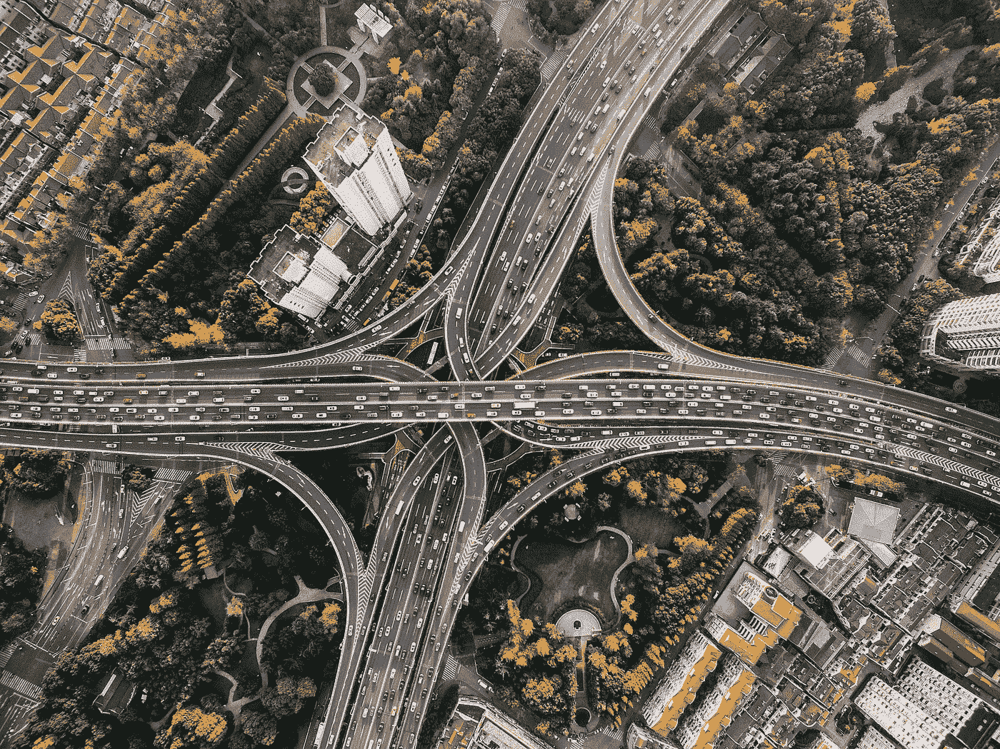

# 一月版:自动驾驶汽车

> 原文：<https://towardsdatascience.com/january-edition-self-driving-cars-ab4e59fbd7b5?source=collection_archive---------7----------------------->

## 10 篇必读文章

## [了解 SSD 多盒子——深度学习中的实时对象检测](/understanding-ssd-multibox-real-time-object-detection-in-deep-learning-495ef744fab)

由[埃迪·弗森](https://medium.com/u/89ef0c2275f1?source=post_page-----ab4e59fbd7b5--------------------------------) — 11 分钟阅读。

自从 [AlexNet](https://papers.nips.cc/paper/4824-imagenet-classification-with-deep-convolutional-neural-networks.pdf) 在 2012 ImageNet 大规模视觉识别挑战赛(ILSVRC)上席卷研究界以来，深度学习已经成为图像识别任务的首选方法，远远超过了文献中使用的更传统的计算机视觉方法。

## 自动驾驶汽车，自…赛格威以来最受关注的东西？

由[郭晓非](https://medium.com/u/629b67cb9826?source=post_page-----ab4e59fbd7b5--------------------------------) — 8 分钟读完。

有了这样的头条新闻，很难不为自主和自动驾驶汽车感到兴奋。毕竟，我们看过《少数派报告》、《全面召回》和《iRobot》中的汽车，并对自己说:“我们什么时候才能最终进入那些*汽车？”*

## [车辆检测与跟踪](/vehicle-detection-and-tracking-44b851d70508)

由伊万·卡萨科夫 — 7 分钟读完。

这是 Udacity 的自动驾驶汽车工程师纳米学位项目 第一学期的最终项目。源代码和技术上更详细的文章可以在 [**GitHub**](https://github.com/antevis/CarND-Project5-Vehicle_Detection_and_Tracking) 获得

## [深度学习的车道检测](/lane-detection-with-deep-learning-part-2-3ba559b5c5af)

迈克尔处女座 9 分钟阅读。

即使在各种各样的条件下，人们也可以相当容易地找到道路上的车道线。除非有雪覆盖地面，降雨量非常大，道路非常脏或年久失修，我们可以告诉我们应该去哪里，假设这些线实际上是有标记的。

## [为高速公路上的自动驾驶汽车规划路径](/planning-the-path-for-a-self-driving-car-on-a-highway-7134fddd8707)

由 [Priya Dwivedi](https://medium.com/u/b040ce924438?source=post_page-----ab4e59fbd7b5--------------------------------) — 6 分钟阅读。

路径规划是自动驾驶汽车的大脑。这个模块试图复制我们人类在驾驶时的思维和决策——阅读地图，分析我们的环境(其他车辆和行人)，并根据安全、速度和交通规则决定最佳行动。

## [ConvNets 系列。空间变压器网络](/convnets-series-spatial-transformer-networks-cff47565ae81)

到 [Kirill Danilyuk](https://medium.com/u/157a4724b329?source=post_page-----ab4e59fbd7b5--------------------------------) — 11 分钟读完。

空间转换器是不同模块集合中的另一个乐高积木。它通过应用可学习的仿射变换然后进行插值来消除图像的空间不变性。

## [车辆检测与跟踪:Udacity 的自动驾驶汽车 Nanodegree](/vehicle-detection-and-tracking-udacitys-self-driving-car-nanodegree-ca02330820ee)

由 [Dhanoop Karunakaran](https://medium.com/u/9d9e487d186?source=post_page-----ab4e59fbd7b5--------------------------------) — 10 分钟读取。

在自动驾驶技术中，车辆检测和跟踪对于汽车的安全行驶至关重要。在这个项目中，目标是编写一个软件管道来检测视频中的车辆。

## [如何训练你的自动驾驶汽车转向](/how-to-train-your-self-driving-car-to-steer-68c3d24bbcb7)

由诺曼迪帕洛 — 5 分钟阅读。

神经网络，特别是深度学习研究，最近在计算机视觉领域和计算机科学的其他重要领域取得了许多突破。

## [机器人也错了——最坏情况下的混乱映射](/robots-are-wrong-too-confusion-mapping-for-the-worst-case-2e01b7e19936)

由[克里斯·巴特勒](https://medium.com/u/ba6349c9c628?source=post_page-----ab4e59fbd7b5--------------------------------) — 8 分钟读出。

上一次计算器不按你的意愿工作是什么时候？一个人最后一次这样做是什么时候？从确定性的角度来看，像机器学习这样的算法介于这两者之间。

## [用 Tensorflow 对象检测 API 构建玩具检测器](/building-a-toy-detector-with-tensorflow-object-detection-api-63c0fdf2ac95)

由 [Priya Dwivedi](https://medium.com/u/b040ce924438?source=post_page-----ab4e59fbd7b5--------------------------------) — 5 分钟阅读。

这个项目是我的热门项目的第二阶段-[Google tensor flow 对象检测 API 是实现图像识别最简单的方法吗](https://medium.com/towards-data-science/is-google-tensorflow-object-detection-api-the-easiest-way-to-implement-image-recognition-a8bd1f500ea0)？在最初的文章中，我使用 Tensorflow 提供的[模型](https://github.com/tensorflow/models/blob/master/research/object_detection/g3doc/detection_model_zoo.md)来检测 youtube 视频中的常见对象。

我们也感谢最近加入我们的所有伟大的新作家， [Chuong Do](https://medium.com/u/1f5caa1cec35?source=post_page-----ab4e59fbd7b5--------------------------------) ， [Savina van der Straten](https://medium.com/u/784af1e6f733?source=post_page-----ab4e59fbd7b5--------------------------------) ，[马可·布拉姆贝拉](https://medium.com/u/88b92e077317?source=post_page-----ab4e59fbd7b5--------------------------------)， [Christopher Gill](https://medium.com/u/a41a15d15a21?source=post_page-----ab4e59fbd7b5--------------------------------) ， [Aravind Srinivasan](https://medium.com/u/574d1ab7e396?source=post_page-----ab4e59fbd7b5--------------------------------) ， [Max Lawnboy](https://medium.com/u/295a45ede06a?source=post_page-----ab4e59fbd7b5--------------------------------) ， [Simeon Kostadinov](https://medium.com/u/5cdfd010517e?source=post_page-----ab4e59fbd7b5--------------------------------) ， [An Luong](https://medium.com/u/31aee920140c?source=post_page-----ab4e59fbd7b5--------------------------------) ， [Ethan Arsht](https://medium.com/u/29c764ea1173?source=post_page-----ab4e59fbd7b5--------------------------------) ， [Danny](https://medium.com/u/93516c4d06e9?source=post_page-----ab4e59fbd7b5--------------------------------) [纳希德·阿拉姆](https://medium.com/u/9c3cc6db069e?source=post_page-----ab4e59fbd7b5--------------------------------)、[哈默尔·侯赛因](https://medium.com/u/2f23c8eb1e49?source=post_page-----ab4e59fbd7b5--------------------------------)、[铃木健太](https://medium.com/u/372014b15a71?source=post_page-----ab4e59fbd7b5--------------------------------)、[詹妮弗·马利](https://medium.com/u/87c165d63933?source=post_page-----ab4e59fbd7b5--------------------------------)、[本·谢弗](https://medium.com/u/440332e89a8f?source=post_page-----ab4e59fbd7b5--------------------------------)、[鲍里斯·斯莫斯](https://medium.com/u/fbe27680c9fc?source=post_page-----ab4e59fbd7b5--------------------------------)、[埃利斯·布朗](https://medium.com/u/5f4a1f403b7c?source=post_page-----ab4e59fbd7b5--------------------------------)、[萨加尔·豪瓦尔](https://medium.com/u/96ceaf04c572?source=post_page-----ab4e59fbd7b5--------------------------------)、[乔希·亚兹曼](https://medium.com/u/99d7a5fb9f5a?source=post_page-----ab4e59fbd7b5--------------------------------)、[因德拉·登·巴克](https://medium.com/u/5568d929eced?source=post_page-----ab4e59fbd7b5--------------------------------)等等。 我们邀请你看看他们的简介，看看他们的工作。