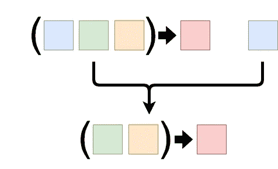

# Javascript- Currying VS 部分应用程序

> 原文：<https://towardsdatascience.com/javascript-currying-vs-partial-application-4db5b2442be8?source=collection_archive---------0----------------------->


许多人在涂抹和部分涂抹之间感到困惑，我们中的许多人不知道应该在何时何地使用它们。所以这篇文章将涵盖它们的实际用法和区别。

所以让我们从定义开始。

# Currying


Photo by [Caroline Attwood](https://unsplash.com/@carolineattwood?utm_source=medium&utm_medium=referral) on [Unsplash](https://unsplash.com?utm_source=medium&utm_medium=referral)

是一种将带有 N 个参数的函数调用转换成 N 个函数调用链的技术，每个函数调用只有一个参数？

Currying 总是返回另一个只有一个参数的函数，直到所有的参数都被应用。所以，我们一直调用返回的函数，直到我们用尽了所有的参数，最终的值被返回。

```
// Normal function
function addition(x, y) {
   return x + y;
}// Curried function
function addition(x) {
   return function(y) {
     return x + y;
   }
}
```

> 注意:Curry 取二元函数，返回一元函数，返回一元函数。它的 JavaScript 代码是

```
function curry(f) {
  return function(x) {
    return function(y) {
       return f(x, y);
    }
  }
}
```

> 注意:一个 curried 函数有一个内置的迭代器行为。一次应用一个参数，然后返回给调用函数，用于下一步。在这里阅读[关于迭代器的](https://codeburst.io/javascript-es6-iterables-and-iterators-de18b54f4d4)。

# 习惯

1.  定制函数的常见用例是**函数组合**，例如`p(x) = q(r(x))`。即通过传递参数从旧函数构建新函数。函数`q`将返回值作为函数`r`的参数。因为函数只能返回一个值，所以应用于返回值的函数必须是一元的。
2.  Curried function 也可以在项目的**基础设施设置**时使用，在该项目中，有许多可能性来创建通用函数，从而可以轻松地配置和重用小部分，而不会出现混乱。
3.  [**Ramda.js**](https://ramdajs.com/0.16/index.html) lib。函数是自动执行的，lodash 有一个名为 [curry](https://lodash.com/docs/4.17.10#curry) 的函数，可用于形成 curry 函数。
4.  [**记忆化**](https://taylodl.wordpress.com/2012/06/13/functional-javascript-memoization-part-i/) 是 curry 函数的另一个好用例。
5.  **处理错误**出错后立即抛出函数并退出。
6.  **捕捉多个错误，并将其用作 API 和客户端代码的验证器**。
7.  可以创建第一类函数，这意味着我们可以使用函数作为参数和返回值。例如:

```
const func1 = () => console.log ('Hey Medium.');
const firstClassfunc1 = argsFunc => argsFunc();
const firstClassfunc2 = () => func1;
firstClassfunc1 (firstClassfunc2()); // Hey Medium.
```

> 注意:一定要看完这个视频，你会知道更多关于为什么，什么时候和用法。

## **咖喱工厂法(ES6)**

```
const **compose** = (...**fns**) =>
  **fns.reduce**((**f**, **g**) => (...**args**) => **f**(**g**(...**args**)));
```

[这里的](https://medium.com/@kevincennis/currying-in-javascript-c66080543528)是一篇关于如何使用 ES5 创建我们自己的 curry 函数工厂方法的好文章。

> 注意:如果处理不当，Javascript 中的 Currying 会导致更复杂的堆栈跟踪，这对调试是不利的。

# **局部应用**



是一种将多个参数固定到一个函数上，产生另一个更小参数的函数的技术，即随着函数链的发展，将值绑定到一个或多个参数上。

```
function add1(x) {
  return 1 + x;
}
```

JavaScript 有内置的方法`.bind`,它可以处理任意数量的参数，并且可以绑定任意数量的参数。它的调用具有以下语法。

```
*function*.bind(*thisValue*, [*arg1*], [*arg2*], ...)
```

它将*函数*变成一个新函数，它的隐式参数是这个值，并且它的初始参数总是给定的。

```
function addition(x, y) {
   return x + y;
}const plus5 = addition.bind(null, 5)
plus5(10) // output -> 15
```

> 注意:`this`值对于(非方法)函数加法无关紧要，这就是为什么它在上面是 null 的原因。

当使用下划线或 lodash 时，你可以使用*部分*函数，它比原始的*绑定*方法好得多。

[这里](http://benalman.com/news/2012/09/partial-application-in-javascript/#partial-application)是关于局部应用和左、右局部应用功能实现的详细帖子。

# 差异

*   Currying *always* 产生嵌套的一元(1 元)函数。转换后的函数在很大程度上仍与原始函数相同。
*   部分应用产生任意数量参数的函数。转换后的函数不同于原始函数，它需要的参数更少。
*   Currying 不是局部应用。它可以使用部分应用程序来实现。你不能创建一个接受任意数量参数的函数，(除非你固定参数的数量)。

# 优势

更容易重用更抽象的函数，从而产生干净的代码，降低复杂性，提高代码的表达能力和可维护性。

这篇文章的一些资源

[](https://medium.com/javascript-scene/curry-or-partial-application-8150044c78b8) [## 库里还是局部申请？

### 部分应用和咖喱的区别

medium.com](https://medium.com/javascript-scene/curry-or-partial-application-8150044c78b8) [](https://2ality.com/2011/09/currying-vs-part-eval.html) [## Currying 与部分应用程序(使用 JavaScript 代码)

### Currying 和局部应用是将一个功能转换为另一个功能的两种方式，通常具有更小的…

2ality.com](https://2ality.com/2011/09/currying-vs-part-eval.html) [](https://medium.com/javascript-scene/curry-and-function-composition-2c208d774983) [## 咖喱与功能组合

### 注意:这是学习函数式编程和组合软件的“组合软件”系列的一部分…

medium.com](https://medium.com/javascript-scene/curry-and-function-composition-2c208d774983) 

如果您想被添加到我的电子邮件列表中，请考虑在这里输入您的电子邮件地址 和**关注我的** [**medium**](https://medium.com/@ideepak.jsd) **阅读更多关于 javascript 的文章，并关注**[**github**](https://github.com/dg92)**查看我的疯狂代码**。如果有什么不清楚或者你想指出什么，请在下面评论。

你可能也会喜欢我的其他文章

1.  [Javascript 执行上下文和提升](https://levelup.gitconnected.com/javascript-execution-context-and-hoisting-c2cc4993e37d)
2.  [Javascript —生成器-产出/下一个&异步-等待🤔](https://medium.com/datadriveninvestor/javascript-generator-yield-next-async-await-8442d2c77185)
3.  [理解 Javascript‘this’关键字(上下文)](https://medium.com/datadriveninvestor/javascript-context-this-keyword-9a78a19d5786)。
4.  [Javascript 数据结构与映射、归约、过滤](https://levelup.gitconnected.com/write-beautiful-javascript-with-%CE%BB-fp-es6-350cd64ab5bf)
5.  [Javascript- Currying VS 部分应用](https://medium.com/datadriveninvestor/javascript-currying-vs-partial-application-4db5b2442be8)
6.  [Javascript ES6 —可迭代程序和迭代器](https://medium.com/datadriveninvestor/javascript-es6-iterables-and-iterators-de18b54f4d4)
7.  [Javascript —代理](https://medium.com/datadriveninvestor/why-to-use-javascript-proxy-5cdc69d943e3)
8.  [Javascript —作用域](https://medium.com/datadriveninvestor/still-confused-in-js-scopes-f7dae62c16ee)

# 如果你喜欢这篇文章，请随意分享，以帮助他人找到它！

**谢谢！**