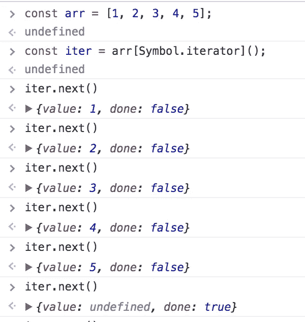

# Javascript ES6 —可迭代程序和迭代器

> 原文：<https://towardsdatascience.com/javascript-es6-iterables-and-iterators-de18b54f4d4?source=collection_archive---------5----------------------->


Photo by [Samuel Zeller](https://unsplash.com/photos/rk_Zz3b7G2Y?utm_source=unsplash&utm_medium=referral&utm_content=creditCopyText) on [Unsplash](https://unsplash.com/search/photos/ladder?utm_source=unsplash&utm_medium=referral&utm_content=creditCopyText)

# 可重复的

> iterable 是一个接口，它指定如果一个对象实现了一个关键的方法，那么这个对象就是可访问的。

使用 iterable 的一些内置数据结构有:

*   数组
*   用线串
*   地图
*   集合等。

## 为什么在 ES6 中增加了 iterable？

如果没有 iterable，就很难管理各种类型数据结构的数据迭代，即数组迭代不同于对象迭代。

此外，ES6 引入了新的数据结构，如集合和映射，因此按照迭代的数据结构编写逻辑将变得更加复杂。

这就是 iterable 接口诞生的地方。

这里有两件事需要注意

1.  **数据消费者—** 迭代如何发生，如使用循环、扩展操作符、array.from 方法、通过数组模式进行析构等
2.  **数据源** —我们选择什么样的数据结构，比如数组、映射、字符串等等来迭代。

# 迭代器

> 对象，该对象知道如何一次访问集合中的一个项，同时跟踪它在该序列中的当前位置。

iterable 接口返回的对象也是迭代器对象。

迭代器对象有一个返回序列中下一个项目的`next()`方法。该方法返回一个具有两个属性的对象:`done`和`value`，当`next()`调用到达序列末尾时，将`done`属性设置为`true`，否则保持`false`。

所以迭代器的下一个返回:

**{value:'迭代的当前值'，done:'真/假' }**

现在，既然我们清楚了这个理论，让我们来看一些例子

## 简单数组示例



Array iterator

这里，我们有一个带有一些值的数组`arr`，然后我们创建了一个迭代器对象，我们可以在上面调用`next()`，直到我们调用了`true`

> 注意:数组中已经有**符号.迭代器**键作为函数，在上面的例子中，符号.迭代器代表`*iter*`对象的属性，当我们调用它时，构造一个迭代器实例，通过 next 使用该对象的值。

我们可以创建自己的 iterable 和 iterator 对象，让我们看一个例子。

## 自定义迭代器对象示例

> 注意:要在上面运行，我们将使用 for..的循环，你可以阅读[这里](https://developer.mozilla.org/en-US/docs/Web/JavaScript/Reference/Statements/for...of)了解更多细节。

这就是我们如何迭代我们的 *customIterable* 对象。

```
for (const x of customIterable) {
    console.log(x);
}
// output 1,2,3,4,5,undefined
```

代码执行五个步骤，每次运行时`counter`递增。首先，我们返回值`1`，然后是值`2`等等，直到`5`，然后我们指示已经到达迭代的末尾，并且返回值`undefined`。每个项目都包装在一个具有以下属性的对象中:

*   `value`保存实际项目和
*   `done`这是一个布尔标志，指示是否已经到达终点。

> 注意:如果需要，最后一步可以返回值，我们也可以手动中断..如果需要，使用 break 关键字。break 关键字将向迭代器发送一个信号，表明消费代码已完成，不会再从中提取任何值，因此无论如何都会调用它。一旦我们完成迭代，它将返回{done:true}，但我们也可以手动调用它。

## 带生成器的迭代器功能强大，可能会改变我们编写代码的方式。

如果您想加入我的电子邮件列表，请考虑在这里输入您的电子邮件地址 和**关注我在**[**medium**](https://medium.com/@ideepak.jsd)**阅读更多关于 javascript 的文章，并在**[**github**](https://github.com/dg92)**上查看我的疯狂代码**。如果有什么不清楚或者你想指出什么，请在下面评论。

你可能也会喜欢我的其他文章

1.  [Javascript 执行上下文和提升](https://levelup.gitconnected.com/javascript-execution-context-and-hoisting-c2cc4993e37d)
2.  [Javascript —生成器-产出/下一个&异步-等待🤔](https://medium.com/datadriveninvestor/javascript-generator-yield-next-async-await-8442d2c77185)
3.  [理解 Javascript‘this’关键字(上下文)](https://medium.com/datadriveninvestor/javascript-context-this-keyword-9a78a19d5786)。
4.  [Javascript 数据结构与映射、归约、过滤](https://levelup.gitconnected.com/write-beautiful-javascript-with-%CE%BB-fp-es6-350cd64ab5bf)
5.  [Javascript- Currying VS 部分应用](https://medium.com/datadriveninvestor/javascript-currying-vs-partial-application-4db5b2442be8)
6.  [Javascript —代理](https://medium.com/datadriveninvestor/why-to-use-javascript-proxy-5cdc69d943e3)， [Javascript —作用域](https://medium.com/datadriveninvestor/still-confused-in-js-scopes-f7dae62c16ee)

## 如果这篇文章有帮助，请随意分享并帮助他人找到它！

**谢谢你！**