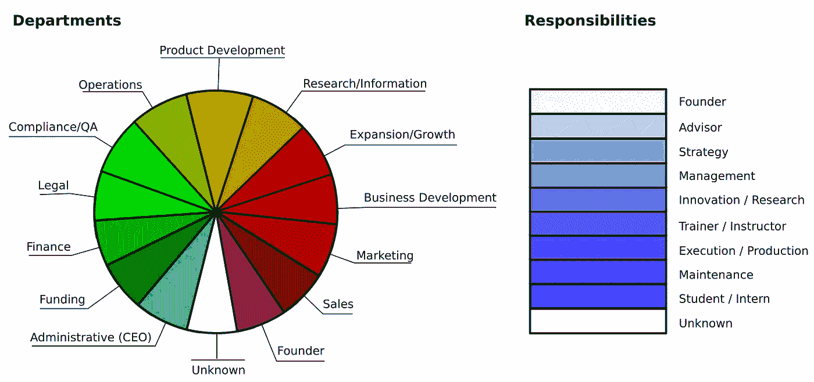
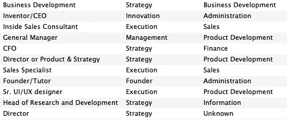

# python 和 NLTK 中的职称分析

> 原文：<https://towardsdatascience.com/job-title-analysis-in-python-and-nltk-8c7ba4fe4ec6?source=collection_archive---------2----------------------->


Photo by [Scott Graham](https://unsplash.com/@homajob?utm_source=medium&utm_medium=referral) on [Unsplash](https://unsplash.com?utm_source=medium&utm_medium=referral)

职称表明了一个人的角色和职责。它说如果他们管理一个团队，如果他们控制预算，和他们的专业化水平。

了解这一点在自动化业务开发或客户拓展时非常有用。例如，一家销售语音识别软件的公司可能希望将消息发送给:

*   CTO 和技术主管告知他们使用语音识别软件的价格和好处。
*   潜在投资者或顾问邀请他们了解公司潜在市场规模的信息。
*   创始人和工程师指导他们如何使用软件。

训练一个软件对职称进行分类是一个多文本的文本分类问题。对于这个任务，我们可以使用 Python 自然语言工具包(NLTK)和贝叶斯分类。

# 概念化

首先，让我们概念化一下职称代表什么。对于某个*部门*，每项工作都有一级*职责*。

职责包括清洁地板等维护任务，团队领导等管理任务，或决定预算等战略任务。

部门包括基于增长的部门，如业务开发和营销部门，基于合规的部门，如财务和法律部门，或基于执行的部门，如产品开发和运营部门。



职责和部门被编码成许多职称，如下所示:


我们希望将每个工作描述归入这些职责和部门中的一个。


# 执行

## 数据采集

第一步是得到一份职位列表。在 [CareerBuilder](https://www.careerbuilder.com/browse) 上有一个大约 800 个职位的列表。


职位名称是有页码的，所以唯一的方法就是点击每一页。

## 培训数据创建

导入职位名称后，我们可以描述这些职位的职责和部门。



## 数据格式编排

对于这个项目，我们需要[自然语言工具包](https://www.nltk.org/) (NLTK)。它包含文本处理资源、机器学习工具等等。

我们将使用贝叶斯多类分类器和自然语言工具包对这些职位进行分类。

像这样导入 NLTK:

```
import re
import nltk
from nltk.corpus import stopwords
import pandas as pd
stop_words = set(stopwords.words('english'))
```

*停用词*是常见的词，如 *a* 、*和*、 *the* ，这些词对我们的职称没有什么意义。NLTK 提供了一个英语停用词列表，我们将从每个职位中过滤掉。

当我们在网上获取职位头衔时，例如从 LinkedIn 或会议上，他们有时会包含多个职位头衔，用逗号、破折号、冒号或其他字符分隔。为简单起见，我将展示如何提取第一个职位:

```
def get_first_title(title):
    # keep "co-founder, co-ceo, etc"
    title = re.sub(r"[Cc]o[\-\ ]","", title)
    split_titles = re.split(r"\,|\-|\||\&|\:|\/|and", title)
    return split_titles[0].strip()
```

贝叶斯分类器将需要一个特征列表——在这种情况下，哪个单词出现在哪个职位描述中。我还把第一个词和最后一个词加到了特写中，因为有时候第一个词或最后一个词对职位有重要意义。例如，*营销总监*和*营销总监*是不同的角色。

```
def get_title_features(title):
    features = {}
    word_tokens = nltk.word_tokenize(title)
    filtered_words = [w for w in word_tokens if not w in stop_words] 
    for word in filtered_words:
        features['contains({})'.format(word.lower())] = True
    if len(filtered_words) > 0:
        first_key = 'first({})'.format(filtered_words[0].lower())
        last_key = 'last({})'.format(filtered_words[-1].lower())
        features[first_key] = True
        features[last_key] = True
    return features
```

这将产生一个职位名称的单词列表，包括第一个和最后一个单词，例如职位名称，*全球运营总监*:

```
{
    "contains(director)": True,
    "contains(global)": True,
    "contains(operations)": True,
    "first(director)": True,
    "last(operations)": True
}
```

现在我们需要为分类器清理和准备职位、职责和部门的列表。

假设我们的原始职位数据格式如下:

```
raw_job_titles = [
    {
        "title": "Business Development",
        "responsibility": "Strategy",
        "department": "Business Development"
    },
    {
        "title": "Inside Sales Consultant",
        "responsibility": "Execution",
        "department": "Sales"
    },
    ...
]
```

## 分类器训练

接下来，我们可以在这些数据集上训练贝叶斯分类器。我们通过对每个职位的特征进行分类来做到这一点。

```
# Responsibilities
responsibilities_features = [
    (
         get_title_features(job_title["title"]),
         job_title["responsibility"]
    )
    for job_title in raw_job_titles
    if job_title["responsibility"] is not None
]# Departments
departments_features = [
    (
         get_title_features(job_title["title"]),
         job_title["department"]
    )
    for job_title in raw_job_titles
    if job_title["department"] is not None
]
```

我们可以分割特征，以便我们可以使用一些特征来训练分类器，并使用其余的特征来测试分类器。

```
# Responsibilities
r_size = int(len(responsibilities_features) * 0.5)
r_train_set = responsibilities_features[r_size:]
r_test_set = responsibilities_features[:r_size]
responsibilities_classifier = nltk.NaiveBayesClassifier.train(
    r_train_set
)
print("Responsibility classification accuracy: {}".format(
    nltk.classify.accuracy(
        responsibilities_classifier,
        r_test_set
    )
))# Departments
d_size = int(len(departments_features) * 0.5)
d_train_set = departments_features[d_size:]
d_test_set = departments_features[:d_size]
departments_classifier = nltk.NaiveBayesClassifier.train(
    d_train_set
)
print("Department classification accuracy: {}".format(
    nltk.classify.accuracy(
        departments_classifier,
        d_test_set
    )
))
```

输出应该如下所示:

```
Responsibility classification accuracy: 0.80588235294117646
Department classification accuracy: 0.80526315789473684
```

## 数据分类

如果你对结果满意，你可以给新的职位分类。

```
title = "Director of Communications"
responsibility = responsibilities_classifier.classify(
    get_title_features(title)
)
department = departments_classifier.classify(
    get_title_features(title)
)
print("Job title: '{}'".format(title))
print("Responsibility: '{}'".format(responsibility))
print("Department: '{}'".format(department))
```

这将产生以下输出:

```
Job title: 'Director of Communications'
Responsibility: 'Strategist'
Department: 'Marketing'
```

一个限制是分类器将为每个职位分配一个部门和责任，不管职位有多模糊。这导致了应该保持不分类或由人审查的职称的分类。

为了克服这一点，我们可以揭示分类器对其解释的信心，以便我们可以选择是否接受它。

```
# Responsibility
responsibility_probability = \
    responsibilities_classifier.prob_classify(
        get_title_features(title)
    )
responsibility_probability = 100 * responsibility_probability.prob(
    responsibility_probability.max()
)
print("Responsibility confidence: {}%".format(
    round(responsibility_probability)
))# Department
department_probability = \
    departments_classifier.prob_classify(
        get_title_features(title)
    )
department_probability = 100 * department_probability.prob(
    department_probability.max()
)
print("Department confidence: {}%".format(
    round(department_probability)
))
```

结果是这样的:

```
Responsibility confidence: 86%
Department confidence: 79%
```

源代码可以在 [Github](https://gist.github.com/backupbrain/f355126042513188c484db5ef91650cd#file-job_title_analysis-py) 上找到。我期待听到任何反馈或问题。