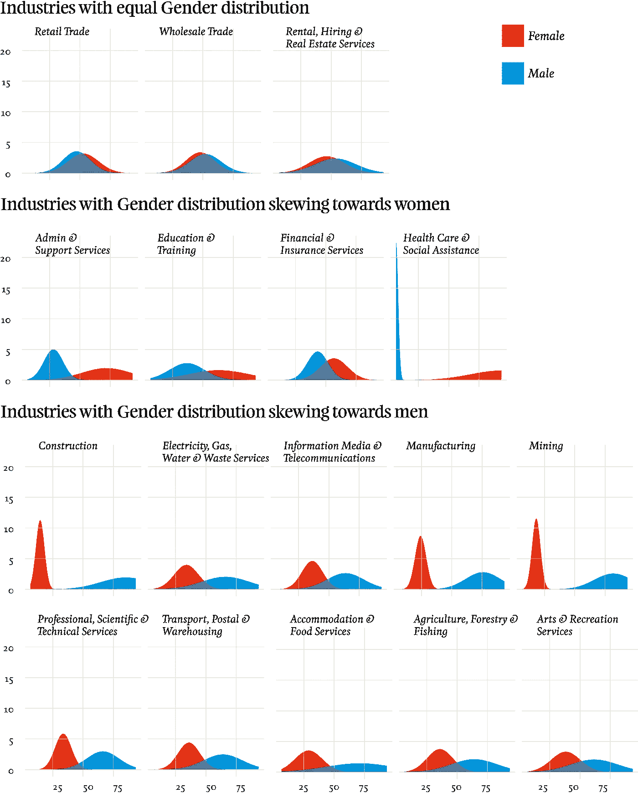
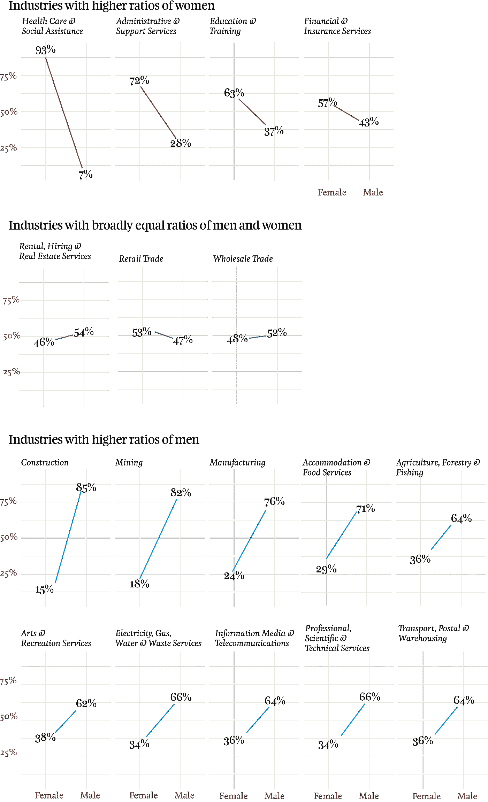

# 男孩(和女孩)的工作

> 原文：<https://towardsdatascience.com/jobs-for-the-boys-and-girls-d69345ed22b8?source=collection_archive---------3----------------------->

在 200 多家 ASX 上市公司中，女性和男性的比例分别为 45%和 55%。有趣的是，这种情况似乎合乎逻辑。我们很多人都认识一些女性，她们会停止工作一段时间来照看孩子或照顾家人。45%的员工由女性组成，这可能看起来合理、公平，甚至很高。*我的意思是，这是非常接近一半，对不对？*

然而，如果我们进一步挖掘数据，就会发现性别不平等仍然是大多数组织的组成部分。无论是工作的行业类型、人们所担任的角色，还是他们的就业状况，有时性别不平衡远远超过这一接近甚至 45%对 55%的比例。

这可能是一个很好的观点，说明性别平等不仅仅是让更多的妇女工作，或者让更多的妇女留在劳动力队伍中。这是关于解决一种性别占主导地位的就业领域的性别失衡问题。这是关于认识到男性和女性的经验对所有行业都很重要。重要的是，人们有选择满意职业的自由，这种职业不依赖于被认为是“性别合适”的角色。这意味着让更多的男性进入卫生或教育领域，就像让更多的女性进入科学或 it 领域一样重要。

## 工业

当将结果汇总到一个行业级别时，大多数结果显示性别不平衡。只有三个行业显示男女分布平等。其余的男女比例不平衡，大多数人倾向于男性就业。

Gender Split Distributions for Industries

考察绝对比率，结果更加明显。90%以上从事卫生和社会援助工作的人是妇女。相反，80%以上受雇于建筑业和采矿业的人是男性。

Gender ratios across industry classification.

虽然男性和女性在劳动力中的广泛分布接近相等，但行业分类之间存在很大差异。这可能会对长期职业参与产生负面影响；女性和男性可能会感到“被定型”，更有可能追求似乎更符合他们性别的职业，而不是他们的兴趣或优势。这可能会导致生产率下降。

## 数据源和详细信息

*本帖探究 2014/15 年度***调查结果。他们调查了 213 个组织的性别平等状况。这 213 家组织只是 2014/15 年向 WGEA 报告的 4670 家公司中的一小部分，但这 213 家组织都在 ASX 上市，因此有可能探索性别平等和 ASX 绩效之间是否存在任何联系。这篇文章探讨了不同行业分类的性别平等调查结果。我开展的其他工作侧重于男性和女性的职位和工作状况，以及股东总回报(TSR)和性别平等之间的关系。**

**WGEA 每年收集数据，他们是数据的来源和所有者。我从他们的主要数据集中提取了 213 家 ASX 上市公司的一个较小的集合，上面所有的结果都反映了这个较小的数据集合。**