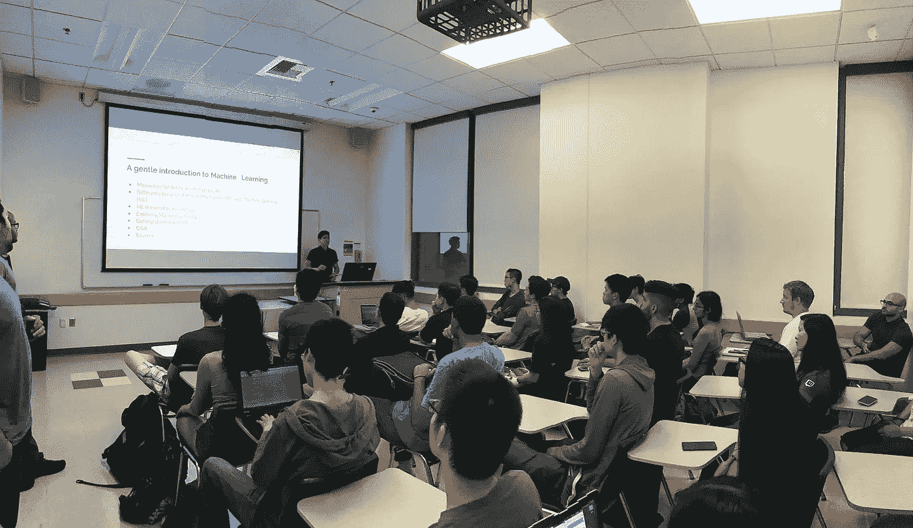

# 加入#人人爱行动

> 原文：<https://towardsdatascience.com/join-the-aiforeveryone-initiative-86bae2dfc13a?source=collection_archive---------9----------------------->

My first time presenting “[A Gentle Introduction to Machine Learning](http://andresvourakis.com/ai-for-everyone)” at UC Irvine.

***更新:*** *你也可以在* [*西班牙语*](https://medium.com/@avourakis/%C3%BAnete-a-la-iniciativa-aiforeveryone-520c4ccf7898) 中阅读这篇文章

人工智能(AI)领域的领军人物之一吴恩达最近将人工智能称为“新电力”。这当然是一个大胆的声明，坦率地说，我完全同意他的观点！

就像 100 年前的电力一样，人工智能正在改变我们世界的几乎每个方面；从我们检索信息和浏览世界的方式到医生用来检测和治疗疾病的技术。

许多研究人员已经转向人工智能来寻找许多全球性问题的解决方案，例如解决水危机和战胜饥饿。毫无疑问，人工智能具有巨大的潜力，这就是为什么研究人员不应该是唯一有机会获得这些知识/技术的人。像[微软](https://news.microsoft.com/features/democratizing-ai/)和[谷歌](https://www.youtube.com/watch?v=Rnm83GqgqPE)这样的公司都有这种信念，这也反映在他们为人工智能民主化所做的巨大努力中。毫不奇怪，他们的计划已经在推动创新。我最喜欢的一个故事是来自芝加哥的一个名叫阿布的高中生，他使用谷歌的开源机器学习库——tensor flow，建立了一个早期检测乳腺癌肿瘤的系统。

Abu’s Story

但重要的是要认识到，这不仅仅是让机器学习工具可供他人使用，有时我们需要的是一位导师，这可以是一位朋友，一位老师，甚至是一位陌生人，他们分享他们的知识，并帮助我们认识到人工智能如何被用来解决实际问题。

> 出于这个原因，我想鼓励你们每个人都参与到“人人爱你”的行动中来。

大约两个月前，我决定访问不同的学校，通过举办关于机器学习、人工神经网络和 TensorFlow 等主题的讲座/研讨会来传播 AI。

我绝不是人工智能方面的专家(至少现在还不是)，但我已经能够通过上课和参与项目，对机器学习和自然语言处理的许多领域建立坚实的理解；足以向学生们介绍这些话题，并引导他们走向正确的方向。

现在，你不一定要参加这个项目的讲座或研讨会，一个简单的一对一的讨论可以为这个领域的新手做很多事情。不管你决定怎么做，我认为我们都应该遵守 3 条简单的规则:

## 1.不要胡说。

你能做的最糟糕的事情就是试图让自己听起来很聪明，并传播错误信息。我有学生就我不太了解的话题问我问题，我经常克制自己不做任何评论，以免让他们更加困惑。如果你不知道这一切，不要难过，这就是谷歌的作用！

## 2.把它作为一个学习自己的机会

我甚至不能简单地通过试图以容易消化的方式解释困难的概念来表达我对人工智能的了解有多少。记住，通过分享你所知道的，你不仅是在帮助别人，也是在帮助你自己。

## 3.确保他们向前支付它

回馈他人最重要的部分是鼓励他们也这样做。记住阿布的一句话，“帮助别人总会回到你身边”。

> 如果你准备好加入这一倡议，那么不要忘记使用标签 [#AIforEveryone](https://twitter.com/search?q=%23AIforEveryone&src=typd) 分享你是如何参与其中的。

此外，如果你有任何问题，请随时联系我，并通过评论和分享这篇文章 **:)** 来表达对 ♥ **的爱**