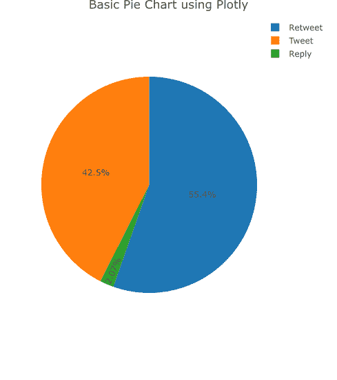
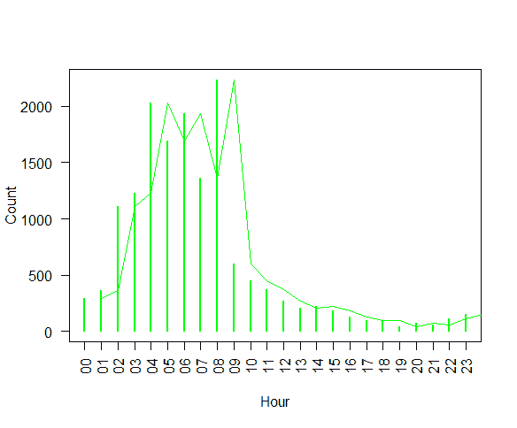
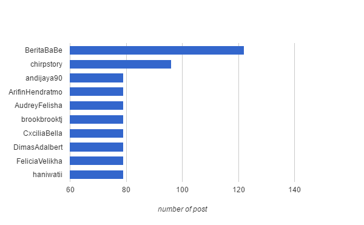

# 佐科威内阁改组传闻

> 原文：<https://towardsdatascience.com/jokowis-cabinet-reshuffle-buzz-a9baa8c19619?source=collection_archive---------7----------------------->

# 背景

佐科·维多多总统于 2016 年 7 月 27 日宣布内阁改组。旨在提高其内阁效率的举措。这件事在网民中引起了不同的反应。有些是优点，有些是缺点。了解人们对重组的看法看起来很有趣。因此，我通过追踪关键词“# reshuffle”来分析人们在 twitter 上谈论的关于改组的话题，然后从中提取信息。

# 数据

我收集了从 2016 年 7 月 27 日到 2016 年 8 月 3 日的数据，总共有 15，290 条推文包含标签#reshuffle(当然，实际上比关于#reshuffle 的推文数量多)。我使用 Jeff Gentry 的“twitteR”包来抓取推文。

# 分析

## 推文类型

让我们从了解#reshuffle 关键字的 tweet 行为开始分析。

Type of Tweets

似乎网民更喜欢转发人们的推文(55.4%)，而不是表达自己的想法(推文，42.5%)。他们中很少有人(2.07%)会通过回复推特来做进一步的讨论。

Time distribution by hour

这张图显示了网民在 twitter 上活跃的时间分布。看起来网民更喜欢在早上而不是晚上活跃在推特上。高峰时间是早上 8 点。

## 网红

现在，我们将找出是谁在 twitter 上发布了关于#改组的推文。给你。

Top 5 Influencers

在此期间，共有 6081 个独立用户发布了关于#改组的帖子，总共获得了 837，660，066 次展示。上图显示了发帖最多的前 10 个 twitter 账户。

## 艺术家是谁？

以下是参与此次内阁改组的部长们的受欢迎程度分布。让我们看看在改组问题上谁是最受欢迎的部长。

Top 10 most mentioned people

Woa！Anies baswedan 是最受欢迎的大臣。紧随其后的是维兰托、斯里·穆利亚尼和伊格纳修斯·约南。

## 网友是怎么想的？

好的，在上面我们已经知道了在网民中受欢迎的部长。那么，他们是怎么看待他们的呢？他们说好的感觉还是相反？

让 wordcloud 来回答你的问题。下面是网民提及最多的 4 位最受欢迎的部长的聚类。

Clustered wordcloud over top 4 popular ministers.

**维兰托**

Wiranto 与法律问题有关，因为他周围出现最多术语是' kejahatan '，' dakwaan '和' ham '。

**安尼斯巴斯维丹**

Anies Baswedan 似乎得到了网民的积极印象。他们感谢安妮斯的表现，网民们也对他的替代者表示不满。

**斯里·穆亚尼**

人们欢迎 Sri Mulyani 回来，他们希望她能治愈印尼经济。

**伊格内修斯·乔南**

伊格内修斯·乔南，从网民那里得到了复杂的感觉。一些人同意他替换，另一些人对他的替换感到失望，因为他们认为 Jonan 的表现足够好。