# 深入探讨多标签分类..！(附有详细的案例研究)

> 原文：<https://towardsdatascience.com/journey-to-the-center-of-multi-label-classification-384c40229bff?source=collection_archive---------0----------------------->

## 有毒-评论分类。


Fig-1: Multi-Label Classification to finde genre based on plot summary.

> 随着可用数据的持续增加，迫切需要对其进行组织，并且现代分类问题通常涉及同时与单个实例相关联的多个标签的预测。
> 
> 被称为多标签分类，它是一个这样的任务，在许多现实世界的问题中无所不在。
> 
> 在这个项目中，以 Kaggle 问题为例，我们探索了多标签分类的不同方面。
> 
> ***数据来源免责声明:*** *数据集包含可能被认为亵渎、低俗或冒犯的文字。*

# 项目鸟瞰图:

*   **第 1 部分:**多标签分类概述。
*   **第二部分:**问题定义&评估指标。
*   **Part-3:** 探索性数据分析 *(EDA)* 。
*   **第四部分:**数据预处理。
*   **第五部分:**多标签分类技术。

# 第 1 部分:多标签分类概述:

*   多标签分类起源于对文本分类问题的研究，其中每个文档可能同时属于几个预定义的主题。
*   文本数据的多标签分类是一个重要的问题。例子从新闻文章到电子邮件。例如，这可以用来根据电影情节的概要找到电影所属的类型。

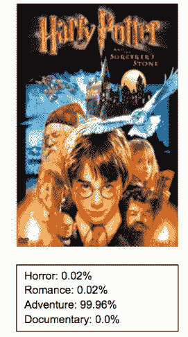

Fig-2: Multi-label classification to find genres based on movie posters.

*   或者基于电影海报的流派多标签分类。*(这就进入了计算机视觉的领域。)*
*   在多标签分类中，训练集由与一组标签相关联的实例组成，任务是通过分析具有已知标签集的训练实例来预测未知实例的标签集。
*   **多类分类的区别&多标签分类**在于，在多类问题中，类是互斥的，而对于多标签问题，每个标签代表不同的分类任务，但这些任务在某种程度上是相关的。
*   例如，*多类分类*假设每个样本被分配给一个且仅一个标签:水果可以是苹果或梨，但不能同时是两者。然而，*多标签分类*的一个例子可以是，一个文本可能同时涉及宗教、政治、金融或教育中的任何一个，或者这些都不涉及。

# 第 2 部分:问题定义和评估标准:

## 问题定义:

*   有毒评论分类是一个高度不平衡数据集的多标签文本分类问题。
*   我们面临的挑战是建立一个多标签模型，能够检测不同类型的毒性，如威胁，淫秽，侮辱和基于身份的仇恨。我们需要创建一个模型来预测每条评论的每种毒性的概率。
*   这个问题的 Kaggle 链接可以在 [*这里*](https://www.kaggle.com/c/jigsaw-toxic-comment-classification-challenge) 找到。

## 评估指标:

> **注:**ka ggle 挑战赛最初的评估指标是 *Log-Loss* ，后来改为 *AUC* 。但是在这篇文章中，我们也揭示了其他评估指标。

*   单标签的评估方法通常不同于多标签的评估方法。这里，在单标签分类中，我们使用简单的度量标准，如精确度、召回率、准确度等。比方说，在单标签分类中，准确度只是:

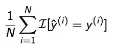

Fig-3: Accuracy in single-label classification

*   在多标签分类中，错误分类不再是绝对的对错。包含实际类别的子集的预测应该被认为比不包含任何类别的预测更好，即，正确预测三个标签中的两个这比根本不预测标签更好。

## *微平均* & M *宏平均(基于标签的测量):*

*   为了测量一个多类分类器，我们必须以某种方式对这些类进行平均。有两种不同的方法可以做到这一点，分别称为*微平均*和*宏平均*。
*   在*微平均*中，对每个类别的所有 TPs、TNs、FPs 和 FNs 求和，然后取平均值。

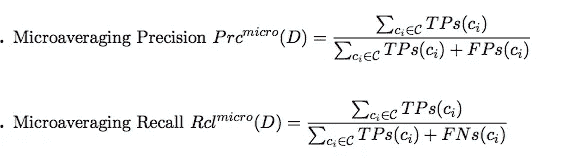

Fig-4: Micro-Averaging

*   在*微平均*方法中，您将系统对于不同集合的单个真阳性、假阳性和假阴性相加并加以应用。并且微观平均 F1 分数将简单地是上述两个方程的调和平均值。
*   *宏平均*非常简单。我们只是取不同集合上系统的精度和召回率的平均值。

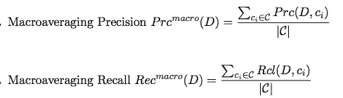

Fig-5: Macro-Averaging

*   *当您想要了解系统在数据集上的整体表现时，可以使用宏平均*方法。你不应该用这个平均数做出任何具体的决定。另一方面，当数据集大小不同时，*微平均*是一个有用的方法。

## 汉明损失(基于示例的测量):

*   用最简单的术语来说，*汉明损失*是被错误预测的标签的分数，即错误标签占标签总数的分数。

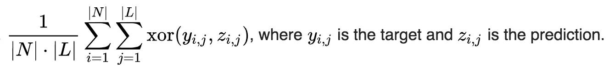

Fig-6: Hamming-Loss

## 精确匹配率(子集准确度):

*   这是最严格的指标，表示所有标签都被正确分类的样本的百分比。

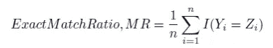

Fig-7: Exact Match Ratio

*   这种方法的缺点是多类分类问题有部分正确的机会，但这里我们忽略了那些部分正确的匹配。
*   在 *scikit-learn* 中有一个实现子集精度的函数，叫做 **accuracy_score。**

> **注意:**我们将使用 **accuracy_score** 函数来评估我们在这个项目中的所有模型。

# 第 3 部分:探索性数据分析(EDA):

> 探索性数据分析是数据分析过程中的重要步骤之一。在这里，重点是理解手头的数据——比如制定向数据集提问的正确问题，如何操作数据源以获得所需的答案，等等。

*   首先让我们导入必要的库。

```
import os
import csv
import pandas as pd
import numpy as np
import matplotlib.pyplot as plt
import seaborn as sns
```

*   接下来，我们将 csv 文件中的数据加载到 pandas 数据帧中，并检查其属性。

```
data_path = "/Users/kartik/Desktop/AAIC/Projects/jigsaw-toxic-comment-classification-challenge/data/train.csv"data_raw = pd.read_csv(data_path)print("Number of rows in data =",data_raw.shape[0])
print("Number of columns in data =",data_raw.shape[1])
print("\n")
print("**Sample data:**")
data_raw.head()
```

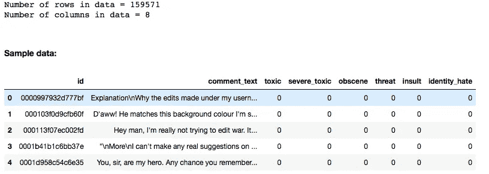

Fig-8: Data Attributes

*   现在我们统计每个标签下的评论数量。(详细代码请参考本项目的 GitHub 链接。)

```
categories = list(data_raw.columns.values)
sns.set(font_scale = 2)
plt.figure(figsize=(15,8))ax= sns.barplot(categories, data_raw.iloc[:,2:].sum().values)plt.title("Comments in each category", fontsize=24)
plt.ylabel('Number of comments', fontsize=18)
plt.xlabel('Comment Type ', fontsize=18)#adding the text labels
rects = ax.patches
labels = data_raw.iloc[:,2:].sum().values
for rect, label in zip(rects, labels):
    height = rect.get_height()
    ax.text(rect.get_x() + rect.get_width()/2, height + 5, label, ha='center', va='bottom', fontsize=18)plt.show()
```

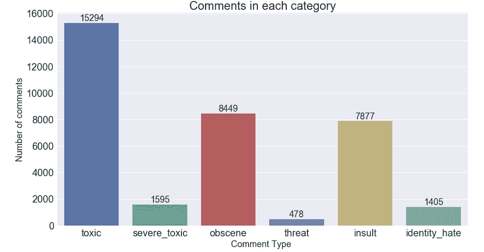

Fig-9: Count of comments under each label

*   计算具有多个标签的评论的数量。

```
rowSums = data_raw.iloc[:,2:].sum(axis=1)
multiLabel_counts = rowSums.value_counts()
multiLabel_counts = multiLabel_counts.iloc[1:]sns.set(font_scale = 2)
plt.figure(figsize=(15,8))ax = sns.barplot(multiLabel_counts.index, multiLabel_counts.values)plt.title("Comments having multiple labels ")
plt.ylabel('Number of comments', fontsize=18)
plt.xlabel('Number of labels', fontsize=18)#adding the text labels
rects = ax.patches
labels = multiLabel_counts.values
for rect, label in zip(rects, labels):
    height = rect.get_height()
    ax.text(rect.get_x() + rect.get_width()/2, height + 5, label, ha='center', va='bottom')plt.show()
```

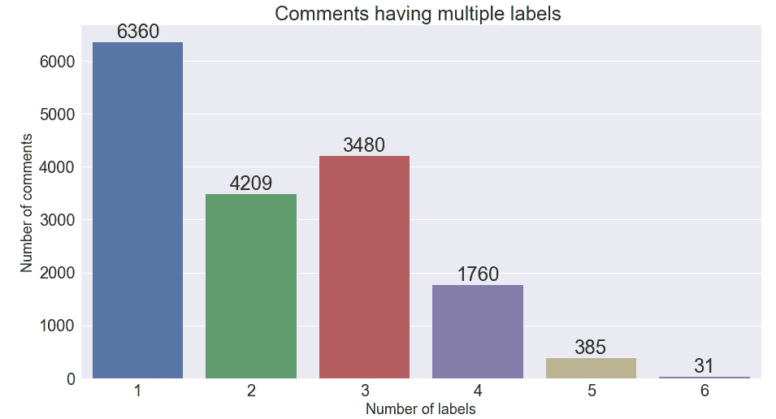

Fig-10: Count of comments with multiple labels.

*   每一类评论中最常用词的 WordCloud 表示。

```
from wordcloud import WordCloud,STOPWORDSplt.figure(figsize=(40,25))# clean
subset = data_raw[data_raw.clean==True]
text = subset.comment_text.values
cloud_toxic = WordCloud(
                          stopwords=STOPWORDS,
                          background_color='black',
                          collocations=False,
                          width=2500,
                          height=1800
                         ).generate(" ".join(text))
plt.axis('off')
plt.title("Clean",fontsize=40)
plt.imshow(cloud_clean)# Same code can be used to generate wordclouds of other categories.
```

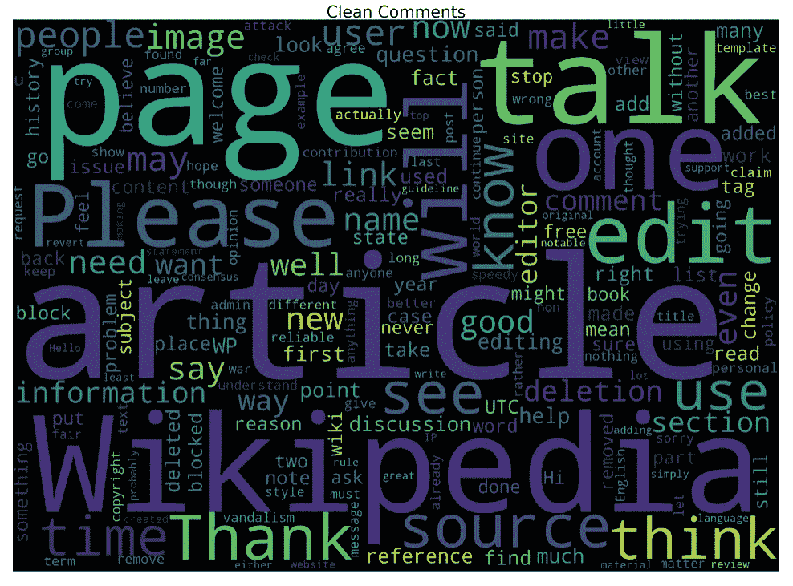

Fig-1: Word-cloud Representation of Clean Comments

# 第 4 部分:数据预处理:

*   我们首先将注释转换成小写，然后使用定制的函数从注释中删除 *html 标签、标点符号和非字母字符*。

```
import nltk
from nltk.corpus import stopwords
from nltk.stem.snowball import SnowballStemmer
import re
import sys
import warningsdata = data_rawif not sys.warnoptions:
    warnings.simplefilter("ignore")def cleanHtml(sentence):
    cleanr = re.compile('<.*?>')
    cleantext = re.sub(cleanr, ' ', str(sentence))
    return cleantextdef cleanPunc(sentence): #function to clean the word of any punctuation or special characters
    cleaned = re.sub(r'[?|!|\'|"|#]',r'',sentence)
    cleaned = re.sub(r'[.|,|)|(|\|/]',r' ',cleaned)
    cleaned = cleaned.strip()
    cleaned = cleaned.replace("\n"," ")
    return cleaneddef keepAlpha(sentence):
    alpha_sent = ""
    for word in sentence.split():
        alpha_word = re.sub('[^a-z A-Z]+', ' ', word)
        alpha_sent += alpha_word
        alpha_sent += " "
    alpha_sent = alpha_sent.strip()
    return alpha_sentdata['comment_text'] = data['comment_text'].str.lower()
data['comment_text'] = data['comment_text'].apply(cleanHtml)
data['comment_text'] = data['comment_text'].apply(cleanPunc)
data['comment_text'] = data['comment_text'].apply(keepAlpha)
```

*   接下来，我们使用可以从 *NLTK* 库中下载的默认停用词集合，删除注释中出现的所有 ***停用词*** 。我们还在标准列表中添加了一些停用词。
*   停用词基本上是任何语言中的一组常用词，不仅仅是英语。停用词对许多应用程序至关重要的原因是，如果我们删除给定语言中非常常用的词，我们就可以专注于重要的词。

```
stop_words = set(stopwords.words('english'))
stop_words.update(['zero','one','two','three','four','five','six','seven','eight','nine','ten','may','also','across','among','beside','however','yet','within'])
re_stop_words = re.compile(r"\b(" + "|".join(stop_words) + ")\\W", re.I)
def removeStopWords(sentence):
    global re_stop_words
    return re_stop_words.sub(" ", sentence)data['comment_text'] = data['comment_text'].apply(removeStopWords)
```

*   接下来我们做 ***词干*** *。*存在不同种类的词干，它们基本上将语义大致相同的单词转换成一种标准形式。例如，对于逗乐、娱乐和逗乐，词干应该是 amus。

```
stemmer = SnowballStemmer("english")
def stemming(sentence):
    stemSentence = ""
    for word in sentence.split():
        stem = stemmer.stem(word)
        stemSentence += stem
        stemSentence += " "
    stemSentence = stemSentence.strip()
    return stemSentencedata['comment_text'] = data['comment_text'].apply(stemming)
```

*   在将数据集分成训练集和测试集之后，我们想要总结我们的注释，并将它们转换成数字向量。
*   一个技巧是挑选最频繁出现的术语(具有高 ***术语频率*** 或 *tf* 的词)。然而，最频繁出现的单词是一个不太有用的度量，因为像' *this* '、' *a* '这样的单词在所有文档中出现得非常频繁。
*   因此，我们还希望衡量一个单词的独特性，即该单词在所有文档中出现的频率(I***n 反转文档频率*** 或 *idf* )。
*   因此，一个单词的 TF & IDF(***TF-IDF***)的乘积给出了该单词在文档中的出现频率乘以该单词在整个文档语料库中的独特性的乘积。
*   文档中具有高 tfidf 分数的单词在文档中频繁出现，并且提供关于该特定文档的最多信息。

```
from sklearn.model_selection import train_test_splittrain, test = train_test_split(data, random_state=42, test_size=0.30, shuffle=True)from sklearn.feature_extraction.text import TfidfVectorizer
vectorizer = TfidfVectorizer(strip_accents='unicode', analyzer='word', ngram_range=(1,3), norm='l2')
vectorizer.fit(train_text)
vectorizer.fit(test_text)x_train = vectorizer.transform(train_text)
y_train = train.drop(labels = ['id','comment_text'], axis=1)x_test = vectorizer.transform(test_text)
y_test = test.drop(labels = ['id','comment_text'], axis=1)
```

*   ***TF-IDF*** 易于计算，但其缺点是不能捕捉文本中的位置、语义、在不同文档中的共现等。

# 第 5 部分:多标签分类技术；

> 大多数传统的学习算法是针对单标签分类问题开发的。因此，文献中的许多方法将多标签问题转化为多个单标签问题，从而可以使用现有的单标签算法。

## 1.OneVsRest

*   通过限制每个实例只有一个标签，传统的两类和多类问题都可以转化为多标签问题。另一方面，多标签问题的通用性不可避免地增加了学习的难度。解决多标签问题的直观方法是将其分解为多个独立的二分类问题(每个类别一个)。
*   在“一对多”策略中，可以建立多个独立的分类器，并且对于一个看不见的实例，选择置信度最大化的类别。
*   这里的主要假设是标签是*互斥的*。在这个方法中，您不考虑类之间的任何潜在相关性。
*   例如，它更像是问一些简单的问题，比如，“*评论是否有毒”、“*评论是否具有威胁性？*等。此外，这里可能有一个广泛的过度拟合的情况，因为大多数注释是未标记的，也就是说，大多数注释是干净的注释。*

```
from sklearn.linear_model import LogisticRegression
from sklearn.pipeline import Pipeline
from sklearn.metrics import accuracy_score
from sklearn.multiclass import OneVsRestClassifier# Using pipeline for applying logistic regression and one vs rest classifier
LogReg_pipeline = Pipeline([
                ('clf', OneVsRestClassifier(LogisticRegression(solver='sag'), n_jobs=-1)),
            ])for category in categories:
    print('**Processing {} comments...**'.format(category))

    # Training logistic regression model on train data
    LogReg_pipeline.fit(x_train, train[category])

    # calculating test accuracy
    prediction = LogReg_pipeline.predict(x_test)
    print('Test accuracy is {}'.format(accuracy_score(test[category], prediction)))
    print("\n")
```

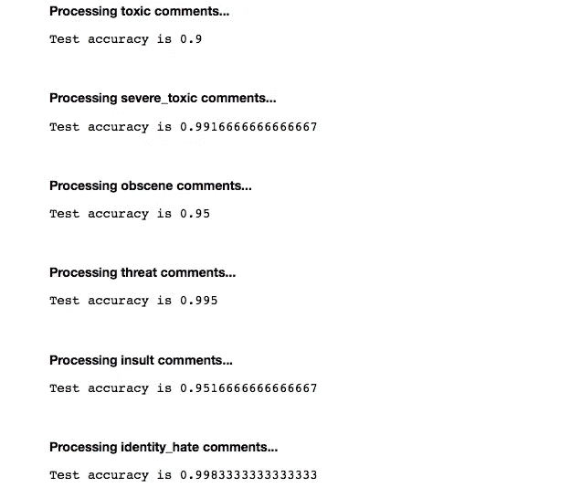

Fig-12: OneVsRest

## 2.二元相关性

*   在这种情况下，训练单标签二元分类器的集合，每个类别一个。每个分类器预测一个类的成员或非成员。所有被预测的类的并集被作为多标签输出。这种方法很受欢迎，因为它易于实现，但是它也忽略了类标签之间可能的相关性。
*   换句话说，如果有 *q* 个标签，二元相关性方法从图像中创建 *q* 个新数据集，每个标签一个，并在每个新数据集上训练单标签分类器。一个分类器可能对“它包含树吗？”这个问题回答是/否，从而“二元关联”中的“二元”。这是一种简单的方法，但是当标签之间存在依赖关系时，这种方法就不好用了。
*   *OneVsRest &二元关联性*看起来非常相像。如果 OneVsRest 中的多个分类器回答*“是”*，那么您将回到二元相关性场景。

```
# using binary relevance
from skmultilearn.problem_transform import BinaryRelevance
from sklearn.naive_bayes import GaussianNB# initialize binary relevance multi-label classifier
# with a gaussian naive bayes base classifier
classifier = BinaryRelevance(GaussianNB())# train
classifier.fit(x_train, y_train)# predict
predictions = classifier.predict(x_test)# accuracy
print("Accuracy = ",accuracy_score(y_test,predictions)) ***Output:****Accuracy = 0.856666666667*
```

## 3.分类器链

*   一串二元分类器 C0，C1。。。，Cn，其中分类器 Ci 使用所有分类器 Cj 的预测，其中 j < i. This way the method, also called classifier chains (CC), can take into account label correlations.
*   The total number of classifiers needed for this approach is equal to the number of classes, but the training of the classifiers is more involved.
*   Following is an illustrated example with a classification problem of three categories {C1, C2, C3} chained in that order.

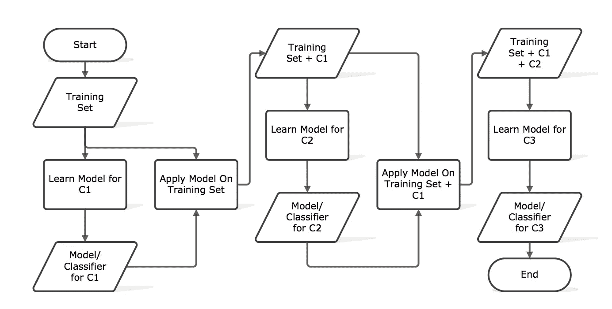

Fig-13: Classifier Chains

```
# using classifier chains
from skmultilearn.problem_transform import ClassifierChain
from sklearn.linear_model import LogisticRegression# initialize classifier chains multi-label classifier
classifier = ClassifierChain(LogisticRegression())# Training logistic regression model on train data
classifier.fit(x_train, y_train)# predict
predictions = classifier.predict(x_test)# accuracy
print("Accuracy = ",accuracy_score(y_test,predictions))
print("\n")***Output:****Accuracy = 0.893333333333*
```

## 4\. Label Powerset

*   This approach does take possible correlations between class labels into account. More commonly this approach is called the label-powerset method, because it considers each member of the power set of labels in the training set as a single label.
*   This method needs worst case (2^|C|) classifiers, and has a high computational complexity.
*   However when the number of classes increases the number of distinct label combinations can grow exponentially. This easily leads to combinatorial explosion and thus computational infeasibility. Furthermore, some label combinations will have very few positive examples.

```
# using Label Powerset
from skmultilearn.problem_transform import LabelPowerset# initialize label powerset multi-label classifier
classifier = LabelPowerset(LogisticRegression())# train
classifier.fit(x_train, y_train)# predict
predictions = classifier.predict(x_test)# accuracy
print("Accuracy = ",accuracy_score(y_test,predictions))
print("\n")***Output:****Accuracy = 0.893333333333*
```

## 5\. Adapted Algorithm

*   Algorithm adaptation methods for multi-label classification concentrate on adapting single-label classification algorithms to the multi-label case usually by changes in cost/decision functions.
*   Here we use a multi-label lazy learning approach named ***ML-KNN*** 是从传统的 K-最近邻(KNN)算法得到的。
*   `[**skmultilearn.adapt**](http://scikit.ml/api/api/skmultilearn.adapt.html#module-skmultilearn.adapt)`模块实现多标签分类的算法自适应方法，包括但不限于 ***ML-KNN。***

```
from skmultilearn.adapt import MLkNN
from scipy.sparse import csr_matrix, lil_matrixclassifier_new = MLkNN(k=10)# Note that this classifier can throw up errors when handling sparse matrices.x_train = lil_matrix(x_train).toarray()
y_train = lil_matrix(y_train).toarray()
x_test = lil_matrix(x_test).toarray()# train
classifier_new.fit(x_train, y_train)# predict
predictions_new = classifier_new.predict(x_test)# accuracy
print("Accuracy = ",accuracy_score(y_test,predictions_new))
print("\n")***Output:****Accuracy = 0.88166666667*
```

# 结论:

## 结果:

*   解决多标签分类问题主要有两种方法:**问题转化方法**和**算法自适应方法**。
*   问题转换方法将多标签问题转换成一组[二元分类](https://en.wikipedia.org/wiki/Binary_classification)问题，然后可以使用单类分类器来处理这些问题。
*   而算法适应方法使算法适应直接执行多标签分类。换句话说，他们不是试图将问题转化为更简单的问题，而是试图解决问题的全部形式。
*   在与其他方法的广泛比较中，label-powerset 方法得分最高，其次是 one-against-all 方法。
*   在这个数据集上运行时，ML-KNN 和 label-powerset 都需要相当长的时间，所以实验是在训练数据的随机样本上进行的。

## 进一步改进:

*   在深度学习中使用 LSTMs 可以解决同样的问题。
*   为了更快的速度，我们可以使用决策树，为了在速度和准确性之间进行合理的权衡，我们也可以选择集合模型。
*   诸如 MEKA 的其他框架可以用于处理多标签分类问题。

## GitHub 项目的 [*链接*](https://github.com/nkartik94/Multi-Label-Text-Classification) 。LinkedIn [简介](https://www.linkedin.com/in/kartiknooney)。

> 希望你喜欢这个教程。感谢阅读..！