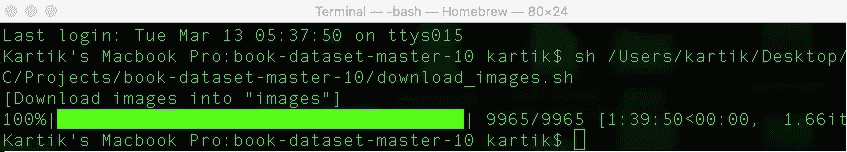
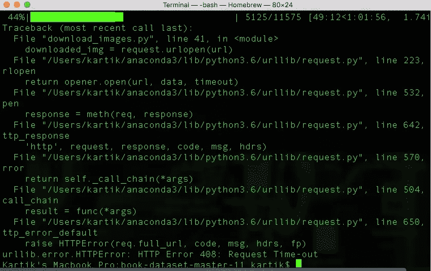
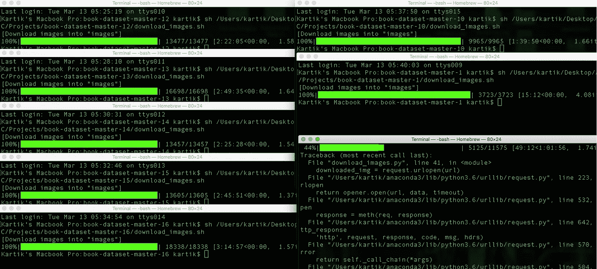
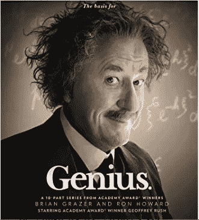
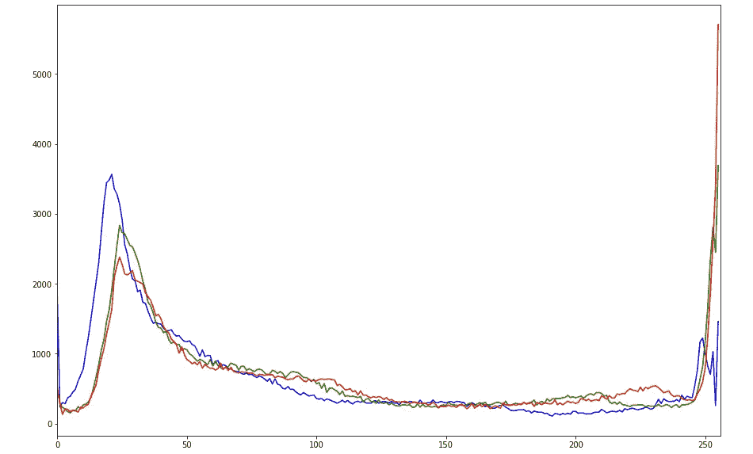
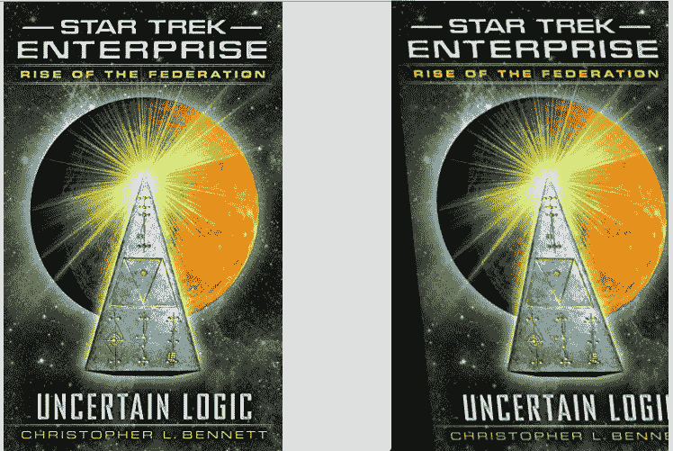
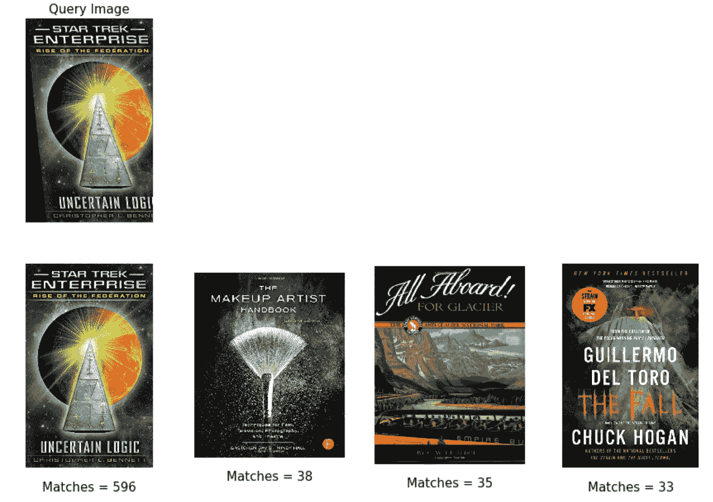
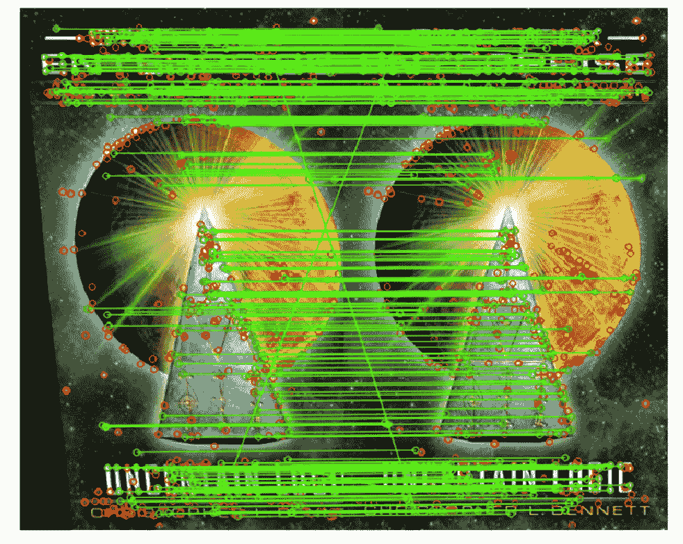
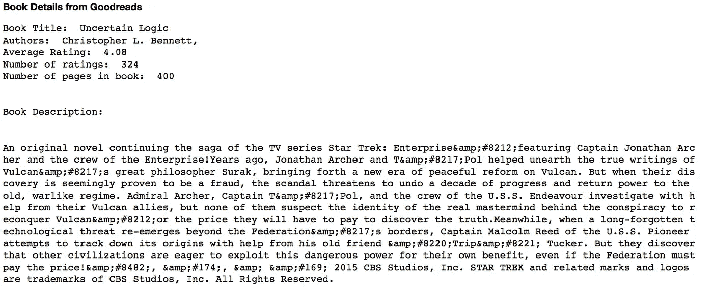

# 根据封面判断一本书..！

> 原文：<https://towardsdatascience.com/judging-a-book-by-its-cover-1365d001ef50?source=collection_archive---------6----------------------->

## 项目的 GitHub [链接](https://github.com/nkartik94/Judging-a-book-by-its-cover.git)。LinkedIn [简介](https://www.linkedin.com/in/kartiknooney)。

> 与流行的谚语“*不要根据封面来判断一本书”相反，一本书的封面实际上可以用来获得关于这本书的各种信息。一本书的封面通常是第一次互动，它会给读者留下印象。它开始与潜在的读者对话，并开始画一个故事，揭示里面的内容。但是，书的封面上写了什么？*
> 
> 如果光是书的封面就能告诉我们选择这本书作为下一次阅读的所有信息，无论是平均评分、有用的评论、书的页数、作者的详细信息，还是对这本书的更好的总结，会怎么样？如果所有这些信息都是从无数的网站上收集来的，使得信息更加真实，那会怎么样呢？
> 
> 延伸我对书籍的痴迷，这个项目在*计算机视觉*和*机器学习的帮助下解决了上述问题。*

# **项目鸟瞰图:**

这个项目是一个临时版本的 *CBIR (* 基于内容的图像检索)系统。一旦用户实时点击书籍封面的图片，我们使用一个三级匹配系统来检索书籍封面的最接近匹配，并根据检索到的书籍封面显示从 Goodreads 和 Amazon 等网站获得的关于书籍各个方面的总结信息。

## **三级匹配系统:**

*   **一级:** RGB 颜色直方图。
*   **第二级:**结构相似性指数度量(SSIM)。
*   **Level-3:** 使用 SIFT 特征的 FLANN 匹配。
*   这个三级匹配系统的基本思想是通过在每一级消除不相关的匹配来缩小精确匹配的范围。随着级别的增加，匹配器产生的结果的准确性增加，并且它用于匹配的时间也增加。
*   如果我们在初始级别消除更多的匹配，那么匹配器在下一级别所花费的时间将会减少，但同时潜在的匹配可能已经在前一级别被消除，因此降低了整个系统的准确性。
*   如果我们在初始级别消除非常少的匹配，从而将更多的匹配传递给下一级匹配器，则系统的时间会急剧增加，但系统的准确性不会受到损害。
*   因此，我们减少了每个级别的潜在匹配的数量，但不是通过消除太多的匹配，因此我们在速度和准确性之间进行了微调。

## **十步流程:**

*   第一步:建立一个包含所有可用书籍封面及其各自的 *ISBN 号*的存储库。
*   **第二步:**为库中所有的书籍封面图像计算 *RGB 颜色直方图*。
*   **步骤 3:** 读入查询书籍封面并计算其颜色直方图。
*   **步骤 4:** 基于直方图之间的*相关性*在图像库中搜索查询书封面的最接近匹配。*(一级匹配器)。*
*   **第五步:**使用 *SSIM* 从*第四步*得到的匹配中搜索与查询书封面最接近的匹配。*(二级匹配器)。*
*   **第六步:**使用 *FLANN* 从*第五步*得到的匹配中搜索与查询书封面最接近的匹配。*(三级匹配器)。*
*   **步骤 7:** 显示 3 级匹配后得到的前 4 个匹配。还显示前 4 个检索图像中匹配的 *SIFT* 特征的数量。
*   **步骤 8:** 绘制查询书封面图像与顶部匹配的匹配。
*   **第 9 步:**创建一个网络爬虫从 *Goodreads 和 Amazon 收集信息。*
*   **步骤-10:** 使用顶级匹配的 *ISBN* 和在*步骤-9 中设计的爬虫程序，*检索额外的图书信息，如评级数、平均评级、有用评论、图书页数、作者详细信息等。并最终显示所获得信息的汇总版本。

# 此项目中使用的库:

*   **OpenCV:** 开源计算机视觉是一个主要针对实时计算机视觉的编程函数库。该库拥有超过 2500 种优化算法，包括一套全面的经典和最先进的计算机视觉和机器学习算法。
*   Numpy 的主要目标是大型、高效、多维数组表示。这个项目处理大量的图像，每个图像被表示为一个 numpy 数组。将图像表示为 NumPy 数组不仅计算和资源效率高，而且许多其他图像处理和机器学习库也使用 NumPy 数组表示。
*   **Scikit-image:**It**是图像处理的算法集合。它包括分割、几何变换、色彩空间处理、分析、过滤、特征检测等算法。它旨在与 Python 数字和科学库 NumPy 和 SciPy 进行互操作。**
*   ****Matplotlib:** Matplotlib 是一个绘图库。当分析图像时，我们将利用 matplotlib，无论是绘制搜索系统的整体准确性还是简单地查看图像本身，matplotlib 都是您工具箱中的一个伟大工具。**
*   ****Imutils:** 这个包包含了一系列 OpenCV 和便利函数，执行基本任务，比如平移、旋转、调整大小和骨骼化。这是一个由[**Adrian rose Brock**](https://www.pyimagesearch.com/author/adrian/)**开源的精彩而高效的包。****
*   ****美汤:**是一个从 HTML 和 XML 文件中抽取数据的 Python 库。它与您喜欢的解析器一起工作，提供导航、搜索和修改解析树的惯用方式。BeautifulSoup 的优点是，它可以像解析简单的 XML 一样解析 HTML，并毫不费力地将所需的值(文本)返回给我们。**

# **实施:**

> ****注:**本代码中有某些超参数，可根据个人需求进行微调。我对它们进行了调整，在速度和准确性之间找到了一个最佳平衡点。**

```
# Hyper-Parameter for comparing histograms
correl_threshold = 0.9# Hyper-Parameters for SSIM comparision
similarity_index_threshold = 0.0
ssim_matches_limit = 100# Hyper-Parameters for SIFT comparison
sift_features_limit = 1000
lowe_ratio = 0.75
predictions_count = 4# Hyper-Parameters to display results
query_image_number = 2
amazon_reviews_count = 3
```

## **第一步:**

*   **封面数据集可以从 [*这个*](https://github.com/uchidalab/book-dataset) 链接下载。该数据集包含来自亚马逊的 207，572 本书。但都是 2017 年之前发行的书。**
*   **它包含一个 shell 脚本，将 csv 文件作为输入传递给 python 代码。csv 文件包含图书的 ISBN 号，python 代码将根据这些 ISBN 号逐一下载图书封面，并以 ISBN 号作为图像名称保存。**
*   **亚马逊不允许使用这种脚本高速下载其数据。下载速度会很少，35kbps 左右。按照这种速度，下载所有的书的封面需要将近 2 天的时间。下载失败可能有几个原因，主要原因是亚马逊阻止了这样的脚本。**

****

**Figure 1: Download Complete**

****

**Figure 2: Download Failed**

*   **这个问题的快速解决方法是将包含 ISBN 号的 csv 文件*(*[*book32-listing . csv*](https://github.com/uchidalab/book-dataset/blob/master/Task2/book32-listing.csv)*)*拆分成几个部分，然后在所有这些零碎的 CSV 文件上并行运行 shell 脚本。这样我们可以在几个小时内下载完整的图书封面图片。即使在这种方法中，很少下载会失败，但是我们可以简单地只重新运行该特定片段的 shell 脚本来重试下载。**

****

**Figure 3: Parallel download of book covers**

## **第二步:**

*   **基于内容的图像检索(CBIR)是一种利用视觉属性(如颜色、纹理、形状)来搜索图像的技术。在大型图像数据库中，颜色属性被认为是图像搜索中最常用的低级特征。**
*   **颜色直方图是一个简单的直方图，显示每个单独的 RGB 颜色通道的颜色级别。由于我们处理的是 RGB 色彩空间，这里的像素值将在 0–255 的范围内。如果您在不同的色彩空间中工作，像素范围可能会有所不同。**
*   **绘制直方图时，X 轴充当我们的“箱”。如果我们构建一个有 256 个面元的直方图，那么我们可以有效地计算每个像素值出现的次数。然后，在 Y 轴上绘制被装箱到 X 轴值的像素数。在我们的程序中，我们使用的是 RGB 8-bin 颜色直方图。**
*   **首先让我们导入必要的库。**

```
import os
import cv2
import imutils 
import pickle
import numpy as np
```

> ****注意:** Pickle 是一个库，它可以用来序列化或反序列化一个 python 对象，比如一个列表到文本中，并保存到磁盘或从磁盘中检索。通常它们被保存为 pickle 文件。pkl”作为扩展名。**

*   **接下来，我们将所有下载的书籍封面的路径列表放入一个名为“ *train_paths”的 python 列表中。***

```
train_paths = []train_path = "/Users/kartik/Desktop/Projects/Book_Covers_Data/amazon_book_cover_images"for root, dirs, files in os.walk(train_path):
     for file in files:
        train_paths.append((os.path.join(root, file)))
```

*   **现在，我们遍历书籍封面图像的所有路径，并使用 *openCV 逐一读入图像。*openCV 的问题在于，它无法读取太阳下的每一种图像格式，例如，它无法读取 gif 图像。即使它不能读取图像， *openCV* 也不会抛出错误，而是返回一个 *NoneType* 对象。所以我们需要在计算颜色直方图之前移除所有这样的*非类型*对象。**
*   ***openCV* 有很好的内置函数来计算颜色直方图，*[*卡尔奇斯特*](https://docs.opencv.org/2.4/modules/imgproc/doc/histograms.html)*。默认情况下， *openCV* 读取的是" *BGR"* 格式的图像，因此在将图像传递给 *calcHist* 函数之前，我们将图像的颜色方案从 BGR 转换为 RGB。****
*   ****我们定义了另一个列表" *hist_train"* ，它将存储特定书籍封面图像的路径及其相应的颜色直方图。****

```
**hist_train = []for path in train_paths:
    image = cv2.imread(path)

    if image is None:
        continueimage = cv2.cvtColor(image, cv2.COLOR_BGR2RGB)
    # extract a RGB color histogram from the image,
    # using 8 bins per channel, normalize, and update
    # the index
    hist = cv2.calcHist([image], [0, 1, 2], None, [8, 8, 8],[0, 256, 0, 256, 0, 256])
    hist = cv2.normalize(hist, None)
    hist_train.append((path,hist))**
```

*   ****在计算完所有图像的颜色直方图后，我们可以将这些数据作为 pickle 文件保存到磁盘上。****

```
**# Saving the train data histograms to a pickle filewith open('train_hist_data.pkl', 'wb') as f:
    pickle.dump(hist_train, f)**
```

*   ****我们可以在以后的任何时候简单地从磁盘加载颜色直方图数据，而不用再次计算所有的直方图。****

```
**# Loading the train data histograms from pickle filewith open('train_hist_data.pkl', 'rb') as f:
    hist_train = pickle.load(f)**
```

> ******注:**如果处理器性能相当好，计算所有 **207K** 图像的直方图将需要相当长的时间。我在一个 16GB 内存的 i7 处理器上花了大约 1 小时 20 分钟。****

*   ****图像的 RGB 颜色直方图可以使用 matplot 库可视化。对于下面的样本书籍封面，其颜色直方图可以如下获得:****

********

```
**import matplotlib.pyplot as pltimg_path = "/Users/kartik/Desktop/Projects/S_Images/9781501171383.jpg"
img = cv2.imread(img_path)
color = ('b','g','r')
plt.figure(figsize=(15,10))for i,col in enumerate(color):
    histr = cv2.calcHist([img],[i],None,[256],[0,256])
    plt.plot(histr,color = col)
    plt.xlim([0,256])
plt.show()**
```

********

****Figure 5: RGB Colour Histogram****

## ****第三步:****

*   ****我从这些 *207k* 图像中创建了一组查询/测试图像，通过随机选取一组图像并对这些图像应用*仿射变换*并添加一些剪切。完成这些变换是为了紧密模仿从移动设备拍摄的实时图像。****

********

****Figure 6: Images before and after applying Affine Transformation with Shear = 0.1****

*   ****类似于*步骤 2* 中的程序，我们读入所有查询书籍封面，并计算它们的 RGB 颜色直方图。****

```
**query_path = "/Users/kartik/Desktop/Projects/Book_Covers_Data/Test_Images"
query_paths = imlist(query_path)hist_query = []
for path in query_paths:
    image = cv2.imread(path)

    if image is None:
        continue

    image = cv2.cvtColor(image, cv2.COLOR_BGR2RGB)
    # extract a RGB color histogram from the image,
    # using 8 bins per channel, normalize, and update the index
    hist = cv2.calcHist([image], [0, 1, 2], None, [8, 8, 8],[0, 256, 0, 256, 0, 256])
    hist = cv2.normalize(hist, None)
    hist_query.append((path,hist))**
```

## ****第 4 步(一级匹配器):****

*   ****在*步骤 2* 中，我们已经索引了整本书封面的所有颜色直方图。并且在*步骤 3* 中，我们已经计算了查询书籍封面的颜色直方图。现在，我们必须将这些查询书封面直方图与我们的训练数据库中的直方图进行比较，我们必须找出最接近的直方图。****
*   *****openCV* 中内置了 [*函数*](https://docs.opencv.org/2.4/modules/imgproc/doc/histograms.html?highlight=comparehist) 来比较直方图，但是有几个比较度量可以选择。*相关、卡方、交集、巴特查亚距离、海灵格距离。*****

> ******注:**比较指标也是一个超参数，可以根据正在处理的数据及其应用进行微调。****

*   ****对于本项目，使用来自 *openCV* 的*相关性*作为比较指标。使用相关性作为比较度量的 cv2 直方图比较函数的输出值将给出 0 到 1 范围内的值。越接近 1 的值是越相似的直方图。****
*   ****在比较直方图之后，我已经按照返回的相关值的非递减顺序对结果进行了排序，并且仅将相关值高于"*相关阈值"*的匹配视为潜在匹配，并且丢弃了其他匹配。****
*   ****"*相关性阈值"*是一个超参数，可以根据个人需求进行微调。基于对该书封面数据的几次试验，较高的相关阈值消除了大多数非潜在匹配。但是，过高的值也会消除潜在的匹配，从而降低匹配器的准确性。****
*   ****由于我正在处理一个 207K 图像的数据集，所以我将“*相关性阈值”的值设置为 0.9。如果数据集中的图像数量很少，比如大约 3k，那么作为*相关阈值*的值 0.5* 将产生更好的结果。****

```
*hist_matches = []for i in range(len(hist_query)):
    matches = []
    for j in range(len(hist_train)):
        cmp = cv2.compareHist(hist_query[i][1], hist_train[j][1], cv2.HISTCMP_CORREL)
        if cmp > correl_threshold:
            matches.append((cmp,hist_train[j][0]))
    matches.sort(key=lambda x : x[0] , reverse = True)
    hist_matches.append((hist_query[i][0],matches))*
```

*   ***基本上，这里我们将查询书籍封面的直方图与数据库中 207k 书籍封面的所有 207k 直方图进行比较。在这一步的最后，我们过滤掉大约 800 到 1000 个潜在的匹配。在该步骤结束时获得的潜在匹配的数量主要取决于*相关阈值*。这些过滤后的 1k 结果被传递到下一级。***

## ***步骤 5(二级匹配器):***

*   ***比较图像的另一个重要的图像描述符是图像的纹理。在比较图像时，均方差(MSE)虽然易于实现，但并不能很好地表明感知的相似性。结构相似性旨在通过考虑纹理来解决这一缺点。SSIM 试图模拟图像结构信息的感知变化。***
*   ***比较两幅图像时，结构相似性指数(SSIM)返回的值介于-1 到 1 之间。指数越接近值 1，表示两幅图像非常相似。***
*   ***现在，我们将查询 book-cover 与上一步获得的 1k 左右的潜在匹配进行比较，并根据获得的*相似性指数*的非降序对结果进行排序。***
*   ****相似性指数*也是一个超参数，我已经将其设置为 0。我认为任何具有正值*相似性指数*的匹配都是潜在的匹配，我会将该匹配传递到下一级进行进一步匹配。***

```
*from skimage.measure import compare_ssim as ssimdef similarity_index(q_path,m_path):
    q_i = cv2.imread(q_path,0)
    q_i = cv2.resize(q_i,(8,8))
    m_i = cv2.imread(m_path,0)
    m_i = cv2.resize(m_i,(8,8))
    return ssim(q_i,m_i)ssim_matches = []for i in range(len(hist_matches)):
    query_image_path = hist_matches[i][0]
    matches = []
    for j in range(len(hist_matches[i][1])):
        match_image_path = hist_matches[i][1][j][1]
        si = similarity_index(query_image_path,match_image_path)
        if si > similarity_index_threshold:
            matches.append((si,match_image_path))
    matches.sort(key=lambda x : x[0] , reverse = True)
    ssim_matches.append((query_image_path,matches[:ssim_matches_limit]))*
```

*   ***我还使用超级参数 *ssim-matches-limit* 来限制获得的匹配数。我将值设置为 100 作为限制，因此只将这一步中获得的前 100 个匹配传递到下一级匹配。***

## ***第六步(三级匹配器):***

*   ***匹配不同图像的特征是计算机视觉中的一个常见问题。当所有图像在性质上相似(相同的比例、方向等)时，简单的角点检测器可以工作。但是当你有不同尺度和旋转的图像时，你需要使用*尺度不变特征变换(SIFT)。****
*   ***我们想要与图像的“部分”相对应的特征，在比原始像素更整体的水平上。我们想要的功能是不敏感的图像分辨率，比例，旋转，照明变化(如灯的位置)的变化。SIFT 算法会做到这一点。***
*   ***在将图像传递给 *openCV* 的 *SIFT* 函数时，它会返回关键点:我们所有感兴趣点的 x、y 和八度音程位置，以及方向。*关键点*具有比例不变性和旋转不变性。它还为每个关键点生成*描述符*，不使用原始亮度值，而是通过计算每个像素的梯度。***
*   ***生成的 *SIFT 关键点的数量*也是一个*超参数*。它可以根据计算能力和可用的内存资源进行微调。我已经为生成的 *SIFT 特征*设置了 1000 个*关键点*的限制。***

```
*def gen_sift_features(image):
    sift = cv2.xfeatures2d.SIFT_create(sift_features_limit)
    # kp is the keypoints
    #
    # desc is the SIFT descriptors, they're 128-dimensional vectors
    # that we can use for our final features
    kp, desc = sift.detectAndCompute(image, None)
    return kp, desc*
```

*   ***我们为在*步骤-5(二级匹配器)*之后获得的每个潜在匹配生成 *SIFT 关键点&描述符*，并将它们与查询图书封面的 *SIFT 关键点&描述符*进行比较。使用*FLANN-Matcher*完成*关键点*的比较。FLANN 是一个用于在高维空间中执行快速近似最近邻搜索的库。***

```
*# FLANN matcher
FLANN_INDEX_KDTREE = 0
index_params = dict(algorithm = FLANN_INDEX_KDTREE, trees = 5)
search_params = dict(checks=50)   # or pass empty dictionary
flann = cv2.FlannBasedMatcher(index_params,search_params)*
```

*   ***" *FLANN-Matcher"* 将返回两幅图像的关键点之间的匹配数量。这里的“*劳氏比”*是另一个*超参数*，过滤掉 *FLANN-Matcher* 结果中的弱关键点匹配。理想比值在 0.75 左右。现在，我们按照关键点匹配计数的非递减顺序对潜在匹配进行排序。***

```
*predictions = []
for i in range(len(ssim_matches)):
    matches_flann = []
    # Reading query image
    q_path = ssim_matches[i][0]
    q_img = cv2.imread(q_path)
    if q_img is None:
        continue
    q_img = cv2.cvtColor(q_img, cv2.COLOR_BGR2RGB)
    # Generating SIFT features for query image
    q_kp,q_des = gen_sift_features(q_img)
    if q_des is None:
        continue

    for j in range(len(ssim_matches[i][1])):
        matches_count = 0
        m_path = ssim_matches[i][1][j][1]
        m_img = cv2.imread(m_path)        
        if m_img is None:
            continue
        m_img = cv2.cvtColor(m_img, cv2.COLOR_BGR2RGB)
        # Generating SIFT features for predicted ssim images
        m_kp,m_des = gen_sift_features(m_img)
        if m_des is None:
            continue
        # Calculating number of feature matches using FLANN
        matches = flann.knnMatch(q_des,m_des,k=2)
        #ratio query as per Lowe's paper
        matches_count = 0
        for x,(m,n) in enumerate(matches):
            if m.distance < lowe_ratio*n.distance:
                matches_count += 1
        matches_flann.append((matches_count,m_path))
    matches_flann.sort(key=lambda x : x[0] , reverse = True)
    predictions.append((q_path,matches_flann[:predictions_count]))*
```

## ***第七步:***

*   ***现在，我们从在*步骤 6(3 级匹配器)*中获得的预测中，为给定的查询图书封面挑选出前 4 个预测图书封面，并将它们与关键点匹配的计数一起绘制出来。***

******

***Figure 7: Top-4 Predictions***

## ***第八步:***

*   ***我们选择最有可能与我们的查询书封面相同的顶部预测图像，并且我们可以绘制精确的 *SIFT 关键点*匹配。***

******

***Figure 8: SIFT keypoint matches***

## ***第九步:***

> *****注:**以下刮刀仅用于教育目的。***

*   ***现在我们使用 python 抓取框架创建一个网络爬虫，比如 *BeautifulSoup。我们创建了两个独立的 scrappers，一个用于 Goodreads，另一个用于 Amazon。这些刮削器将图书的 ISBN 号作为输入，并根据它刮削页面。****

> ***Goodreads Scrapper***

```
*def book_details_goodreads(isbn):

    # Goodreads Scraping
    goodreads_base_url = "[https://www.goodreads.com/book/isbn/](https://www.goodreads.com/book/isbn/)"
    goodreads_url = goodreads_base_url + isbn
    req = Request(goodreads_url, headers={'User-Agent': 'Mozilla/5.0'})
    page = urlopen(req).read().decode("utf-8")
    soup = BeautifulSoup(page, 'html.parser')

    # Book Title
    book_name = soup.find(itemprop="name")
    book_name = str(book_name)
    book_name = remove_tags(book_name)
    book_name = book_name.strip()
    book_name_list = book_name.split(" ")

    # Author Names
    author_names = soup.find_all("span",itemprop="name")
    author_names = str(author_names)
    author_names = author_names.split(",")
    author_name = author_names[0]
    author_name = author_name.split(">")[1].split("<")[0]
    for i in range(len(author_names)):
        author_names[i] = author_names[i].split(">")[1].split("<")[0]

    author_names_text = ""
    for i in range(len(author_names)):
        author_names_text += str(author_names[i])
        author_names_text += ", "

    # Number of Ratings
    rating_count = soup.find(itemprop="ratingCount")
    rating_count = str(rating_count)
    rating_count = rating_count.split('"')[1]# Average Rating
    rating_val = soup.find(itemprop="ratingValue")
    rating_val = str(rating_val)
    rating_val = remove_tags(rating_val)

    # Number of pages in book
    pg_count = soup.find("meta",  property="books:page_count")
    pg_count = str(pg_count)
    pg_count = pg_count.split('"')[1]

    # Book Description
    desc = soup.find("div", id="description")
    if desc is not None:
        desc = desc.find_all("span",style="display:none")
        if desc is not None:
            desc = str(desc)
            desc = remove_tags(desc)
            description = desc.strip("[]")
            description = description.strip()
        else:
            description = "No description found"
    else:
        description = "No description found"# Printing book details from Goodreads
    printmd('**Book Details from Goodreads\n**')
    #print("Book Details from Goodreads\n")
    print("Book Title: ",book_name.splitlines()[0])
    #print("\n")
    print("Authors: ",author_names_text)
    #print("\n")
    print("Average Rating: ",rating_val)
    #print("\n")
    print("Number of ratings: ",rating_count)
    #print("\n")
    print("Number of pages in book: ",pg_count)
    print("\n")
    print("Book Description:")
    print("\n")
    print(description)*
```

> ***亚马逊废品店***

```
*def book_details_amazon(isbn):

    # Amazon Scraping
    amazon_base_url = "[https://www.amazon.com/dp/](https://www.amazon.com/dp/)"
    amazon_url = amazon_base_url + isbn
    req = Request(amazon_url, headers={'User-Agent': 'Mozilla/5.0'})
    page = urlopen(req).read().decode("utf-8")
    soup = BeautifulSoup(page, 'html.parser')

    # Book title
    a_title = soup.find_all("span",id="productTitle")
    a_title = str(a_title)
    a_title = remove_tags(a_title)
    a_title = a_title.strip("[]")
    a_title = a_title.strip()

    # Book details
    book_info = []
    for li in soup.select('table#productDetailsTable div.content ul li'):
        try:
            title = li.b
            key = title.text.strip().rstrip(':')
            value = title.next_sibling.strip()
            value = value.strip("()")
            book_info.append((key,value))
        except AttributeError:
            break

    # Amazon reviews scraping
    amazon_review_base_url = "[https://www.amazon.com/product-reviews/](https://www.amazon.com/product-reviews/)"
    amazon_review_url = amazon_review_base_url + isbn + "/ref=cm_cr_getr_d_paging_btm_2?pageNumber="
    req = Request(amazon_review_url, headers={'User-Agent': 'Mozilla/5.0'})
    page = urlopen(req).read().decode("utf-8")
    soup = BeautifulSoup(page, 'html.parser')

    # List of book reviews in Amazon
    reviews_list = []
    reviews_list_final = []
    for pg in range(1,5):
        amazon_review_url = amazon_review_base_url + isbn + "/ref=cm_cr_getr_d_paging_btm_2?pageNumber=" + str(pg)
        req = Request(amazon_review_url, headers={'User-Agent': 'Mozilla/5.0'})
        page = urlopen(req).read().decode("utf-8")
        soup = BeautifulSoup(page, 'html.parser')txt = soup.find("div", id="cm_cr-review_list")
        try:
            for rawreview in txt.find_all('span', {'class' : 'a-size-base review-text'}):
                text = rawreview.parent.parent.parent.text
                startindex = text.index('5 stars') + 7
                endindex = text.index('Was this review helpful to you?')
                text = text[startindex:endindex]
                text = text.split("Verified Purchase")[1]
                rText = text.split(".")[:-1]
                review_text = ""
                for i in range(len(rText)):
                    review_text += rText[i]
                    review_text += "."
                if review_text is not "":
                    if "|" not in review_text:
                        reviews_list.append(review_text)
                    else:
                        rText = text.split(".")[:-2]
                        review_text = ""
                        for x in range(len(rText)):
                            review_text += rText[x]
                            review_text += "."
                        reviews_list.append(review_text)
        except AttributeError:
            review_text = "No reviews found."

    if amazon_reviews_count < len(reviews_list):
        reviews_list_final = reviews_list[:amazon_reviews_count]
    else:
        reviews_list_final = reviews_list

    # Printing book details from Amazon
    printmd('**Book Details from Amazon\n**')
    #print("Book Details from Amazon\n")
    print("Book Title: ",a_title)
    #print("\n")
    for i in range(len(book_info)):
        print(f"{book_info[i][0]} : {book_info[i][1]}")
        #print("\n")
    print("\n")
    if len(reviews_list_final) == 0:
        print(review_text)
        print("\n")
    else:
        print(f"Displaying top {amazon_reviews_count} book reviews:\n")
        for i in range(len(reviews_list_final)):
            review_txt_list = reviews_list_final[i].split(".")[:3]
            review_txt = ""
            for j in range(len(review_txt_list)):
                review_txt += review_txt_list[j]
                review_txt += "."
            review_txt += ".."
            print(review_txt)
            print("\n")*
```

## ***第十步:***

*   ***我们将在*第 7 步*结束时获得的最佳匹配的 ISBN 号作为输入传递给上面的 Goodreads 和 Amazon scrappers，并显示获得的信息。***

```
*isbn = predictions[query_image_number][1][0][1].split("/")[-1].split(".")[0]book_details_goodreads(isbn)*
```

******

```
*book_details_amazon(isbn)*
```

******

# ***结论:***

## ***结果:***

*   ***基于对超参数的微调，该系统给出了大约 90%的准确率，并且检索单个查询书籍封面的结果所花费的平均时间大约为 20 秒。这里总是在速度和准确性之间进行权衡。当我们试图减少*周转时间时，*精度也会降低。***

## ***进一步改进:***

*   ***在建立所有书籍封面的颜色直方图储存库时，可以添加诸如 K-Means 的聚类算法。***
*   ***我们可以用 CNN 代替 SIFT 从图像中提取特征。***
*   ***图像库可以在爬虫的帮助下更新，从亚马逊和 Goodreads 抓取最新的书籍封面。***
*   ***相同的项目可以扩展到移动应用程序，但是复杂的计算在服务器端完成。***

> ***希望你喜欢这个教程。感谢阅读..！***