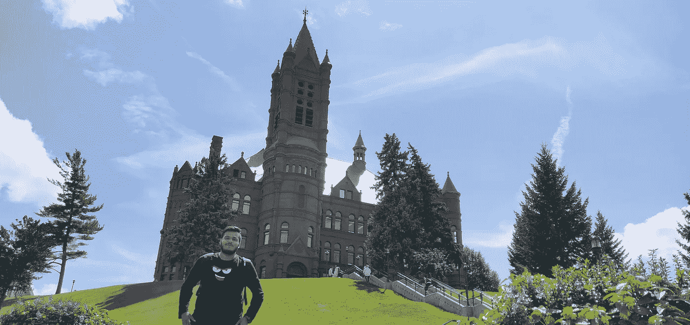

# 利用研究助教奖学金进入微软

> 原文：<https://towardsdatascience.com/jump-start-into-ms-with-research-assistantship-1f9a792590ff?source=collection_archive---------9----------------------->

来到机会之地:美国，已经一个月了。到目前为止，这是一次美妙的旅程，我很喜欢。所以，回到印度后，我有两个选择，是去达索系统公司做一名 R&D 的助理开发工程师，还是去锡拉丘兹大学信息研究学院攻读应用数据科学硕士。正如你从标题中理解的那样，你知道我做了哪个选择。如果你不知道，让我告诉你,《美国新闻》将锡拉丘兹大学信息学院的信息项目列为全美第二。为抵达美国做准备是一段艰难的时光，但我享受其中的每一刻。我于 2018 年 8 月 6 日抵达美国纽约锡拉丘兹的汉考克国际机场。这里的天气不可预测，但相对凉爽。到目前为止，美国没有让我失望，因为它是一种不同的文化，人们更加友好和外向，但我想念我的家人，朋友和最后但并非最不重要的“假期”。大学有一个巨大的校园，占地 700 多英亩，位于城市环境中，拥有最先进的基础设施和设备。

闲话少说，让我开门见山:我是如何从第一学期就获得研究助教奖学金的？我说“助教奖学金”了吗？对不起，我指的是“助教奖学金”:让我带你看一下整个过程。

# 我什么时候接触过老师了？

我在 2018 年 5 月中旬完成了我的本科学业，在家里无所事事。许多人告诉我，你通常不会在第一学期获得助教奖学金，但这总是值得一试。我最初在大学网站上浏览了教员的研究概况。每所大学都有教师网页，在那里你可以找到教授们目前参与的所有有趣的东西。我列出了与我的研究兴趣有交集的五位教授的候选名单，并在 5 月底之前发送了关于我对他们工作的兴趣的电子邮件。

# 我在那些邮件里写了什么？

教授们确实会收到很多关于他们实验室工作的电子邮件，同时他们也非常忙。你的电子邮件中应该有一个能引起教授注意的钩子。钩子？伙计，你说的钩子是什么意思？等等，我在解释。实际上，你的电子邮件有两个主要的吸引读者的地方。主题:人们习惯写各种各样的主题，比如“未来的研究助理——2018 年秋季”，“你实验室的 RA/GA/TA”等等，但是它包含教授感兴趣的东西吗？没有。他/她为什么会打开你的邮箱？在这个繁忙的时刻，教授们已经收到了很多类似的电子邮件。这就是为什么第一个钩子是主题行。对我有用的是:对你教授的研究做适当的功课，找到你研究兴趣的交叉点。然后，你可以把主题简单地写成“[研究兴趣] —在你的实验室工作”。这是不是太简单了，但它确实有效；
)**2。开篇:**这是大多数学生犯的一个错误，他们介绍了自己，并对自己说了很多废话。如果教授打开你的电子邮件，他很少有机会阅读你的第二段，因为你在第一段吹嘘自己，浪费了这个机会。第一段应该基于你对教授做的家庭作业:谈论他的项目、论文、兴趣。这是人类的一种倾向，他们喜欢听到关于他们自己的事情。它不应该超过 3-4 行，然后巧妙地将它与你觉得这些东西有趣的原因联系起来。我确实用一句话把它和我过去做过的一个项目联系起来。现在，教授知道你值得他/她的时间，因为你自己已经研究过他/她的兴趣和工作。现在你们两个都有共同的兴趣，他/她可能会看第二段，在那里你简要介绍自己，并描述与教授相关的所有工作。如果你想要一个很长的第二段，或者分成 4-4 行的段落，总共最多 3 段关于你自己和你的工作，这完全取决于你。确保一切都与你想做的工作类型相关。

你认为你现在都准备好了吗？啊哈。一定要写下结束语，直截了当地问你想要什么。你可以礼貌地问“我想知道你的实验室是否有一个为你的研究做贡献的空缺职位”，并以注明你已经放在邮件中供教授参考的所有附件结束这一段。你在说什么依恋，伙计？你至少应该附上你的简历，但你可以添加更多像实习信，论文(即使是未发表的，因为它是你的学术写作样本的例子)和项目报告。

嗯……就这些？不，还有更多。15 天后，如果你没有收到任何回复，你可以发一封提醒邮件，因为他们有时会因为忙碌而错过邮件。让我们回到我的故事，我说到哪里了？是的，我告诉你我在五月底给五位教授发了电子邮件。第一天，第二天，第三天，第四天，我得到了一位教授的第一次回复，他说我的背景非常适合他/她的研究，并要求我在来锡拉丘兹之前阅读一些技术。哦，那是积极的。在发出提醒邮件后，我又收到了两封回复，其中一封说他/她想在我到达锡拉丘兹大学后和我面谈，猜猜那个教授是我最优先考虑的。

我在八月初到达锡拉丘兹，然后给他们发电子邮件告知我的到达。他们很忙，面试被安排在八月的第三周。与此同时，我知道系里有一个门户网站，上面贴出了所有学院研究助理的职位空缺，找到一个好职位后，我就去申请了。就在一天之内，我得到了一个面试的机会，面试是在接到通知的第二天，因为教授在那之后几周都不在城里。关于面试，确保你知道你写在简历上的所有内容，并准备好回答深层次的概念性问题。我在第一次面试中被盘问，除了我的简历之外，还问了一些关于优化模式匹配算法、微积分和数学的问题。不要犹豫地说“你不知道”,不要试图愚弄教授，因为他们是你所用技术的大师。最终，我完成了对不同教授的三次面试，幸运的是，他们都给了我一份工作，让我在他们各自的实验室做研究助理。我的假新闻检测项目(听起来很棒？但这是美国著名的研究课题)和在印度人类住区研究所的实习经历在面试中发挥了至关重要的作用。

In-front of School of Visual and Performing Arts, Syracuse University

这是一种幸福的结局，对不对？我最终决定与 Jennifer Stromer-Galley 教授合作进行[启发性](http://illuminating.ischool.syr.edu)项目，开发机器学习算法和自然语言处理技术，以跟踪脸书和推特上大约 1100 名 2018 年联邦选举的候选人。该项目得到了奈特基金会、哥伦比亚大学数字新闻 Tow 中心、锡拉丘兹大学信息研究学院计算和数据科学中心以及 BITS 实验室的支持。那都是乡亲们！在 gmail dot com 的[我的名字][我的名字]或我的[LinkedIn](https://www.linkedin.com/in/jkachhadia)上提问。关于这项工作的更新即将推出。