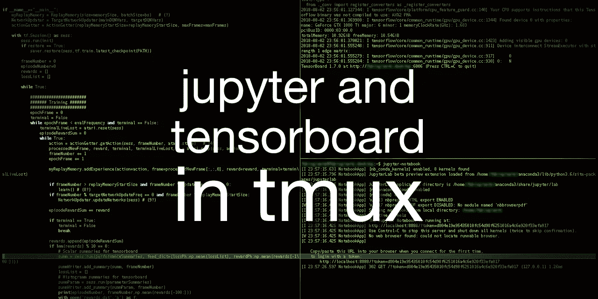
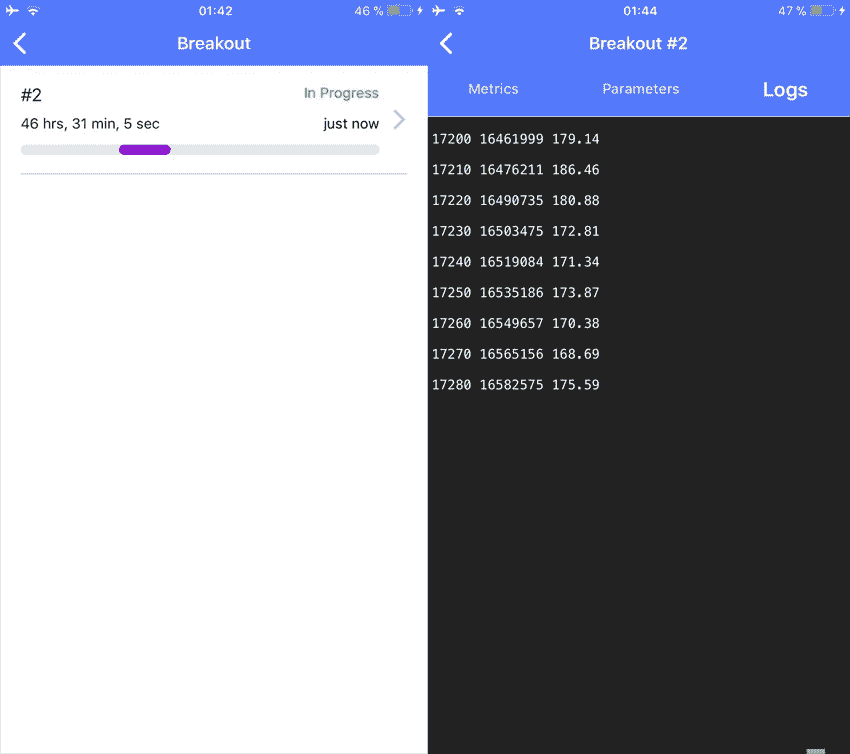

# tmux 和 ssh 中的 Jupyter 和 tensorboard

> 原文：<https://towardsdatascience.com/jupyter-and-tensorboard-in-tmux-5e5d202a4fb6?source=collection_archive---------4----------------------->



在最近的帖子中，我描述了如何[设置你的个人深度学习工作站](https://medium.com/@fabiograetz/setting-up-your-personal-deep-learning-station-with-ubuntu-16-04-2bc3ed2d7bb3)以及如何[打开并远程访问它](https://medium.com/@fabiograetz/accessing-your-deep-learning-station-remotely-and-setting-up-wake-on-lan-1e708c50fdd8)。

在这篇短文中，我解释了我通常如何用 tmux 设置我的远程工作环境，并在我的手机上检查我的计算进度。

**tmux** 是一个[终端复用器](https://en.wikipedia.org/wiki/Terminal_multiplexer)，允许用户在单个终端窗口或远程终端会话中访问多个独立的终端会话。

首先，将以下几行添加到您笔记本电脑上的`.ssh/config`中。看这里,如果你想要更详细的关于如何远程访问你的电脑的指导。

```
Host workstation
     HostName <hostname>
     User <username>
     Port <port>
     LocalForward 8888 localhost:8888
     LocalForward 6006 localhost:6006
```

现在输入`ssh workstation`就可以登录了。键入`tmux new -s <sessionname>`来启动 tmux。我通常通过键入`Ctrl-b %`垂直分割屏幕，然后通过键入`Ctrl-b "`水平分割屏幕。使用`Ctrl-b o` 可以导航到下一个窗格。我通常会打开右上方的窗格，用`source active <name>`启动我的虚拟环境，然后通过键入`jupyter-notebook`启动一个 jupyter 笔记本。将链接复制到笔记本电脑的浏览器中。接下来，我们开始 tensorboard。键入`Ctrl-b o`将光标移动到 tmux 中的下一个窗格。通过键入`tensorboard --logdir=<log directory>`激活虚拟环境并启动 tensorboard。在笔记本电脑的浏览器中打开一个新标签，然后进入 [http://localhost:6006](http://localhost:6006) 。现在 tensorboard 应该也在运行(如果它不工作，确保 tensorboard 真的像我的情况一样使用端口 6006)。

现在最精彩的部分来了:当你停止工作时，只需输入`Ctrl-b d`就可以从 tmux 会话中脱离，当你想继续工作时，输入`tmux attach -t <sessionname>`就可以回到你离开的地方！

不幸的是，我不认为有一种方法可以关闭 jupyter 笔记本，同时它继续在后台运行，以后再回来。我经常做的是，当我想留下一些计算的东西过夜时，通过键入`jupyter-nbconvert --to script <name>.ipynb`将它转换成 python。现在，只需运行`.py`，脱离 tmux 会话，第二天再回来查看输出。如果有人知道更好的方法，请留下评论，我会很高兴知道。

以下是 tmux 的一些非常有用的快捷方式:

```
# session management
tmux ls (or tmux list-sessions)
tmux new -s session-name
Ctrl-b d Detach from session
tmux attach -t [session name]
tmux kill-session -t session-nameCtrl-b c Create new window
Ctrl-b d Detach current client
Ctrl-b l Move to previously selected window
Ctrl-b n Move to the next window
Ctrl-b p Move to the previous window
Ctrl-b & Kill the current window
Ctrl-b , Rename the current window
Ctrl-b q Show pane numbers (used to switch between panes)
Ctrl-b o Switch to the next pane
Ctrl-b ? List all keybindings# moving between windows
Ctrl-b n (Move to the next window)
Ctrl-b p (Move to the previous window)
Ctrl-b l (Move to the previously selected window)
Ctrl-b w (List all windows / window numbers)
Ctrl-b window number (Move to the specified window number, the
default bindings are from 0 -- 9)# Tiling commands
Ctrl-b % (Split the window vertically)
CTRL-b " (Split window horizontally)
Ctrl-b o (Goto next pane)
Ctrl-b q (Show pane numbers, when the numbers show up type the key to go to that pane)
Ctrl-b { (Move the current pane left)
Ctrl-b } (Move the current pane right)
Ctrl-b x kill current pane# Make a pane its own window
Ctrl-b : "break-pane"
```

另一个有用的提示:如果你使用 [hyperdash](https://hyperdash.io) ，你可以在手机上追踪你的模特的表现，而不必登录你的电脑:

`hyperdash run -n "DQN Breakout" python DQN.py`



希望这能为你节省不少时间:)玩得开心！