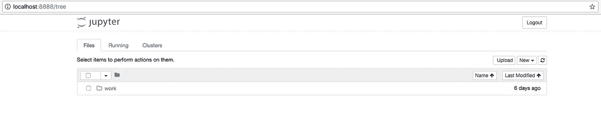

# Jupyter 数据科学堆栈+ Docker 在 15 分钟内完成

> 原文：<https://towardsdatascience.com/jupyter-data-science-stack-docker-in-under-15-minutes-19d8f822bd45?source=collection_archive---------0----------------------->

***动机*** :假设你想使用 Python 或 R 中一些很酷的数据科学库，但你不想花费 ***小时*** 来安装 Python 或 R，找出你需要的库，安装每一个库，然后在你的 Linux/Windows/OSX/OS9 版本上无聊地工作——这就是 Docker 的用处！有了 Docker，我们可以立即建立并运行 Jupyter“数据科学”笔记本堆栈。我们开始吧！

Docker 允许我们在所谓的 ***容器*** 中运行“准备就绪”的 Jupyter 数据科学堆栈:

> 容器映像是一个轻量级的、独立的、可执行的软件包，包含了运行它所需的一切:代码、运行时、系统工具、系统库、设置。基于 Linux 和 Windows 的应用程序都可以使用容器化软件，无论环境如何，容器化软件都可以运行。容器将软件从其周围环境中隔离出来，例如开发和阶段环境之间的差异，并有助于减少在同一基础设施上运行不同软件的团队之间的冲突。

那么容器和虚拟机有什么区别呢？

> 容器和虚拟机具有类似的资源隔离和分配优势，但功能不同，因为容器虚拟化的是操作系统而不是硬件，容器更具可移植性和效率。

要开始使用 Docker，您需要安装 Docker 社区版。在此下载适合您环境的安装程序[。一旦你安装了 Docker，重启你的机器，我们就可以开始安装 Jupyter 容器了。当运行一个容器时，你需要告诉 Docker 这个容器的基本映像是什么。](https://www.docker.com/community-edition#/download)

那么什么是 ***图像*** 以及它如何与 ***容器*** 相关联呢？

> Docker 图像是由一系列层构建而成的。每一层代表图像 docker 文件中的一条指令。除了最后一层，每一层都是只读的。

一个 ***容器*** 就是一个 ***图像*** 的运行实例。使用 Docker 真正节省时间的是，其他人已经构建了一个映像，其中包含了我们开始使用全套 Jupyter 数据科学堆栈所需的一切！我们所需要做的就是告诉 Docker 根据预定义的图像启动一个容器。为此，我们将以 Docker compose 文件的形式编写一个简单的配方。将下面的文件作为 **docker-compose.yml** 保存到您的工作目录中:

保存文件后，用您最喜欢的编辑器打开它，并更改以下部分:

`/Absolute/Path/To/Where/Your/Notebook/Files/Will/Be/Saved`

本地机器上保存您的工作的路径。确保路径确实存在，也就是说，已经创建了所有目录。如果不这样做，当你试图启动你的容器时会导致错误，更糟糕的是，你将不能保存你在容器中做的任何工作！

很好，我们已经准备好了 Docker compose 文件，现在我们可以使用 docker-compose 命令来启动我们的容器。打开终端或命令提示符，进入您的工作目录并运行以下命令:

`docker-compose up`

您应该在终端/命令提示符下看到类似下面的输出(为了简洁起见，我省略了一些输出):

```
$ **docker-compose up**Creating network “jupyternotebook_default” with the default driverCreating datascience-notebook-container …Creating datascience-notebook-container … doneAttaching to datascience-notebook-containerdatascience-notebook-container | Execute the command: jupyter notebook.
.
.datascience-notebook-container | [I 11:37:37.993 NotebookApp] The Jupyter Notebook is running at: [http://[all ip addresses on your system]:8888/?token=123456789123456789123456789123456789](http://localhost:8888/?token=123456789123456789123456789123456789)datascience-notebook-container | [I 11:37:37.993 NotebookApp] Use Control-C to stop this server and shut down all kernels (twice to skip confirmation).datascience-notebook-container | [C 11:37:37.994 NotebookApp]datascience-notebook-container |datascience-notebook-container | Copy/paste this URL into your browser when you connect for the first time,datascience-notebook-container | to login with a token:datascience-notebook-container | [http://localhost:8888/?token=123456789123456789123456789123456789](http://localhost:8888/?token=123456789123456789123456789123456789)
```

最后一行是一个 URL，我们需要将其复制并粘贴到我们的浏览器中，以访问我们的新 Jupyter 堆栈:

```
[http://localhost:8888/?token=123456789123456789123456789123456789](http://localhost:8888/?token=123456789123456789123456789123456789)
```

一旦你做到了这一点，你应该迎接你自己的集装箱 Jupyter 服务！您可以访问此[链接](https://hub.docker.com/r/jupyter/datascience-notebook/)了解 Jupyter 数据科学堆栈为您提供的更多信息。



要创建您的第一个笔记本，请进入工作目录，然后单击右侧的“新建”按钮，并选择“Python 3”来创建一个基于 Python 3 的新笔记本。一旦你这样做了，检查你的路径，你选择保存你的工作到本地，你应该看到你的新笔记本的。ipynb 文件已保存！

要在完成工作后关闭容器，只需在终端/命令提示符下按 Ctrl-C。您的工作将全部保存在您的实际机器上，路径是我们在 Docker compose 文件中设置的。这就是你开始使用 Jupyter 笔记本和 Docker 魔力的简单快捷的方法。

我希望这篇文章对你有所帮助，请在下面留下你的反馈或评论。黑客快乐！