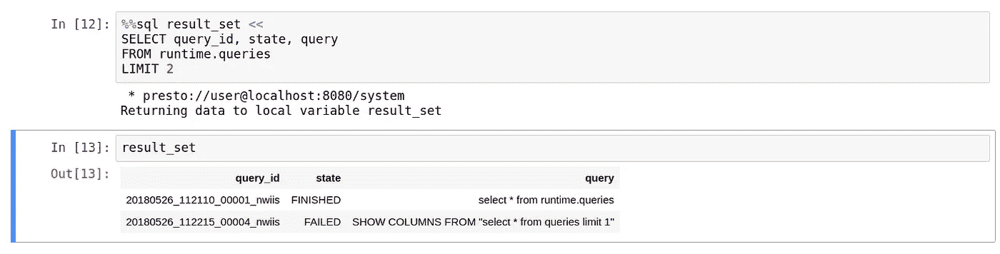

# 使用 SQL 的 Jupyter Magics

> 原文：<https://towardsdatascience.com/jupyter-magics-with-sql-921370099589?source=collection_archive---------5----------------------->


Jupyter/IPython 笔记本可用于在关系数据库上使用 SQL 进行交互式数据分析。这融合了使用 Jupyter(一个成熟的数据分析平台)的优势、SQL 的易用性和 SQL 引擎的性能。

Jupyter 的神奇功能允许你用更简洁的代码片段替换样板代码片段。让我们探索 Jupyter SQL 的魔力，它允许我们与 Presto 或任何其他关系数据库进行交互。

# 什么是神奇功能？

魔术函数是 Jupyter 内核中执行所提供命令的预定义函数(“魔术”)。有两种面向行和面向单元的魔法，分别以`%`和`%%`开头。

为了看出区别，我们开始比较使用和不使用 magics 函数的代码示例。最终，两条语句达到了相同的结果。

让我们开始创建与 SQLAchemy 的连接，以获取最后执行的查询并将其放入数据框。

如果我们启用了 SQL 魔法函数，我们将这样做。

## 入门指南

这些示例使用 Prestodb 作为 SQL 引擎。然而，该方法可以扩展到任何与 Python SQLAlchemy 兼容并且具有实现 Python DB 2.0 规范的驱动程序的引擎。为了实现这种魔力，我们需要一个 ipython-sql 库。此外，这些例子大多来自 ipython-sql [官方知识库](https://github.com/catherinedevlin/ipython-sql)。

```
pip install pandas

pip install sqlalchemy # ORM for databases

pip install ipython-sql # SQL magic function
```

要使用 Prestodb，我们需要 PyHive 库。幕后的 SQLAlchemy 将使用该库建立连接并提交 SQL 查询。对于其他引擎，您需要安装合适的驱动程序，即[PostgreSQL](http://docs.sqlalchemy.org/en/latest/dialects/postgresql.html)、 [MySQL](http://docs.sqlalchemy.org/en/latest/dialects/mysql.html) 。

```
pip install pyhive[presto] # DB driver library
```

# 使用

ipython-sql 库使用%load_ext iPython 扩展语法加载，并指向连接对象，如下所示:

```
%load_ext sql
%config SqlMagic.autocommit=False # for engines that do not support autommit
```

请注意，对于普雷斯托，黑斑羚和其他一些引擎，你需要禁用`autocommit`功能。这是通过 SqlMagic config 属性完成的。列出您可以在单元中运行的所有配置选项:`%config SqlMagic`

# 关系

要连接到数据库，您需要将 SQLAlchemy 格式的连接字符串传递给`%sql`函数。

```
%sql presto://user@localhost:8080/system
```

如果没有提供连接字符串并且还没有建立连接，`ipython-sql`试图从`DATABASE_URL`环境变量中获取连接信息。如果您的连接信息是静态的，您可以在`~/.bashrc`中导出环境变量`DATABASE_URL`。%env 是另一个设置环境变量的神奇函数。

```
%env DATABASE_URL=presto://user@localhost:8080/system
%sql SELECT 1 as "Test"
```

在多个 SQL 引擎的情况下，如果您想要组合来自它们的数据，您可以在单元模式下将连接字符串与神奇函数的每个查询一起传递。

```
%%sql user@jmx
SHOW SCHEMAS
```

# 绑定变量

参数替换是一个方便的特性，它允许在查询运行时定义 SQL 查询参数。它使代码不那么脆弱，也不那么富于表现力。该参数需要在本地范围内定义，并以冒号为前缀，即`:parameter`

# 变量赋值

普通的 IPython 赋值适用于单行`%sql`查询:

```
result = %sql select query_id, state from runtime.queries limit 1
```


对于多行查询，您需要使用`<<`语法。

```
%%sql result_set << 
SELECT query_id, state, query 
FROM runtime.queries
LIMIT 2
```



# 熊猫

SQL magic 与 pandas 库有很好的集成。SQL 查询的结果可以通过`DataFrame`调用转换成常规的 pandas 数据帧。


# 结论

你也应该考虑阅读一下[内置的神奇](https://jakevdp.github.io/PythonDataScienceHandbook/01.03-magic-commands.html)功能，它可以让你完成更多的工作，减少输入！你也可以看看[满笔记本](https://github.com/satybald/ipython-notebooks/blob/master/MagicsSQL.ipynb)贴上的例子。

[](https://github.com/satybald/ipython-notebooks/blob/master/MagicsSQL.ipynb) [## saty bald/ipython-笔记本

### IPython-笔记本-IPython 笔记本的集合

github.com](https://github.com/satybald/ipython-notebooks/blob/master/MagicsSQL.ipynb)