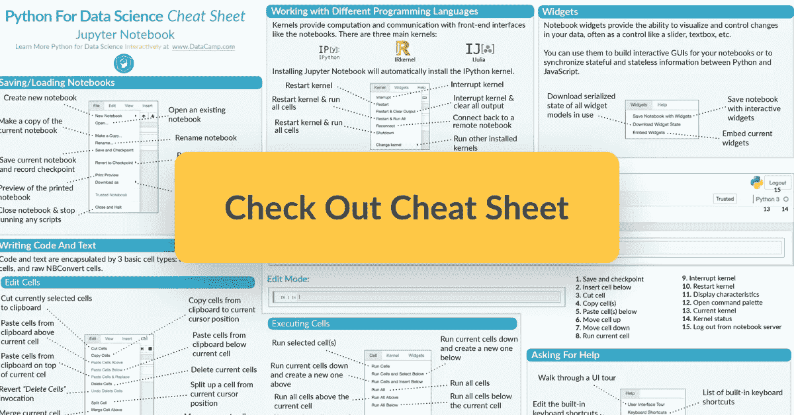

# Jupyter 笔记本备忘单

> 原文：<https://towardsdatascience.com/jupyter-notebook-cheat-sheet-e4aa632018c2?source=collection_archive---------6----------------------->

您可能已经非常了解 Jupyter 笔记本，它可能是 Jupyter 生态系统中最知名的部分之一！如果你还没有探索过这个生态系统，或者你只是想了解更多，请不要犹豫，点击这里去探索它吧！。

对于那些不熟悉 Project Jupyter 的人来说，Jupyter Notebook 应用程序可以生成包含可执行代码、文本元素甚至 HTML 的混合文档，这使得它成为汇集分析描述及其结果以及实时执行数据分析的理想场所。这一点，加上其许多有用的功能，解释了为什么 Jupyter 笔记本电脑是[数据科学家的首选开发环境之一](https://www.datacamp.com/community/tutorials/data-science-python-ide)，它允许交互式、可重复的数据科学分析、计算和通信。

Jupyter 笔记本的另一个优点是什么？

它们非常容易上手！当你阅读 DataCamp 的[Jupyter 笔记本权威指南](https://www.datacamp.com/community/tutorials/tutorial-jupyter-notebook)时，你可能已经注意到了这一点。然而，当您第一次进入应用程序时，您可能需要在呈现给您的各种功能中找到自己的方式:从保存您当前的笔记本到在笔记本中添加或移动单元格，或者在笔记本中嵌入当前的小部件——毫无疑问，当您第一次开始使用时，有很多东西需要发现！

这就是为什么 DataCamp 为那些刚刚起步并希望获得一些帮助来找到出路的人制作了一个 Jupyter 笔记本备忘单。

**请注意**Jupyter 笔记本应用程序有一个方便的“帮助”菜单，包括一个完整的用户界面浏览！—别担心，我们也在备忘单中包含了这一点:)

请点击这里查看:

**点击** [**这里**](https://s3.amazonaws.com/assets.datacamp.com/blog_assets/Jupyter_Notebook_Cheat_Sheet.pdf) **看小抄。**

简而言之，这份备忘单将帮助你启动你的数据科学项目，无论它们是大是小:通过一些截图和解释，你很快就会成为 Jupyter 笔记本专家！

你还在等什么？是时候开始了！

*原载于***。**