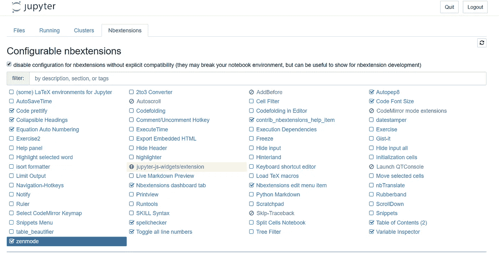
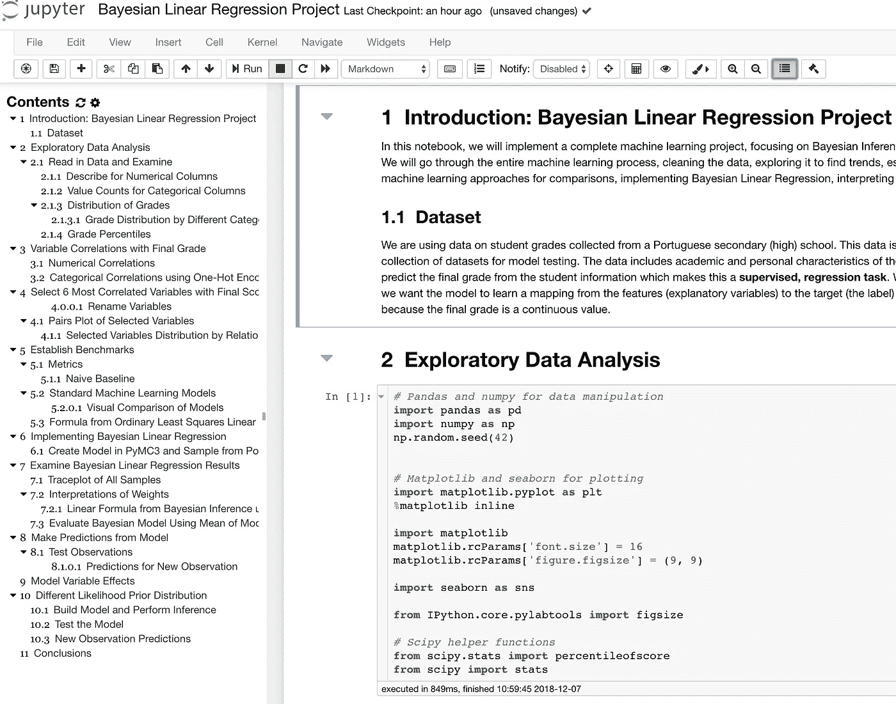
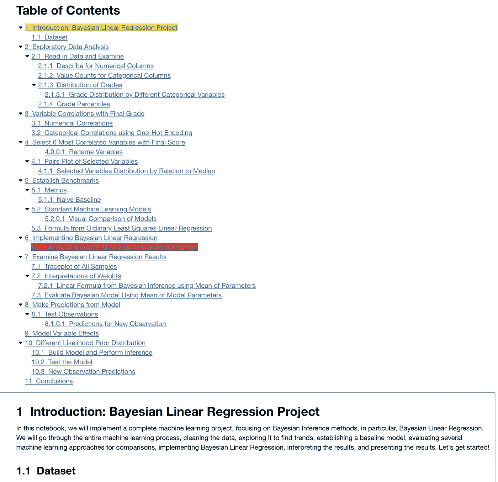
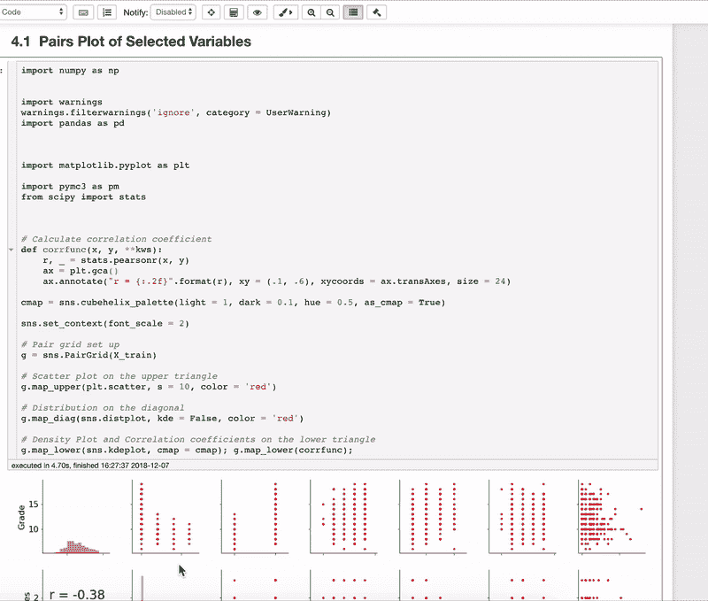
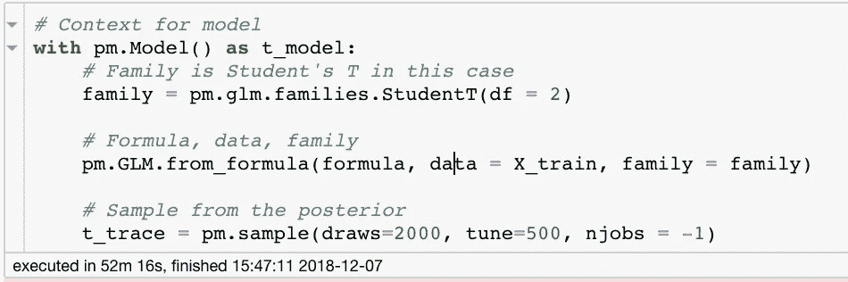
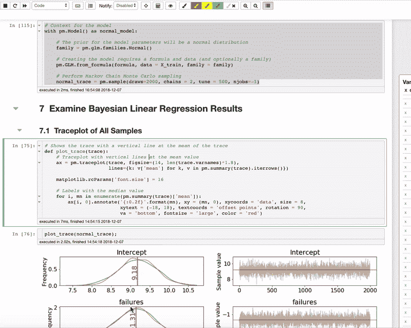

# Jupyter 笔记本扩展

> 原文：<https://towardsdatascience.com/jupyter-notebook-extensions-517fa69d2231?source=collection_archive---------0----------------------->


[(Source)](https://www.pexels.com/photo/view-of-high-rise-buildings-during-day-time-302769/)

## 如何在笔记本电脑环境中提高工作效率

Jupyter 笔记本是一个很好的教学、探索和读写编程环境，但是开箱即用的笔记本众所周知缺乏特性。幸运的是，有许多[方法](/jupyter-notebook-hints-1f26b08429ad)，包括 [Jupyter 笔记本扩展](https://github.com/ipython-contrib/jupyter_contrib_nbextensions)，来改进这个无价的工具。

# 极其简洁的版本

在命令提示符下运行以下命令:

```
pip install jupyter_contrib_nbextensions && jupyter contrib nbextension install 
```

启动 Jupyter 笔记本并导航到新的 Nbextensions 选项卡:



Jupyter Notebook Extensions Tab

启用您想要的扩展并享受工作效率优势。

(如果您[没有看到选项卡](https://github.com/Jupyter-contrib/jupyter_nbextensions_configurator/issues/72)，请打开笔记本并点击编辑> nbextensions 配置)

可以在笔记本的工具栏中看到启用的扩展:


# 稍长的版本

如果这还不够让你满意，下面是一些关于 Jupyter 笔记本扩展的细节。我还列出了我的前 5 条建议来帮助你开始。

## 什么是笔记本扩展？

[Jupyter 笔记本扩展](https://github.com/ipython-contrib/jupyter_contrib_nbextensions)是扩展笔记本环境基本功能的简单附件。用 JavaScript 编写，他们做的事情有[自动格式化你的代码](https://github.com/ipython-contrib/jupyter_contrib_nbextensions/tree/master/src/jupyter_contrib_nbextensions/nbextensions/code_prettify)或者[当一个单元格完成时发送一个浏览器通知](https://github.com/ipython-contrib/jupyter_contrib_nbextensions/tree/master/src/jupyter_contrib_nbextensions/nbextensions/notify)。扩展目前只适用于 Jupyter 笔记本(不适用于 Jupyter 实验室)。

为什么要使用这些扩展？Jupyter 笔记本是教学、学习、原型制作、探索和尝试新方法的绝佳工具(甚至在网飞的[生产中也是如此)。然而，普通笔记本的功能有限，这使得在笔记本上工作令人沮丧。虽然 Jupyter 笔记本扩展没有完全解决问题，但它们确实增加了一些好处，使您的工作更加轻松。](https://medium.com/netflix-techblog/notebook-innovation-591ee3221233)

# 使用哪个

以下是我最常用的 5 款 Jupyter 笔记本扩展:

## 1.目录:更简单的导航

一旦你开始在一个 Jupyter 笔记本上放几十个电池，就很难把它们都记录下来。目录通过添加可放置在页面任何位置的链接目录解决了这个问题:



Table of Contents

您还可以使用该扩展在笔记本顶部添加一个链接的目录。这甚至显示哪个单元被选中，哪个单元正在运行:



Table of Contents in Notebook

## 2.Autopep8:一键完成简洁的代码

我们都应该编写符合 [pep8 的代码](https://www.python.org/dev/peps/pep-0008/)，但有时你会陷入分析中，很难坚持最佳实践。当你写完这个惊人的情节时，这个扩展允许你简单地点击木槌，自动格式化你混乱的代码。



Autopep8 your code.

像最好的附加组件一样，这一个只需简单的点击就能完成耗时而乏味的任务，让你专注于思考问题。

## 3.变量检查器:跟踪你的工作空间

变量检查器显示您在笔记本中创建的所有变量的名称，以及它们的类型、大小、形状和值。


Variable inspector

对于从 RStudio 迁移过来的数据科学家来说，或者如果你不想继续打印`df.shape`或者想不起`x`的`type`的话，这个工具是非常宝贵的。

## 4.ExecuteTime:显示单元运行的时间和时长

我经常发现自己试图弄清楚一个单元运行需要多长时间，或者我最后一次运行打开了几天的笔记本是什么时候。ExecuteTime 通过显示一个单元完成的时间和花费的时间来处理这两个问题。



ExecuteTime extension output

有更好的[方法来计时](https://pythonhow.com/measure-execution-time-python-code/)(例如`[%%timeit](https://ipython.readthedocs.io/en/stable/interactive/magics.html#magic-timeit)`[单元格魔术](https://ipython.readthedocs.io/en/stable/interactive/magics.html#magic-timeit))但是这很容易实现并且覆盖了笔记本中的所有单元格。

## 5.隐藏代码输入:隐藏工作显示结果

虽然我们中的一些人喜欢看到进入分析的艰苦工作，一些人只是喜欢看到结果。Hide input all 扩展允许您在保留输出的同时立即隐藏笔记本中的所有代码。



Hide all code

下一次有人说他们只想看到结果，你有一个单击解决方案。(尽管您应该经常检查代码)。

这些只是我发现自己最常使用的扩展，你并不局限于五个。安装扩展并打开一个笔记本(这里显示的笔记本[在 GitHub](https://github.com/WillKoehrsen/Data-Analysis/blob/master/bayesian_lr/Bayesian%20Linear%20Regression%20Project.ipynb) 上)来检查整个列表！(如果您愿意，您甚至可以编写自己的扩展。文档很少，但是[这里是基本结构](https://jupyter-contrib-nbextensions.readthedocs.io/en/latest/internals.html)。)

# 结论

安装 Jupyter 笔记本扩展，花点时间搞清楚哪些对你有用，提高你的生产力。虽然没有一个能改变生活，但它们都增加了足够的价值，累积起来节省了您几个小时的宝贵开发时间。

尽管如果你正在编写生产代码(我喜欢[而不是代码](https://code.visualstudio.com/docs/languages/python))，你可能想花一些时间在[学习 IDE](https://realpython.com/python-ides-code-editors-guide/) ，Jupyter 笔记本仍然是数据科学工作流程中不可或缺的一部分。如果您打算使用这种环境，那么您最好充分利用您的工具。

一如既往，我欢迎反馈和建设性的批评。可以通过 Twitter [@koehrsen_will](http://twitter.com/@koehrsen_will) 或者通过我的个人网站 [willk.online](https://willk.online) 找到我。