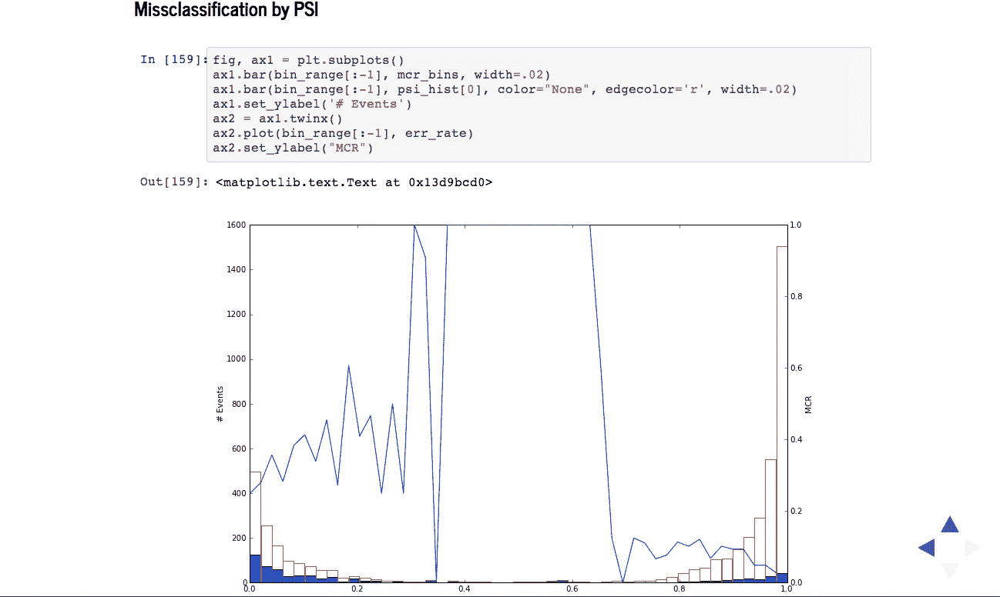
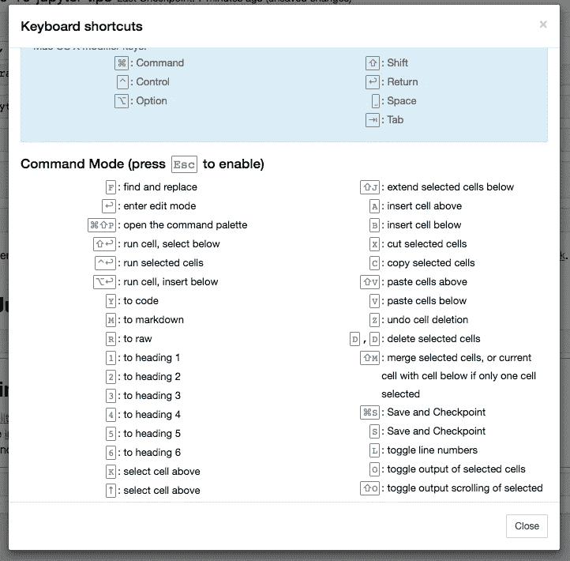
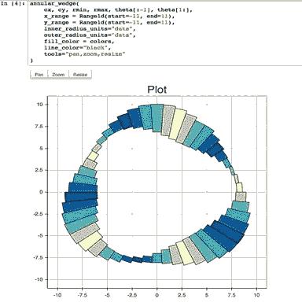
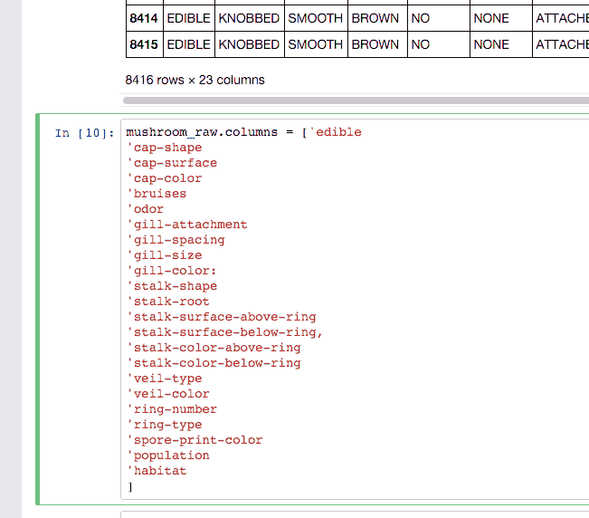
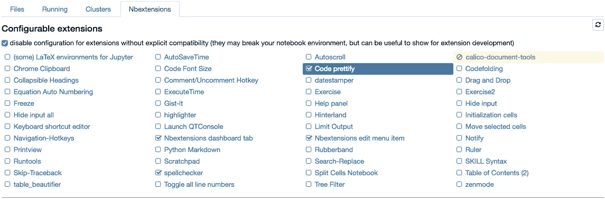

# 提高 Jupyter 笔记本电脑的工作效率

> 原文：<https://towardsdatascience.com/jupyter-notebook-hints-1f26b08429ad?source=collection_archive---------1----------------------->

# Jupyter (IPython)笔记本特性

首先，我想指出，它是创建可读分析非常灵活的工具，因为人们可以将代码、图像、注释、公式和图表放在一起:



Jupyter 具有很强的可扩展性，支持其他编程语言，几乎可以在任何服务器上轻松托管——您只需要通过 ssh 或 http 访问服务器。而且是完全免费的。

# 基础

热键列表显示在**帮助>键盘快捷键**中(列表会不时扩展，所以不要犹豫再看一遍)。

这给了你一个如何与笔记本互动的想法。如果你经常使用笔记本，你当然会学到大部分的内容。特别是:

*   `Esc + F`查找和替换仅搜索代码，不搜索输出
*   `Esc + O`切换单元格输出
*   您可以选择一行中的多个单元格，然后删除/复制/剪切/粘贴它们。当您需要移动笔记本的部件时，这很有帮助



# 共享笔记本

最简单的方法是共享笔记本文件。ipynb)，但并不是所有人都在用笔记本，所以选项有

*   将笔记本转换为 html 文件
*   分享给正在渲染笔记本的 gists。
*   将您的笔记本存放在 dropbox 中，并将链接放入 [nbviewer](http://nbviewer.jupyter.org/) 中。nbviewer 将渲染笔记本
*   github 渲染笔记本(有一些限制，但在大多数情况下是可以的)，这使得保持你的研究历史非常有用(如果研究是公开的)

# 在笔记本中绘图

有许多绘图选项:

*   matplotlib(事实上的标准)，用`%matplotlib inline`激活
*   `%matplotlib notebook`是交互式模式，但是非常慢，因为渲染是在服务器端完成的。
*   mpld3 为 matplotlib 代码提供了可选的渲染器(使用 d3)。很好，虽然不完整
*   散景是构建交互式地块的更好选择
*   plot.ly 可以生成很好的图，但是会让你花钱



# 魔法

魔术师正在把简单的 python 变成*神奇的 python* 。魔法是 ipython 力量的关键。

在[1]中:

```
*# list available python magics*
**%lsmagic**
```

Out[1]:

```
Available line magics:
%alias  %alias_magic  %autocall  %automagic  %autosave  %bookmark  %cat  %cd  %clear  %colors  %config  %connect_info  %cp  %debug  %dhist  %dirs  %doctest_mode  %ed  %edit  %env  %gui  %hist  %history  %killbgscripts  %ldir  %less  %lf  %lk  %ll  %load  %load_ext  %loadpy  %logoff  %logon  %logstart  %logstate  %logstop  %ls  %lsmagic  %lx  %macro  %magic  %man  %matplotlib  %mkdir  %more  %mv  %notebook  %page  %pastebin  %pdb  %pdef  %pdoc  %pfile  %pinfo  %pinfo2  %popd  %pprint  %precision  %profile  %prun  %psearch  %psource  %pushd  %pwd  %pycat  %pylab  %qtconsole  %quickref  %recall  %rehashx  %reload_ext  %rep  %rerun  %reset  %reset_selective  %rm  %rmdir  %run  %save  %sc  %set_env  %store  %sx  %system  %tb  %time  %timeit  %unalias  %unload_ext  %who  %who_ls  %whos  %xdel  %xmodeAvailable cell magics:
%%!  %%HTML  %%SVG  %%bash  %%capture  %%debug  %%file  %%html  %%javascript  %%js  %%latex  %%perl  %%prun  %%pypy  %%python  %%python2  %%python3  %%ruby  %%script  %%sh  %%svg  %%sx  %%system  %%time  %%timeit  %%writefileAutomagic is ON, % prefix IS NOT needed for line magics.
```

# %环境

您可以管理笔记本的环境变量，而无需重新启动 jupyter 服务器进程。一些库(比如 theano)使用环境变量来控制行为，%env 是最方便的方法。

在[2]中:

```
*# %env - without arguments lists environmental variables*
**%env** OMP_NUM_THREADS=4env: OMP_NUM_THREADS=4
```

# 执行 shell 命令

您可以调用任何 shell 命令。这对于管理您的虚拟环境特别有用。

在[3]中:

```
**!**pip install numpy
**!**pip list | grep TheanoRequirement already satisfied (use --upgrade to upgrade): numpy in /Users/axelr/.venvs/rep/lib/python2.7/site-packages
Theano (0.8.2)
```

# 抑制最后一行的输出

有时不需要输出，所以我们可以在新行上使用`pass`指令，或者在末尾使用分号

在[4]中:

```
**%matplotlib** inline
**from** **matplotlib** **import** pyplot **as** plt
**import** **numpy**
```

在[5]中:

```
*# if you don't put semicolon at the end, you'll have output of function printed*
plt**.**hist(numpy**.**linspace(0, 1, 1000)******1.5);
```

# 看 python 函数/类/什么的源码带问号(？, ?？)

在[6]中:

```
**from** **sklearn.cross_validation** **import** train_test_split
*# show the sources of train_test_split function in the pop-up window*
train_test_split**??**
```

在[7]中:

```
*# you can use ? to get details about magics, for instance:*
%pycat**?**
```

将在弹出窗口中输出:

```
Show a syntax-highlighted file through a pager.This magic is similar to the cat utility, but it will assume the file
to be Python source and will show it with syntax highlighting.This magic command can either take a local filename, an url,
an history range (see %history) or a macro as argument ::%pycat myscript.py
%pycat 7-27
%pycat myMacro
%pycat [http://www.example.com/myscript.py](http://www.example.com/myscript.py)
```

# %run 执行 python 代码

%run 可以从执行 python 代码。py 文件—这是一种有据可查的行为。

但它也可以执行其他 jupyter 笔记本！有时候还是挺有用的。

NB。%run 与导入 python 模块不同。

在[8]中:

```
*# this will execute all the code cells from different notebooks*
**%run** ./2015-09-29-NumpyTipsAndTricks1.ipynb[49 34 49 41 59 45 30 33 34 57]
[172 177 209 197 171 176 209 208 166 151]
[30 33 34 34 41 45 49 49 57 59]
[209 208 177 166 197 176 172 209 151 171]
[1 0 4 8 6 5 2 9 7 3]
['a' 'b' 'c' 'd' 'e' 'f' 'g' 'h' 'i' 'j']
['b' 'a' 'e' 'i' 'g' 'f' 'c' 'j' 'h' 'd']
['a' 'b' 'c' 'd' 'e' 'f' 'g' 'h' 'i' 'j']
[1 0 6 9 2 5 4 8 3 7]
[1 0 6 9 2 5 4 8 3 7]
[ 0.93551212  0.75079687  0.87495146  0.3344709   0.99628591  0.34355057
  0.90019059  0.88272132  0.67272068  0.24679158]
[8 4 5 1 9 2 7 6 3 0][-5 -4 -3 -2 -1  0  1  2  3  4]
[0 0 0 0 0 0 1 2 3 4]
['eh' 'cl' 'ah' ..., 'ab' 'bm' 'ab']
['ab' 'ac' 'ad' 'ae' 'af' 'ag' 'ah' 'ai' 'aj' 'ak' 'al' 'am' 'an' 'bc' 'bd'
 'be' 'bf' 'bg' 'bh' 'bi' 'bj' 'bk' 'bl' 'bm' 'bn' 'cd' 'ce' 'cf' 'cg' 'ch'
 'ci' 'cj' 'ck' 'cl' 'cm' 'cn' 'de' 'df' 'dg' 'dh' 'di' 'dj' 'dk' 'dl' 'dm'
 'dn' 'ef' 'eg' 'eh' 'ei' 'ej' 'ek' 'el' 'em' 'en' 'fg' 'fh' 'fi' 'fj' 'fk'
 'fl' 'fm' 'fn' 'gh' 'gi' 'gj' 'gk' 'gl' 'gm' 'gn' 'hi' 'hj' 'hk' 'hl' 'hm'
 'hn' 'ij' 'ik' 'il' 'im' 'in' 'jk' 'jl' 'jm' 'jn' 'kl' 'km' 'kn' 'lm' 'ln'
 'mn']
[48 33  6 ...,  0 23  0]
['eh' 'cl' 'ah' ..., 'ab' 'bm' 'ab']
['eh' 'cl' 'ah' ..., 'ab' 'bm' 'ab']
['bf' 'cl' 'dn' ..., 'dm' 'cn' 'dj']
['bf' 'cl' 'dn' ..., 'dm' 'cn' 'dj'][ 2.29711325  1.82679746  2.65173344 ...,  2.15286813  2.308737    2.15286813]
1000 loops, best of 3: 1.09 ms per loop
The slowest run took 8.44 times longer than the fastest. This could mean that an intermediate result is being cached.
10000 loops, best of 3: 21.5 µs per loop0.416
0.416
```

# %负载

将代码直接加载到单元格中。您可以选择本地文件或网上文件。

在取消下面代码的注释并执行后，它将用文件的内容替换单元格的内容。

在[9]中:

```
*# %load* [*http://matplotlib.org/mpl_examples/pylab_examples/contour_demo.py*](http://matplotlib.org/mpl_examples/pylab_examples/contour_demo.py)
```

# %store:在笔记本电脑之间传递数据时偷懒

在[10]中:

```
data **=** 'this is the string I want to pass to different notebook'
**%store** data
**del** data *# deleted variable*Stored 'data' (str)
```

在[11]中:

```
*# in second notebook I will use:*
**%store** -r data
**print** datathis is the string I want to pass to different notebook
```

# %who:分析全局范围的变量

在[12]中:

```
*# pring names of string variables*
**%who** strdata
```

# 时机

当您需要测量花费的时间或找到代码中的瓶颈时，ipython 可以帮上忙。

在[13]中:

```
**%%time**
import time
time.sleep(2) # sleep for two secondsCPU times: user 1.23 ms, sys: 4.82 ms, total: 6.05 ms
Wall time: 2 s
```

在[14]中:

```
*# measure small code snippets with timeit !*
**import** **numpy**
**%timeit** numpy.random.normal(size=100)The slowest run took 13.85 times longer than the fastest. This could mean that an intermediate result is being cached.
100000 loops, best of 3: 6.35 µs per loop
```

在[15]中:

```
**%%writefile** pythoncode.pyimport numpy
def append_if_not_exists(arr, x):
    if x not in arr:
        arr.append(x)

def some_useless_slow_function():
    arr = list()
    for i in range(10000):
        x = numpy.random.randint(0, 10000)
        append_if_not_exists(arr, x)Overwriting pythoncode.py
```

在[16]中:

```
*# shows highlighted source of the newly-created file*
**%pycat** pythoncode.py
```

在[17]中:

```
**from** **pythoncode** **import** some_useless_slow_function, append_if_not_exists
```

# 分析:%prun，%lprun，%mprun

在[18]中:

```
*# shows how much time program spent in each function*
**%prun** some_useless_slow_function()
```

输出示例:

```
26338 function calls in 0.713 seconds Ordered by: internal time ncalls  tottime  percall  cumtime  percall filename:lineno(function)
    10000    0.684    0.000    0.685    0.000 pythoncode.py:3(append_if_not_exists)
    10000    0.014    0.000    0.014    0.000 {method 'randint' of 'mtrand.RandomState' objects}
        1    0.011    0.011    0.713    0.713 pythoncode.py:7(some_useless_slow_function)
        1    0.003    0.003    0.003    0.003 {range}
     6334    0.001    0.000    0.001    0.000 {method 'append' of 'list' objects}
        1    0.000    0.000    0.713    0.713 <string>:1(<module>)
        1    0.000    0.000    0.000    0.000 {method 'disable' of '_lsprof.Profiler' objects}
```

在[19]中:

```
**%load_ext** memory_profiler
```

在[20]中:

```
*# tracking memory consumption (show in the pop-up)*
**%mprun** -f append_if_not_exists some_useless_slow_function()('',)
```

输出示例:

```
Line #    Mem usage    Increment   Line Contents
================================================
     3     20.6 MiB      0.0 MiB   def append_if_not_exists(arr, x):
     4     20.6 MiB      0.0 MiB       if x not in arr:
     5     20.6 MiB      0.0 MiB           arr.append(x)
```

**%lprun** 是行剖析，但它似乎在最新的 IPython 版本中被打破了，所以这次我们将不用魔法来管理:

在[21]中:

```
**import** **line_profiler**
lp **=** line_profiler**.**LineProfiler()
lp**.**add_function(some_useless_slow_function)
lp**.**runctx('some_useless_slow_function()', locals**=**locals(), globals**=**globals())
lp**.**print_stats()Timer unit: 1e-06 sTotal time: 1.27826 s
File: pythoncode.py
Function: some_useless_slow_function at line 7Line #      Hits         Time  Per Hit   % Time  Line Contents
==============================================================
     7                                           def some_useless_slow_function():
     8         1            5      5.0      0.0      arr = list()
     9     10001        17838      1.8      1.4      for i in range(10000):
    10     10000        38254      3.8      3.0          x = numpy.random.randint(0, 10000)
    11     10000      1222162    122.2     95.6          append_if_not_exists(arr, x)
```

# 使用%debug 调试

Jupyter 有自己的接口用于 [ipdb](https://docs.python.org/2/library/pdb.html) 。使得进入函数内部并研究那里发生的事情成为可能。

这不是 pycharm，需要很多时间来适应，但是在服务器上调试时，这可能是唯一的选择(或者从终端使用 pdb)。

在[22]中:

```
*#%%debug filename:line_number_for_breakpoint*
*# Here some code that fails. This will activate interactive context for debugging*
```

一个简单一点的选项是`%pdb`，它在异常出现时激活调试器:

在[23]中:

```
*# %pdb**# def pick_and_take():*
*#     picked = numpy.random.randint(0, 1000)*
*#     raise NotImplementedError()*

*# pick_and_take()*
```

# 用乳胶写配方

markdown 单元格使用 MathJax 渲染 latex。

p(a∣b)=p(b∣a)p(a)p(b)p(a∣b)=p(b∣a)p(a)p(b)

Markdown 是笔记本的重要组成部分，别忘了利用它的表现力！

# 在一个笔记本中使用不同的语言

如果你错过了很多，使用其他计算内核:

*   %%python2
*   %%python3
*   % %红宝石
*   %%perl
*   %%bash
*   %%R

是可能的，但是显然您需要首先设置相应的内核。

在[24]中:

```
**%%**ruby
puts 'Hi, this is ruby.'Hi, this is ruby.
```

在[25]中:

```
%%bash
echo 'Hi, this is bash.'Hi, this is bash.
```

# 大数据分析

许多解决方案可用于查询/处理大型数据样本:

*   [ipyparallel(以前的 ipython cluster)](https://github.com/ipython/ipyparallel) 对于 python 中的简单 map-reduce 操作来说是一个很好的选择。我们在 rep 中使用它来并行训练许多机器学习模型
*   [pyspark](http://www.cloudera.com/documentation/enterprise/5-5-x/topics/spark_ipython.html)
*   spark-sql magic [%%sql](https://github.com/jupyter-incubator/sparkmagic)

# 让其他人不用安装任何东西就能玩你的代码

像 mybinder 这样的服务可以让用户访问装有 jupyter 笔记本的机器，上面安装了所有的库，这样用户就可以在只有浏览器的情况下玩半个小时。

你可以用 [jupyterhub](https://github.com/jupyterhub/jupyterhub) 设置自己的系统，这在你组织小型课程或研讨会而没有时间关心学生机器时非常方便。

# 其他语言的书写功能

有时候 numpy 的速度不够，我需要写一些快速代码。原则上，你可以在动态库中编译函数并编写 python 包装器…

但是当这个无聊的部分为你做的时候会好很多，对吗？

您可以用 cython 或 fortran 编写函数，并直接从 python 代码中使用它们。

首先，您需要安装:

```
!pip install cython fortran-magic
```

在[26]中:

```
**%load_ext** Cython
```

在[27]中:

```
**%%**cython
**def** **myltiply_by_2**(float x):
    **return** 2.0 ***** x
```

在[28]中:

```
myltiply_by_2(23.)
```

Out[28]:

```
46.0
```

就我个人而言，我更喜欢使用 fortran，我发现它对于编写数字运算函数非常方便。

在[29]中:

```
**%load_ext** fortranmagic/Users/axelr/.venvs/rep/lib/python2.7/site-packages/IPython/utils/path.py:265: UserWarning: get_ipython_cache_dir has moved to the IPython.paths module
  warn("get_ipython_cache_dir has moved to the IPython.paths module")
```

在[30]中:

```
**%%fortran**
subroutine compute_fortran(x, y, z)
    real, intent(in) :: x(:), y(:)
    real, intent(out) :: z(size(x, 1)) z = sin(x + y)end subroutine compute_fortran
```

在[31]中:

```
compute_fortran([1, 2, 3], [4, 5, 6])
```

Out[31]:

```
array([-0.95892429,  0.65698659,  0.41211849], dtype=float32)
```

我还应该提到，有不同的抖动系统可以加速你的 python 代码。

# 多个光标

因为最近 jupyter 支持多个光标(在一个单元格中)，就像 sublime ot intelliJ！



Gif 取自 http://swanintelligence.com/multi-cursor-in-jupyter.html

# [Jupyter-contrib 扩展](https://github.com/ipython-contrib/jupyter_contrib_nbextensions)

安装有

```
!pip install https://github.com/ipython-contrib/jupyter_contrib_nbextensions/tarball/master
!pip install jupyter_nbextensions_configurator
!jupyter contrib nbextension install --user
!jupyter nbextensions_configurator enable --user
```



这是一系列不同的扩展，包括例如 **jupyter 拼写检查器和代码格式化器**，它们在 jupyter 中是缺省的。

# [崛起](https://github.com/damianavila/RISE):用笔记本做演示

Damian Avila 的扩展使笔记本电脑作为演示展示成为可能。此类演示的示例:[http://bollwyvl.github.io/live_reveal/#/7](http://bollwyvl.github.io/live_reveal/#/7)

当你教别人使用图书馆时，这是非常有用的。

# Jupyter 输出系统

笔记本显示为 HTML，单元格输出可以是 HTML，因此您可以返回几乎任何内容:视频/音频/图像。

在本例中，我扫描了存储库中包含图像的文件夹，并显示了前五个图像:

在[32]中:

```
**import** **os**
**from** **IPython.display** **import** display, Image
names **=** [f **for** f **in** os**.**listdir('../images/ml_demonstrations/') **if** f**.**endswith('.png')]
**for** name **in** names[:5]:
    display(Image('../images/ml_demonstrations/' **+** name, width**=**300))
```

# 我可以用 bash 命令获取相同的列表

因为 magics 和 bash 调用返回 python 变量:

在[33]中:

```
names **=** **!**ls ../images/ml_demonstrations/*.png
names[:5]
```

Out[33]:

```
['../images/ml_demonstrations/colah_embeddings.png',
 '../images/ml_demonstrations/convnetjs.png',
 '../images/ml_demonstrations/decision_tree.png',
 '../images/ml_demonstrations/decision_tree_in_course.png',
 '../images/ml_demonstrations/dream_mnist.png']
```

# 重新连接到内核

很久以前，当您开始某个耗时的过程，并且在某个时刻您与 ipython 服务器的连接断开时，您完全失去了跟踪计算过程的能力(除非您将这些信息写入文件)。因此，要么中断内核并潜在地丢失一些进程，要么等到它完成而不知道发生了什么。

选项现在可以在不中断计算的情况下再次连接到正在运行的内核，并显示新的输出(但是部分输出已经丢失)。

# 在笔记本上写下你的帖子

比如这个。使用 nbconvert 将它们导出到 html。

# 有用的链接

*   IPython [内置魔法](https://ipython.org/ipython-doc/3/interactive/magics.html)
*   Ben Zaitlen 关于 jupyter 的精彩互动演示
*   高级笔记本[第一部分:魔法](https://blog.dominodatalab.com/lesser-known-ways-of-using-notebooks/)和[第二部分:小工具](https://blog.dominodatalab.com/interactive-dashboards-in-jupyter/)
*   [使用 jupyter 在 python 中进行剖析](http://pynash.org/2013/03/06/timing-and-profiling/)
*   [扩展笔记本的 4 种方式](http://mindtrove.info/4-ways-to-extend-jupyter-notebook/)
*   [IPython 笔记本小技巧](https://www.quora.com/What-are-your-favorite-tricks-for-IPython-Notebook)
*   [Jupyter vs Zeppelin 争夺大数据](https://www.linkedin.com/pulse/comprehensive-comparison-jupyter-vs-zeppelin-hoc-q-phan-mba-)