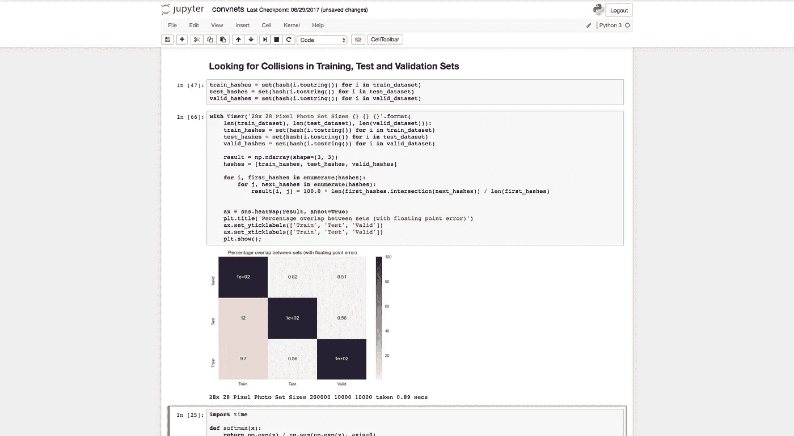
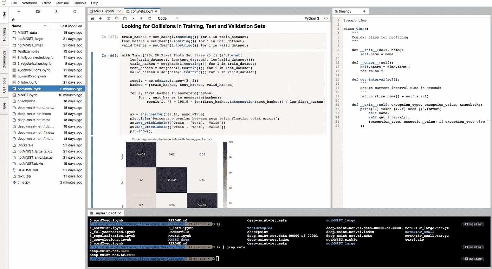

# Jupyter 笔记本毫无特色——使用 Jupyter 实验室

> 原文：<https://towardsdatascience.com/jupyter-notebooks-are-breathtakingly-featureless-use-jupyter-lab-be858a67b59d?source=collection_archive---------4----------------------->

我们喜欢 Jupyter 笔记本，笔记本格式是构建数据叙事的有效方式。但是浏览器内置集成开发环境只是简单的免费功能，很难提供 Atom、VS Code、Sublime 甚至 RStudio 那种不可思议的编辑能力。因此，从工作流的角度来看，数据科学和数据工程之间的差距仍然很大。让我们缩短这个差距。

Jupyter Notebook

让我们来看看典型的数据科学家工作流程。他们打开笔记本，导入一些数据，做一些探索性分析，然后建立一个模型。如果他们发现了新的东西，他们可能希望在生产中实现它。

*解决方案的当前笔记本表现与生产实施有多接近？*远得不可思议。

笔记本的某些部分是可重用的，可视化的部分我们可能会省去，希望一些功能已经定义。但这正是 Jupyter 笔记本的局限性真正开始显现的地方。

*我的文件树*在哪里？如果我的文件树不容易看到，就很难保持一个干净的、可管理的存储库。不用说，我们也希望一些基本的跳转功能，一次打开多个文档。*如何将我的代码快速转移到 python 脚本中？* *我的终端在哪里？*我知道我可以通过导入和显示熊猫来查看原始数据，但让我们面对现实吧，这与 RStudio 的文件查看器相比相形见绌——我的*合法 csv 查看器在哪里？*和* w *我的 Jupyter 笔记本左右两边浪费的空间是什么？**

正是由于 Python 作为一种语言的优势，以及笔记本文档作为一种呈现叙事的手段，Jupyter 笔记本一直保持着与 RStudio 的竞争力——**而不是 Jupyter 的实际特性**。

当然，所有这些事情都可以通过额外的窗口来解决。但是我们不会对我们的编辑器和 IDE 做出这样的妥协。Atom 为您提供了跳转功能、广泛的热键灵活性、文件树(可以关闭),以及几乎任何您可以在编辑器中想象到的东西。

[Jupyter Lab](https://github.com/jupyterlab/jupyterlab) 在其 *Alpha* 产品中提供了这些对功能的基本期望；尽管产品仍在开发中，但它的功能已经让最初的 Jupyter 笔记本黯然失色。

Jupyter Lab

在 Jupyter Lab 上的 PyData Seattle 演讲中，作者演示了打开 1 万亿行乘 1 万亿列的 csv(并毫不费力地在各列之间左右滚动)，以及使用 Jupyter Lab Google Drive 扩展、OOTB 维加和 GeoJSON 兼容性以及许多其他令人难以置信的功能进行实时协作。

Jupyter 实验室和 Jupyter 笔记本有两个不变量。

1.  笔记本文档是相同的(您的旧文档仍然有效)。
2.  笔记本电脑服务器是相同的(您的集成仍然有效)。

我写这篇文章是因为我最近向我的几个同事演示了 Jupyter 实验室。他们的反应？*“我怎么没听说过这个？”*这些功能早就应该出现了，我认为是时候做出改变了，让我们的日常数据科学离生产代码更近一步。