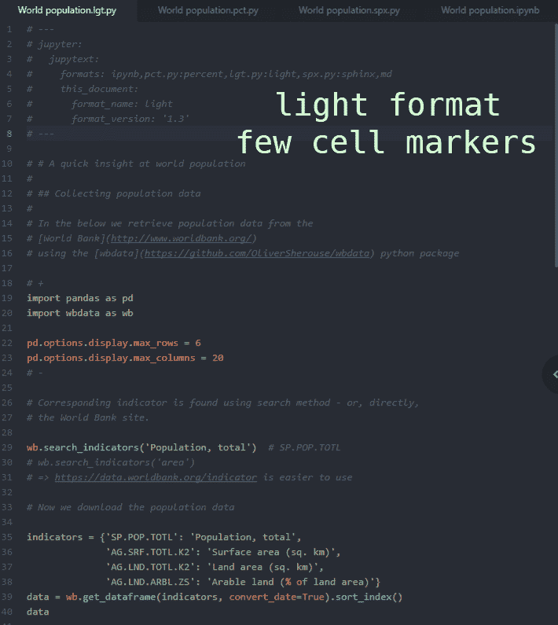
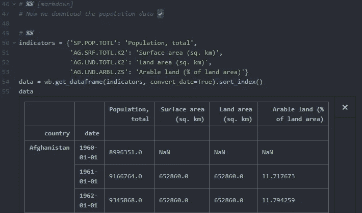
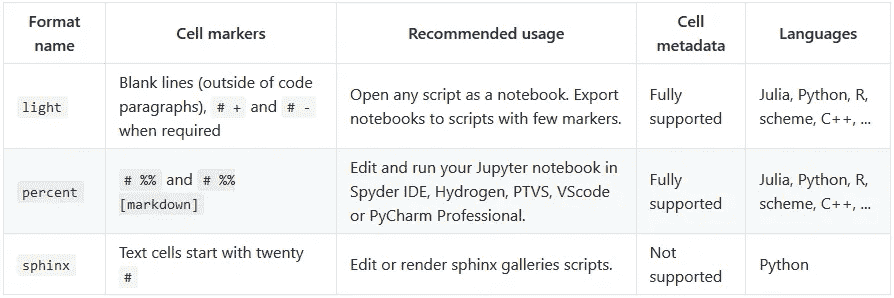

# Jupyter 笔记本，如 Light、Percent 或 Sphinx 脚本

> 原文：<https://towardsdatascience.com/jupyter-notebooks-as-light-percent-or-sphinx-scripts-efca8bc3aa44?source=collection_archive---------18----------------------->

几周前，我们[发布了](/introducing-jupytext-9234fdff6c57) Jupytext，这是 Jupyter 的一个插件，可以像脚本一样读写 Jupyter 笔记本。将 Jupyter 笔记本表示为文本文件大大简化了笔记本的使用。笔记本作为脚本很容易编辑、重构，甚至可以在专门的 ide 中执行。Jupyter 笔记本作为脚本的版本控制产生了有意义的差异。最后，在笔记本的文本表示上合并多个贡献并不比在标准脚本上合并贡献更难，这为在 Jupyter 笔记本上更容易的协作开辟了道路。

Jupytext 的最初版本为笔记本引入了`light`格式作为脚本。从那以后，我们继续探索如何最好地将 Jupyter 笔记本表现为文本文件。我们与 Spyder、Hydrogen 和 Matplotlib 团队进行了有趣的交流，除了`light`格式之外，他们还发现了两种将 Jupyter 笔记本表示为 Python 脚本的现有的流行格式:`percent`和`sphinx`格式。

下面，我们简要回顾一下这三种格式，并回忆一下如何在 Jupyter 笔记本和这三种格式之间来回转换。



# `light`格式

当我们准备 Jupytext 的初始版本时，我们在设计`light`格式时考虑了以下目标:

*   将任意脚本作为笔记本打开，带有有意义的单元格，
*   将笔记本表示为带有少量单元格标记的脚本，如果可能的话，不要标记，
*   在往返转换时保留笔记本的脚本和输入。

普通脚本没有单元格标记。所以我们决定代码段应该是自然细胞。后跟缩进行的空行以及属于多行注释的空行不被视为单元格分隔符。完全注释的段落被理解为标记单元格。

在 Jupytext 中，我们关心的是往返转换——我们不想弄乱你的笔记本！因此，我们必须找到一种方法来明确地识别在 Jupyter 笔记本中包含不止一个代码段的代码单元。为此，我们使用`# +`作为单元开始标记，使用`# -`作为单元结束标记。

对于所有类型的单元格，`light`格式完全支持单元格元数据。包含元数据的单元格有一个显式的头`# + {JSON}`，其中元数据以 JSON 格式表示。

此处提供了`light`格式的笔记本样本[。](https://github.com/mwouts/jupytext/blob/master/demo/World%20population.lgt.py)

`light`格式已经在 Python 脚本上进行了广泛的测试。Jupytext 也为 R、Julia、Scheme、C++实现了那种格式，如果这里没有列出你最喜欢的语言，欢迎询问！

# `percent`格式

受 Matlab 启发的`percent`格式是 Spyder 在五年前推出的。现在支持该格式的有:

*   [Spyder IDE，](https://docs.spyder-ide.org/editor.html#defining-code-cells)
*   [氢，](https://atom.io/packages/hydrogen)基于原子的笔记本编辑器，
*   [VS 代码](https://code.visualstudio.com/)使用 [vscodeJupyter](https://marketplace.visualstudio.com/items?itemName=donjayamanne.jupyter) 扩展时，
*   [Visual Studio 的 Python 工具](https://github.com/Microsoft/PTVS)，
*   [PyCharm 专业](https://www.jetbrains.com/pycharm/)。

Jupytext 也实现了`percent`格式。为了实现 Jupyter 笔记本到`percent`脚本的无损往返转换，我们扩展了格式以支持 markdown 和 raw 单元格，以及单元格元数据。我们实现的单元头是:

```
# %% Optional cell title [cell type] {optional JSON metadata}
```

其中单元格类型要么省略(代码单元格)，要么`[markdown]`或`[raw]`。显然，markdown 和 raw 单元格的内容在`percent`脚本中被注释掉了！

这里有`percent`格式的笔记本样品[。](https://github.com/mwouts/jupytext/blob/master/demo/World%20population.pct.py)

格式不限于 Python。 [Hydrogen](https://atom.io/packages/hydrogen) 已经将`percent`格式推广到所有的 Jupyter 语言:Julia、Python、R、Javascript 等等！Jupytext 目前实现了 Julia、Python、R、Scheme 和 C++的`percent`格式。再说一次，你可以要求更多。

上面列出的所有编辑器都可以识别单元格，并允许执行它们的内容。Hydrogen 甚至在输入电池的正下方显示输出，就像 Jupyter 笔记本一样。并且 [Matplotlib](https://gist.githubusercontent.com/mwouts/91f3e1262871cdaa6d35394cd14f9bdc/raw/3e2dde646d66207e132fba30d7c407a5917c0371/percent_format_matplotlib.png) 和 [Plotly](https://gist.githubusercontent.com/mwouts/91f3e1262871cdaa6d35394cd14f9bdc/raw/3e2dde646d66207e132fba30d7c407a5917c0371/percent_format_plotly.png) 两个图都很好的集成在编辑器中。



# 狮身人面像画廊格式

这是 Matplotlib 用来生成其[图库](https://matplotlib.org/gallery.html)的格式。文本单元格表示为三重引号字符串或注释文本块，以带有许多散列符号的行开始。连续的代码单元用空字符串分隔。

Jupytext 实现了 Jupyter 笔记本的`sphinx`格式，这里给出了一个笔记本示例[。如果你想为你的斯芬克斯画廊设计新的例子，使用这种格式，或者反过来，如果你想使用](https://github.com/mwouts/jupytext/blob/master/demo/World%20population.spx.py) [mybinder](http://mybinder.org/) 和 [Jupytext](https://github.com/mwouts/jupytext/blob/master/README.md#sphinx-gallery-scripts) 作为 Jupyter 笔记本访问你的斯芬克斯画廊。

# 使用 Jupytext

使用升级 Jupytext

```
pip install jupytext --upgrade
```

Jupytext 为 Jupyter 提供了一个插件，允许你在 Jupyter 中将脚本作为笔记本打开，并与配对的笔记本一起工作(下面将详细介绍)。将 Jupytext 的内容管理器添加到您的 Jupyter 配置文件`.jupyter/jupyter_notebook_config.py`:

```
c.NotebookApp.contents_manager_class="jupytext.TextFileContentsManager"
```

通过将`"jupytext": {"formats": "ipynb,py:percent"},`添加到笔记本元数据，将脚本或笔记本转换为配对笔记本。然后，Jupyter 将你的笔记本保存为传统的`.ipynb`文件和补充的`percent`格式的`.py`文件。正如[公告](/introducing-jupytext-9234fdff6c57)中所述，您可以编辑`.py`文件，并刷新 Jupyter 以获得更新的输入单元格(通过在单元格中运行`%autosave 0`关闭 Jupyter 的自动保存)。

或者，使用[命令行转换器](https://github.com/mwouts/jupytext/blob/master/README.md#command-line-conversion)将 Jupyter 笔记本转换为`percent`脚本，然后再转换回来:

```
# create notebook.py with '# %%'-cells
jupytext --to py:percent notebook.ipynb# update input cells in notebook.ipynb
jupytext --to ipynb --update notebook.py
```

使用以下命令将`light`脚本转换为`percent`脚本:

```
# Convert light.py to percent.py
jupytext --from py:light --to py:percent --output percent.py light.py# In place conversion! Handle with care.
jupytext --from py:light --to py:percent notebook.py
```

# 所有格式一览



# 结论

将笔记本表示为文本文件可以方便地重构、共享和版本控制 Jupyter 笔记本。作为文本文件的笔记本不包括输出单元格，因此当[将](https://github.com/mwouts/jupytext/blob/master/README.md#paired-notebooks)与传统的`.ipynb`笔记本配对时，它们工作得最好。

Jupyter 笔记本可以用各种文本格式表示。除了 [Markdown](https://github.com/mwouts/jupytext/blob/master/demo/World%20population.md) 和 [R Markdown](https://github.com/mwouts/jupytext/blob/master/demo/World%20population.Rmd) 之外，Jupytext 还将 Jupyter 笔记本实现为`light`和`percent`脚本。使用`light`格式(由 Jupytext 提供)打开任意脚本作为笔记本，并以离散单元格格式保存笔记本。或者用 Spyder 五年前贡献的`percent`格式，现在很多编辑都支持。这四种格式是语言不可知的，已经在 Python、Julia、R、Scheme 和 C++笔记本上进行了测试。

你愿意投稿吗？我们想使格式规范坚如磐石，请让我们知道你是否能帮忙。我们也对向`light`和`percent`格式添加[更多语言](https://github.com/mwouts/jupytext/blob/master/README.md#extending-the-light-and-percent-formats-to-more-languages)的贡献感兴趣。一个能够编辑元数据的[笔记本扩展](https://github.com/mwouts/jupytext/issues/86)将会改善用户体验。