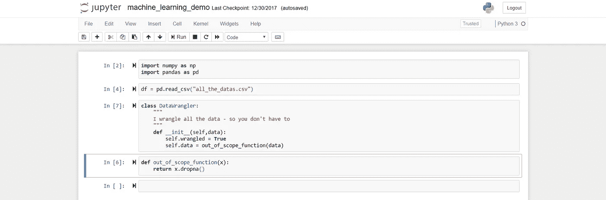
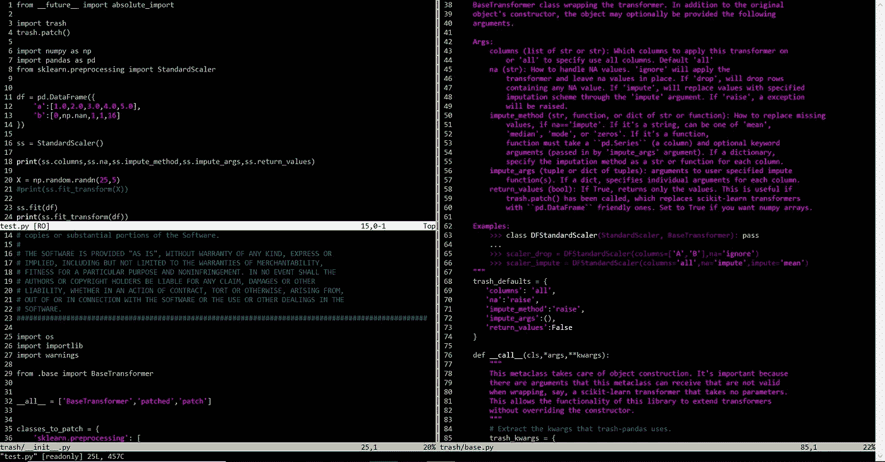
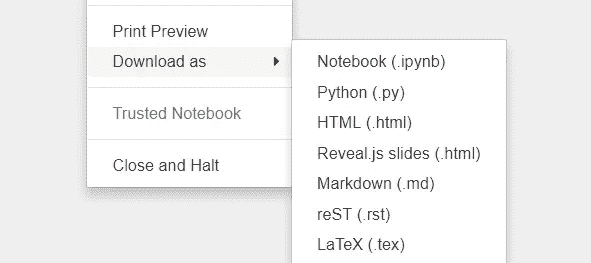
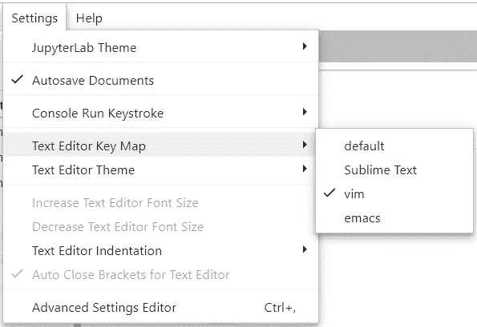
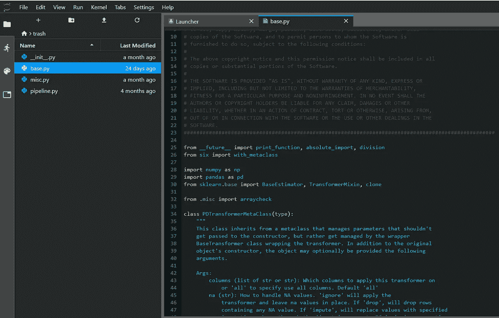

# Jupyter 笔记本让我变成了一个懒惰的程序员…

> 原文：<https://towardsdatascience.com/jupyter-notebooks-made-me-a-lazy-programmer-bef237c310bf?source=collection_archive---------11----------------------->

Don’t try this at home.

## …而且方式不对

像大多数数据科学家和机器学习实践者一样，我使用 Jupyter 笔记本进行原型设计、执行数据分析，并将我的结果传达给其他团队成员、上层管理人员、客户和利益相关者。Jupyter 在这方面很棒，然而不知何故，在几乎专门在笔记本上编码一段时间后，我发现我的编码能力开始下降。过了一段时间，我发现自己染上了坏习惯。

很多时候，我会发现自己在复制和粘贴可以轻松重用的大代码块，或者在需要的地方随意导入代码。如果你只是拼凑一些东西，这没什么问题，但当需要展示你的代码或组装成完整的演示或解决方案时，你不得不争先恐后地将你的片段组装成类似于所谓的机器学习“专家”开发的复杂预测模型的东西。

> 如果把 X 改成 Y 运行，结果会怎么样？

我们都听说过。在自豪地宣称您可以在他们眼前动态运行您的模型并生成结果后，您正在进行现场演示！不要介意你刚刚花了 6 个小时润色你的图表、表格和其他可视化的东西来有效地传达你的结果。因为你已经在笔记本上设计了你的模型，代码很可能是支离破碎的，不能很好地概括来处理这个问题。有时这是不可避免的，但我发现我已经不止一次遇到这种情况，结果是可信度降低。我们都去过那里(…对吗？)

我不是对笔记本有意见，绝对不是。笔记本摇滚。我回想起当初为什么开始用笔记本。听我说，这一切都是有意义的。

我在一台机器上工作，这台机器充当了我团队的 YARN 集群和我在其上开发的其他虚拟机的网关。在我早期的职业生涯中，我使用了许多不同的 ide 和文本编辑器来开发我的代码和模型。现在我在一个充满挑战的环境中工作。我很快就和维姆成为了好朋友。Vim 无处不在，它比大多数人意识到的要强大得多。

vim — it actually doesn’t suck.

这是一个完全不同的问题。我很快开始成为 vim 超级用户，并发现自己比以前更有效率了！我的编码能力提高了，很快我发现自己一直在制造新的算法，能够从一个系统跳到另一个系统，而不必每次都重新配置我的开发环境。我势不可挡…

…至少我是这么认为的。尽管我可以编写大量的脚本和代码来生成可视化效果、表格或写入我们的数据库，而不会有在演示过程中被要求编码的尴尬。即便如此，我还是被迫在编码前思考——在写之前设计我的模型。这留下了大量可重用的设计模式，我可以用它们来构建有效的模型。这极大地增强了我的能力，我将这些代码汇编成库，可以随时调用。现在，我的剧本仅仅是一口袋的台词，然而却能让我领悟到在过去曾让我领悟了数百次的东西。掌握 vim 让我变得懒惰——以一种好的方式！我已经到达了数据科学的天堂，但是我仍然缺少一些东西。

不知何故，一切都太死板了。此外，我只在远程机器上工作。将 matplotlib 可视化中导出的图像复制回我的根计算机以查看结果，挑剔的 X-forwarding，或者依赖于更大的基础设施和 It 限制，这真的很烦人。不，我想要再次自由。我想让我的代码感觉我又一次在一台机器上工作，当我完成或想继续程序执行时，我可以弹出一个绘图窗口并关闭它。此外，我希望向我们的最终用户公开一些我已经编入我的宝贵库中的数据争论和算法功能，其中一些用户本身就是数据科学家。

进入 Jupyter。哇，当我建立了我的第一个 Jupyter 环境并通过代理运行时，我就被迷住了。我可以从任何网关机器上访问它。现在，我甚至可以从任何机器上直接登录到我的环境中，并运行交互式代码。我甚至可以在利益相关者的机器上这样做，并向他们展示我在用他们的数据做什么。感觉棒极了。很快，我的团队让 Jupyter hub 在我们的环境中运行。我仍然可以通过使用我的老朋友 vim 在我们的虚拟机上开发我的结构化代码和库，但是可以使用 Jupyter 快速原型化新算法。什么会出错？

嗯，就像我们大多数人在某个时候发生的一样，我换了工作。我现在正在研究新机器。我的旧代码？不可接近，在我以前的同事手里，对我来说完全看不见。哦，好吧，去做更大更好的事情吧！

我从以前的工作中学到了很多，我想用我学到的知识前进。我立即着手开发一个新的模型，这次我从 Jupyter 笔记本开始。很快，我发现自己的代码杂乱无章，笔记本支离破碎。别让我开始讨论范围问题！然后人们开始要求我和他们分享我的作品。啊哦，人们都会看到我的代码！很快，我发现自己抄近路，走捷径，让事情运行简单，但至少我又有效率了。我的笔记本自给自足，能够从头到尾完整地解释我的过程和模型。

> 你为什么一直滚动这么多代码？我只想看到结果。

有可能，如果你在听到这个之前已经在笔记本上演示过，或者至少是类似的东西。他们是对的——大多数人不关心你的代码，所以虽然展示代码对数据科学家来说很好，但对客户来说就不那么好了，你知道，那些帮你赚钱的人？

进入 reveal.js 这改变了我写笔记本的方式！我可以点击一个小标签，在演示中隐藏我的代码。想展示我的代码吗？打开和关闭非常简单。

我仍然发现自己退回到糟糕的编码习惯。我无法在良好的编码实践和编写可重用性以及 Jupyter 提供的敏捷性之间找到平衡。本质上，因为我没有被强迫去想清楚，所以我没有。我已经变成了一个懒惰的程序员。当然，我是有效的，但是我仍然为我的代码感到尴尬。有时候难看的代码很重要——我们数据科学家有时候需要粗制滥造一个模型，让代码的美丽见鬼去吧。如果有一种方法可以让笔记本快速原型化，并且在共享我的笔记本时隐藏我的代码就好了。我想拥有可演示的笔记本，而不需要旋转一堆旋钮和隐藏代码来让它看起来像样。我需要别的东西。我需要…

…JupyterLab！JupyterLab 就像是上帝给我的礼物。我不仅可以快速组装笔记本，还可以在同一个基于 web 的环境中直接将我的类和函数复制粘贴到文本文件中。这让我重新开始计划。不知何故，让文本文件和笔记本一起编辑让一切都不同了。不仅仅是编辑。实验室能让你接触到终端。但是等等，还有呢！

我找回了我的活力。嗯，部分原因。它至少拥有多年来成为肌肉记忆的相同键绑定。当然，我一直带着它，但是现在我把它放在我心爱的笔记本旁边。但是仍然缺少一些东西。我讨厌轻松的主题。笔记本默认是浅色的，只有通过安装第三方扩展，你才能切换到深色的。这没什么不对的，除非你无法访问你正在使用的 Jupyter 笔记本服务器。JupyterLab 的文本编辑器有多个深色主题，Lab 整体有一个深色主题。

太美了。我已经决定(现在！)是我快速迭代的工作流。如果我发现自己写的东西在演示中没有用武之地，我会把它藏到别处，并从我的笔记本中引用文件或库。这比我以前做的感觉好多了，我只是在这里抓了一点皮毛。如果你喜欢笔记本电脑，但发现自己陷入了和我类似的陷阱，给 JupyterLab 一针——我打赌你会喜欢它。

总而言之:

*   保持你的*真实*代码与你的笔记本分开，除非你在写编码教程。这会让你的笔记本更整洁，养成把东西分开的习惯会让你更有效率。将来你会感谢你的。
*   动笔之前先思考。这将避免不得不当场拼凑一些东西来回答一个问题。能当场跑位是 Jupyter 的一部分实力，用起来！
*   使用 JupyterLab。说真的，太神奇了。
*   玩得开心！

*本文表达的观点为本人观点，不一定与本人雇主相同。