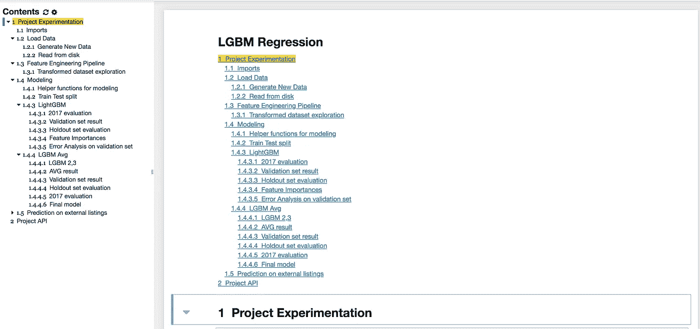
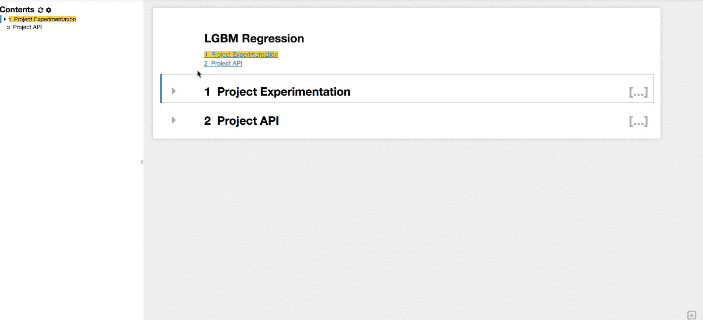
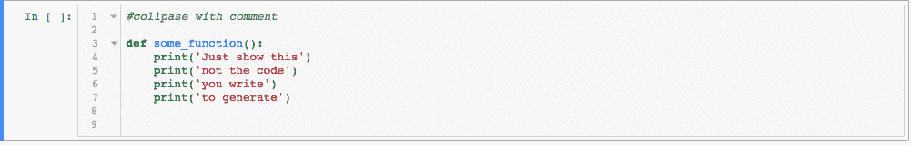
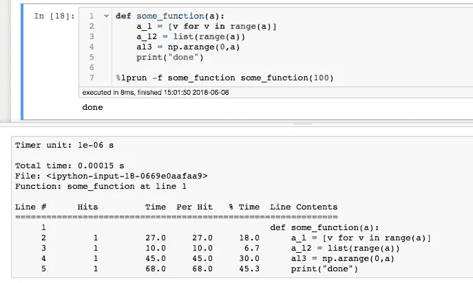

# 提高生产力的 Jupyter 工具

> 原文：<https://towardsdatascience.com/jupyter-tools-to-increase-productivity-7b3c6b90be09?source=collection_archive---------1----------------------->


Photo by [Philip Swinburn](https://unsplash.com/photos/vS7LVkPyXJU?utm_source=unsplash&utm_medium=referral&utm_content=creditCopyText) on [Unsplash](https://unsplash.com/search/photos/tools?utm_source=unsplash&utm_medium=referral&utm_content=creditCopyText)

> *“如果你唯一的工具是一把锤子，你会把所有的问题都看成钉子。”*
> 
> *亚伯拉罕·马斯洛*

像许多其他数据科学家一样，Jupyter notebook 是我的数据科学工具包中不可或缺的一部分。它易于使用，功能强大得令人难以置信。在这篇文章中，我将记录一些可用的扩展和特性，我认为每个使用 Jupyter 的人都应该熟悉它们。

但是等等，这难道不是旧东西吗？既然 JupyterLab 刚刚出现，我们现在应该对它感到满意吗？

JupyterLab 是 Jupyter 笔记本电脑的发展，引入了一些期待已久的功能，然而它目前处于测试阶段，当我试用它时，发现许多为 JupyterLab 开发的很酷的扩展由于版本兼容性问题不能很好地工作。所以我想，即使 JupyterLab 是未来，至少在不久的将来，我还是会坚持使用经典笔记本几个月。

# Jupyter contrib nbextensions

你知道 Jupyter 笔记本有扩展吗！确实有，而且非常有用！

*安装*

[官方 github repo](https://github.com/ipython-contrib/jupyter_contrib_nbextensions) 有安装的所有细节，所以我不会重复这些。但是，如果你懒得去过，这里是 TLDR 版本的基本步骤:

```
pip install jupyter_contrib_nbextensionspip install https://github.com/ipython-contrib/jupyter_contrib_nbextensions/tarball/masterjupyter contrib nbextension install --user
```

还要安装扩展配置器，以便轻松切换扩展:

```
pip install jupyter_nbextensions_configuratorjupyter nbextensions_configurator enable --user
```

你完了！

刷新 Jupyter 主页，您应该能够看到类似这样的内容:


nbextensions tab

以下是一些我认为有用的 nbextensions，并简要描述了它们的功能:

1.  *目录(2)* :根据笔记本的表头单元格自动创建一个目录。`Display Table of Contents as a sidebar`选项创建了一个 TOC 作为侧边栏，有助于保持上下文和浏览笔记本。



Table of contents

*2。可折叠的标题*:这个和 toc2 一起可以很好的卷起笔记本中你不想在特定时间关注的部分。



Collapsible heading

*3。代码折叠*:您可以通过折叠函数定义和长代码块来减小单元格的大小。



codefolding

*4。execute time*:`%%time`单元格魔术函数对于检查运行时非常有用。但是有了 ExecuteTime，所有代码单元格的运行时都显示在左下角，所以你不需要记得使用单元格魔术。


execute time

*5。Gist-it* :非常适合在 Github 上创建 Gist。为什么是 gist？实验时可以在不同状态下保存同一个笔记本的不同版本。此外，gists 更容易共享和引用。

*6。隐藏所有输入*:当你需要编码来生成和输出，但是不需要显示代码的时候(为了简洁)，这对于整理一个笔记本来演示是很棒的。

# Jupyter 魔法函数

Jupyter 中有很多神奇的功能。对于 Ipython 内核，这里是到文档的[链接。](http://ipython.readthedocs.io/en/stable/interactive/magics.html)

以下是一些我认为特别有用的线条魔术功能:

1.  `%cd <path>`:在笔记本中切换工作目录的快捷方式。
2.  `%autoreload`:在每个使用脚本/项目的笔记本上使用。您对它们所做的更改将自动重新加载到 jupyter 上下文中。

```
%reload_ext autoreload
%autoreload 2
```

1.  `%timeit`:多次运行代码行，并打印代码运行时的度量。
2.  `%lprun and %mprun`:python 的行分析器和内存分析器。非常适合优化代码:



line profiler in action

要使用 line_profiler，请使用 pip 安装它:

```
pip install line-profiler
pip install memory_profiler
```

然后加载扩展:

```
%load_ext line_profiler
%load_ext memory_profiler
```

1.  `!`或`%%bash` : Bash 命令在终端上很容易使用，但是如果你有一系列需要重复运行的命令，那么把它们放在笔记本上就更好了！一行之前的`!`将在 bash 中执行该行。例如:

```
!ls -lht
```

如果您使用 AWS 之类的云服务，并且您有多个 cli 命令，将它们放在一个笔记本中会使事情变得容易得多，因为您有可搜索的命令历史和结果。

注意:由于某种原因，我发现使用单元格魔术`%%bash`会在执行完成后打印输出*。这对于大多数用例来说是好的，但是假设您正在检查 docker 日志，您可能很想检查进度。*

# 临时演员

Jupyter 还可以做很多其他很酷的事情，但我无法一一列举，只能列出一个简短的列表:

1.  *Jupyter 小部件:* Jupyter 支持小部件，也支持有用的[交互](https://ipywidgets.readthedocs.io/en/latest/examples/Widget%20List.html)甚至很酷的[可视化](http://jupyter.org/widgets)。交互小部件对于创建交互式笔记本来说是很棒的，我想如果你安装了 JupyterHub，它们会更棒，这样你就可以在笔记本上协作了。
2.  *跨语言支持:*事实证明，Jupyter 实际上是一个缩写——Julia Python R，并且有许多不同语言的内核。。
3.  *调试:【Jupyter 笔记本有很多调试选项，哪一个最有效很大程度上取决于你如何编写代码。对我来说，由于我将大部分代码放在了`.py`文件中，所以我使用 ipython 调试器来调试代码:*

```
from IPython.core.debugger import set_tracedef func(x):
	x = x+2
	set_trace()
	x = x-2
	return xfunc(2)
```

这将弹出一个交互框来检查笔记本中的变量。

还有更容易使用的选项:

出现异常时打开调试器界面的`%%pdb`单元魔术。

或者你可以在出现异常后立即运行`%debug`行来检查堆栈。

4.Jupyter 笔记本预览与 Vistual 工作室代码

所以笔记本很棒，当你更有条理的时候，你可以用它做更多的事情。但是，笔记本的版本化仍然是个问题。这意味着你可能会为一个项目制作几十个笔记本，如果你想找到一些你在项目早期写的代码，你必须一个接一个地打开它们，或者试着记住 grep 的相关关键词。除了使用命名约定和利用文件夹结构之外，我没有解决版本控制问题的干净的解决方案，但是，对我来说，如果我可以预览笔记本而不必启动内核并等待它加载(特别是如果笔记本很大的话)，这是有帮助的。拯救的 Visual Studio 代码！这个方便的文本编辑器与 Sublime Text 非常相似，并且有一个方便的插件`vscode-nbpreviewer`，它允许你在不启动内核的情况下打开笔记本，加载速度非常快。

使用 Visual Studio 代码的另一个好处是:spyder 喜欢脚本中的代码单元，因此您可以将代码从脚本发送到编辑器

此外，它是 Anaconda 的可选安装！

这是我目前所有的。随着我发现更多有用的东西，我会继续更新。感谢阅读！