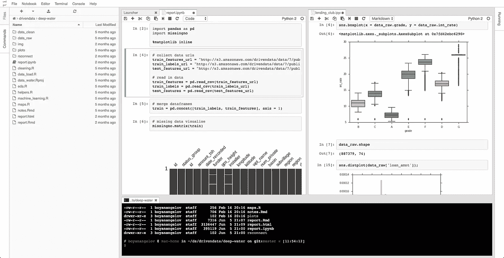
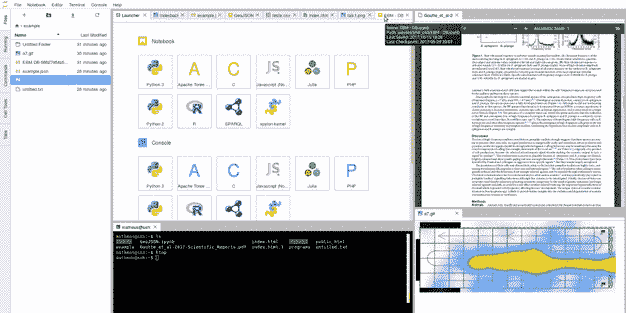

# JupyterLab 是我们一直在寻找的数据科学用户界面

> 原文：<https://towardsdatascience.com/jupyterlab-you-should-try-this-data-science-ui-for-jupyter-right-now-a799f8914bb3?source=collection_archive---------1----------------------->

Jupyter 项目(正式名称为 IPython)是一个多语言、基于网络的开源数据科学工具。通过[笔记本](http://jupyter-notebook-beginner-guide.readthedocs.io/en/latest/what_is_jupyter.html#notebook-document)的想法，它支持跨[多种编程语言](https://github.com/jupyter/jupyter/wiki/Jupyter-kernels)(所谓的[内核](http://jupyter-notebook-beginner-guide.readthedocs.io/en/latest/what_is_jupyter.html#kernel))的交互式数据科学和[科学计算](https://github.com/jupyter/jupyter/wiki/A-gallery-of-interesting-Jupyter-Notebooks)。

Jupyter 与语言无关的行为使它成为一个可能的游戏规则改变者，因为它将多个开源社区团结在同一个工具周围。它现在有一个很大的社区，并且发展得非常快，导致 Github 上出现了许多扩展——包括一个由 SAS 自己维护的用于 SAS 的[内核，一个用于](https://github.com/sassoftware/sas_kernel) [SPARQL 查询](https://github.com/paulovn/sparql-kernel)的内核，多个[小部件](http://jupyter.org/widgets.html)等等。


Jupyter 目前默认的笔记本界面(上图)已经相当不错了，但它可能已经找到了继任者:JupyterLab。JupyterLab 正在成为 Project Jupyter 的下一代 UI，因为它为用户提供了类似 IDE 的体验(如下图)。JupyterLab 不需要用户处理分散的工具，而是将数据科学家需要的大部分工具放在一起，允许窗口停靠/组合和按需创建动态仪表板。这种可定制的灵活环境无疑会提高工作效率，并可能改变用户对笔记本电脑的看法。



JupyterLab Demo (own)

除了提供像文件浏览器、终端、图像浏览器、控制台、代码/文本编辑器等工具之外。在同一个屏幕上，JupyterLab 允许使用第三方扩展。这种扩展可能不仅与笔记本本身有关，还与整个公共数据科学生态系统有关。作为一个很好的例子，在下面的视频中，我们可以看到一个扩展，允许用户在编辑笔记本时(通过 Google Drive)实时**协作**，以及第二个 UI 优化的扩展，允许用户打开包含(字面上)数万亿行的海量 CSV 文件并与之交互。

你可以在项目的[库](https://github.com/jupyter/jupyterlab)找到更多关于如何安装 JupyterLab 的细节。现在，这里是安装基础:

**如果用康达:**

```
conda install -c conda-forge jupyterlab
```

**如果使用画中画:**

```
pip install jupyterlab
jupyter serverextension enable --py jupyterlab --sys-prefix
```

**如果你有一个**[**JupyterHub**](https://github.com/jupyterhub/jupyterhub)**环境:**

```
**//Install JupyterLab and then install** [**this extension**](https://github.com/jupyterhub/jupyterlab-hub)
jupyter labextension install @jupyterlab/hub-extension**//Edit** "jupyterhub_config.py" **and add/edit the following line** c.Spawner.default_url = '/lab'**//**[**This issue**](https://github.com/jupyterhub/jupyterhub/issues/690) **may be useful for troubleshooting** 
```

# **号外:**

下面的演讲(由@[**SylvainCorlay**](https://twitter.com/SylvainCorlay)**在 PlotCon)是一个了解 ipywidgets 和其他基于 Jupyter 构建的流行小部件库提供的大多数特性和功能的好机会。在视频中，您可以看到 JupyterLab 如何通过在嵌套布局中组装简单的控件和可视化小部件来支持仪表板的创作。**