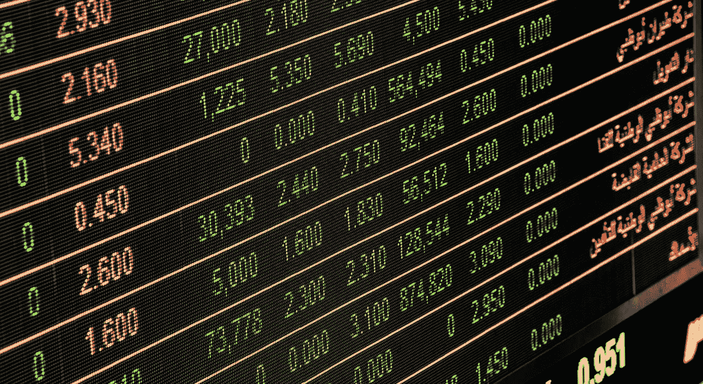
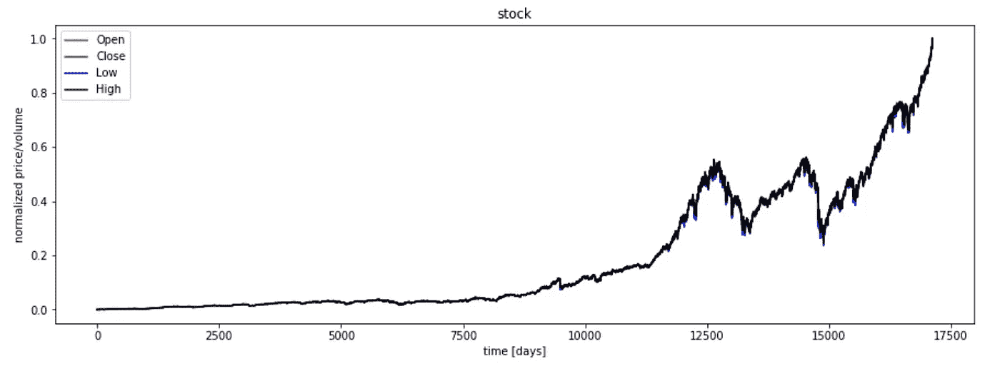

# 只是另一个试图预测股市的人工智能:第 1 部分

> 原文：<https://towardsdatascience.com/just-another-ai-trying-to-predict-the-stock-market-part-1-d0663673a30e?source=collection_archive---------2----------------------->

学习如何建立机器学习模型既不是一件简单的事情，也不是一件容易的事情。我花了一个月左右的时间学习神经网络如何详细工作，以及是什么让某些模型比其他模型表现得更好。

现在我决定将我的知识付诸实践，实现一个相当简单的例子——使用 GRU 网络预测 S&P500 指数的股票价格。

**你可以将这些系列作为你机器学习之旅的起点，所以不要犹豫，毫无准备地投入进去吧。**如果有任何问题，请在评论区与我分享。

## #1.准备数据

我们应该做的第一件事就是获取数据来训练我们的模型。雅虎财经是一个寻找任何公司新数据的好地方。因此，我们将使用从 1950 年 1 月 1 日到今天这段时间的 [S & P500 数据集](https://finance.yahoo.com/quote/%5EGSPC/history?p=%5EGSPC)。只需点击*下载数据*即可。

出于这个例子的目的，我们将只使用一个 python 文件，没有面向对象的模式或任何花哨的结构。让我们将文件命名为 *sp_rnn_prediction.py* 并加载数据。

这些库的目的如下:

*   [numpy](http://www.numpy.org/) —用于轻松进行矩阵计算和数学运算，这对于任何 ML 模型都是必不可少的
*   [熊猫](https://pandas.pydata.org/) —用于为你的训练数据定义一个好的数据结构
*   [sklearn](http://scikit-learn.org/stable/) —用于数据分析的工具(例如标准化或聚类数据)
*   [matplotlib](https://matplotlib.org/) —用于显示我们的数据
*   [tensorflow](https://www.tensorflow.org/) — Google 的开源库，用于以简单优雅的方式构建 ML 图

数据集应分为训练/验证/测试部分，每个部分都相互独立。我选择将数据分成 80%的训练、10%的验证和 10%的测试。

最后，我用*熊猫*来装载*。csv* 文件，并将其存储到一个数据框架中。我们将在后面看到如何使用它。

## #2.操纵数据

我们的下一步是以某种方式改革数据，使其可用于训练。

首先，我们需要规范化它，这基本上意味着将每个特征缩放到一个给定的范围，在我们的例子中，这个范围在 0 和 1 之间。正常化通过以下方式实现:

我们使用`sklearn.preprocessing.MinMaxScaler()`和`fit_transform`将*开盘价、最高价、最低价和收盘价*中的每个值拟合到 0-1 的范围内，并将这些矩阵转换为(-1，1)的形状。用(-1，1)整形意味着我们希望，例如，`df['open'].values`成为形状(k，1)的矩阵，其中 k 未知，由 numpy 决定。在这种情况下，k 将等于不同价格的数量。

然后，我们需要将数据分为训练、验证和测试。如上所述，80%是培训，10%是验证，10%是测试。

在上面的代码片段中有 3 个主要步骤:

1.  将数据分割成长度相同的不同数组`seq_len`。
2.  根据项目数量确定训练/验证和测试数据的长度。
3.  按照正确的比例划分数据。

## #3.显示数据

最后，我们需要显示规范化的数据。这对于模型性能来说并不重要，但是在调试代码时非常有用。因此，应该养成经常可视化数据集的习惯。

在绘制数据之前，我们需要使用上面定义的方法。

首先，我们复制数据帧并删除未使用的参数(本例中为“Volume”)，然后对其他值进行规范化。之后，我们只需要使用 matplotlib 库来绘制它:

*   第 14 行:初始化图像帧。
*   第 15–18 行:绘制不同的值。
*   第 19–23 行:添加符号并显示图形。

S&P500 price visualization (normalized)

## 在下一部分

我们以上面的可视化来结束第一部分。在[第 2 部分](/just-another-ai-trying-to-predict-the-stock-market-part-2-88605f9d8e45)中，我们将重点关注使用价格训练模型。我们将大量使用 TensorFlow，因此您可以看到这个优秀的库在实践中是如何工作的。

## 谢谢你的阅读。如果你喜欢这篇文章，给它一些掌声👏。希望你有一个伟大的一天！