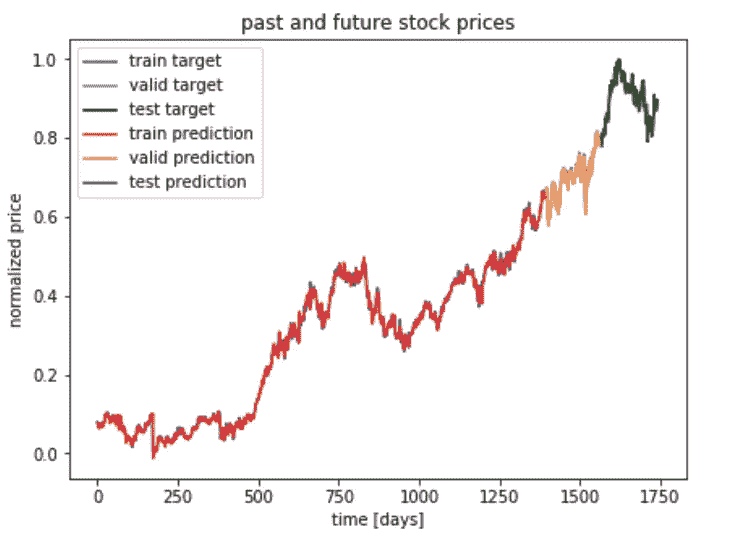

# 只是另一个试图预测股市的人工智能:第 3 部分

> 原文：<https://towardsdatascience.com/just-another-ai-trying-to-predict-the-stock-market-part-3-ee2d419e00c3?source=collection_archive---------7----------------------->

这是我的如何使用递归神经网络预测股票市场系列的最后一部分，我们将进行实际预测。在[第一部分](/just-another-ai-trying-to-predict-the-stock-market-part-1-d0663673a30e)中，我们准备了我们的数据(S & P500 价格)，在[第二部分](/just-another-ai-trying-to-predict-the-stock-market-part-2-88605f9d8e45)中，我们训练了我们的模型。现在我将向你展示如何做最后的预测。

## #1.获取预测值

让我们复习一下上一部分的内容。优化我们的模型后，我们获得了预测值(第 13–15 行):

## #2.可视化结果

为了将实际结果与我们的预测进行比较，我们将绘制两者的曲线图，并清楚地看到差异。

首先让我们定义一个新的变量`price = 0`,它将决定价格类型的指数(在这种情况下，我们看开盘价；收盘价为 1，最高价为 2，最低价为 3)

*   绘制训练数据的结果:

在我们图表的 X 轴上，我们将有从 0 到训练数据大小的数字。在 Y 轴上，我们将绘制实际结果和预测结果。

*   绘制验证数据的结果:

在图表的 X 轴上，我们将把从训练数据末尾到验证数据末尾的数字相加。在 Y 轴上，我们将绘制实际结果和预测结果。

*   测试数据的绘图结果:

在我们图表的 X 轴上，我们将把从验证数据末尾到测试数据末尾的数字相加。在 Y 轴上，我们将绘制实际结果和预测结果。

最后，我们需要显示图表的图例:

使用第 2 部分中的 S&P500 数据和超参数，最终的图像应该与此类似:

当然，你的可能会不同，所以我建议用一组参数进行实验，看看什么时候模型会产生最好的结果。

## 最后的想法

我希望这个实现对您有用。如果你有任何问题，请在评论区留言，我们可以一起讨论。

## 谢谢你的阅读。如果你喜欢这篇文章，给它一些掌声👏。希望你有一个伟大的一天！