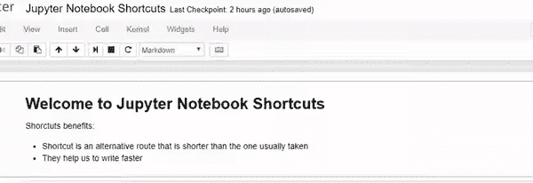

# Jupyter 笔记本快捷方式

> 原文：<https://towardsdatascience.com/jypyter-notebook-shortcuts-bf0101a98330?source=collection_archive---------1----------------------->

# 什么是 *Jupyter 笔记本*？

*Jupyter 笔记本*广泛用于数据分析。我在 2-3 个月前开始学习 ***数据科学*** 并且我用这个工具探索了一些数据集(数据的集合)。太牛逼了！

让我们看看文档中的定义。

> **笔记本文档**是由 *Jupyter 笔记本 App* 生成的文档，**既可以包含代码**(如 **Python** )也可以包含富文本元素(**段落、等式、链接等)..**)。
> 
> ***Jupyter 笔记本应用*** 是一个客户端-服务器**应用**，允许**通过**浏览器**编辑和运行笔记本文档**。

在这里你可以找到更详细的信息，如果你想的话。

# 快捷指令

作为一名开发人员，我喜欢尽可能多地使用快捷方式和代码片段。它们只是让编写代码变得更加容易和快速。我喜欢遵循一条规则:

> 如果你开始用鼠标做一些动作，停下来想一想是否有捷径。如果有一个-使用它。

当我开始使用 *Jupyter Notebook* 时，我不知道这个工具有快捷方式。好几次，我把我的**单元格类型**从 ***代码*** 更改为 ***markdown*** 并且我不知道如何更改。正如你能猜到的，这让我很头疼。有一天我刚好看到菜单栏里有一个`Help > Keyboard Shortcuts`链接。令我惊讶的是，原来 *Jupyter 笔记本*有**一吨的快捷方式**。

在这篇文章中，我将向你展示我最喜欢的几个。请注意，这些快捷方式是针对`Windows`和`Linux`用户的。无论如何，对于`Mac`用户来说，它们是`Ctrl`、`Shift`和`Alt`的不同按钮:

*   `Ctrl`:命令键`⌘`
*   `Shift`:换挡`⇧`
*   `Alt`:选项`⌥`

首先我们要知道它们是 *Jupyter 笔记本 App* 中的 **2 模式**:**命令模式**和**编辑模式**。我将从两种模式之间共享的快捷方式开始。

两种模式下的快捷键:

*   `Shift + Enter`运行当前单元格，选择下图
*   `Ctrl + Enter`运行选定的单元格
*   `Alt + Enter`运行当前单元格，在下面插入
*   `Ctrl + S`保存和检查点

在命令模式下(按下`Esc`激活):

*   `Enter`进入编辑模式
*   `H`显示所有快捷方式
*   `Up`选择上面的单元格
*   `Down`选择下面的单元格
*   `Shift + Up`扩展上面选中的单元格
*   `Shift + Down`扩展下面选中的单元格
*   `A`在上面插入单元格
*   `B`在下方插入单元格
*   `X`剪切选中的细胞
*   `C`复制选中的单元格
*   `V`粘贴单元格下方
*   `Shift + V`粘贴单元格上方
*   `D, D (press the key twice)`删除选中的单元格
*   `Z`撤消单元格删除
*   `S`保存和检查点
*   `Y`将单元类型更改为*代码*
*   `M`将单元格类型更改为*降价*
*   `P`打开命令调色板。
    该对话框帮助你**运行任何名为**的命令。如果你不知道一些快捷方式，或者当你没有想要的命令的快捷方式时，这真的很有用。

Command Palette

*   `Shift + Space`向上滚动笔记本
*   `Space`向下滚动笔记本

在编辑模式下(按`Enter`激活)

*   `Esc`带你进入命令模式
*   `Tab`代码完成或缩进
*   `Shift + Tab`工具提示
*   缩进
*   `Ctrl + [`德登
*   `Ctrl + A`全选
*   `Ctrl + Z`撤销
*   `Ctrl + Shift + Z`或`Ctrl + Y`重做
*   `Ctrl + Home`转到单元格开始
*   `Ctrl + End`转到单元格末尾
*   向左走一个单词
*   `Ctrl + Right`向右移动一个单词
*   `Ctrl + Shift + P`打开命令调板
*   `Down`向下移动光标
*   `Up`向上移动光标

这些是我在日常工作中使用的捷径。如果你还需要这里没有提到的东西，你可以在快捷键对话框中找到(`H`)。您也可以从菜单栏中的`Help > Edit Keyboard Shortcuts`链接**编辑现有的**或**添加更多的**快捷方式**。单击该链接将打开一个对话框。在它的底部有添加或编辑快捷方式的规则。你需要用连字符`-`来代表应该同时按下的键。**

**例如，我为*重启内核并运行所有单元*命令添加了一个快捷方式`Ctrl-R`。**

# **我的其他博客文章**

*   **[数据科学的 Python 基础知识](/python-basics-for-data-science-6a6c987f2755)**
*   **[Python 数据科学:Matplotlib 数据可视化简介](/data-science-with-python-intro-to-data-visualization-and-matplotlib-5f799b7c6d82)**
*   **[使用 Python 的数据科学:使用 pandas 加载和子集化/过滤数据简介](/data-science-with-python-intro-to-loading-and-subsetting-data-with-pandas-9f26895ddd7f)**
*   **[文本自然语言处理介绍](/introduction-to-natural-language-processing-for-text-df845750fb63)**

# **商务化人际关系网**

**如果你想和我联系，这是我的 LinkedIn 个人资料。**

# **时事通讯**

**如果你想在我发表新的博客文章时得到通知，你可以订阅我的时事通讯。**

# **最后的话**

**谢谢你的阅读，如果你喜欢这篇文章，请按住按钮。另外，我很乐意分享您的反馈。**