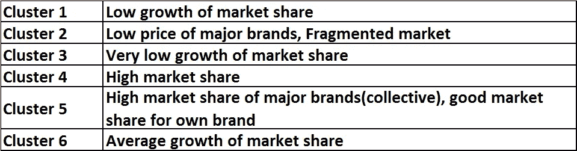

# k-means——营销组合建模的一个步骤

> 原文：<https://towardsdatascience.com/k-means-a-step-towards-market-mix-modeling-d3feca510d21?source=collection_archive---------7----------------------->

Source: [www.mstecker.com/](http://www.mstecker.com/pages/chfmcflosIMG_2046a1.htm)

聚类是一种无监督的技术，它将某些对象分类成称为簇的组，使得一个簇中的对象与其他簇中的对象相比具有相似的模式和不同的模式。

使用聚类分析的市场细分有助于根据客户行为和其他方面的相似性或独特性将各种市场划分为小的类别。一些特征包括不同品牌的价格点、品牌的市场份额、人口统计(年龄、性别、收入)、行为(使用、频率、忠诚度)、地理、倾向、媒体习惯等。

在本文中，我将介绍一个小型案例研究，说明如何应用 k-means 对各种市场进行聚类，以及从结果中可以获得什么样的见解。

假设一个国家有 20 个市场。我们有每个市场的以下变量的数据:

> 主要品牌的市场份额
> 
> 市场份额——您自己的品牌
> 
> 市场份额增长—您自己的品牌
> 
> 平均价格(主要品牌)

我们需要根据上述特征对市场进行细分，找到 5-6 个集群。因此，每个集群都有相似的特征市场。这将有助于为每个集群制定营销战略，而不是将重点放在所有 20 个市场上。

使用 k-means 算法，市场被划分为 6 类。

采取以下步骤来执行 k 均值:

> I .数据清理和缺失值检查
> 
> 二。数据标准化(所有变量有不同的单位)
> 
> 三。运行 k = 5 或 6 的 k 均值算法(此处 k 为聚类数)
> 
> 四。使用肘方法找到正确的集群数量(您可以使用其他方法，如平均轮廓和间隙统计)

你一定想知道为什么我选择了 5-6 个集群。这就是领域知识发挥作用的地方。通过取 6 个集群，我们假设我们可以将一个国家的市场分成 6 个集群。每个集群中的市场将具有相似的特征。假设或直觉来自领域知识。

基于上述方法，市场被分为 6 类，分析揭示了以下内容:

你可能想知道这些集群是如何形成的，什么是组件 1 和组件 2。在引擎盖下，五氯苯甲醚正在发挥作用。我们也可以用 t-SNE 来表示更高维度的星团。

因此，通过主成分分析，我们知道以下两个变量解释了模型中 80.9%的方差:

> 一、主要品牌市场份额:49.2%
> 
> 二。自有品牌市场份额:31.7%

在降维技术中，我们忽略了不能解释太多差异的特征向量/分量，从而减少了变量的数量。在这里，我们不会忽略或删除任何变量，相反，我们的目标是看看哪些变量是集群形成的关键。

**那么，有哪些见解呢？**

> 重申一下，我们有 6 个集群。
> 
> 每个集群代表相似的市场
> 
> 市场份额是一个变量，基于这个变量可以推断市场的独特性或相似性(记住通过 PCA 得出的方差 80.91！！)

**营销组合建模的链接**

公司通常对了解多个市场的营销组合感兴趣。但是他们可能不会执行这种分析，因为:

> 有限的预算
> 
> 时间限制
> 
> 由于帕累托原则:80 %的收入来自 20%的市场，他们很少有市场在他们的雷达上。

因此，市场细分拯救了他们。他们可以从每个集群中挑选高潜力市场，并专注于在那里获得正确的营销组合，而不是建立 50 个模型。

*有句谚语说:“不要只看到树木而忽略了森林！！!"*

营销语境中的 k 意味着帮助营销人员“不要只见树木不见森林”

Source: [Max and Dee Bernt/flickr](https://www.flickr.com/photos/lhanaphotography/17313962841)

如果你喜欢我的文章，给它一些掌声，或者更好地与你的朋友或同事分享。

**附注**:最近，很多人问我是否做市场组合建模/营销分析方面的咨询。

您可以将您的咨询问题发布到:[https://www.arymalabs.com/](https://www.arymalabs.com/)

领英:[https://www.linkedin.com/in/ridhima-kumar7/](https://www.linkedin.com/in/ridhima-kumar7/)

推特: [@kumar_ridhima](https://twitter.com/kumar_ridhima)

**版权所有 2018**[**www.ridhimakumar.com**](http://www.ridhimakumar.com)**版权所有。**