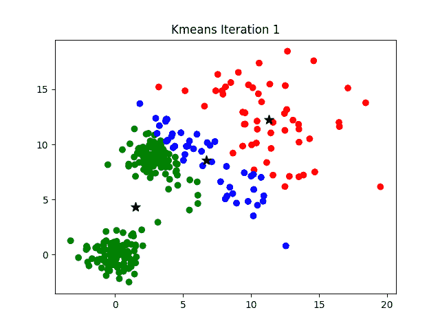
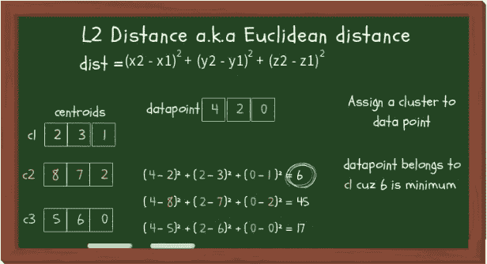
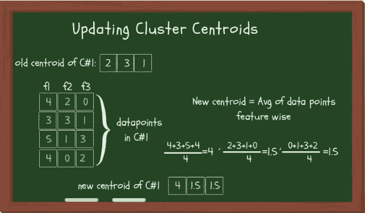
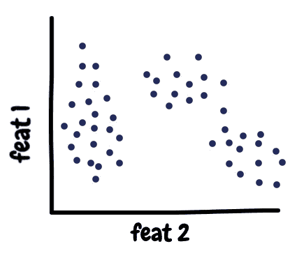
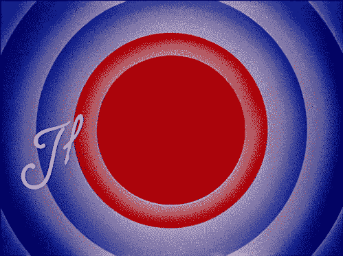

# k-均值聚类:从 A 到 Z

> 原文：<https://towardsdatascience.com/k-means-clustering-from-a-to-z-f6242a314e9a?source=collection_archive---------3----------------------->

## 关于 K-均值聚类你需要知道的一切

[Picture by Radu Marcusu](https://unsplash.com/@radu_marcusu) on [Unsplash](https://unsplash.com?utm_source=medium&utm_medium=referral)

D ata 对于数据科学来说是必不可少的(好像这个名字还不够有启发性)。由于每毫秒都会生成大量数据，因此这些数据中的大部分都没有标记也就不足为奇了。但这没关系，因为有不同的技术可以用来处理未标记的数据集。事实上，有一个完整的机器学习领域叫做“无监督学习”，处理未标记的数据。

有时我们只想看看数据是如何组织的，这就是集群发挥作用的地方。尽管它主要用于未标记的数据，但是它也适用于有标记的数据。“群集”这个词的意思是把相似的东西组合在一起。最常用的聚类方法是 K-Means(因为它很简单)。

这篇文章解释了 K-Means 聚类如何工作(深入)，如何测量聚类的质量，选择最佳的 K 数，并提到了其他聚类算法。

# 这个概念

想象你正在开一家小书店。你有一堆不同的书和三个书架。你的目标是把相似的书放在一个书架上。你要做的是拿起 3 本书，每个书架一本，为每个书架设定一个主题。这些书现在将决定剩下的书放在哪个书架上。

每次你从书架上拿起一本新书，你会把它和前三本书进行比较，然后把这本新书放在有类似书的书架上。你可以重复这个过程，直到所有的书都放好。

完成后，你可能会注意到，改变书架的数量，为这些书架挑选不同的初始书籍(改变每个书架的主题)会增加你对书籍的分组效果。所以，你重复这个过程，希望得到更好的结果。

K-Means 算法的工作原理[大概就是这样。](https://www.youtube.com/watch?v=FM7MFYoylVs)

# 该算法

K-means 聚类是开始探索未标记数据集的好地方。K-Means 中的 K 表示聚类数。这个算法一定会在一些迭代之后收敛到一个解。它有 4 个基本步骤:

1.  初始化群集质心(选择这 3 本书开始)
2.  将数据点分配给集群(将剩余的书籍逐一放置)
3.  更新群集质心(从 3 本不同的书开始)
4.  重复步骤 2–3，直到满足停止条件。

您不必一开始就从 3 个集群开始，但是 2-3 个集群通常是一个很好的起点，以后再进行更新。

[Clustering with K=3](https://sandipanweb.wordpress.com/category/uncategorized/)

## 1.初始化 K 形心

作为起点，您告诉您的模型它应该生成多少个集群。首先，模型从数据集中选取 K 个(让 K = 3)数据点。这些数据点被称为簇形心。

现在有不同的方法来初始化质心，你可以随机选择它们，或者对数据集进行排序，将其分成 K 个部分，并从每个部分中选取一个数据点作为质心。

## 2.将聚类分配给数据点

从现在开始，模型自己执行计算，并为每个数据点分配一个聚类。您的模型将计算数据点和所有质心之间的距离，并将被分配给具有最近质心的簇。同样，有不同的方法可以计算这个距离；各有利弊。通常我们使用 L2 距离。

下图显示了如何计算中心体和数据点之间的 L2 距离。每次一个数据点被分配给一个集群时，都要遵循以下步骤。

L2 or Euclidean distance

## 3.更新质心

因为初始质心是任意选择的，所以模型会用新的聚类值更新它们。新值可能出现在数据集中，也可能不出现在数据集中，事实上，如果出现，也只是巧合。这是因为更新的聚类 centorid 是该聚类内所有数据点的平均值。

Updating cluster centroids

现在，如果使用其他算法，如 K-Mode 或 K-Median，而不是取平均值，将分别取 Mode 和 Median。

## 4.停止准则

由于第 2 步和第 3 步会迭代执行，如果我们不设置停止标准，它将永远继续下去。停止标准告诉我们的算法何时停止更新聚类。值得注意的是，设置一个停止标准不一定会返回最好的集群，但是为了确保它返回相当好的集群，更重要的是至少**返回**一些集群，我们**需要**有一个停止标准。

像其他事情一样，有不同的方法来设置停止标准。您甚至可以设置多个条件，如果满足这些条件，就会停止迭代并返回结果。一些停止条件是:

1.  分配给特定集群的数据点保持不变(花费太多时间)
2.  质心保持不变(耗时)
3.  数据点距其质心的距离最小(您设置的阈值)
4.  已经达到固定的迭代次数(迭代次数不足→结果不佳，明智地选择最大迭代次数)

# 评估集群质量

这里的目标不仅仅是制造集群，而是制造好的、有意义的集群。质量聚类是指一个聚类中的数据点靠得很近，而与其他聚类相距较远。

测量群集质量的两种方法如下所述:

1.  **惯性:**直觉上，惯性告诉我们一个星团内的点有多远。因此，小惯性是目标。惯性值的范围从零开始上升。
2.  **轮廓分数:**轮廓分数表示一个聚类中的数据点与另一个聚类中的数据点的距离。轮廓分数的范围是从-1 到 1。分数应该更接近于 1 而不是-1。

# 有多少个集群？

您必须指定想要创建的集群数量。有几种方法可以选择 k 的最佳值。直接的方法是绘制数据点，看看它是否能给你提示。如下图所示，创建 3 个集群似乎是个不错的选择。

K=3 seems like a good choice

另一种方法是使用惯性值。好的聚类背后的思想是具有小的惯性值和少量的聚类。

惯性值随着簇数量的增加而减小。所以，这是一个权衡。经验法则:惯性图中的肘点是一个很好的选择，因为在那之后惯性值的变化就不显著了。

K=3 is the optimal choice

## 命名集群

当你形成一个集群时，你给它一个名字，集群中的所有数据点都被赋予这个名字作为它们的标签。现在你的数据集有标签了！您可以使用这些标签进行测试。为了深入了解您的数据，您可以查看一个聚类中的数据点有什么相似性，以及它与其他聚类有什么不同。

## 将聚类分配给新的数据点

一旦您最终确定了您的模型，它现在可以将一个集群分配给一个新的数据点。分配聚类的方法保持不变，即，将其分配给质心最近的聚类。

# ⚠️警告！

在执行 K-Means 之前对数据进行预处理是很重要的。如果您的数据集还没有转换成数值，那么您必须将它转换成数值，以便可以执行计算。此外，应用特征约简技术将会加速该过程，并且还会改善结果。这些步骤很重要，因为 K-Means 对异常值很敏感，就像其他使用平均值的算法一样。遵循这些步骤可以缓解这些问题。

我过去常常被聚类和任何非监督算法吓倒，因为我对此知之甚少。我记得我第一次不得不使用 K-Means 来开发音乐推荐引擎时，我一直在想，如果没有标签，我该如何测试最终的模型。在这篇文章中，我试图把 K-Means 的每一个重要的东西打包，并提到了替代方法。我希望这篇文章能帮助你，如果你曾经发现自己处于我的处境。

如果你觉得这篇文章有帮助，请鼓掌👏拍手可以让更多的人看到一个帖子。🐦

> 数据科学新手？给[这篇文章](https://blog.goodaudience.com/data-science-a-piece-of-cake-92a70232e71f)读一读！📖

> 如果您有任何问题或建议，请随时在下面发表。你也可以在 [**Linkedin**](https://www.linkedin.com/in/azika-amelia/) 和我联系。💼
> 
> 直到那时和平结束。✌