# k 表示聚类:在陌生人的世界里识别出 F.R.I.E.N.D

> 原文：<https://towardsdatascience.com/k-means-clustering-identifying-f-r-i-e-n-d-s-in-the-world-of-strangers-695537505d?source=collection_archive---------6----------------------->

***Quickie 竞猜时间*** *:* *是什么把某人定义为某人的朋友？你如何在混乱中认出那个人？你如何交朋友？*

嗯，最常见的答案是，两个人之间必须有一些基本的协调，意见的联盟，思想的联盟和喜欢才能形成友谊的纽带。最小的差异会导致亲密和更强的牢不可破的忠诚纽带。交朋友有无数种方式，因人而异，因情况而异。

*   就是这样！！就这些了…！鉴于上述背景，你将更容易联系和理解接下来出现在银盘上的类似类比。事不宜迟，让我们直接进入今天最重要的讨论主题-***【K-均值聚类】*** 。

我知道这听起来有点像带有 *K-means* 的沉重的数据科学行话？！还有*聚类*？！但没必要惊慌，因为这只是科学家口袋里的另一个花哨术语。所以要理解背后的直觉，我们就来“*”。*【分裂()】“这个术语，尽量”。*描述()*“每一个令牌以及随之而来的问题。

我们开始吧..？！..大声说“是”会有帮助..！！..是啊。..酷…蹬踏板！

> **什么是聚类？**-这是一种无监督的机器学习技术，将数据分成不同的组，以便每个组内的观察结果都是相似的。这里每个组都被称为簇。
> 
> **什么是无监督机器学习？**-输出未知的机器学习类型。我们试图从给定的输入数据中学习关系、结构和潜在模式。
> 
> **什么是 K？**-是你要从数据中形成多少个聚类的数目。它的“手段”部分将在后面更详细地解释。
> 
> **那么 K-means 聚类最终是什么呢？**-这是一种无监督的机器学习算法，它将尝试在您的数据中将相似的聚类分组在一起。

既然我们有了基本的想法，让我们进入主题的实质。

# k 均值算法；

研究表明，图形信息比文本信息更容易记忆。所以让我们用图片来学习，因为它们更好*回忆*！

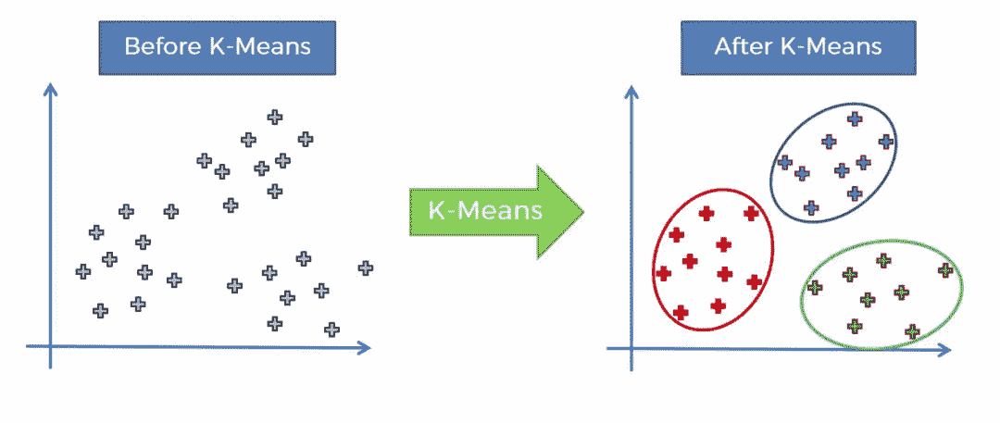

好了，这里我们有一个散点图。假设我们有两个变量从数据集中沿 X 轴和 Y 轴绘制(在 K 均值图之前)。问题是我们能否在变量中识别出某些群体，以及我们如何去做。我们如何识别组的数量？

因此，K-means 为您所做的是，它减少了决策过程的复杂性，并允许您轻松地从数据集中识别那些数据点集群(在 K-means 图之后)。就这样，我们有三个集群(红色，蓝色，绿色)。这是一个非常简单的例子，这里我们只有两个变量，所以是二维的，但请注意，K-means 可以处理多维数据。

# 工作原理:

我将用简单的逐步格式来分解它。

**步骤 1** :选择集群的数量 K——我们将在下一节看到如何选择最佳的集群数量。但是现在我们假设我们选择 K。它可以是任何数字(3、5 或 2 等)。

**第二步**:随机选择 K 个点，质心(不一定来自你的数据集)——质心就是聚类的中心点。您可以从第一个散点图中选择任意两个点，它们可以是任意随机的 X 和 Y 值，前提是您选择的质心数量等于步骤 1 中选择的聚类数量。

**步骤 3** :将每个数据点分配到形成 K 聚类的最近的质心>——现在理解最近是这里的模糊术语。这取决于你测量的是哪种距离，这将由业务问题来定义。最常遵循的是欧几里德距离。当数据包含大值时，曼哈顿距离将是一个很好的选择，如果数据集充满了分类变量，则首选余弦距离。

**步骤 4** :计算并放置每个聚类的新质心。——这在我们研究一个例子的时候会更加清晰。

**步骤 5** :将每个数据点重新分配给新的最近质心。如果发生了任何重新分配，则转到步骤 4，否则停止，这显然是步骤 4 和 5 的迭代过程。

我知道这可能看起来有点复杂，但让我们通过一个视觉示例，以便我们在非常直观的水平上理解这一点，稍后您可以参考这些步骤来挖掘后台发生的事情。

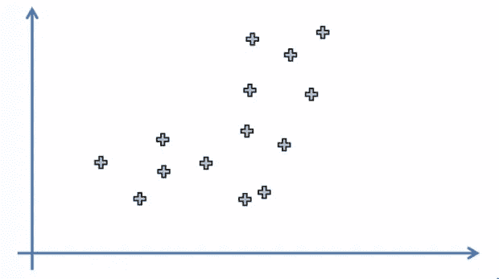

STEP 1: Choose Number K of Clusters: K=2

这里，我们的数据集中有观察值。它们是针对两个变量绘制的，现在的第一个问题是，你能否直观地识别出我们最终将得到的最终集群。那很难，不是吗！这只是两个变量，想象一下，如果我们有三个变量和五个变量，会有什么挑战。我们无法绘制这样的五维散点图。这就是 K-means 算法出现并简化过程的原因。现在让我们看看它是如何进行。在这种情况下，我们将手动执行 K-means 聚类算法，并查看它是如何工作的。通常由 python、R 等工具完成的工作

好吧，假设我们以某种方式确定了最佳聚类数等于 2。我们将再次讨论如何进一步找到最佳集群数量，但目前我们同意只有 2 个集群。

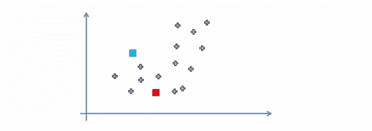

STEP 2: Select at random K points,the centroids(not necessarily from your dataset)

在这一步，我们选择了数据集外的两个随机点，蓝色正方形和红色正方形作为我们的质心。

**STEP 3**: Assign each data point to the closest centroid >That forms K Cluster. (Fig.1b)

对于第 3 步，基本上我们必须检查数据集中的每个数据点，确定两个质心(蓝色或红色)中哪个最近。这一点我们将通过刷新我们的几何知识来确定。我们要做的是用直线连接这些质心，然后用垂线(用绿色虚线标出)平分这条线。绿线上的任何一点与两个质心的距离都是相等的。位于该线上方的点属于蓝色聚类质心，同样，位于该线下方的点属于红色聚类质心。为了简单起见，它们所属的簇的点将被涂上相同的颜色。在我们继续之前，我想提一下“最近”是一个模糊的术语。因为当你在散点图上想象事物时，最近的距离是非常直接的，这意味着我们所看到的距离。根据散点图，我们可以很好地得出结论，点 x 更接近集群 A，点 y 更接近集群 b。*(距离度量的类型:* [*欧几里得*](https://en.wikipedia.org/wiki/Euclidean_distance) *，* [*曼哈顿*](https://www.quora.com/What-is-the-difference-between-Manhattan-and-Euclidean-distance-measures) *，* [*余弦*](https://en.wikipedia.org/wiki/Cosine_similarity) *等。)*

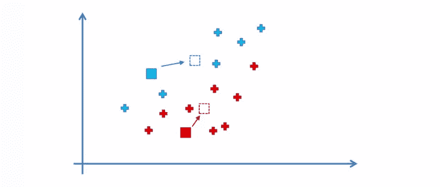

**STEP 4**: Compute and place the new centroid of each cluster.(Fig.1a)

请记住这一点，继续进行第 4 步。想象每个数据点都有一定的权重。所以你需要找到质心，并在散点图上精确定位(用虚线方块表示)。

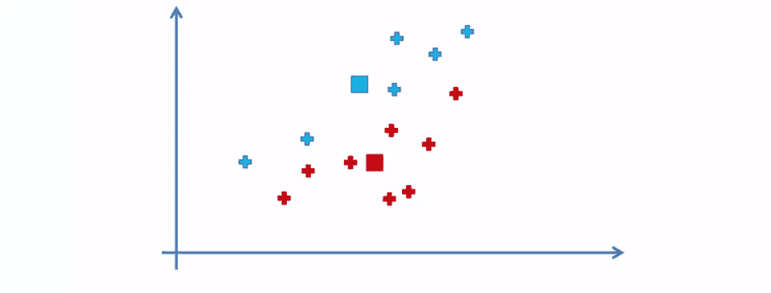

**STEP 5**: Reassign each data point to the new closest centroid. If any reassignment took place,go to STEP 4, otherwise stop.(Fig.1a)

这基本上是通过计算属于特定聚类的数据点的平均值来实现的。在我们的例子中，让我们看看蓝色的聚类点，取每个聚类点的 y 坐标和 x 坐标，分别进行平均，并绘制出平均点。

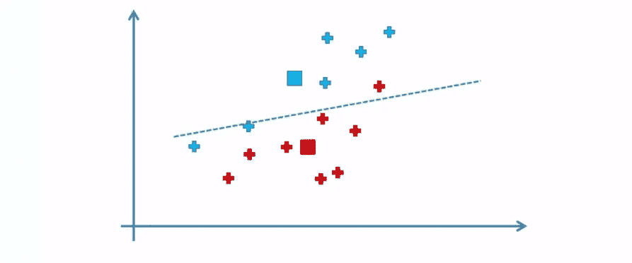

**STEP 5**: Reassign each data point to the new closest centroid. If any reassignment took place,go to STEP 4, otherwise stop.(Fig.1b)

太好了！现在我们进入第五步。在绘制绿线后，我们可以看到有三个点由于以前的隶属关系而被错误分类。

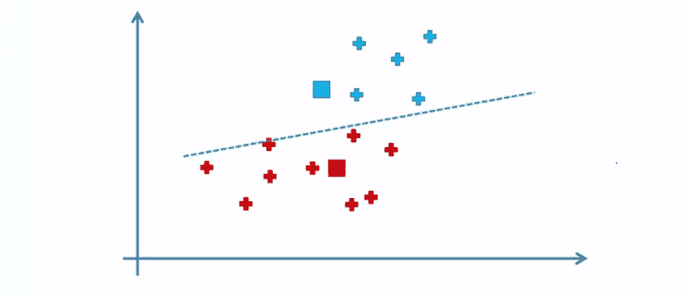

**STEP 5**: Reassign each data point to the new closest centroid. If any reassignment took place,go to STEP 4, otherwise stop.(Fig.1c)

因此，我们将移动它们，并根据聚类的质心对它们重新着色。由于重新分配了数据点，我们将返回到步骤 4。

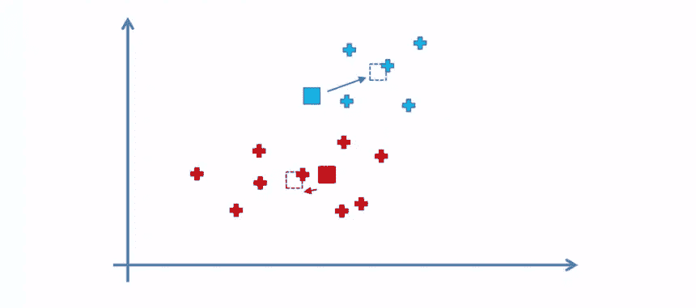

**STEP 4**: Compute and place the new centroid of each cluster.(Fig. 2a)

基于重新分配，我们重新计算质心，并为每个聚类放置质心。

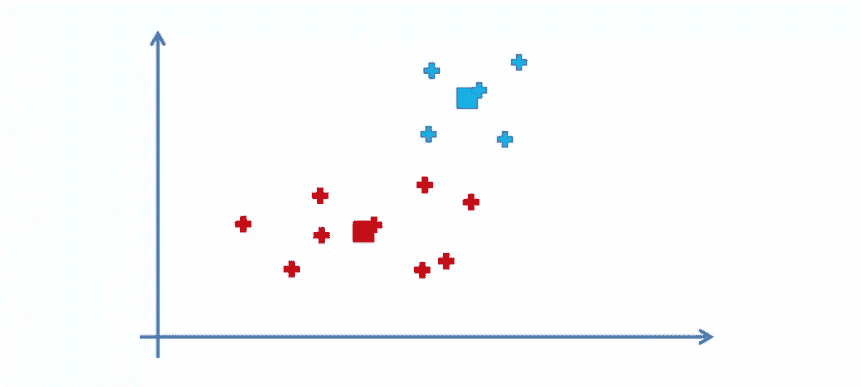

**STEP 4**: Compute and place the new centroid of each cluster.(Fig. 2b)

确定每个簇的新质心，用虚线方块表示，并在这些位置移动质心。

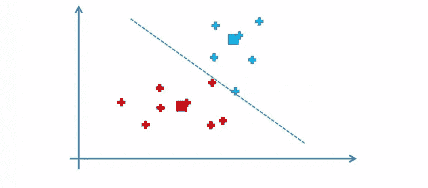

**STEP 5**: Reassign each data point to the new closest centroid. If any reassignment took place,go to STEP 4, otherwise stop.(Fig.2b)

重复步骤 5。

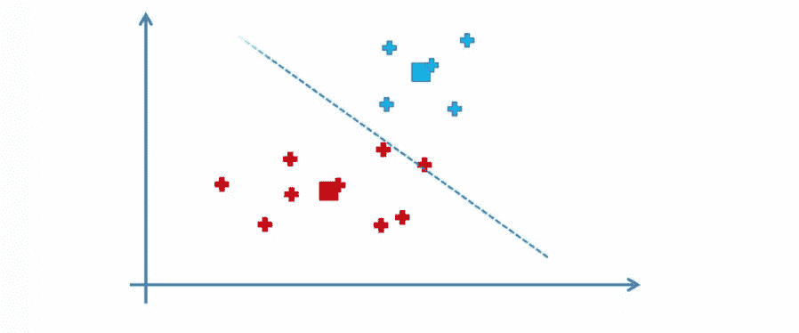

**STEP 5**: Reassign each data point to the new closest centroid. If any reassignment took place,go to STEP 4, otherwise stop.(Fig.2a)

注意绿线上方的红色数据点(见步骤 5 的图 2a)被重新分配给蓝色聚类。

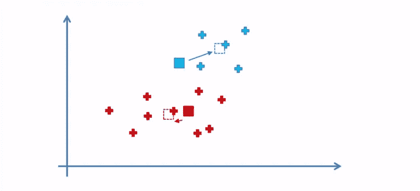

**STEP 4**: Compute and place the new centroid of each cluster.(Fig. 3a)

重复步骤 4。正如我们所见，这是一个迭代过程。我们继续这样做，直到算法收敛。

**STEP 4**: Compute and place the new centroid of each cluster.(Fig. 3b)

第三次迭代的步骤 4。

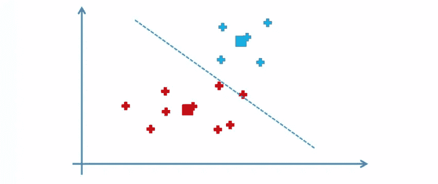

**STEP 5**: Reassign each data point to the new closest centroid. If any reassignment took place,go to STEP 4, otherwise stop.(Fig.3a)

第五步第三次迭代。

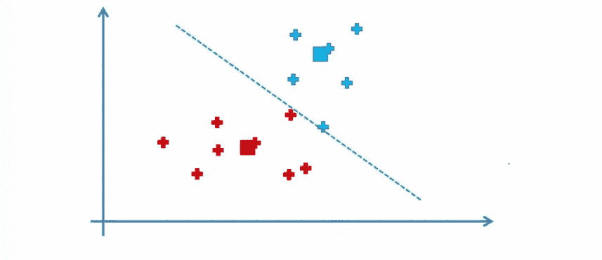

**STEP 5**: Reassign each data point to the new closest centroid. If any reassignment took place,go to STEP 4, otherwise stop.(Fig.3b)

你可以再次看到等距的绿线。

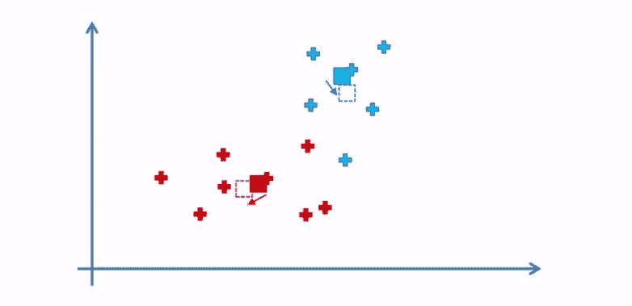

**HSTEP 4**: Compute and place the new centroid of each cluster.(Fig. 4a)

第四次迭代的步骤 4。

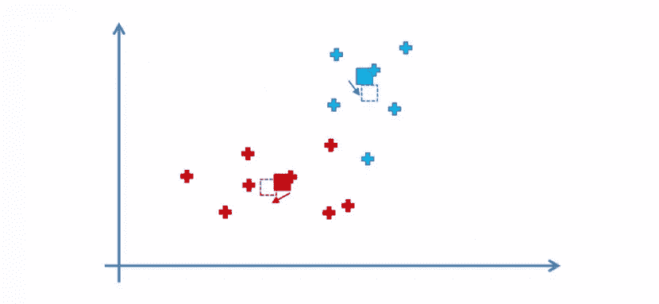

**STEP 4**: Compute and place the new centroid of each cluster.(Fig. 5a)

在步骤 5 中，将每个数据点重新分配给新的最近质心。

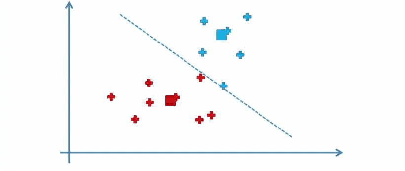

**STEP 5**: Reassign each data point to the new closest centroid. If any reassignment took place,go to STEP 4, otherwise stop.(Fig.4a)

第五次迭代的第四步。

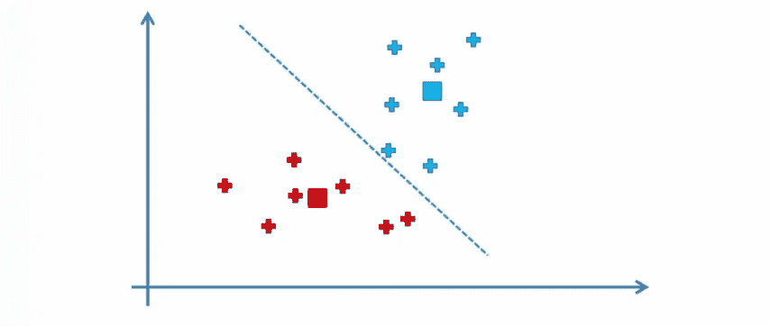

**STEP 5**: Reassign each data point to the new closest centroid. If any reassignment took place,go to STEP 4, otherwise stop.(Fig.5a)

我们非常接近我们集群的最终成员。

**STEP 4**: Compute and place the new centroid of each cluster.(Fig. 6a)

第六次重复步骤 4。

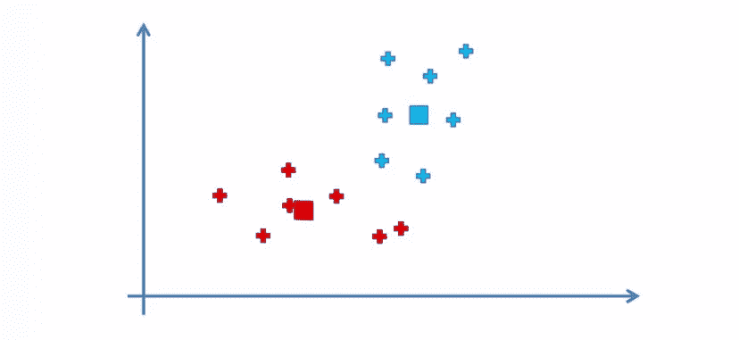

**STEP 4**: Compute and place the new centroid of each cluster.(Fig. 6b)

计算并在每个簇中放置新的质心。

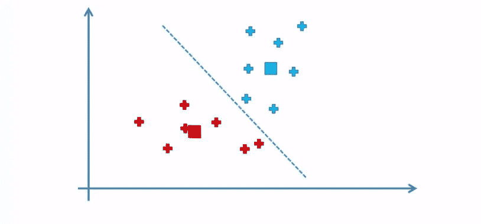

**STEP 5**: Reassign each data point to the new closest centroid. If any reassignment took place,go to STEP 4, otherwise stop.(Fig.6a)

现在，当我们第六次运行步骤 5 时，请注意集群成员没有变化。比较步骤 5 的图 5a 和图 6a。因此，我们可以安全地得出结论，我们的 K-means 算法已经收敛，最终模型准备就绪。

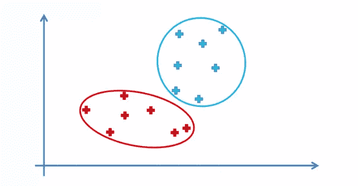

Finally !!!

这是我们用 K-means 算法建议的两个聚类。希望我已经用简单的术语成功地揭开了算法的神秘面纱。

> [**这里的**](http://nbviewer.jupyter.org/github/PBPatil/K-means-Clustering/blob/master/K-means_clustering_1.ipynb) 是在 Iris 数据集上尝试 K-means 聚类的实际例子。

# 选择最佳 K 值-

K 均值聚类的一个严重缺点是 K 值。

现在，为了便于理解，举例来说，如果在上述场景中有 2 个集群会更好，或者有 10 个集群会更好。我们需要一定的度量。我们需要一种方法来评估特定数量的群集如何比不同的群集表现得更好，并且该指标最好是可量化的。那么，我们对聚类算法施加什么样的度量，会告诉我们一些关于最终结果的信息呢？

对此的补救措施是簇内变异**。**

组内变异在数学上表示为误差平方和(WCSS/SSE)。它也被称为“肘法”。

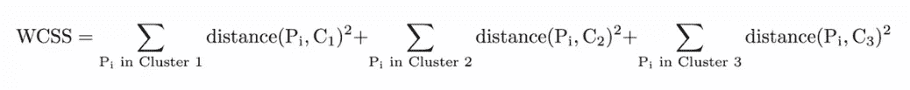

乍一看，这个公式似乎很复杂，但实际上非常简单。根据我们的使命，化繁为简，让我们把它分解开来。

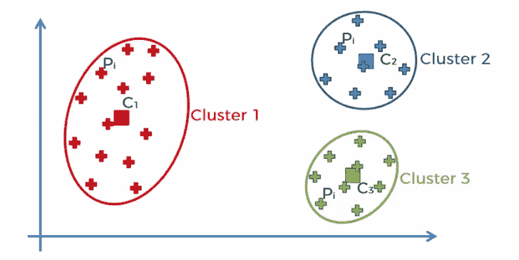

基本上我们在这里做的是…

聚类 1 中的每个数据点(聚类 1 中的 Pi)，测量 Pi 数据点和聚类 1 的 C1 质心之间的差{距离(Pi，C1)}并将它们相加(大的“E”符号称为 sigma，它表示相加)

其他集群也是如此。

如果你把 K 对着上证指数作图，你会看到误差随着 K 变大而减小；这是因为当集群数量增加时，它们应该更小，因此失真也更小。

肘法的思路是选择 SSE 突然下降的 K。

这在图中产生了“肘效应”。

> 在这里 我已经接触了肘方法的概念和其他一些概念。

**参考文献**:

 [## 机器学习 A-Z:数据科学中的 Python & R 实践

### 向两位数据科学专家学习用 Python 和 R 创建机器学习算法。包括代码模板。

www.udemy.com](https://www.udemy.com/machinelearning/)  [## Python 用于数据科学和机器学习训练营

### 了解如何使用 NumPy、Pandas、Seaborn、Matplotlib、Plotly、Scikit-Learn、机器学习、Tensorflow 等等！

www.udemy.com](https://www.udemy.com/python-for-data-science-and-machine-learning-bootcamp)  [## 统计学习导论

### 作为一名前数据科学家，我最常被问到的问题莫过于“学习统计学的最佳方法是什么?”?“我……

www-bcf.usc.edu](http://www-bcf.usc.edu/~gareth/ISL/) 

从 1 到哈姆雷特，你有多优柔寡断？好吧，有一个巧妙的方法可以解决生活中令人烦恼的困境，我们下次再见时再看 **！**

**阅读我发表的其他文章**—

1.  [如何使用 Python 从 Excel 创建 PDF 报告](https://medium.com/@theprasadpatil/how-to-create-a-pdf-report-from-excel-using-python-b882c725fcf6)
2.  [什么是探索性数据分析？](/exploratory-data-analysis-8fc1cb20fd15)
3.  [最后一分钟修订:第一部分—机器学习&统计](https://medium.com/@theprasadpatil/last-minute-revision-part-i-machine-learning-statistics-8de23a377987)