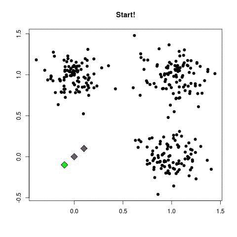
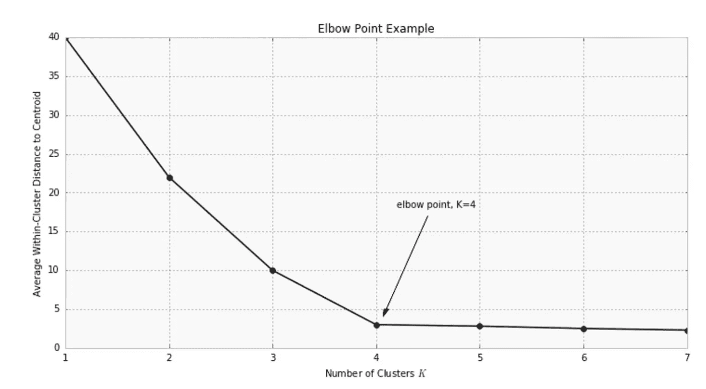

# k-均值聚类—机器学习算法简介

> 原文：<https://towardsdatascience.com/k-means-clustering-introduction-to-machine-learning-algorithms-c96bf0d5d57a?source=collection_archive---------0----------------------->

## 最简单的聚类算法—代码和解释


## 简介—无监督学习

在机器学习中，我们并不总是被提供一个目标来优化，我们也不总是被提供一个目标标签来对输入数据点进行分类。在人工智能领域中，没有目标或标签可供我们分类的问题被称为无监督学习问题。在无监督学习问题中，我们试图对数据中存在的潜在结构化信息进行建模。聚类是一种无监督学习问题，我们试图根据相似数据的底层结构将它们分组到群组/聚类中。K-means 算法是一种广泛使用的著名聚类算法。k 代表我们要将数据点分类到的聚类数。

## K-Means 伪代码

```
## K-Means Clustering 1\. Choose the number of clusters(K) and obtain the data points 
2\. Place the centroids c_1, c_2, ..... c_k randomly 
3\. Repeat steps 4 and 5 until convergence or until the end of a fixed number of iterations
4\. for each data point x_i:
       - find the nearest centroid(c_1, c_2 .. c_k) 
       - assign the point to that cluster 
5\. for each cluster j = 1..k
       - new centroid = mean of all points assigned to that cluster
6\. End 
```

下面的模拟将提供对 K-means 算法的更好理解。



K — Means Algorithm

## 怎么选 K？？

在某些情况下，我们不知道集群的数量。那么，我们如何选择 K 的值呢？？？有一种方法叫肘法。在这种方法中，选择不同数量的簇，并开始绘制簇内到质心的距离。图表如下所示。



Elbow method

从上图中我们可以推断出，在 k=4 时，该图达到最佳最小值。即使类内距离在 4 之后减少，我们也会做更多的计算。这类似于收益递减定律。因此，我们选择值 4 作为聚类的最佳数量。之所以称之为肘关节法，是因为最佳聚类数代表一个肘关节！

## K-均值聚类算法的应用

*   行为细分
*   异常检测
*   社会网络分析
*   市场细分

只有几个应用聚类算法(如 K-means)的例子。

## 让我们写一些代码

我们将使用[虹膜数据集](https://www.kaggle.com/jchen2186/machine-learning-with-iris-dataset/data)来构建我们的算法。即使虹膜数据集有标签，我们也将丢弃它们，只使用特征点对数据进行聚类。我们知道有 3 个聚类(“鸢尾-海滨鸢尾”、“鸢尾-刚毛鸢尾”、“鸢尾-杂色”)。因此，在我们的例子中 k=3。

我们加载数据集并删除目标值。我们将特征点转换成一个 numpy 数组，并将其分成训练和测试数据。

我们实现了上面显示的伪代码，我们可以发现我们的算法在 6 次迭代后收敛。我们现在可以输入一个测试数据点，找到它最接近的质心，并将该点分配给相应的聚类。

Scikit-learn 库通过提供一个我们可以用来实现算法的抽象层次对象，再一次使我们免于编写这么多行代码。

## 结论

K-means 是聚类技术的入门算法，也是最简单的算法。你可能已经注意到了，这里没有目标/损失函数。因此，不需要偏导数，并且消除了复杂的数学运算。K-means 是一种易于实现的简便算法。

## 参考

[](https://www.datascience.com/blog/k-means-clustering) [## K-均值聚类简介

### 具体话题经验:新手职业经验:无行业经验机器知识…

www.datascience.com](https://www.datascience.com/blog/k-means-clustering)