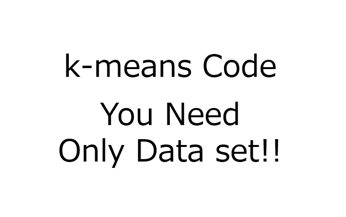
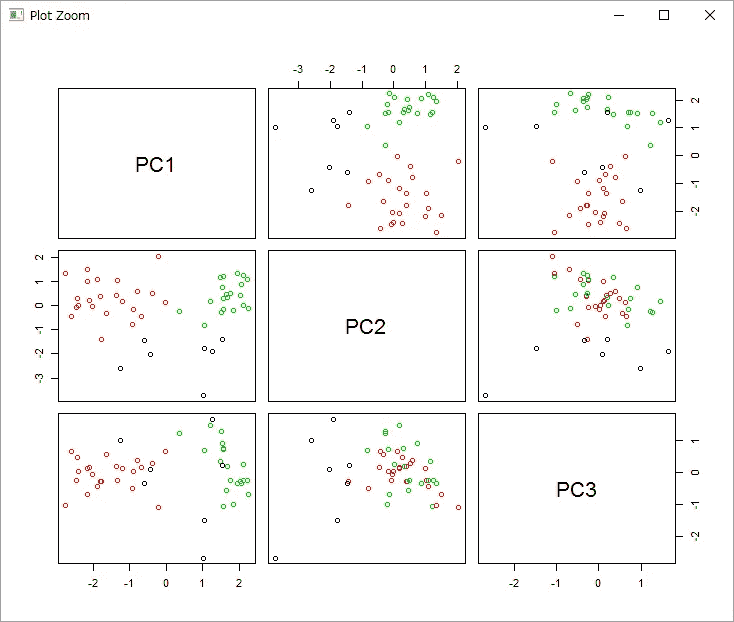
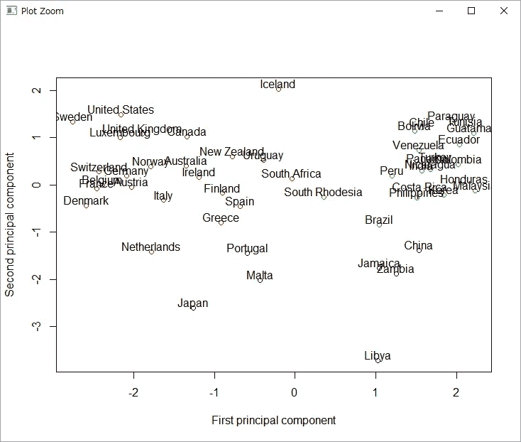
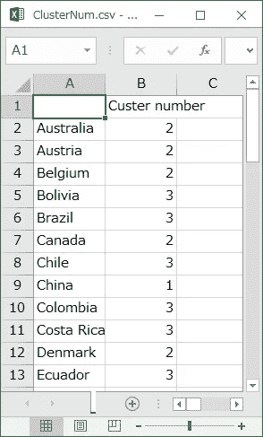

# k-means 聚类:MATLAB、R 和 Python 代码——你所要做的只是准备数据集(非常简单、容易和实用)

> 原文：<https://towardsdatascience.com/k-means-clustering-matlab-r-and-python-codes-all-you-have-to-do-is-just-preparing-data-set-very-151002d1f8ca?source=collection_archive---------2----------------------->

我发布 k-means 聚类的 MATLAB，R 和 Python 代码。它们非常容易使用。你准备数据集，然后运行代码！然后，可以执行 AP 聚类。非常简单容易！

你可以从下面的网址购买每一个代码。

## 矩阵实验室

[https://gum.co/Lowcz](https://gum.co/Lowcz)
请从下面的网址下载补充压缩文件(这是免费的)来运行 k-means 代码。
[http://univproblog . html . xdomain . jp/code/MATLAB _ scripts _ functions . zip](http://univprofblog.html.xdomain.jp/code/MATLAB_scripts_functions.zip)

## 稀有

[https://gum.co/YdBm](https://gum.co/YdBm)
请从下面的网址下载补充压缩文件(这是免费的)来运行 k-means 代码。
[http://univproblog . html . xdomain . jp/code/R _ scripts _ functions . zip](http://univprofblog.html.xdomain.jp/code/R_scripts_functions.zip)

## 计算机编程语言

[https://gum.co/EYGPR](https://gum.co/EYGPR)
请从下面的网址下载补充压缩文件(这是免费的)来运行 k-means 代码。
[http://univprovblog . html . xdomain . jp/code/supporting functions . zip](http://univprofblog.html.xdomain.jp/code/supportingfunctions.zip)

# k-means 在 MATLAB 中的程序，R 和 Python 代码

为了执行适当的 k-means，加载数据集后，MATLAB、R 和 Python 代码遵循以下程序。

**1。决定集群的数量**

**2。自动缩放解释变量(X)(如有必要)**
自动缩放意味着居中和缩放。通过从居中的变量中减去每个变量的平均值，每个变量的平均值变为零。通过将每个变量的标准偏差除以换算中的变量，每个变量的标准偏差变为 1。

**3。运行 k-means**

**4。可视化聚类结果**
例如通过 PCA 进行数据可视化。通过改变散点图中不同聚类的颜色，可以很容易地看到聚类。

# 如何进行 k-means？

## 1.购买代码并解压文件

**MATLAB**:[https://gum.co/Lowcz](https://gum.co/Lowcz)

**R**:[https://gum.co/YdBm](https://gum.co/YdBm)

**蟒蛇**:【https://gum.co/EYGPR】T2

## 2.下载并解压缩补充 zip 文件(这是免费的)

**MATLAB**:[http://univprovblog . html . xdomain . jp/code/MATLAB _ scripts _ functions . zip](http://univprofblog.html.xdomain.jp/code/MATLAB_scripts_functions.zip)

**R**:[http://univprovblog . html . xdomain . jp/code/R _ scripts _ functions . zip](http://univprofblog.html.xdomain.jp/code/R_scripts_functions.zip)

**Python**:[http://univprovblog . html . xdomain . jp/code/supporting functions . zip](http://univprofblog.html.xdomain.jp/code/supportingfunctions.zip)

## 3.将补充文件放在与 k-means 代码相同的目录或文件夹中。

## 4.准备数据集。有关数据格式，请参见下面的文章。

[https://medium . com/@ univprovblog 1/data-format-for-MATLAB-r-and-python-codes-of-data-analysis-and-sample-data-set-9 b0f 845 b 565 a # . 3 ibr PHS 4h](https://medium.com/@univprofblog1/data-format-for-matlab-r-and-python-codes-of-data-analysis-and-sample-data-set-9b0f845b565a#.3ibrphs4h)

## 5.运行代码！

每个样本的聚类数保存在“ClusterNum.csv”中。

# 必需的设置

请看下面的文章。
[https://medium . com/@ uniprofblog1/settings-for-running-my-MATLAB-r-and-python-codes-136 B9 e 5637 a 1 #、paer8scqy](https://medium.com/@univprofblog1/settings-for-running-my-matlab-r-and-python-codes-136b9e5637a1#.paer8scqy)

# 执行结果的示例

