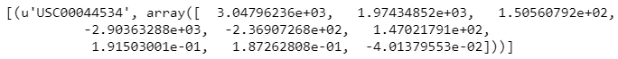
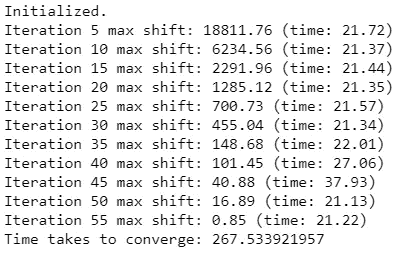
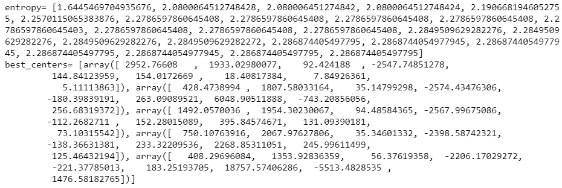

# K-Means++在 Python 和 Spark 中的实现

> 原文：<https://towardsdatascience.com/k-means-implementation-in-python-and-spark-856e7eb5fe9b?source=collection_archive---------4----------------------->


对于本教程，我们将使用 PySpark，Apache Spark 的 Python 包装器。虽然 PySpark 有一个很好的 K-Means++实现，但我们将从头开始编写自己的实现。

# 配置 PySpark 笔记本

如果你在 Jupyter 笔记本上没有 PySpark，我觉得这个教程很有用:

[](https://blog.sicara.com/get-started-pyspark-jupyter-guide-tutorial-ae2fe84f594f) [## 3 分钟内开始使用 PySpark 和 Jupyter 笔记本

### Apache Spark 是大数据爱好者的必备品。简而言之，Spark 是一个快速而强大的框架，它提供了一个…

blog.sicara.com](https://blog.sicara.com/get-started-pyspark-jupyter-guide-tutorial-ae2fe84f594f) 

# 将数据集作为 RDD 加载

开始前，请确保您可以访问气象站数据集:
[https://github . com/yoavfreund/UCSD _ BigData _ 2016/tree/master/Data/Weather](https://github.com/yoavfreund/UCSD_BigData_2016/tree/master/Data/Weather)

```
**def** parse_data(row):
    *'''*
 *Parse each pandas row into a tuple of 
    (station_name,  feature_vec),`l*
 *where feature_vec is the concatenation of the projection vectors*
 *of TAVG, TRANGE, and SNWD.*
 *'''*
    **return** (row[0],
            np.concatenate([row[1], row[2], row[3]]))*## Read data*
data = pickle.load(open("stations_projections.pickle", "rb"))
rdd = sc.parallelize([parse_data(row[1]) 
          **for** row **in** data.iterrows()])
```

让我们看看第一行:

```
rdd.take(1)
```



气象站的名称是 **USC00044534** ，其余的是我们将用于聚类的不同天气信息。

# 导入库

```
**import** numpy as np 
**import** pickle 
**import** sys 
**import** time
**from** numpy.linalg **import** norm 
**from** matplotlib **import** pyplot **as** plt
```

# 定义全局参数

```
*# Number of centroids* K = 5 *# Number of K-means runs that are executed in parallel. Equivalently, number of sets of initial points* RUNS = 25 # For reproducability of results
RANDOM_SEED = 60295531 *# The K-means algorithm is terminated when the change in the 
# location of the centroids is smaller than 0.1* converge_dist = 0.1
```

# 效用函数

随着我们的发展，以下功能将会派上用场:

```
**def** print_log(s):
    '''
    Print progress logs
    '''
    sys.stdout.write(s + "**\n**")
    sys.stdout.flush() **def** compute_entropy(d):
    *'''*
 *Compute the entropy given the frequency vector `d`*
 *'''*
    d = np.array(d)
    d = 1.0 * d / d.sum()
    **return** -np.sum(d * np.log2(d))

**def** choice(p):
    *'''*
 *Generates a random sample from [0, len(p)),*
 *where p[i] is the probability associated with i.* 
 *'''*
    random = np.random.random()
    r = 0.0
    **for** idx **in** range(len(p)):
        r = r + p[idx]
        **if** r > random:
            return idx
    assert(False)
```

# 质心的初始化

对于 K-Means++来说，我们希望在初始化时质心尽可能的分开。这个想法是让质心在初始化时更接近不同的聚类中心，从而更快地达到收敛。

```
**def** kmeans_init(rdd, K, RUNS, seed):
    '''
    Select `RUNS` sets of initial points for `K`-means++
    '''
    # the `centers` variable is what we want to return
    n_data = rdd.count()
    shape = rdd.take(1)[0][1].shape[0]
    centers = np.zeros((RUNS, K, shape)) **def** update_dist(vec, dist, k):
        new_dist = norm(vec - centers[:, k], axis=1)**2
        **return** np.min([dist, new_dist], axis=0) # The second element `dist` in the tuple below is the
    # closest distance from each data point to the selected
    # points in the initial set, where `dist[i]` is the
    # closest distance to the points in the i-th initial set
    data = (rdd
            .map(**lambda** p: (p, [np.inf] * RUNS)) \
            .cache()) # Collect the feature vectors of all data points
    # beforehand, might be useful in the following
    # for-loop
    local_data = (rdd
                    .map(**lambda** (name, vec): vec)
                    .collect()) # Randomly select the first point for every run of
    # k-means++, i.e. randomly select `RUNS` points
    # and add it to the `centers` variable
    sample = [local_data[k] **for** k **in**
        np.random.randint(0, len(local_data), RUNS)]
    centers[:, 0] = sample **for** idx **in** range(K - 1):
        ########################################################
        # In each iteration, you need to select one point for
        # each set of initial points (so select `RUNS` points
        # in total). For each data point x, let D_i(x) be the
        # distance between x and the nearest center that has
        # already been added to the i-th set. Choose a new
        # data point for i-th set using a weighted probability
        # where point x is chosen with probability proportional
        # to D_i(x)^2 . Repeat each data point by 25 times
        # (for each RUN) to get 12140x25
        ######################################################## #Update distance
        data = (data
            .map(**lambda** ((name,vec),dist):
                    ((name,vec),update_dist(vec,dist,idx)))
            .cache()) #Calculate sum of D_i(x)^2
        d1 = data.map(**lambda** ((name,vec),dist): (1,dist))
        d2 = d1.reduceByKey(**lambda** x,y: np.sum([x,y], axis=0))
        total = d2.collect()[0][1] #Normalize each distance to get the probabilities and
        #reshapte to 12140x25
        prob = (data
            .map(**lambda** ((name,vec),dist):
                np.divide(dist,total))
            .collect())
        prob = np.reshape(prob,(len(local_data), RUNS)) #K'th centroid for each run
        data_id = [choice(prob[:,i]) **for** i **in** xrange(RUNS)]
        sample = [local_data[i] **for** i **in** data_id]
        centers[:, idx+1] = sample **return** centers # The second element `dist` in the tuple below is the
    # closest distance from each data point to the selected
    # points in the initial set, where `dist[i]` is the
    # closest distance to the points in the i-th initial set
    data = (rdd
            .map(**lambda** p: (p, [np.inf] * RUNS)) \
            .cache()) # Collect the feature vectors of all data points
    # beforehand, might be useful in the following
    # for-loop
    local_data = (rdd
                    .map(**lambda** (name, vec): vec)
                    .collect()) # Randomly select the first point for every run of
    # k-means++, i.e. randomly select `RUNS` points
    # and add it to the `centers` variable
    sample = [local_data[k] **for** k **in** np.random.randint(0, len(local_data), RUNS)]
    centers[:, 0] = sample **for** idx **in** range(K - 1):
        ########################################################
        # In each iteration, you need to select one point for
        # each set of initial points (so select `RUNS` points
        # in total). For each data point x, let D_i(x) be the
        # distance between x and the nearest center that has
        # already been added to the i-th set. Choose a new
        # data point for i-th set using a weighted probability
        # where point x is chosen with probability proportional
        # to D_i(x)^2 . Repeat each data point by 25 times
        # (for each RUN) to get 12140x25
        ######################################################## #Update distance
        data = (data
                .map(**lambda** ((name,vec),dist):
                        ((name,vec),update_dist(vec,dist,idx)))
                .cache()) #Calculate sum of D_i(x)^2
        d1 = data.map(**lambda** ((name,vec),dist): (1,dist))
        d2 = d1.reduceByKey(lambda x,y: np.sum([x,y], axis=0))
        total = d2.collect()[0][1] #Normalize each distance to get the probabilities and  
        # reshape to 12140x25
        prob = (data
            .map(**lambda** ((name,vec),dist):
                    np.divide(dist,total))
            .collect())
        prob = np.reshape(prob,(len(local_data), RUNS)) #K'th centroid for each run
        data_id = [choice(prob[:,i]) **for** i **in** xrange(RUNS)]
        sample = [local_data[i] **for** i **in** data_id]
        centers[:, idx+1] = sample **return** centers
```

# K-Means++实现

现在我们有了初始化函数，我们可以用它来实现 K-Means++算法。

```
**def** get_closest(p, centers):
    *'''*
 *Return the indices the nearest centroids of `p`.*
 *`centers` contains sets of centroids, where `centers[i]` is*
 *the i-th set of centroids.*
 *'''*
    best = [0] * len(centers)
    closest = [np.inf] * len(centers)
    **for** idx **in** range(len(centers)):
        **for** j **in** range(len(centers[0])):
            temp_dist = norm(p - centers[idx][j])
            **if** temp_dist < closest[idx]:
                closest[idx] = temp_dist
                best[idx] = j
    **return** best

**def** kmeans(rdd, K, RUNS, converge_dist, seed):
    *'''*
 *Run K-means++ algorithm on `rdd`, where `RUNS` is the number of*
 *initial sets to use.*
 *'''*
    k_points = kmeans_init(rdd, K, RUNS, seed)
    print_log("Initialized.")
    temp_dist = 1.0

    iters = 0
    st = time.time() **while** temp_dist > converge_dist: 
        *# Update all `RUNS` sets of centroids using standard k-means 
        # algorithm*
        *# Outline:*
        *#   - For each point x, select its nearest centroid in i-th 
        # centroids set*
        *#   - Average all points that are assigned to the same 
        # centroid*
        *#   - Update the centroid with the average of all points 
        # that are assigned to it*
        temp_dist = np.max([
                np.sum([norm(k_points[idx][j] - new_points[(idx, 
                    j)]) **for** idx,j **in** new_points.keys()])
                            ])

        iters = iters + 1
        **if** iters % 5 == 0:
            print_log("Iteration **%d** max shift: **%.2f** (time: **%.2f**)" %
                      (iters, temp_dist, time.time() - st))
            st = time.time()

        *# update old centroids*
        *# You modify this for-loop to meet your need*
        **for** ((idx, j), p) **in** new_points.items():
            k_points[idx][j] = p

    **return** k_points
```

# 基准测试

K-Means++优于 K-Means 之处在于它的初始化算法带来的收敛速度。此外，Spark 被用来尽可能地并行化这个算法。因此，让我们对这个实现进行基准测试。

```
st = time.time()

np.random.seed(RANDOM_SEED)
centroids = kmeans(rdd, K, RUNS, converge_dist,  
                   np.random.randint(1000))
group = rdd.mapValues(**lambda** p: get_closest(p, centroids)) \
           .collect()

**print** "Time takes to converge:", time.time() - st
```



根据处理器内核的数量、为每个执行器设置的内核内存以及使用的执行器数量，这个结果会有所不同。

# 价值函数

为了验证模型的准确性，我们需要选择一个成本函数，并尝试使用该模型将其最小化。最终的成本函数会给我们一个准确性的概念。对于 K-Means，我们查看数据点和最近的质心之间的距离。

```
**def** get_cost(rdd, centers):
    *'''*
 *Compute the square of l2 norm from each data point in `rdd`*
 *to the centroids in `centers`*
 *'''*
    **def** _get_cost(p, centers):
        best = [0] * len(centers)
        closest = [np.inf] * len(centers)
        **for** idx **in** range(len(centers)):
            **for** j **in** range(len(centers[0])):
                temp_dist = norm(p - centers[idx][j])
                **if** temp_dist < closest[idx]:
                    closest[idx] = temp_dist
                    best[idx] = j
        **return** np.array(closest)**2

    cost = rdd.map(**lambda** (name, v): _get_cost(v, 
           centroids)).collect()
    **return** np.array(cost).sum(axis=0)

cost = get_cost(rdd, centroids)
log2 = np.log2**print** "Min Cost:\t"+str(log2(np.max(cost)))
**print** "Max Cost:\t"+str(log2(np.min(cost)))
**print** "Mean Cost:\t"+str(log2(np.mean(cost)))
```

最小成本:33.7575332525
最大成本:33.8254902123
平均成本:33.2533332335

# 决赛成绩

以下是最终结果:

```
**print** 'entropy=',entropybest = np.argmin(cost)
**print** 'best_centers=',list(centroids[best])
```

