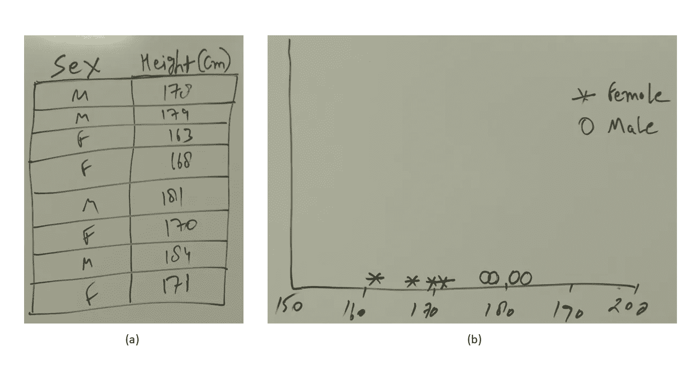
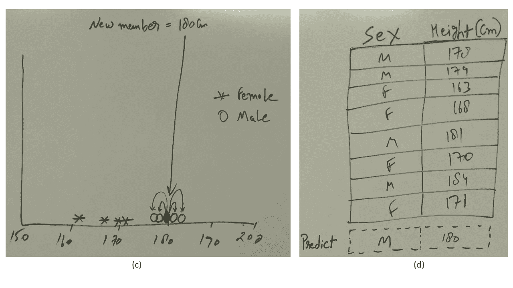
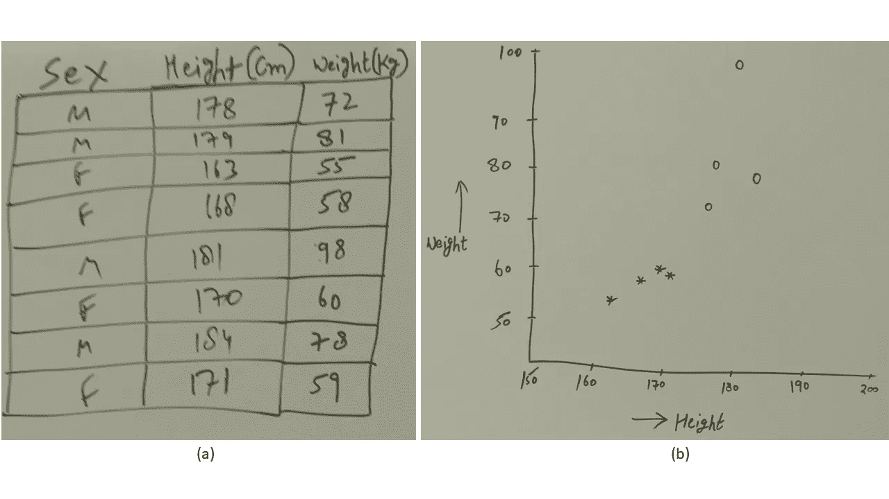
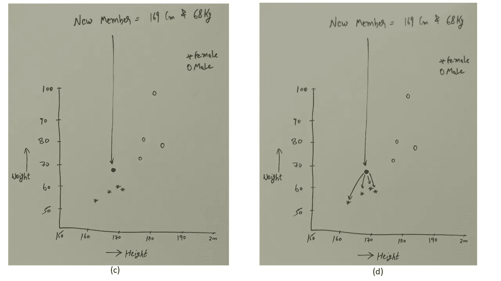
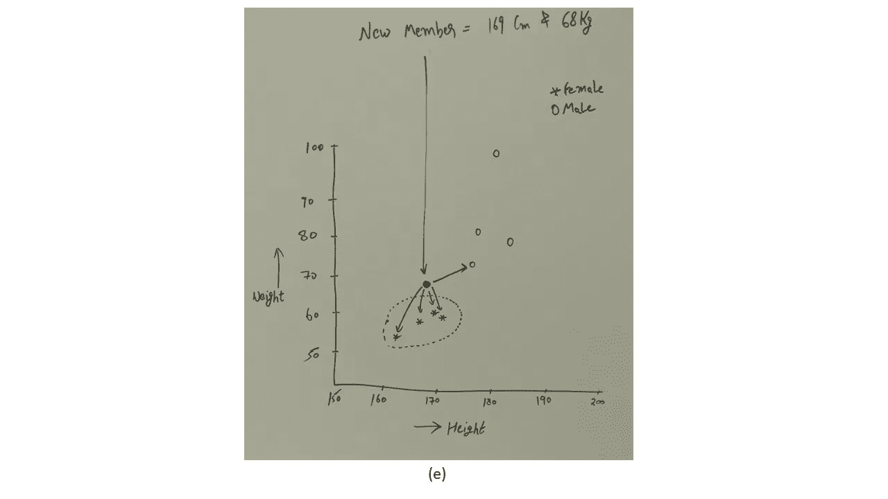

# R 中的 k-最近邻算法及实例(简单解释 knn)

> 原文：<https://towardsdatascience.com/k-nearest-neighbors-algorithm-with-examples-in-r-simply-explained-knn-1f2c88da405c?source=collection_archive---------0----------------------->


在这篇文章中，我将举例说明什么是 k-最近邻算法，以及它如何帮助我们。但是在我们继续之前，我们意识到我的目标受众是那些希望对概念有直观理解而不是非常深入理解的人，这就是为什么我避免对这个话题过于迂腐，对理论概念关注较少。让我们开始吧。

假设我们有一定数量的物体，每个物体都有自己独特的属性，例如，你有 5 把椅子，10 张床和 15 张桌子，我们知道每个物体的长度、宽度和高度。现在，如果有人给我们一个具有新属性的新对象，并要求我们预测该新对象属于哪个类别，这意味着我们获得了维度，并要求我们预测它是椅子、床还是桌子，那么我们必须使用 knn 算法来确定这一点。

因此，属性意味着每个对象的属性，每个对象可以被认为是一个类别。我们的工作是检查新对象的属性与任何一个已知类别的关系有多密切。现在，我将向你们展示多种场景，并尽可能简单地解释这些场景。

当我们得到属性时，我们试着把它们画在图上。这些属性的图形表示将帮助我们计算新值和已知值之间的欧几里德距离。通过这样做，我们可以确定新对象最接近哪个类别。

# 欧几里得距离

不要被这个名字吓倒，它只是简单地表示平面上两点之间的距离。通过简单地使用这个公式，你可以计算两点之间的距离，不管你有多少属性，比如高度，宽度，宽度，重量等等，直到 n，其中 n 可以是你拥有的物体的最后一个属性。公式为√( x2 x1)+(y2 y1)+(z2 Z1)……(N2-n1)

# 两类一属性(1D)

我们分为男性和女性两类，下表给出了他们各自的身高。然后，如果出现一名新成员，并要求您在已知他/她的身高的情况下确定他/她的性别，那么您可以在 1D 平面上绘制该身高，并检查该新身高与其他已绘制身高的接近度。理想情况下，我们将计算该图上的欧几里德距离，以确定新成员高度的最近高度。我们看到，如果我们绘制 180 厘米的身高图，它更接近男性身高，而不是女性身高。这就是我们如何确定它是一个男性。(a)显示表格(b)显示图表上的表示(c)显示新成员的引入(d)显示男性的预测值。



# 两类两属性(2D)

假设我们提出一个名为 weight 的新属性，它也可以描述男性和女性的特征，如下表所示。现在我们创建一个 2D 平面，并按照同样的程序计算新物体与旧物体的距离，它越接近其中一个类别，就被认为是它自己的类别。在下面的例子中，我们可以看到身高 169cm、体重 68kg 的新成员与女性的亲密度高于男性。因此，我们预测新成员是女性。



# 两个类别和两个以上属性(> 3D)

大多数情况下，你会有很多与你的分类对象相关的属性，它们不能简单地画在白板上的 2D 或 1D 平面上。然而，只要你理解了它的功能，你就可以开始了。假设你有 5 个属性，即。性别、身高、体重、颜色、头发长度和音调，然后你只需使用上述欧几里德公式来计算新出现的物体与已有物体的距离。取(sex 1-sex 2)+(height 1-height 2)+(weight 1—weight 2)+(color 1—color 2)+(hair _ length 1—hair _ length 2)+(voice _ pitch 1)—(voice _ pitch 2)的平方根，其中 1 表示已经绘制的数据点，2 表示要确定其类别的新数据点。请记住，上面的这个公式将用于每一个可用的数据点，也就是说，只要数据集中有多少行，它就会运行多少次。

# R 中的示例

在我们继续在 R 中实现它们之前，请注意以下几点:

1-您要检查的最近邻将被称为由值“k”定义。如果 k 是 5，那么您将检查 5 个最近的邻居以确定类别。如果大多数邻居属于这五个最近邻居中的某个类别，那么它将被选为即将到来的对象的类别。如下图所示。



2-不同的变量有不同的比例单位，如体重以千克为单位，身高以厘米为单位。那我们如何在欧几里德公式中使用它们呢？我们用公式(x-min(x))/(min(x)-max(x))对每个变量进行归一化，在下面的例子中也会看到。现在，如果你有一个 200 公斤的变量和一个 50 公斤的变量，归一化后，两者都将由 0 和 1 之间的值表示。假设您已经创建了一个只能容纳 0 到 1 范围内的内容的盒子，但是因为您已经使用了规范化公式将所有内容转换为 0 到 1 之间的值，所以您可以很好地使用这个盒子。注意:那个方框是你的图。

knn 算法适用于数值变量，这并不是说它不能适用于分类变量，只是如果你混合了分类变量和数值变量作为预测变量，那么它需要一点点不同的方法。但是如果所有的预测值都是数字，那么 knn 是最好的，因为我们处理的是距离，因此我们需要硬数字。

4-当我们将数据分成训练集和测试集时，数据应该已经被规范化了。这意味着我们首先将数据标准化，然后将其拆分。

knn 算法不适用于 R 中的有序因子，而是适用于因子。我们将在下面的代码中看到这一点。

6-K-均值算法不同于 K-最近邻算法。K-mean 用于聚类，是一种非监督学习算法，而 Knn 是一种监督学习算法，用于处理分类问题。

```
df <- data(iris) ##load data
 head(iris) ## see the studcture##   Sepal.Length Sepal.Width Petal.Length Petal.Width Species
 ## 1          5.1         3.5          1.4         0.2  setosa
 ## 2          4.9         3.0          1.4         0.2  setosa
 ## 3          4.7         3.2          1.3         0.2  setosa
 ## 4          4.6         3.1          1.5         0.2  setosa
 ## 5          5.0         3.6          1.4         0.2  setosa
 ## 6          5.4         3.9          1.7         0.4  setosa##Generate a random number that is 90% of the total number of rows in dataset.
 ran <- sample(1:nrow(iris), 0.9 * nrow(iris)) 

 ##the normalization function is created
 nor <-function(x) { (x -min(x))/(max(x)-min(x))   }

 ##Run nomalization on first 4 coulumns of dataset because they are the predictors
 iris_norm <- as.data.frame(lapply(iris[,c(1,2,3,4)], nor))

 summary(iris_norm)##   Sepal.Length     Sepal.Width      Petal.Length     Petal.Width     
 ##  Min.   :0.0000   Min.   :0.0000   Min.   :0.0000   Min. :0.00
 ##  1st Qu.:0.2222   1st Qu.:0.3333   1st Qu.:0.1017   1st Qu.:0.08  
 ##  Median :0.4167   Median :0.4167   Median :0.5678   Median :0.50
 ##  Mean   :0.4287   Mean   :0.4406   Mean   :0.4675   Mean   :0.45
 ##  3rd Qu.:0.5833   3rd Qu.:0.5417   3rd Qu.:0.6949   3rd Qu.:0.70
 ##  Max.   :1.0000   Max.   :1.0000   Max.   :1.0000   Max.   :1.00##extract training set
iris_train <- iris_norm[ran,] ##extract testing set
 iris_test <- iris_norm[-ran,]  ##extract 5th column of train dataset because it will be used as 'cl' argument in knn function.
 iris_target_category <- iris[ran,5] ##extract 5th column if test dataset to measure the accuracy
 iris_test_category <- iris[-ran,5]##load the package class
 library(class) ##run knn function
 pr <- knn(iris_train,iris_test,cl=iris_target_category,k=13)

 ##create confusion matrix
 tab <- table(pr,iris_test_category)

 ##this function divides the correct predictions by total number of predictions that tell us how accurate teh model is.

 accuracy <- function(x){sum(diag(x)/(sum(rowSums(x)))) * 100}
 accuracy(tab)## [1] 80
```

在 R 中已经可用的虹膜数据集中，我运行了 k-最近邻算法，得到了 80%的准确结果。首先，我将数据标准化，将 petal.length、sepal.length、petal.width 和 sepal.length 转换为标准化的 0 到 1 形式，以便我们可以将它们放入一个框(一个图)中，还因为我们的主要目标是预测一朵花是 virginica、Versicolor 还是 setosa，这就是为什么我排除了列 5，并将其存储到另一个名为 iris_target_category 的变量中。然后，我将规范化的值分成训练和测试数据集。想象一下，首先在图上绘制来自训练数据集的值，在我们使用所有必要的参数运行 knn 函数后，我们将测试数据集的值引入图中，并计算图中每个已存储点的欧几里德距离。现在，虽然我们知道它是测试数据集中的哪一朵花，但我们仍然预测这些值，并将它们存储在名为“pr”的变量中，以便我们可以将预测值与原始测试数据集的值进行比较。通过这种方式，我们可以了解我们模型的准确性，如果我们将来要获得新的 50 个值，并且要求我们预测这 50 个值的类别，我们可以使用该模型进行预测。

```
##because diamonds dataset is in ggplot2 package
 library(ggplot2)##load data
 data(diamonds)

 ##store it as data frame
 dia <- data.frame(diamonds)

 ##create a random number equal 90% of total number of rows
 ran <- sample(1:nrow(dia),0.9 * nrow(dia))

 ##the normalization function is created
 nor <-function(x) { (x -min(x))/(max(x)-min(x))   }

 ##normalization function is created
 dia_nor <- as.data.frame(lapply(dia[,c(1,5,6,7,8,9,10)], nor))

 ##training dataset extracted
 dia_train <- dia_nor[ran,]

 ##test dataset extracted
 dia_test <- dia_nor[-ran,]##the 2nd column of training dataset because that is what we need to predict about testing dataset
 ##also convert ordered factor to normal factor
 dia_target <- as.factor(dia[ran,2])

 ##the actual values of 2nd couln of testing dataset to compaire it with values that will be predicted
 ##also convert ordered factor to normal factor
 test_target <- as.factor(dia[-ran,2])

 ##run knn function
 library(class)
 pr <- knn(dia_train,dia_test,cl=dia_target,k=20)

 ##create the confucion matrix
 tb <- table(pr,test_target)

 ##check the accuracy
 accuracy <- function(x){sum(diag(x)/(sum(rowSums(x)))) * 100}
 accuracy(tb)## [1] 71.09752
```

在这个模型中，我试图预测“切割”变量，因为它是一个分类变量，我们知道 knn 更适合分类问题。我没有考虑第 3 列和第 4 列，因为它们也是绝对的，并且会引起歧义，因为其他预测变量是整数。注意，有一些方法可以对分类变量和整数变量的混合运行 knn，但是我们在这里不讨论它。其余的过程与 iris 数据集相同，最终我们获得了 71%的准确结果。

# 参考

匿名。(2015 年 3 月 9 日)。“R-kNN-k 最近邻(第 1 部分)”。 [*贾莱尔书院*](https://www.youtube.com/channel/UCTprjveyeUA-pn6b7KbGhmQ) *。*[https://www.youtube.com/watch?v=GtgJEVxl7DY](https://www.youtube.com/watch?v=GtgJEVxl7DY)

库马尔，s .(2017 年 10 月 8 日)。" R 中的 kNN(k-最近邻)算法"。RSTUDIO。[https://r studio-pubs-static . S3 . Amazon AWS . com/316172 _ a 857 ca 788d 1441 F8 be 1 BC D1 e 31 f 0 e 875 . html](https://rstudio-pubs-static.s3.amazonaws.com/316172_a857ca788d1441f8be1bcd1e31f0e875.html)

d . bhal la(2017 年 12 月 18 日)。《K 近邻:循序渐进教程》。*红色记录器。*[https://www . r-bloggers . com/k-nearest-neighbor-step-by-step-tutorial/](https://www.r-bloggers.com/k-nearest-neighbor-step-by-step-tutorial/)

[](https://homedecoration.nu/galleries/black-people-christmas-village-clip-art.html) [## 黑人圣诞村剪贴画

### 声明:所有图片均由 BING 使用 BING 图片搜索 API 提供。所有图片仅供个人使用，我们从不…

homedecoration.nu](https://homedecoration.nu/galleries/black-people-christmas-village-clip-art.html)