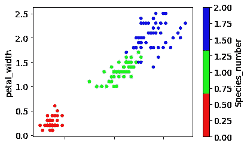

# k 最近邻，它的用途和如何使用它

> 原文：<https://towardsdatascience.com/k-nearest-neighbors-its-purpose-and-how-to-use-it-36fa927acc64?source=collection_archive---------3----------------------->

对于那些不知道 k 最近邻是什么的人来说，这是一个预测模型。它的目的是什么，为什么使用它？这些是我们将在这篇文章中深入探讨的问题。

为了让这个模型工作，数据必须有一个距离的概念。用外行人的话来说，我们需要能够用图表表示我们的数据。

这个模型将是非线性的，可以用在课堂上。我所说的类是指它可以帮助确定一个数据点是属于一个类还是另一个类。一个很好的例子是根据收入和年龄来决定某人是共和党人还是民主党人。该模型将被证明是有用的，因为本质上它查看邻近的数据点来确定这个新数据点将落入什么样的位置。

现在我们知道了为什么这是有用的，让我们给出一个用 python 来做这件事的例子。

这个例子将使用花瓣宽度、花瓣长度、萼片长度和萼片宽度来尝试确定花的分类

```
**import** **pandas** **as** **pd**
url = 'http://archive.ics.uci.edu/ml/machine-learning-databases/iris/iris.data'
col_names = ['sepal_length', 'sepal_width', 'petal_length', 'petal_width', 'species']
iris = pd.read_csv(url, header=None, names=col_names)
```

首先，我导入 pandas(一个 python 库)，然后读入我的数据集并设置列名。这将我的数据放入一个很好的数据框架中，可以很容易地进行分析。

```
**from** **matplotlib.colors** **import** ListedColormap
cmap_bold = ListedColormap(['#FF0000', '#00FF00', '#0000FF']
```

上面的代码块引入了颜色绘图能力。

```
iris["Species_number"] = iris.species.map({'Iris-setosa':0,'Iris-versicolor':1,'Iris-virginica':2 })
```

然后，我制作了一个新的列，将每个物种映射到不同的 bin，bin 为 0、1 或 2。

```
iris.plot(kind = 'scatter', x = "petal_length", y = "petal_width", c ="Species_number" ,colormap= cmap_bold )
```



这显示踏板宽度和花瓣长度，以确定物种。每个物种都有不同的颜色。

```
feature_cols = ['sepal_length', 'sepal_width', 'petal_length', 'petal_width'] 
X = iris[feature_cols]
y = iris.Species_number
```

这使得我们的 X 是萼片长度，萼片宽度，花瓣长度，花瓣宽度。我们的 Y 是有三个箱的物种栏。我们试图使用 X 特征来确定 Y

```
**from** **sklearn.model_selection** **import** train_test_split
X_train, X_test, y_train, y_test = train_test_split(X, y)
```

对于任何一个好的模型，你都需要做一个训练测试来避免过度拟合你的模型。这是把你的数据分成一个训练集，然后是一个测试集来测试你的模型有多好。k 最近邻(也称为 KNN)是一个懒惰模型，这意味着它不使用训练数据点来做任何*泛化。所以*我们不打算训练一个模特。你可能会问，为什么要进行列车试运行？因为我们仍然需要那个测试集来测试这 70%,看看我们的 X 变量是否是好的预测器。

```
**from** **sklearn.neighbors** **import** KNeighborsClassifier
**from** **sklearn** **import** metrics
*# make an instance of a KNeighborsClassifier object*
knn = KNeighborsClassifier(n_neighbors=1)
knn.fit(X_train, y_train)
```

然后我们从 sklearn.neighbors 导入，以便能够使用我们的 KNN 模型。使用 KNeighborsClassifier，然后使用里面的参数确定您希望您的数据点查看多少个最近邻。没有经验法则告诉你应该看多少个邻居。确定要查看多少个相邻要素的最佳方法是测试一系列相邻要素，并确定哪一个具有最佳精度。

```
y_pred_class = knn.predict(X_test) **print** metrics.accuracy_score(y_test, y_pred_class)
```

这将让您看到准确性分数，因为我们只有 1 个最近邻要检查，所以我们的分数最终是 1(也称为 100%)，这有可能被过度拟合。

```
**def** length(X, y):
    empty_list = []
    **for** n **in** range(1,100):
        X_train, X_test, y_train, y_test = train_test_split(X, y)
        knn = KNeighborsClassifier(n_neighbors=(n))
        knn.fit(X_train, y_train)
        y_pred_class = knn.predict(X_test)
        empty_list.append(metrics.accuracy_score(y_test, y_pred_class))
    **return** empty_list
```

该函数将测试 1-100 个最近邻，并返回每个最近邻的精度。这将有助于您为您的模型寻找最佳数量的邻居

一旦您确定了最佳邻居，您就可以在其他数据点上使用您的模型，将它们放入一个类中。

这就是你使用 KNN 的方式，我希望这能帮助那些对预测数据点将属于哪一类感兴趣的人