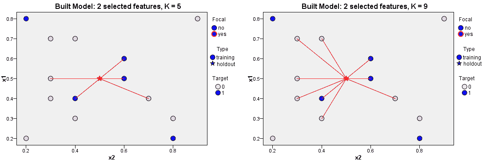
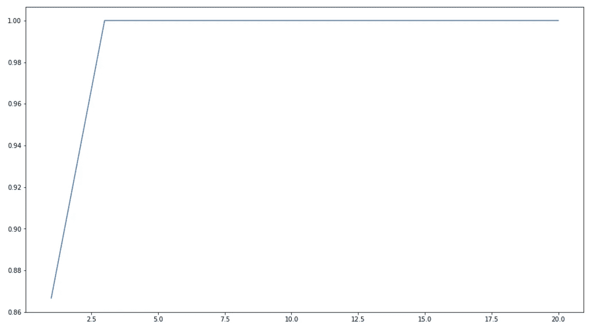

# k 近邻—机器学习算法简介

> 原文：<https://towardsdatascience.com/k-nearest-neighbours-introduction-to-machine-learning-algorithms-18e7ce3d802a?source=collection_archive---------4----------------------->

## 另一种分类算法


## 介绍

我们发现分类算法非常重要而回归算法不太重要的原因是因为我们日常工作中面临的许多问题都属于分类任务。例如，我们想知道肿瘤是恶性的还是良性的，我们想知道消费者对我们出售的产品的反应是积极的还是消极的，等等。k 近邻是另一种分类算法，也是非常简单的一种。如果你在 K 意味着算法之后阅读这篇文章，不要混淆，因为它们属于不同的学习领域。K 均值是一种聚类/无监督算法，而 K 最近邻是一种分类/监督学习算法。

## K 是什么？？

在 K 均值算法中，对于每个测试数据点，我们将查看 K 个最近的训练数据点，并选取最频繁出现的类，并将该类分配给测试数据。因此，K 表示位于测试数据点附近的训练数据点的数量，我们将使用该测试数据点来找到类。

## k 最近邻—伪代码

```
1\. Load the training and test data 
2\. Choose the value of K 
3\. For each point in test data:
       - find the Euclidean distance to all training data points
       - store the Euclidean distances in a list and sort it 
       - choose the first k points 
       - assign a class to the test point based on the majority of      classes present in the chosen points
4\. End 
```



K Nearest Neighbours

## KNN 电码

我们将使用[虹膜数据集](https://www.kaggle.com/jchen2186/machine-learning-with-iris-dataset/data)来说明 KNN 算法。虹膜数据集有四个特征，我们将只使用其中的两个(萼片长度，花瓣长度)。这有助于我们更好地可视化数据点。

我们加载 Iris 数据集，获取目标值并将其存储在一个数组中。我们从数据框中删除目标值和两个不需要的要素。

通过绘制基于这两个特征的数据点，我们获得了如下所示的散点图。


Iris data — Scatter plot

我们将字符串类型中的类转换成整数类型。我们将数据混洗并分成训练和测试数据，90%的数据用于训练，而剩余的 10%用于测试。

我们使用 Scikit-learn 库来实现我们的 KNN 算法。我们取 K 值的范围，从 1 到 20，并根据不同的 K 值绘制我们的 KNN 模型的精确度



K vs accuracy plot

您可以看到，在 K = 3 时，我们能够实现 100%的精度，并且对于更大的 K 值，精度保持不变。现在，我们已经使用 Scikit-learn 库实现了该算法，让我们尝试在不使用 Scikit-learn 的情况下实现 KNN 算法。这将为我们提供对算法如何工作的更好的直观理解。

我们基于上述伪代码实现了该算法。我们使用 K = 3 的值。该模型的准确度也是 100%。

## 结论

k 近邻算法是一种简单的分类算法，具有广泛的应用。了解它的工作原理肯定会有帮助:)