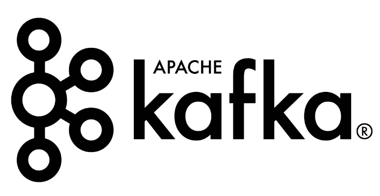
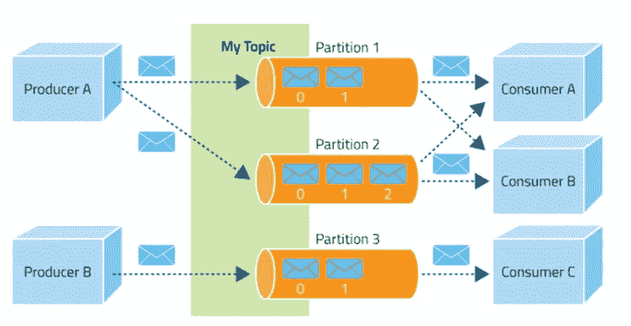
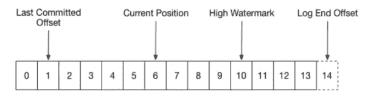

# 卡夫卡-Python 用 10 行代码解释

> 原文：<https://towardsdatascience.com/kafka-python-explained-in-10-lines-of-code-800e3e07dad1?source=collection_archive---------0----------------------->

虽然它不是 Python 提供的最新库，但很难找到关于如何将 Apache Kafka 与 Python 结合使用的全面教程。通过大约十行代码，我将解释**Kafka 的基础以及它与 Kafka-Python** 的交互。



# 设置环境

首先你要在你的机器上安装**卡夫卡和动物园管理员**。对于 Windows 来说，有一个由 Shahrukh Aslam 编写的优秀指南，它们肯定也适用于其他操作系统。

接下来**安装 Kafka-Python** 。如果您使用的是 Anaconda 发行版，那么您可以使用 pip 或 conda 来实现这一点。

```
pip install kafka-pythonconda install -c conda-forge kafka-python
```

在执行下面的示例代码之前，不要忘记启动 Zookeeper 服务器和 Kafka broker 。在这个例子中，我们假设 Zookeeper 在 *localhost:2181* 上运行 default，在 *localhost:9092* 上运行 Kafka。

我们还使用了一个名为 *numtest* 的主题。在本例中，您可以**创建一个新主题**，方法是打开一个新的命令提示符，导航到 *…/kafka/bin/windows* 并执行:

```
kafka-topics.bat --create --zookeeper localhost:2181 --replication-factor 1 --partitions 1 --topic numtest
```

# 卡夫卡是什么？

简而言之，Kafka 是一个分布式发布-订阅消息系统，它以分区和复制的主题维护消息提要。最简单的说，Kafka 生态系统中有三个参与者:生产者、主题(由经纪人管理)和消费者。

制作人根据他们选择的主题制作信息。可以给每个消息附加一个密钥，在这种情况下，生产者保证所有具有相同密钥的消息将到达相同的分区。

主题是日志，它从生产者那里接收数据，并将它们存储在它们的分区中。生产者总是在日志的末尾写新的消息。在我们的例子中，我们可以对分区进行抽象，因为我们在本地工作。

消费者按照自己的节奏阅读他们选择的主题的一组分区的信息。如果消费者是消费者组的一部分，即订阅相同主题的一组消费者，他们可以提交他们的补偿。如果您希望与不同的使用者并行使用一个主题，这可能很重要。



source: [https://www.cloudera.com/documentation/kafka/1-2-x/topics/kafka.html](https://www.cloudera.com/documentation/kafka/1-2-x/topics/kafka.html)

**偏移量是日志中消费者最后消费或读取消息的位置**。然后，用户可以提交该偏移量，使读数成为“官方”读数。偏移量提交可以在后台自动完成，也可以显式完成。在我们的示例中，我们将在后台自动提交。



source: [https://www.confluent.io/blog/tutorial-getting-started-with-the-new-apache-kafka-0-9-consumer-client/](https://www.confluent.io/blog/tutorial-getting-started-with-the-new-apache-kafka-0-9-consumer-client/)

# 让我们编码

在我们的例子中，我们将创建一个**生产者**，它发出从 1 到 1000 的数字，并将它们发送给我们的 Kafka **经纪人**。然后**消费者**将从**代理**读取数据，并将它们存储在 MongoDb 集合中。

使用卡夫卡的好处在于，如果我们的消费者崩溃了，新的或固定的消费者会从上一个消费者停止阅读的地方继续阅读。这是一个很好的方法来确保所有的数据都输入到数据库中，没有重复或丢失的数据。

创建一个名为 *producer.py* 的新 Python 脚本，从我们全新的 Kafka-Python 库中导入 *json* 、 *time.sleep* 和 *KafkaProducer* 开始。

```
from time import sleep
from json import dumps
from kafka import KafkaProducer
```

然后**初始化一个新的卡夫卡制作人**。请注意以下参数:

*   *bootstrap _ servers =[' localhost:9092 ']*:设置生产者应该联系的主机和端口，以引导初始集群元数据。没有必要在这里设置，因为默认设置是 *localhost:9092* 。
*   *value _ serializer = lambda x:dumps(x)。encode('utf-8')* :数据在发送到代理之前应该如何序列化的函数。这里，我们将数据转换为 json 文件，并将其编码为 utf-8。

```
producer = KafkaProducer(bootstrap_servers=['localhost:9092'],
                         value_serializer=lambda x: 
                         dumps(x).encode('utf-8'))
```

现在，我们想生成从 1 到 1000 的数字。这可以通过一个 for 循环来实现，我们将每个数字作为值输入到一个只有一个键的字典中: *number* 。这不是话题键，只是我们数据的一个键。在同一个循环中，我们还将把数据发送给一个代理。

这可以通过**调用生成器**上的 send 方法并指定主题和数据来完成。请注意，我们的值序列化程序将自动转换和编码数据。为了结束我们的迭代，我们休息 5 秒钟。如果您想确保消息被代理收到，建议包含一个回调。

```
for e in range(1000):
    data = {'number' : e}
    producer.send('numtest', value=data)
    sleep(5)
```

如果您想测试代码，建议创建一个新主题并将数据发送到这个新主题。这样，当我们稍后一起测试生产者和消费者时，您将避免在 *numtest* 主题中的重复和可能的混淆。

# 消费数据

在我们开始编码我们的消费者之前，创建一个新文件 *consumer.py* 并从 *pymongo* 导入 *json.loads* 、 *KafkaConsumer* 类和 *MongoClient* 。我不会深入研究 PyMongo 代码，因为这超出了本文的范围。

此外，您可以用任何其他代码替换 mongo 代码。这可以是将数据输入到另一个数据库的代码，处理数据的代码或者任何你能想到的代码。关于 *PyMongo* 和 MongoDb 的更多信息，请查阅[文档](https://api.mongodb.com/python/current/)。

```
from kafka import KafkaConsumer
from pymongo import MongoClient
from json import loads
```

让我们**创造我们的 KafkaConsumer** 并仔细看看这些论点。

*   第一个参数是主题，在我们的例子中是 *numtest* 。
*   *bootstrap _ servers =[' localhost:9092 ']*:与我们的生产者相同
*   *auto _ offset _ reset = ' earliest '*:最重要的参数之一。它处理消费者在故障或关闭后重新开始阅读的位置，并且可以设置为最早*最早*或最晚*最晚*。当设置为*最新*时，用户从日志末尾开始读取。当设置为*最早*时，消费者从最新提交的偏移开始读取。这正是我们想要的。
*   *enable _ auto _ commit = True*:确保消费者每隔一段时间提交一次读取偏移量。
*   *auto _ commit _ interval _ ms = 1000 ms*:设置两次提交的时间间隔。因为每五秒钟就有一条消息进来，所以每秒钟提交一次似乎是公平的。
*   *group_id='counters'* :消费者所属的消费群。请记住，在介绍中，消费者需要成为消费者组的一部分，以使自动提交工作。
*   值反序列化器将数据反序列化为一种通用的 json 格式，与我们的值序列化器所做的相反。

```
consumer = KafkaConsumer(
    'numtest',
     bootstrap_servers=['localhost:9092'],
     auto_offset_reset='earliest',
     enable_auto_commit=True,
     group_id='my-group',
     value_deserializer=lambda x: loads(x.decode('utf-8')))
```

下面的代码连接到我们的 MongoDb 数据库的 *numtest* 集合(集合类似于关系数据库中的表)。

```
client = MongoClient('localhost:27017')
collection = client.numtest.numtest
```

我们可以通过循环从消费者那里提取数据(消费者是可迭代的)。消费者会一直听下去，直到代理不再响应。可以使用 value 属性访问消息的值。这里，我们用消息值覆盖消息。

下一行将数据插入我们的数据库集合。最后一行打印了一条确认消息，表明该消息已被添加到我们的集合中。注意，可以在这个循环中为所有动作添加回调。

```
for message in consumer:
    message = message.value
    collection.insert_one(message)
    print('{} added to {}'.format(message, collection))
```

# 测试

让我们测试我们的两个脚本。打开命令提示符，转到保存 *producer.py* 和 *consumer.py* 的目录。执行 *producer.py* ，打开一个新的命令提示符。启动 *consumer.py* ，看看它如何读取所有消息，包括新消息。

现在中断消费者，记住它是哪个号码(或者在数据库中检查它)并重新启动消费者。请注意，消费者会拾取所有错过的消息，然后继续收听新消息。

请注意，如果您在阅读消息后 1 秒钟内关闭消费者，消息将在重新启动时再次被检索。为什么？因为我们的 *auto_commit_interval* 被设置为 1 秒，记住如果偏移量没有被提交，消费者将再次读取消息(如果 *auto_offset_reset* 被设置为最早)。

—请随时在评论中或私信中向我指出任何不一致或错误。—

# 承认

本文绝不是 Kafka 或 Kafka-Python 的完整指南，而是一个全面的介绍，它将使您熟悉 Kafka 的基本概念以及如何用有用的 Python 代码来转换这些概念。

对于更高级的主题，建议阅读文档。如果你想部署代码，看看 Russell Jurney 的 *Confluent-Kafka* 和[这篇文章](https://blog.datasyndrome.com/a-tale-of-two-kafka-clients-c613efab49df)可能是个好主意。

# 来源

[Kafka-Python 文档](https://kafka-python.readthedocs.io/en/master/index.html)

[使用 Kafka-Python 的反序列化器消费来自 Kafka 的 JSON 消息](https://medium.com/@mukeshkumar_46704/consume-json-messages-from-kafka-using-kafka-pythons-deserializer-859f5d39e02c)

[阿帕奇卡夫卡文档](https://kafka.apache.org/documentation/)

[Cloudera Kafka 文档](https://www.cloudera.com/documentation/kafka/1-2-x/topics/kafka.html)

[使用 Apache Kafka:构建流媒体平台实用指南](https://www.confluent.io/blog/stream-data-platform-1/)

[介绍 Kafka 消费者:开始使用新的 Apache Kafka 0.9 消费者客户端](https://www.confluent.io/blog/tutorial-getting-started-with-the-new-apache-kafka-0-9-consumer-client/)