# 环游世界

> 原文：<https://towardsdatascience.com/kaggle-around-the-world-ccea741b2de2?source=collection_archive---------10----------------------->

The World Clock at Alexanderplatz, Berlin

不言而喻，数据科学家、机器学习工程师和 AI 研究人员的数量在全球并不是平均分布的。有各种各样的指标可以用来了解国家和大陆之间的机器学习差距有多大。例如，来自深度学习 Indaba 的人们使用神经信息处理系统年度会议(NeurIPS 以前的 NIPS)上被接受的论文数量来观察[当代机器学习景观中缺失了两个完整的大陆:南美和非洲](https://goo.gl/yec14p)。

我们可以通过查看关于 [**Kaggle**](https://www.kaggle.com) 的现有数据来做类似的工作。如果你不知道，Kaggle 是一个在线平台，用户可以在那里找到并发布数据集。它还举办不同的机器学习比赛，吸引了一千多个团队和个人。由于 Kaggle 在数据科学人士中非常受欢迎，因此将其作为每个国家的数据科学社区的代理并不为过。我们想在这里解决的主要问题如下:*我们能看到来自不同大陆的机器学习/数据科学社区之间的明显差异吗？这些差异仅与绩效相关吗？还是仅仅是社会经济差异，反映了国家和大陆之间现存的不平等？*

为了回答这些问题，我们将使用两个来源:

*   **排名用户数据集**:由爬虫获取并由 [Norconsult](http://kagglerank.azurewebsites.net/) 智能显示的 Kaggle 用户数据。
*   **Kaggle 第二次年度机器学习和数据科学调查** [**(ML & DS 调查)**](https://www.kaggle.com/kaggle/kaggle-survey-2018):ka ggle 进行的一项调查，共有来自不同国家的 23859 人参与。

第一个数据集将帮助我们了解每个大陆*在 Kaggle 中的表现*；第二个将引导我们看到不同 ML/DS 社区的*相关特征*。本分析中使用的所有代码和数据均可在[这里](https://www.kaggle.com/felsal/kaggle-around-the-world)找到。

# 衡量绩效

排名用户数据集是通过从 Kaggle 的网站上抓取位置数据获得的。Kaggle 有不同类别的专业知识。我们将只与其中一个合作:*竞争。*在这个类别中有五个表现等级:新手、贡献者、专家、大师和特级大师。*分级用户是专家级或更高级别的用户*。

查看数据，我们可以看到每一行代表一个排名用户。栏目有:*报名日期*、*当前积分*、*当前排名*、*最高排名*、*国家*和*洲。*在 Kaggle 中，积分和排名会随着时间而变化。所以，这里代表的所有位置只对应一个特定的时间点(2018 年 8 月左右)。

## 全球排名用户

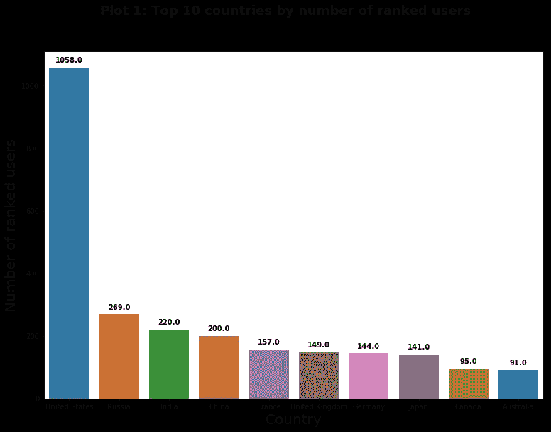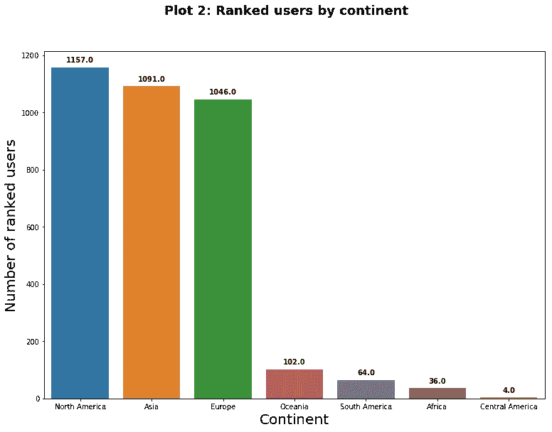

需要注意的是，这些地块并不完整，总排名用户(1267 个用户)中有 **26.6%** 没有公开他们的位置。

看着**情节 1** 很明显，美国是排名用户最多的国家，遥遥领先。如果你把美国从这里列出的国家名单中去掉，差距就没那么大了。

**剧情二**显示有两组截然不同的大陆:一边是北美、亚洲和欧洲(**第一组**)；另一边，大洋洲，南美，非洲，中美洲(**第二组**)。第一组负责 Kaggle 所有排名用户的 **69.1%** ，因此第二组仅保留排名用户的 **4.3%** 。

使用每个用户的注册日期，我们可以看到世界上不同地区在 Kaggle 内部是如何发展的:

我们也可以看到每个国家的演变:

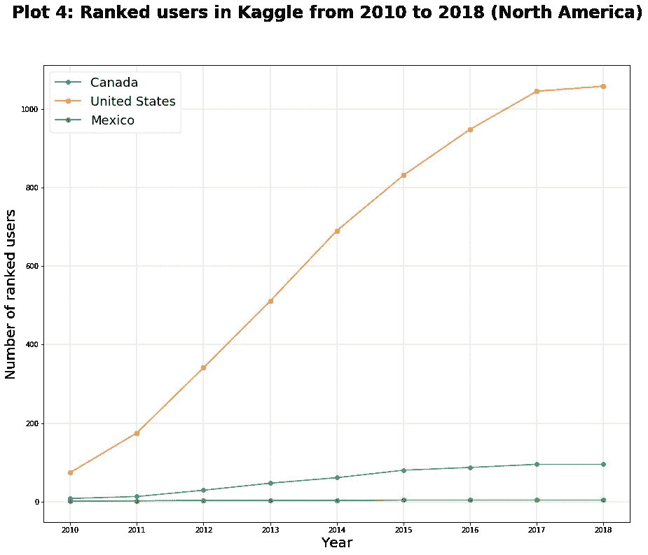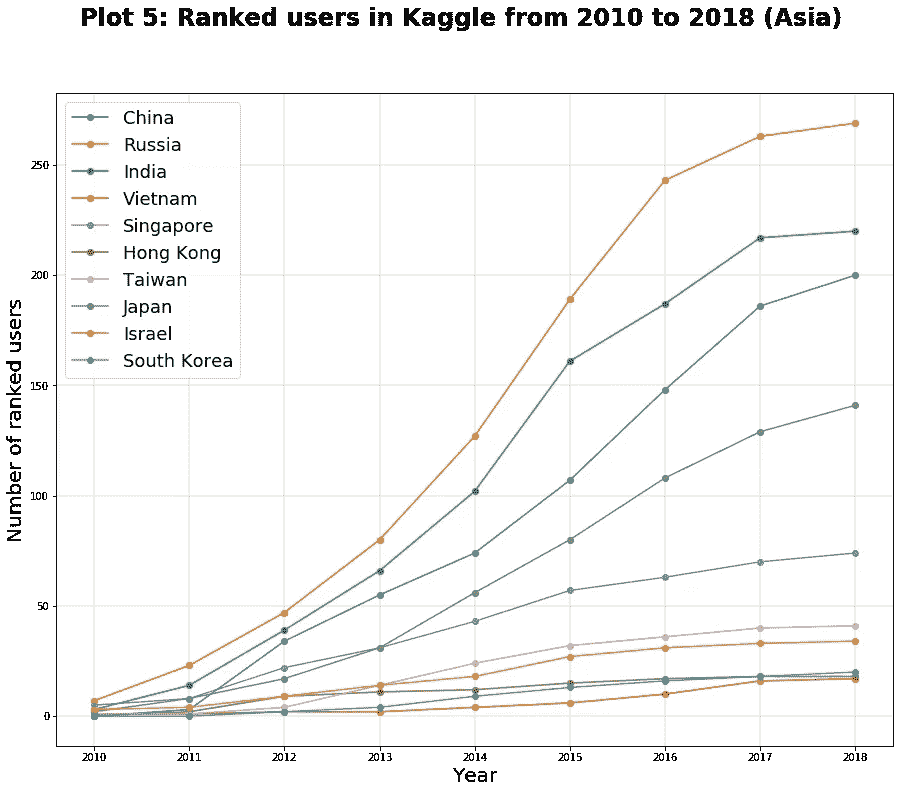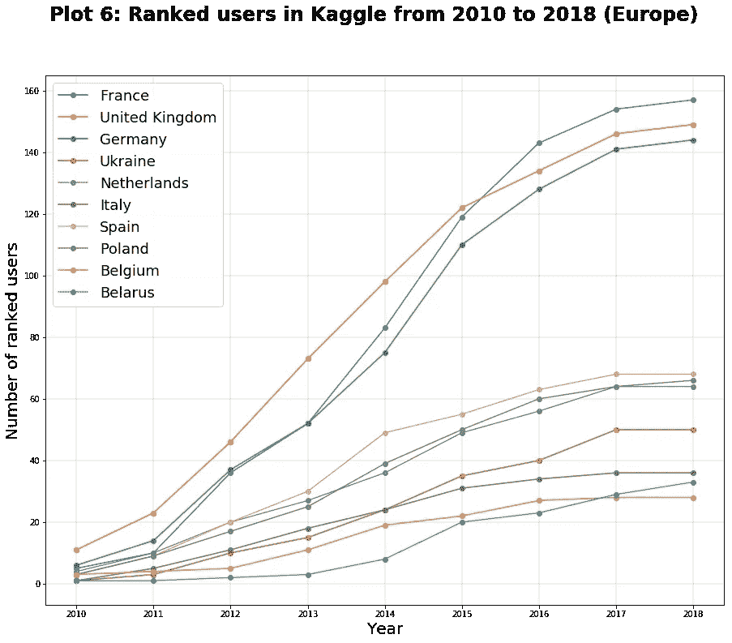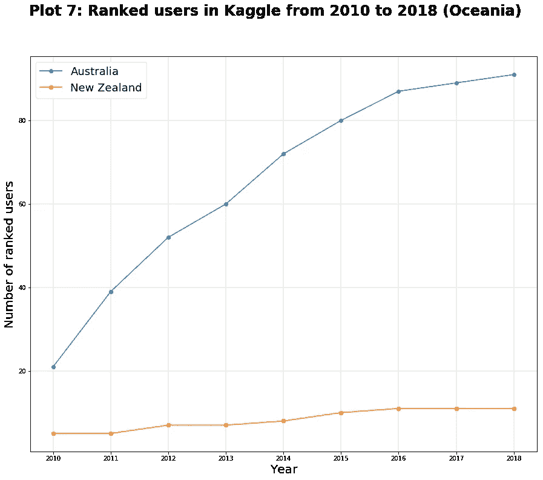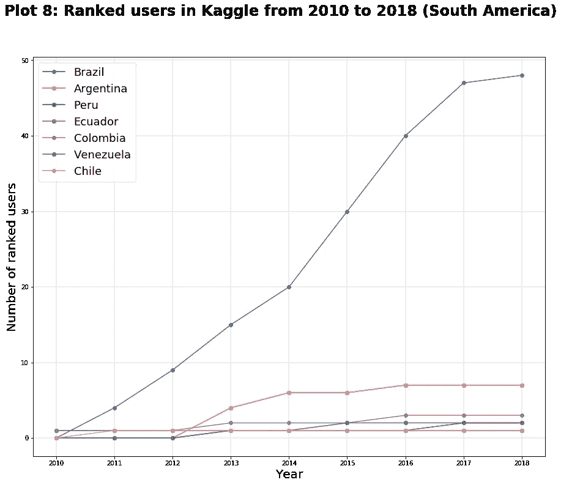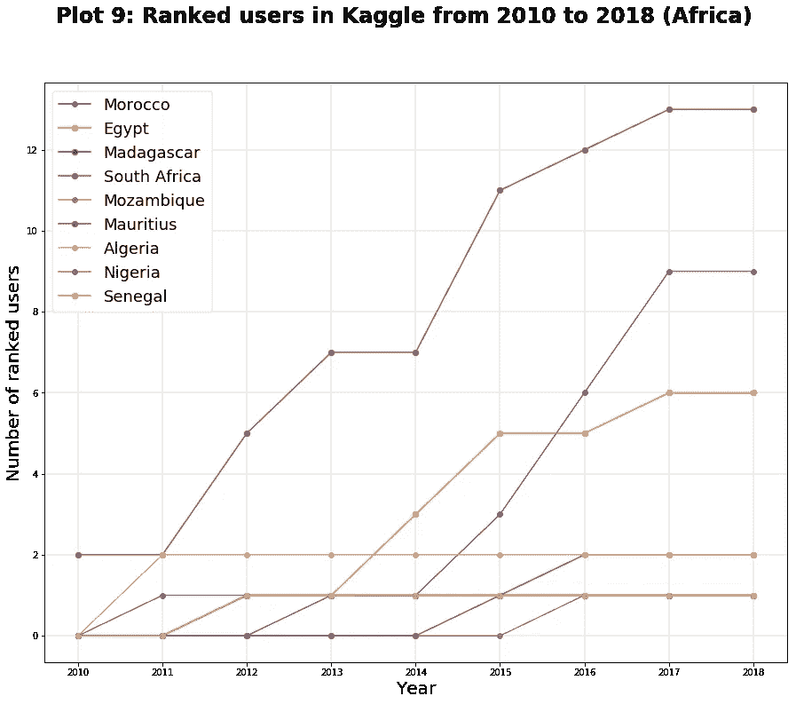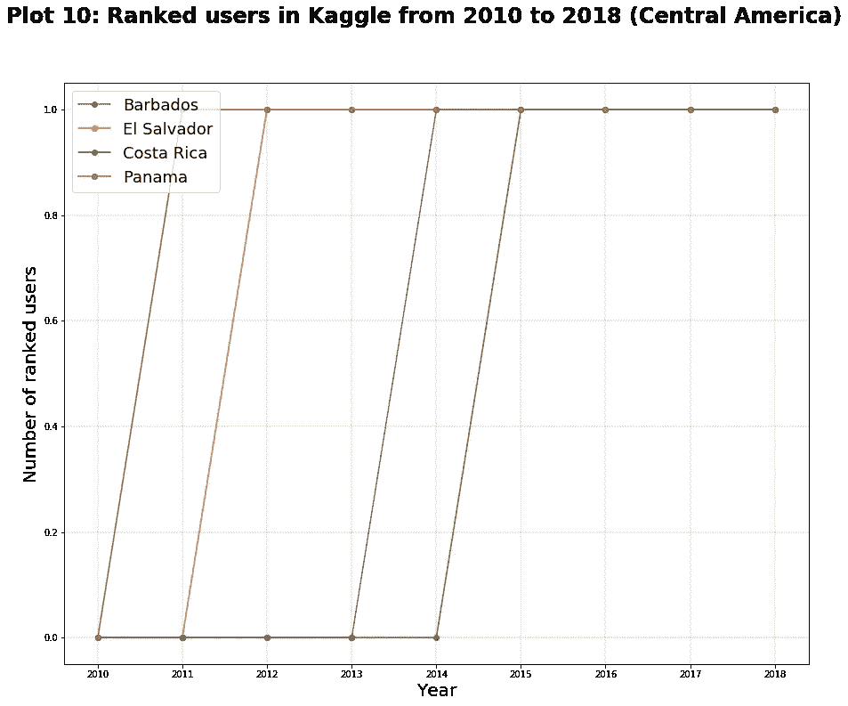

**剧情 3** 清晰地展现了两组大陆的差异。这里需要注意的一点是，尽管欧洲一直主导着亚洲，但在 2016 年，后者开始缩小它们之间的差距，从 2017 年开始，亚洲的排名用户开始超过欧洲。

**图 4–10**显示了每个区域的动态。在北美、亚洲、大洋洲、南美和非洲，我们可以清楚地看到一个国家统治着其他国家:分别是美国、俄罗斯、澳大利亚、巴西和南非。中美洲国家拥有相同数量的用户(每个国家只有一个)。在欧洲，我们可以看到法国、英国和德国争夺第一的位置。

## 点数和等级

Kaggle 有一个积分系统。它们被设计成随着时间的推移而衰减。所以它们只反映了收集数据时的卡格尔地貌。将特定国家的每个用户的积分相加，我们得到了以下图表:

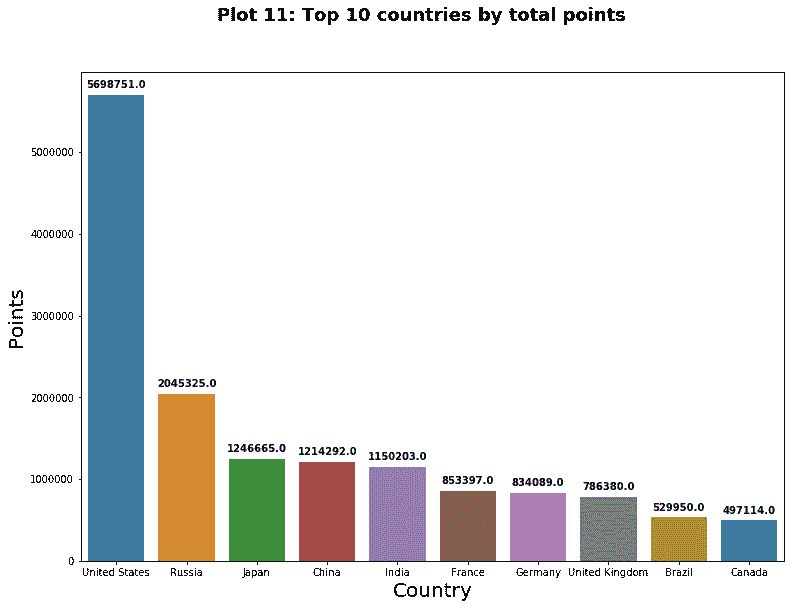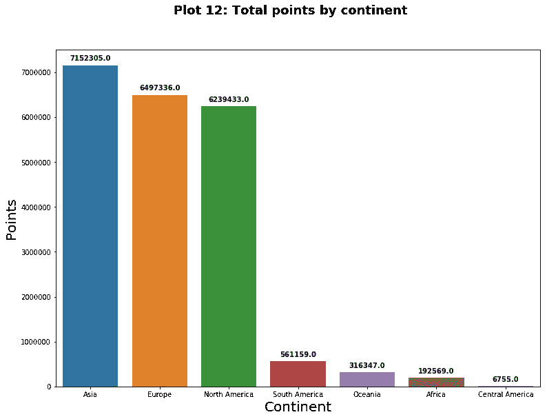

**剧情 11** 展示了一个与**剧情 1** 相似的场景，这里唯一大的不同是巴西的出现(把澳洲排除在名单之外)。这是来自这个国家的一些高排名用户的影响(在收集数据时，第一名属于一个巴西用户)。

在**第 12 集**中可以看出的一点是，亚洲和欧洲的分数都比北美高。记住我们在**剧情 2** 中看到的，北美是排名用户最多的大陆。点衰减解释了**图 2** 和**图 12** 之间的差异。当我们分析排名信息时，这一点就会变得清楚。

在该数据中，我们有每个排名用户的*当前排名*以及他/她曾经达到的*最高排名*。为了比较国家和大洲，我们可以使用以下得分函数:

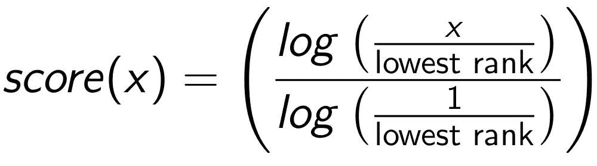

Figure 1: score function

该函数返回一个分数，最高等级的用户得到 1 分，最低等级的用户得到 0 分，对于两者之间的任何人，它返回一个区间(0，1)内的实数。

将各大洲的得分相加，我们得到:

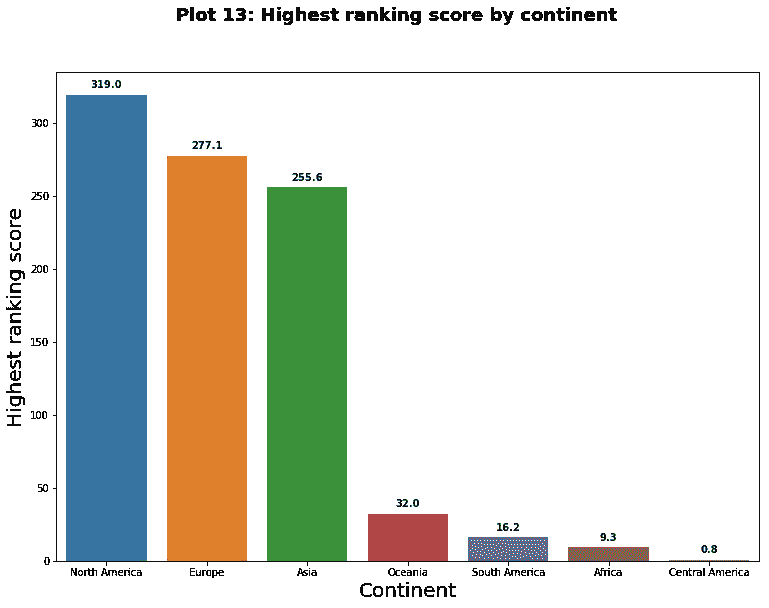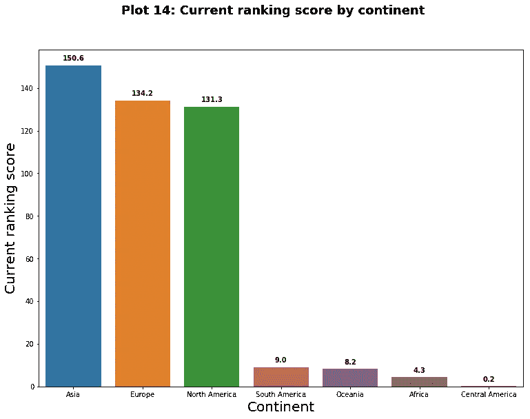

如果我们比较**图 13** 和**图 14** 的差异，我们会看到以下情况:北美呈现最高的*最高排名分数*，因为来自该大陆的许多排名用户在过去的*中取得了不错的排名，但是当我们查看*当前排名分数*时，亚洲和欧洲的表现更好。同样，当我们查看第 2 组时，我们可以看到南美洲拥有*目前*该组大陆中的最佳成绩，大洋洲位居第二。*

*这里的关键事实是，在某个时间点，来自亚洲和欧洲的用户在机器学习竞赛中变得更好，并取代了北美的位置。根据这些数据，我们不能说确切的时间。但是转变是明显的。*

# 仔细观察每个社区

通过提出各种有趣的问题，ML & DS 调查对每个国家的机器学习社区进行了丰富的描述。为了简洁起见，我们只把重点放在一些具体问题上。所选问题反映的被试者的地域差异通常更为突出:*年龄*，*正规教育*，*年使用机器学习*，*年报酬*和*使用技术*。

## ML & DS 调查的地理分布

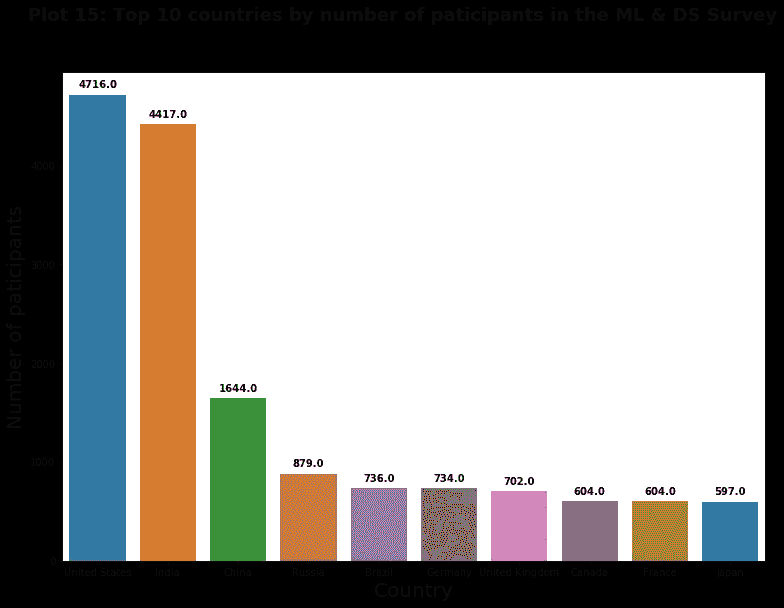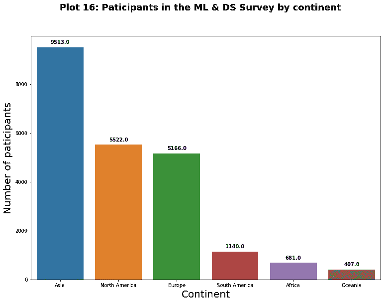

与**图 1** 和**图 2** 相比，**图 15** 和**图 16** 显示了不同的分布。我们可以看到，有大量来自印度的参与者，使亚洲成为调查中最具代表性的大陆。请注意*这里没有中美洲国家的代表*。与已排名的用户数据相比，我们没有公开其位置的用户百分比更低:参与者的 6%**(1430)。**

## 将响应作为分布进行分析

参与者被问及一系列选择题(我们没有分析调查中的开放式问题)。在这里，我们将按大洲显示一些答案，为了有助于形象化，我们将打破显示第**组 1** (亚洲、北美和欧洲)和第**组 2** (南美、非洲和大洋洲)的大洲的图表。

当我们按洲汇总多个答案时，我们在这些答案上构建了一个*分布*。比较大陆之间差异的一种方法是比较它们各自分布之间的差异。为此，我们将利用[库尔贝克-莱布勒散度](https://en.wikipedia.org/wiki/Kullback%E2%80%93Leibler_divergence):

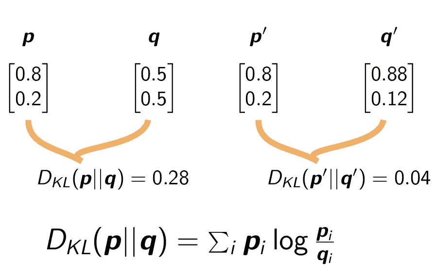

当 p 与 q 同分布时，DKL(p || q)的值为 0，当它们不同时，DKL(p || q) > 0。DKL(p || q)的值随着 p 和 q 之间的散度的增加而增加。我们可以在 DKL(p || q)之上定义一个距离度量*如下:*

distance k1(p，q) = DKL(p || q) + DKL(q || p)

因此，对于每个问题，我们可以构建一个距离矩阵来观察每个大陆之间的差异。

问:“你的年龄是多少岁？”

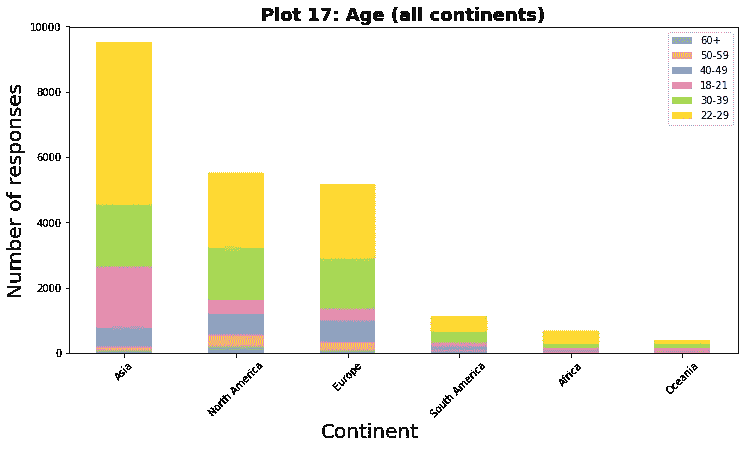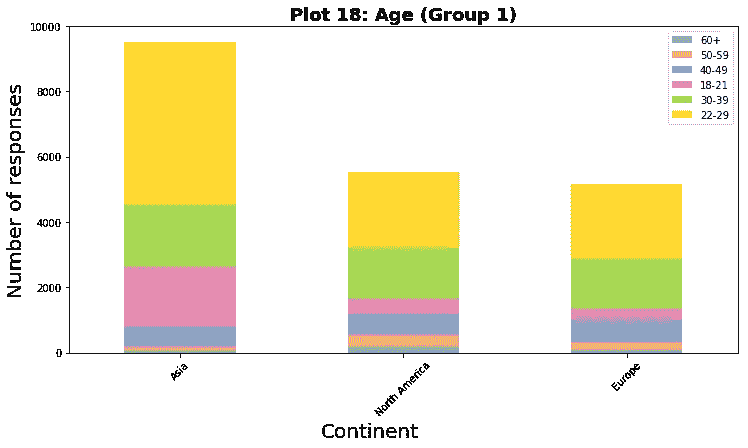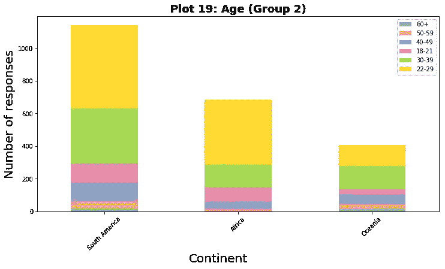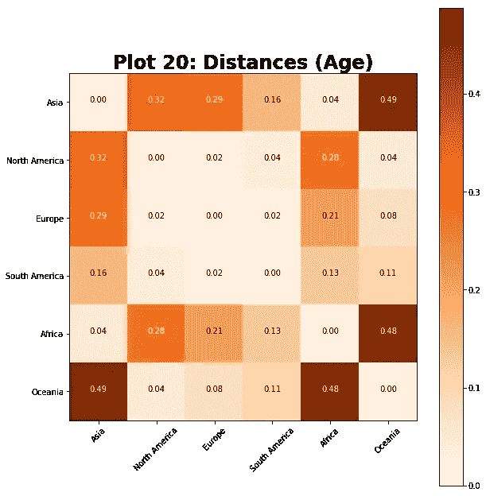

从图 17–19 中可以看出，本次调查中的绝大多数年轻人来自亚洲(大部分来自印度)。客观地看，来自印度的自称 18 到 21 岁的人数(1225)比来自南美的所有参与者的人数(1140)都多。

另一个值得注意的事实是，据报道 40 岁或以上的人很少来自非洲(在 40 岁以上的人群中，只有 1.8%来自非洲)。当我们观察第 20 幅图时，我们可以看到大洋洲和亚洲在年龄上的巨大差异。前者比后者拥有更多的老年 Kaggle 用户。

**问:“你已经达到或计划在未来两年内达到的最高正规教育水平是什么？”**

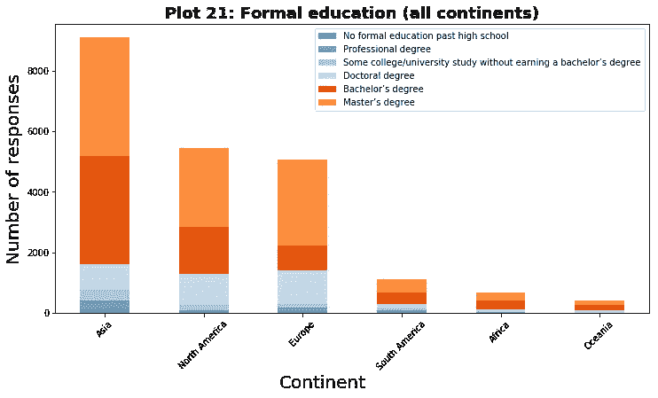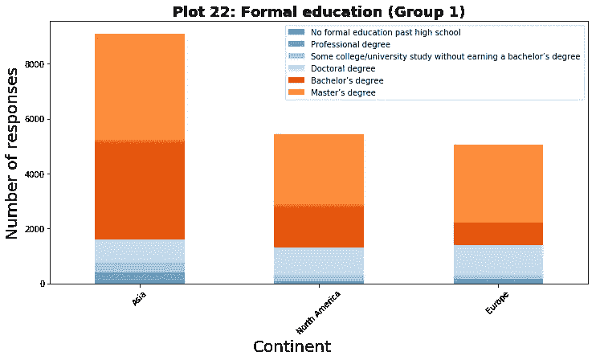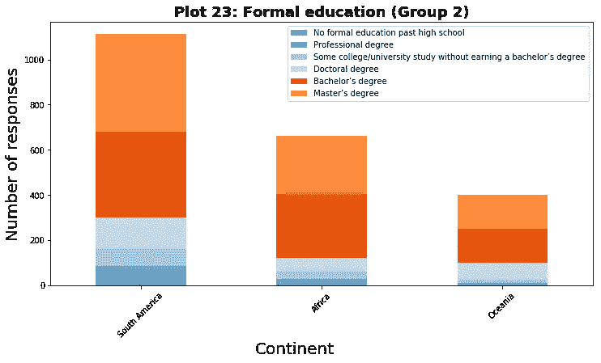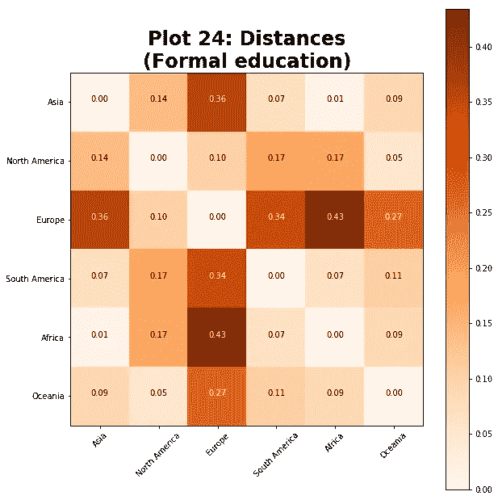

在**图 21–23**中，最引人注目的事实是来自欧洲的 Kaggle 用户中拥有或计划拥有研究生学位的人数。欧洲集中了大部分拥有博士学位的用户(1083)，而 **77.5%** 的欧洲用户已经或计划拥有硕士或博士学位。正如**图 24** 所示，欧洲与几乎所有大陆都有很大差异(北美是唯一的例外)。

问:“你使用机器学习方法(在工作中或在学校)有多少年了？”

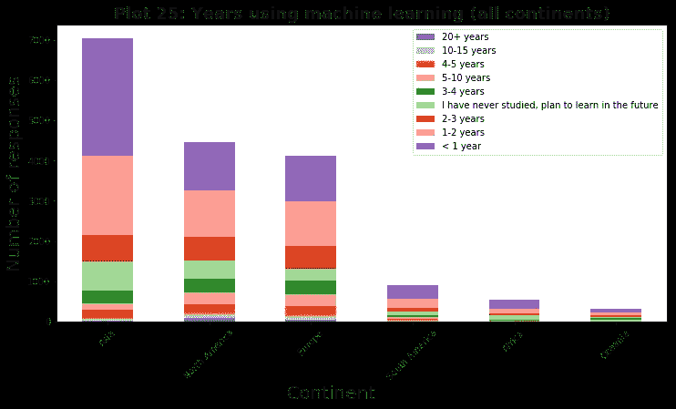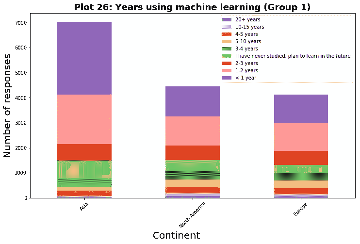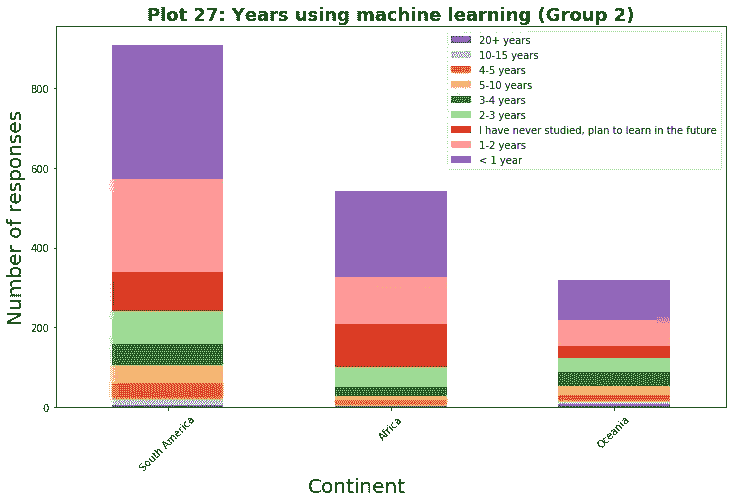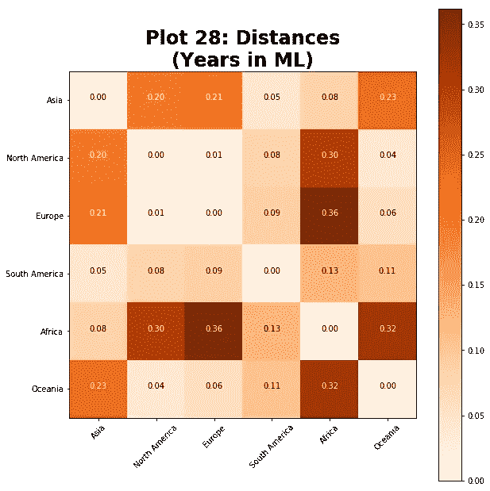

**图 25–27**显示了与图 17–19 中呈现的场景相似的场景:亚洲集中了大量的 ML 新手用户，主要是由于印度；北美和欧洲拥有最多的经验用户(在所有拥有 5 年以上 ML 经验的人中，**39.7%**在北美， **36.6%** 在欧洲)；而非洲只有 1.2%的 ML 老兵。我们在**剧情 24** 中首次发现的欧洲和非洲之间的差异再次出现在**剧情 28** 中。这可以用正规教育和使用机器学习的年数之间的正相关来解释。

问:“你目前的年薪是多少(大约美元)？”

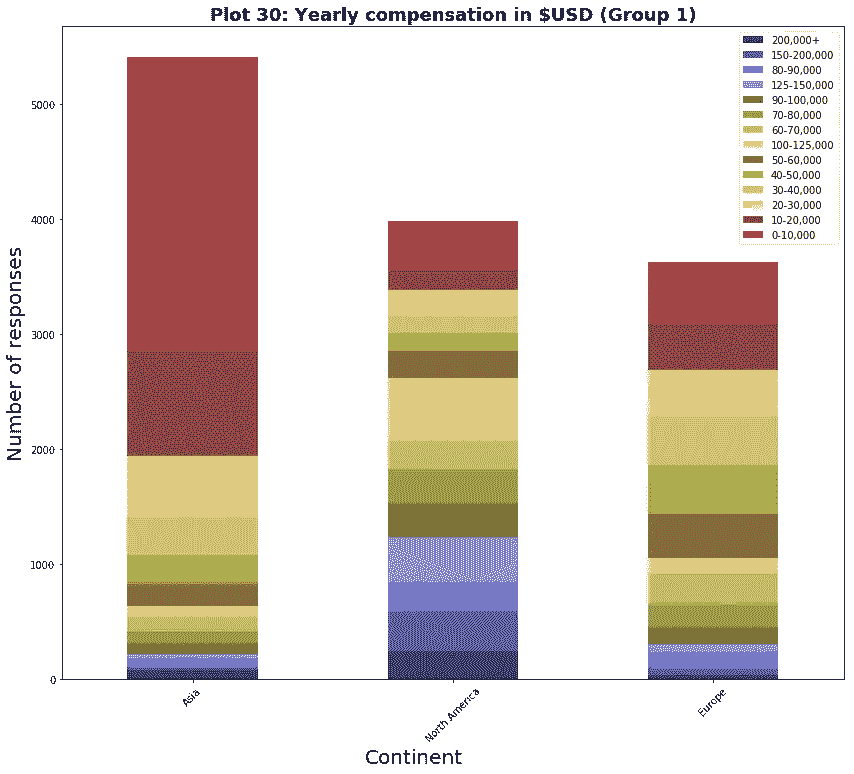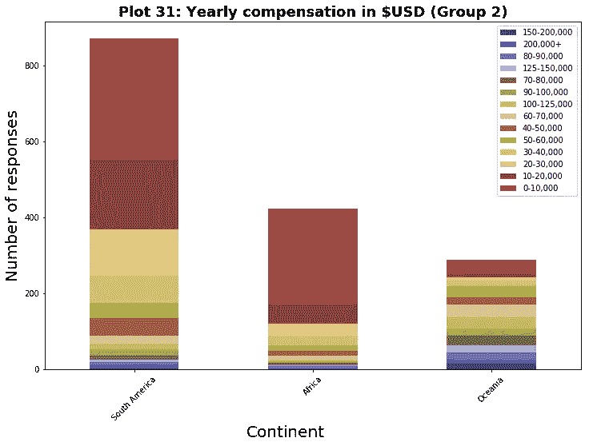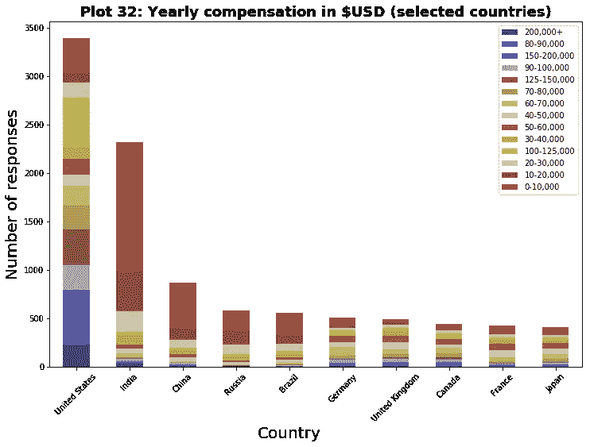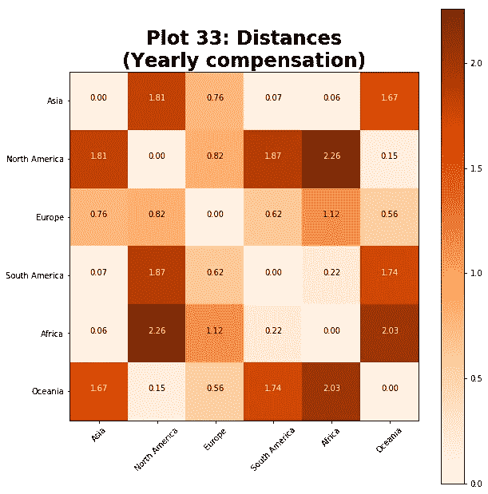

当我们看到薪酬的差异时，各大洲之间的差距就非常明显了。**图 33** 显示了整个内核中 KL 距离的最高值！北美明显不同于世界其他地区。从这个具体答案的 KL 距离上，我们也可以看到两个遥远的群体:一边是北美、欧洲、大洋洲；另一边是南美、亚洲和非洲。另一种方法是看数字。一个极端是，高薪工作集中在北美，收入超过 125，000 英镑的人中有 68.8%来自美国。另一方面，南美洲、亚洲和非洲总共集中了 **75.9%** 报告年度薪酬最低的所有用户。

## 问:在过去 5 年中，您在工作或学校中使用过以下哪些云计算服务？

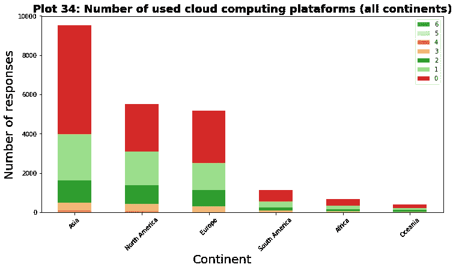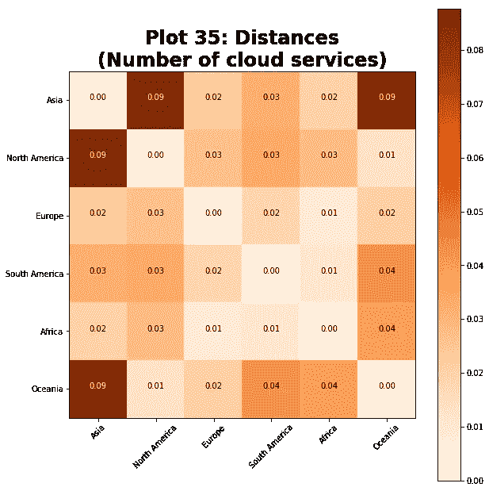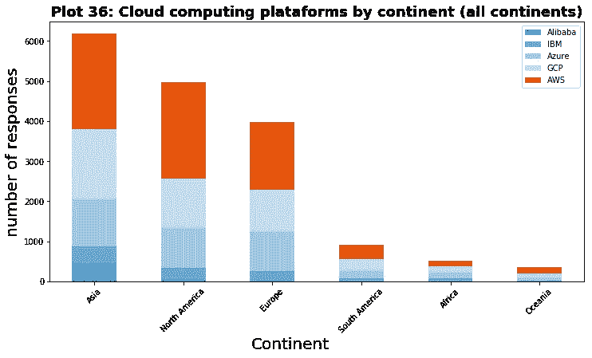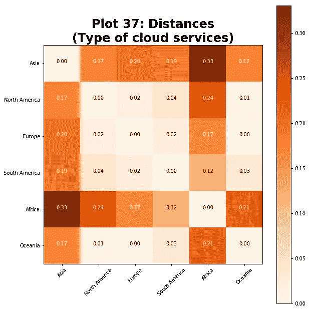

对技术的获取塑造了每个 ML/DS 社区的潜力。幸运的是，关于云计算服务的数量，我们在世界各地看到了相同的模式( **Plots 34** 和 **35** )。我们可以观察到的唯一显著差异是，亚洲使用的服务类型有很小的差异，报告使用阿里云服务的绝大多数用户来自亚洲( **Plots 36** 和 **37** )。

## 问:在过去的 5 年里，你使用过哪些机器学习框架？

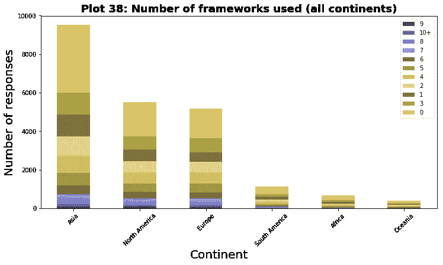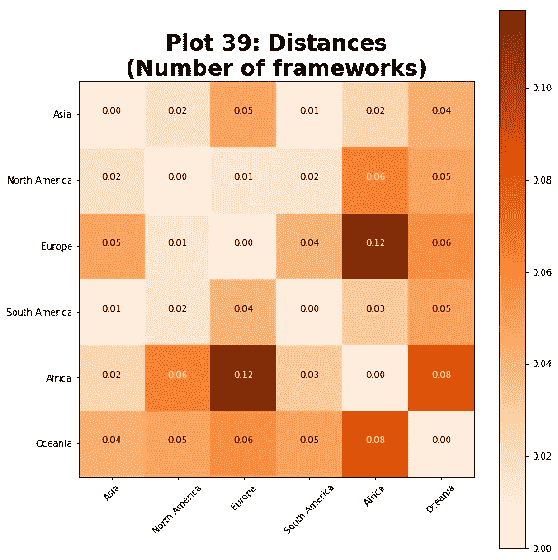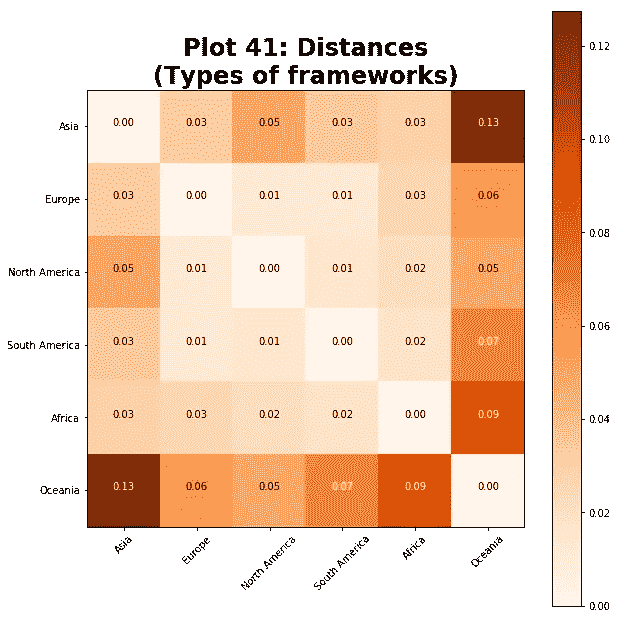

与**图 34–37**中呈现的结果类似，**图 38–41**中传达的信息是，就机器学习框架的使用而言，各大洲之间存在微小差异。

# 最后的想法

根据我们的分析，出现了两个不同的大陆群:**第 1 群**(亚洲、北美和欧洲)和**第 2 群**(南美、非洲、大洋洲和中美洲)。这种区分是基于*用户数量*、*点数*和*排名位置*(一种*基于业绩的*区分)。但是，正如 ML & DS 调查所显示的，这些群体的大陆之间没有社会经济的统一。如果我们采用 KL 距离度量，我们可以定义另外两个更一致的组:**组 3** (北美、欧洲和大洋洲)和**组 4** (非洲、亚洲、南美洲和中美洲)。

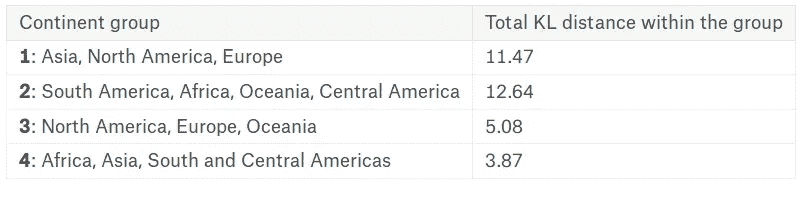

KL distance table by continent groups

这不应该被视为意外，当我们按人均国内生产总值对各大洲进行排名时，第 3 组和第 4 组也出现了。看起来 ML & DS 调查是世界现实的反映，就像它应该的那样。

幸运的是，我们还可以推导出一些*非平凡的结论*。

第一个是，亚洲目前在 Kaggle ( **Plots 12** 和 **14** )中扮演着核心角色，正如 ML & DS 调查显示的那样，*它在未来将继续扮演重要角色。一大群年轻数据科学家属于这个大陆，大部分来自印度。虽然印度在调查中有很好的代表性，但它不应该被高估。正如图 11 所示，与印度相比，俄罗斯、日本和中国目前在比赛中表现更好。*

第二个是*技术的使用在不同的 ML/DS 社区中非常相似*。虽然电力、计算机和互联网的接入因洲而异，但我们没有发现云服务和机器学习框架的数量和类型存在巨大差距(**Plots 34–41**)。看起来这些技术的使用已经相当大众化了，至少在 Kaggle 用户中是这样。

回到启发我们分析的博文(来自深度学习 Indaba 的那篇)，我们看到了关于南美和非洲的更光明的前景。这些大陆并没有在 Kaggle 景观中消失(唯一真正消失的是中美洲)。*他们在场，他们竞争*，南美领先**第 3 组** ( **第 12 地块**和**第 14 地块**)。但是他们仍然有很多问题(因为我来自巴西，这些问题切中要害)。南美洲是一个经济规模可观的大洲(该洲的人均 GDP 大于亚洲)，然而*来自该洲的排名用户数量与来自荷兰的排名用户数量相同* (64)。这是一个令人震惊的小数字。非洲仍然面临许多困难。当我们看一些重要的社会经济特征时，如正规教育、从事机器学习的年限和每年的薪酬，*最高的 KL 距离是在* ***组 3*** *的一个大陆和非洲* ( **地块 24** 、 **28** 和 **33** )。

归根结底，我们面临的最大挑战不是最新的 Kaggle 竞赛，而是我们社区的改善和培育。