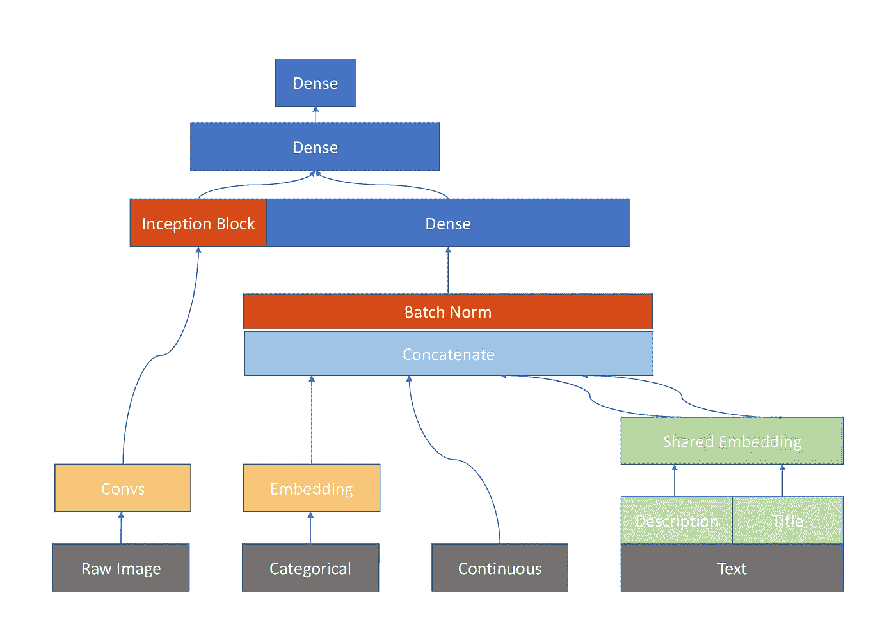

# Kaggle Avito 需求挑战:第 18 名解决方案—神经网络

> 原文：<https://towardsdatascience.com/kaggle-avito-demand-challenge-18th-place-solution-neural-network-ac19efd6e183?source=collection_archive---------3----------------------->

前几天刚和队友在俄罗斯广告公司 Avito 主办的一场 Kaggle 比赛中获得银牌，以第 18 名结束。这项挑战的目标是根据他们提供的数据预测在线分类广告的需求。在这篇文章中，我将说明我的方法，我专门研究的神经网络(NN)(我的队友主要负责基于树和其他线性模型)。然后，我将谈谈我从顶级赢家的解决方案中学到的经验。

# 我的方法

NN Structure

如上图所示，我的神经网络模型由 4 个不同的模块组成，这些模块使用组织者提供的所有数据，图像、分类、连续和文本数据。我将在下面的段落中解释每一部分。

## 连续的

这是最不令人惊讶的部分。连续特征的输入张量直接与其他模块连接。需要注意的一点是处理空值。对于缺失的连续数据，我要么填 0，要么填平均值。

## 绝对的

对于分类数据，嵌入层用于学习这些离散值的潜在表示。我知道这可能不是一个新的想法，但这是我第一次使用分类嵌入，因为我从来没有使用 NN 来处理结构化/表格数据。范畴嵌入的概念类似于单词嵌入。类别值被映射到可学习的嵌入向量上，使得这些向量包含潜在空间中的含义。这有助于避免一次性编码分类特征的稀疏性，提高模型的性能。

## 文本

我的神经网络的文本部分比其他顶级赢家的方法相对简单。没有复杂的递归单元或卷积层，也没有使用预先训练的嵌入。我不知道为什么，但它们都不适合我的神经网络模型。这里唯一的技巧是使用一个共享的嵌入层，受 Mercari 挑战赛中第二名解决方案的启发。基于相同的嵌入矩阵嵌入两个文本条目，标题和描述。它不仅有助于加快神经网络的训练，而且还导致更快的收敛和更低的损失。

## 图像

我对图像数据的第一种方法是使用预先训练的 ImageNet 模型来提取有或没有这些模型头部的特征。我试过 ResNet50 和 InceptionV3 不幸的是，它们都不起作用。在比赛还有 2 周的时候，有人在论坛上说他的模型包括几个卷积层来训练原始图像和其他特征。因此，我开始重写我的代码，以便它利用一个生成器来读取图像和表格数据，因为不可能将所有图像数据加载到 RAM 中。在尝试了一些结构后，我发现 1 个 InceptionV3 单元+几个卷积层最适合我(因为我在 GCP 上只有一个 K80 GPU，所以需要很长时间来验证几次实验的结果)。

# 从顶级解决方案中吸取的经验教训

1.  第一位置 NN 解决方案也遇到了从大多数预先训练的 ImageNet 模型中提取的特征的较差性能。他们最终使用了 VGG 顶层+ ResNet50 中间层。他们的方法与我之前的方法最大的不同是，在提取的图像特征与其他条目连接之前，他们应用了平均池并添加了密集层。
2.  类别特征交互:连接两个类别特征，并将其视为一个新特征。
3.  无监督学习:使用自动编码器从分类数据中提取向量。
4.  验证策略:注意每个折叠之间的重叠特征值应该类似于训练/测试分割的特征值。(特别是本次比赛中的用户 id)
5.  损失函数:所有前 3 名的解决方案都使用二元交叉熵作为损失函数，而我在整个比赛中使用 MSE。我应该尝试更多的损失函数，如 BCE 和 Huber 损失。
6.  堆叠:我们在比赛结束前一周开始堆叠，所以我们只有几个浅堆叠的基础模型。几乎所有的顶级解决方案都使用了大量的模型进行更宽更深的堆叠(第二名获奖者使用了 6 层…)

我在这场比赛中玩得很开心。我要感谢我的队友，所有公开分享他们想法/解决方案的人。我从你身上学到了很多！我也要感谢 Kaggle 和主办方举办了这样一场伟大的比赛。没有你，我就无法提高我的机器学习技能。

如果想了解更多我的解决方案，可以参考这个 [Github repo](https://github.com/khuangaf/Kaggle-Avito-NN) 。