# Kaggle 星球大赛:如何登陆前 4%

> 原文：<https://towardsdatascience.com/kaggle-planet-competition-how-to-land-in-top-4-a679ff0013ba?source=collection_archive---------2----------------------->

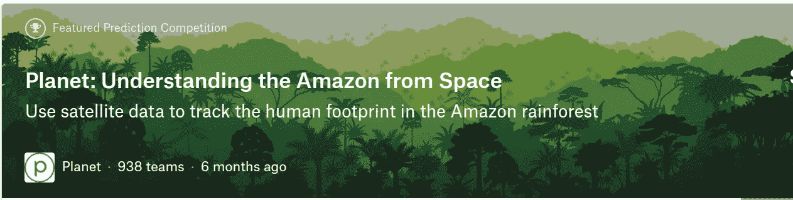

在这篇博文中，我们将学习如何在著名的 Kaggle 竞赛“[星球:从太空了解亚马逊](https://www.kaggle.com/c/planet-understanding-the-amazon-from-space)”中取得世界级的成绩。

*博客中使用的技术是通用的，可以应用于任何其他需要物体检测的问题。这些技巧都在*[***fast . ai deep learning MOOC***](http://forums.fast.ai/t/unofficial-release-of-part-1-v2/9285)*中有所教授。在本教程中，我们将使用基于 PyTorch 构建的*[*fastai*](https://github.com/fastai/fastai)*deep learning 库。*

# 下载比赛数据

让我们开始吧，登录 Kaggle 账号，前往[竞赛页面](https://www.kaggle.com/c/planet-understanding-the-amazon-from-space)，接受竞赛规则，前往*数据*标签，下载以下文件。

*   *sample _ submission _ v2 . CSV . zip*
*   *test-jpg-additional . tar . 7z*
*   *test-jpg.tar.7z*
*   *train-jpg.tar.7z*
*   *train_v2.csv.zip*

我们可以使用***k***[***aggle-cl***](https://github.com/floydwch/kaggle-cli)***I***下载文件，这在你使用 AWS、Paperspace 等云 VM 实例时很有用。要使用 ***kaggle-cli*** 下载文件，请使用以下命令。

```
$ kg download -u <username> -p <password> -c planet-understanding-the-amazon-from-space -f <name of file>
```

其中`planet-understanding-the-amazon-from-space`是比赛名称，你可以在比赛 URL 的末尾 `/c/` 部分`[https://www.kaggle.com/c/planet-understanding-the-amazon-from-spac](https://www.kaggle.com/c/planet-understanding-the-amazon-from-space)e`后找到比赛名称。还有另一个很棒的 Chrome 扩展****Curl Widget***下载云实例上的数据。你可以在这里[查看](http://Builds a command line for 'curl/wget' tools to enable the download of data on a console only session.)。*

*文件下载完成后，我们可以使用以下命令提取文件。*

```
*#To extract .7z files
7z x -so <file_name>.7z | tar xf -#To extract.zip files
unzip <file_name>.zip*
```

*一旦提取完成，将所有文件从文件夹`test-jpg-additional`移动到`test-jpg`。*

*我们的数据准备好了。让我们开始构建模型。*

# *初始模型*

**注意:只有重要的代码片段显示在这篇博文中，完整的笔记本在这里*[](https://github.com/irshadqemu/Kaggle-Competitions/blob/master/Planet_amazon_resnet34.ipynb)**。***

*   **如果你看了比赛的评价标准，你会知道它是基于 [f2 分数](https://clusteval.sdu.dk/1/clustering_quality_measures/5)。我们相应地为模型定义度量。我们将使用由微软公布的[深度剩余模型 **renet34** 的预训练实现。](https://arxiv.org/pdf/1512.03385.pdf)**

**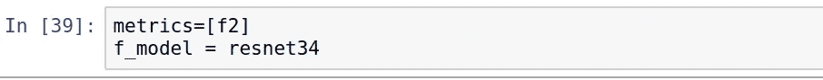**

**获取 20%的可用训练数据作为验证数据，并加载预训练模型。**

**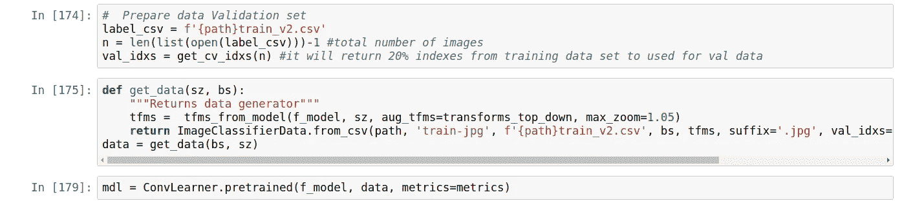**

## **寻找学习率**

**学习率是该模型最重要的超参数之一。它决定了模型学习的快慢。如果 LR 太高，模型将试图学习得太快，损失函数将不收敛。如果 LR 太低，模型将需要太长时间才能收敛。**

**使用 fastai 库找到一个好的学习率非常容易，只需运行下面两行代码。(*它有助于使用研究论文* [*中介绍的技术找到 LR，用于训练神经网络*](https://arxiv.org/abs/1608.03983) 的循环学习率)**

**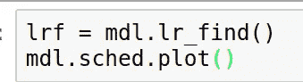**

**这将绘制 LR 对损失函数的曲线图。LR 的一个好值是损失函数斜率最高的地方。正如我们所见，斜率在 0.1 左右最高，您可以使用任何接近它的值。用 0.1 左右的几个值进行实验，以找到 LR 的最佳值，这将是一个好主意。在尝试了几个值之后，0.2 似乎对我最有效。**

**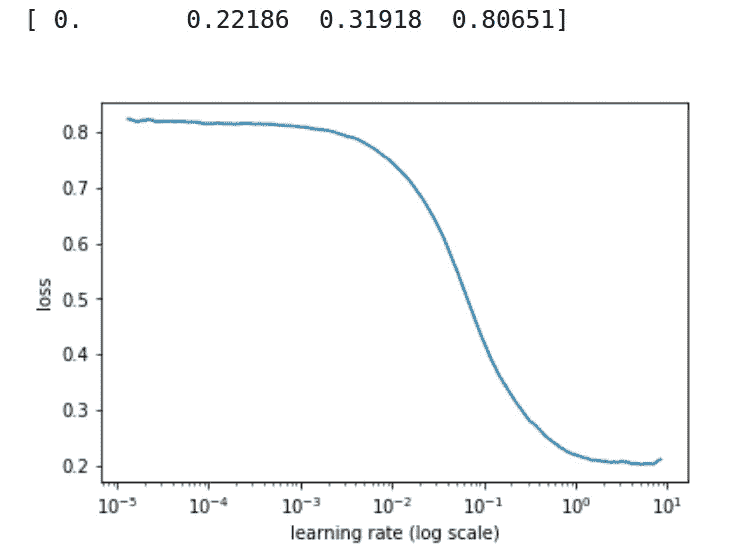**

## **训练模型**

**比赛中的芯片总尺寸为 256X256，我们开始用 64x64 来训练我们的模型，并将随着训练的进展逐渐增加图像的尺寸*。这是避免过度拟合的非常好的技术。***

**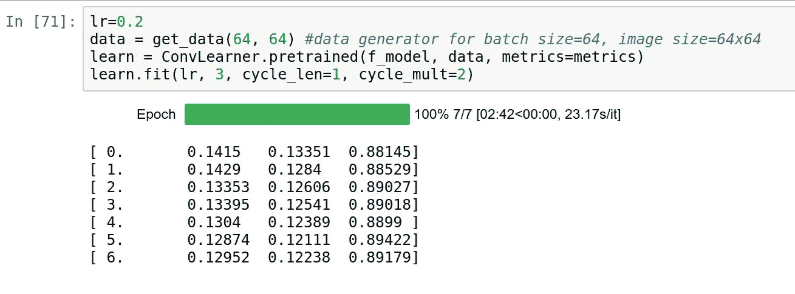**

**输出具有以下格式**

**`[ <epoch_number> <train loss> <val loss> <val set f2 score>]`**

**让我们试着轻描淡写一下`fit function`。在训练模型时 *fastai* 实现了一种叫做*带重启的随机梯度下降(SGDR)的技术(* [*论文链接*](https://arxiv.org/abs/1608.03983) *)。*它在循环中训练模型，其中每个循环由一个或多个时期组成。对于每个周期，它从给定的 LR 值开始，并将随着训练的进行而指数地降低 LR ( *指数学习速率表*)。拟合中的第二个参数表示循环总数。一个循环中的总次数由以下两个参数`cycle_len`和`cycle_mult`控制。**

**`epochs in first cycle = cycle_len
epochs in second cycle = epochs in previous(first) cycle x cycle_mult
epochs in third cycle = epochs in previous(second) cycle x cycle_mult`
这是显示每个周期 LR 变化的图表。**

**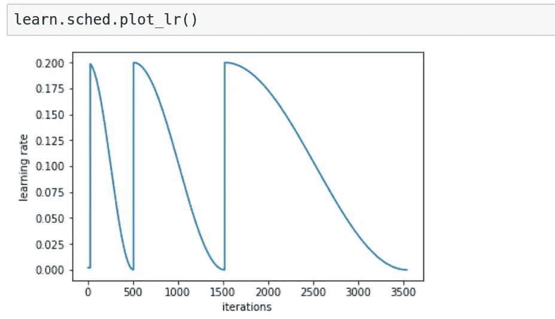**

****解冻所有图层，并为图层设置不同的学习速率****

**默认情况下，`fastai`将冻结所有图层的权重，除了最后几个图层和它添加的用于微调给定数据集模型的图层。(*有 Keras 背景的数据科学家会欣赏这个，不需要* `*model.pop*` *、* `*model.add*` *、*`*model.layers[index].trainable=False*`*`*model.compile*`……)***

**所以在上述时代，所有的学习都是由那些解冻的最后一层完成的。
接下来，我们将解冻所有层的权重，以提高模型的准确性。**

**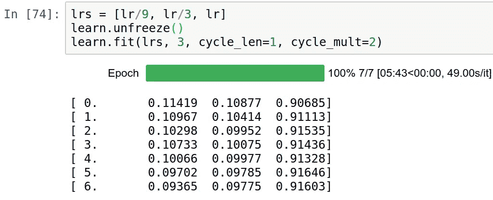**

**如果你给 *fastai* 一个 3 元素的数组，它会把层分成 3 组，【<初始卷积层>，<剩余卷积层>，<最后完全连接层>。对于每个集合，它将使用数组中相应的值。**

**在 CNN 的初始层学习寻找简单的特征(如边缘，颜色渐变，角落),这些特征对行星数据集同样有帮助。因此，我们对它们使用最低的 LR。CNN 的更高层学习寻找复杂的特征(像几何图案、脸、特定物体等)。更高层的 LR 值的增加将有助于它们更快地适应给定的数据集。**

**正如您从输出中看到的，我们的模型已经开始过度适应。我将在这里停止训练，并将训练图像大小增加到 128x128。**

**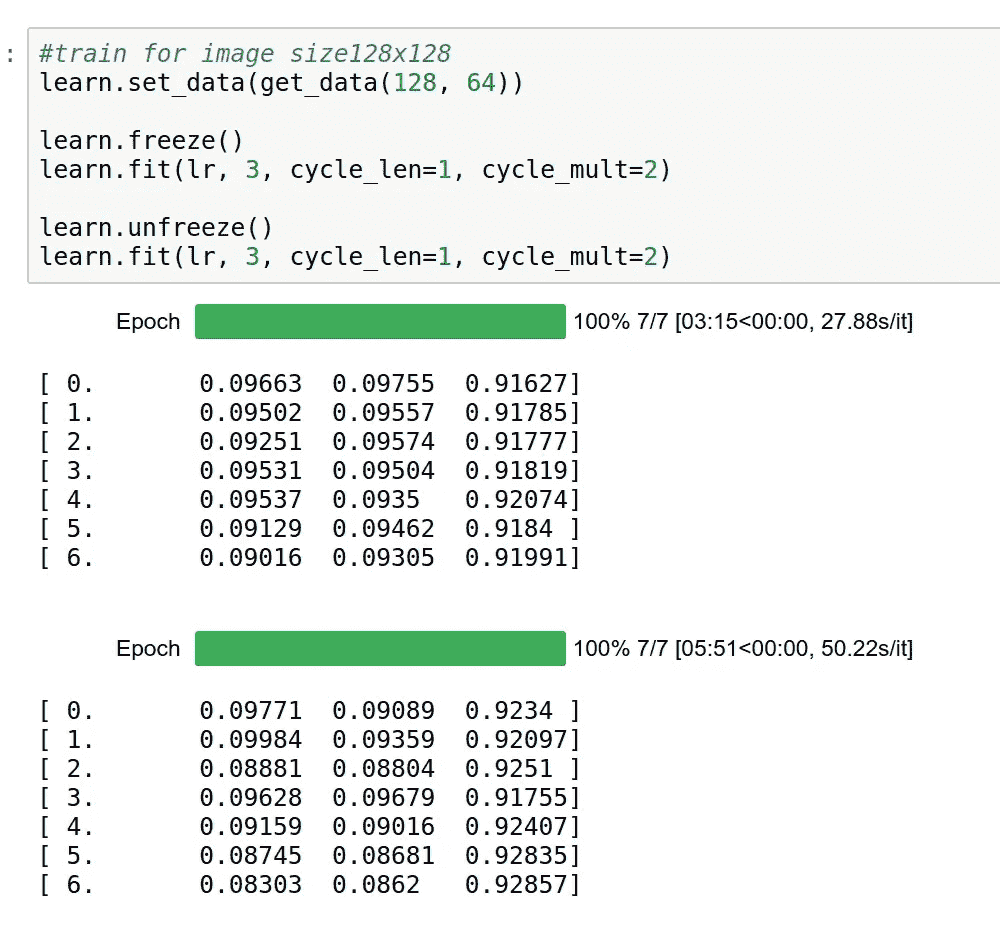**

**同样，通过将图像大小增加到 256x256 来训练模型。这将结束模型的训练阶段。**

**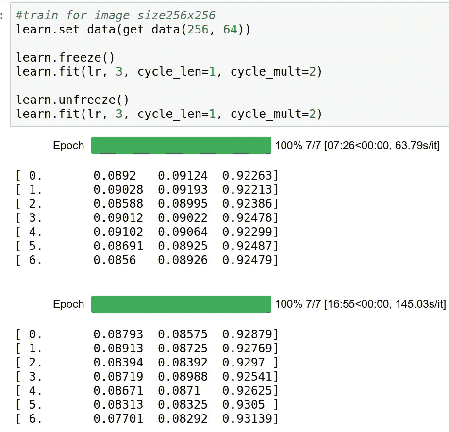**

***fastai* 还有一个非常好的特性叫做**测试时间增强(TTA)** 。这个想法很简单；对每个测试图像应用简单的增强以生成它的五个副本，然后对每个副本进行预测。您可以对这些预测进行平均，以显著降低误差(1–2%)。正如您在下面的代码中看到的，使用 TTA，F2 分数从 0.928 增加到 0.930。这是一个很好的分数。**

**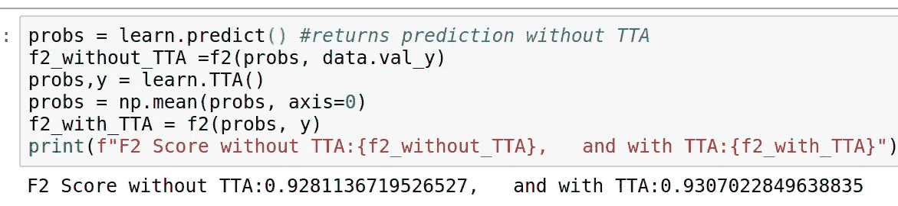**

# ****第一次提交给 Kaggle****

**在提交文件中，我们需要对每个图像放置预测标签。每个图像可以属于多个类别。**

**`file_10770,agriculture clear cultivation primary road test_26732,agriculture clear cultivation haze primary`**

**如果您查看我们的验证集(下图)中的预测示例，您会看到我们的原始标签是 1 和 0 的形式，但我们的预测是浮点数。因此，我们需要为提交文件中包含的预测选择一个阈值(0.66 对于下面的例子是理想的)。**

**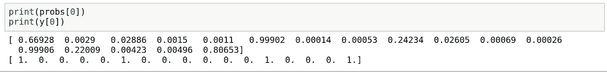**

**`op_th` 函数在给定范围内尝试多个阈值，并返回使 F2 分数最大化的阈值。**

**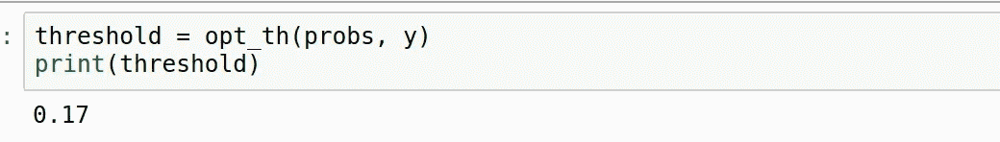**

**现在我们有了最佳阈值，让我们生成一个提交文件**

**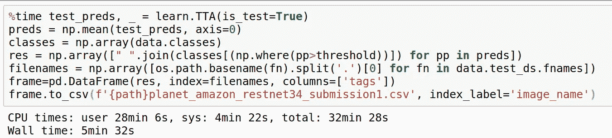**

**这是 Kaggle 的提交结果。**

**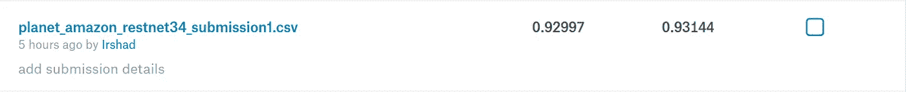**

**私人得分 0.92997 将使我们在 938 名中排名第 65 位。这款最初的车型本应排在**前 7%。这是相当大的成就。让我们进一步改进它。****

**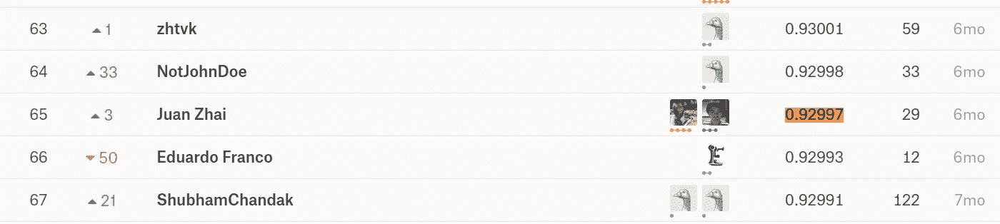**

**Private leader board of Kaggle planet competition.**

# **组装**

**我的下一个目标是进入前 5%。我训练了 5 个 resnet34 模型。每个模型的训练集由 90%的可用训练数据和剩余的 10 %数据组成，作为验证集。我还对每个模型的训练集应用了略有不同的数据扩充。这是所有模特的 F2 分数。**

```
**f2 Score: 0.9285756738073999                 
f2 Score: 0.9325735931488134                 
f2 Score: 0.9345646226806884                 
f2 Score: 0.9331467241762751                 
f2 Score: 0.9349772800026489**
```

**看到这一点后，我对职位的提高充满了希望。我准备了提交文件，并提交给 Kaggle。这是结果。**

**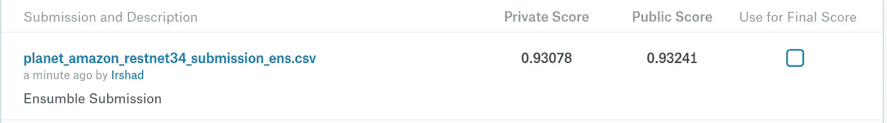**

**Kaggle submission result for ensemble**

**这里是 Kaggle 的私人领袖板。**

**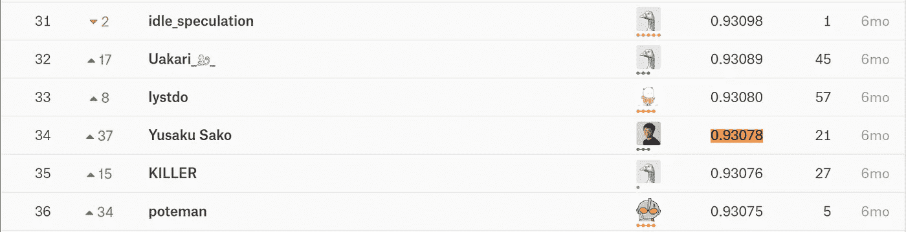**

****0.93078 的个人得分将使我们在 938 分中排在第 35 位**。这是最高的 3.7%。**

## **所以我们进入了前 4%。目标实现**

***代码为合奏可以在* [*这里找到*](https://github.com/irshadqemu/Kaggle-Competitions/blob/master/Planet_amazon_resnet34.ipynb) *或者便签本底部。***

# **如何进一步提高**

**我将给你留下进一步改进的建议。**

*   ****找到阈值的更好方法:**在准备提交文件时，我使用了大约 0.2 的阈值来为所有测试图像选择类别，但理想情况下，每个测试图像都应该有一个独立的阈值，具体取决于模型的预测值。我尝试训练一个 ML 模型来寻找更好的阈值，但没有成功。(*代码在笔记本***
*   ****找出模型预测错误的类别:**从验证集预测中，您可以找出模型预测最不正确的类别。您可以在训练集中引入这些类的多个稍微扩充的副本。**
*   ****用 tiff 代替 jpg:** 对于相同数量的图像，tiff 格式的训练数据集大小为 12.87 GB，而 jpg 格式的大小仅为 600MB，因此很明显 tiff 数据比 jpg 包含更多的信息。这必将有助于进一步改进模型。**
*   ****尝试其他架构:**我只用过 resnet34 型号，它们是很多其他高级型号，比如 resnet50，resent101。你可以尝试这些。**
*   ****减少过拟合:**如果你在笔记本上看集合训练的输出，你会知道我的一些模型在训练时开始过拟合。您可以尝试提前停止或退出，以减少过度拟合。**
*   ****训练多个 CNN 架构的系综:**在准备系综的时候，我只用过 resnet34 的系综。您可以准备一个包括多种架构的系综，如 resnet50、resnet101 等。**

**如果你喜欢读这篇文章，请鼓掌。:-)**

**[](https://github.com/irshadqemu/Kaggle-Competitions/blob/master/Planet_amazon_resnet34.ipynb) [## irshadqemu/ka ggle-竞赛

### Kaggle-竞赛-我的 ka ggle 竞赛笔记本

github.com](https://github.com/irshadqemu/Kaggle-Competitions/blob/master/Planet_amazon_resnet34.ipynb)**