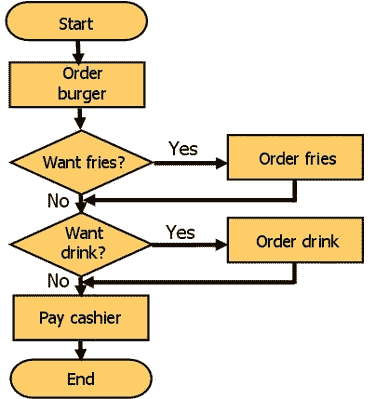

# Kaggle : Python : DataQuest

> 原文：<https://towardsdatascience.com/kaggle-python-dataquest-85ab1994fcdf?source=collection_archive---------1----------------------->

Kaggle.com

## 第二部分:[卡格比赛](https://www.kaggle.com/c/titanic)和[数据任务教程](https://www.dataquest.io/course/kaggle-competitions)在这句话中连在一起。在处理完第 1 部分之后。我回来接受更多的惩罚。

我正在使用 Cloud9 IDE，它有 ubantu，我从 Python2 开始，但我可能会以 python 3 结束。我仍然使用 DataQuest 作为我的指南，所以我们开始吧！请记住，到目前为止，我的代码如下所示:

`import pandas
import numpy as np
from sklearn import cross_validation
from sklearn.linear_model import LogisticRegression
titanic = pandas.read_csv(“train.csv”)
predictors = [“Pclass”, “Sex”, “Age”, “SibSp”, “Parch”, “Fare”, “Embarked”]
alg = LogisticRegression(random_state = 1)
kf = cross_validation.KFold(titanic.shape[0], n_folds=3, random_state=1)
predictions = []
fillage = titanic[“Age”].median()
titanic[‘Age’] = titanic[‘Age’].fillna(fillage)
titanic.loc[titanic[“Sex”] == “male”, “Sex”] = 0
titanic.loc[titanic[“Sex”] == “female”, “Sex”] = 1
titanic[“Embarked”] = titanic[“Embarked”].fillna(‘S’)
titanic.loc[titanic[“Embarked”] == “S”, “Embarked”] = 0
titanic.loc[titanic[“Embarked”] == “C”, “Embarked”] = 1
titanic.loc[titanic[“Embarked”] == “Q”, “Embarked”] = 2
for train, test in kf:
train_predictors = (titanic[predictors].iloc[train,:])
train_target = titanic[“Survived”].iloc[train]
alg.fit(train_predictors, train_target)
test_predictions = alg.predict(titanic[predictors].iloc[test,:])
predictions.append(test_predictions)
predictions = np.concatenate(predictions, axis=0)
predictions[predictions > .5] = 1
predictions[predictions <=.5] = 0
num = len(predictions)`

`i=0
count = 0.0
#print(count)
for prediction in predictions:
if predictions[i] == titanic[“Survived”][i]:
count = count + 1
i = i+1`

`accuracy = float(count/num)
scores = cross_validation.cross_val_score(alg, titanic[predictors], titanic[“Survived”], cv=3)`

`titanic_test = pandas.read_csv(“test.csv”)
fillFare = titanic_test[‘Fare’].median()
fillAge = titanic_test[‘Age’].median() +1
titanic_test[‘Fare’] = titanic_test[‘Fare’].fillna(fillFare)
titanic_test[‘Age’] = titanic_test[‘Age’].fillna(fillAge)
titanic_test[‘Embarked’] = titanic_test[‘Embarked’].fillna(‘S’)
titanic_test.loc[titanic_test[‘Sex’] == ‘male’, ‘Sex’] = 0
titanic_test.loc[titanic_test[“Sex”] == “female”, ‘Sex’] = 1
titanic_test.loc[titanic_test[‘Embarked’] == ‘S’, ‘Embarked’] = 0
titanic_test.loc[titanic_test[‘Embarked’] == ‘C’, ‘Embarked’] = 1
titanic_test.loc[titanic_test[‘Embarked’] == ‘Q’, ‘Embarked’] = 2`

`alg.fit(titanic[predictors], titanic[“Survived”])
predictions = alg.predict(titanic_test[predictors])
submission = pandas.DataFrame({
“Survived”: predictions
},index= titanic_test[“PassengerId”])`

`submission.to_csv(‘Kaggle.csv’)
#print(titanic.describe())`

注意:*现在 python 2 不喜欢“准确性”这一行*叹*所以我换了 python 3。在 c9 中，当你在一个工作空间中时，你可以按 settings 菜单，在 python 2 和 3 之间切换。记住，你必须下载你正在使用的新版本的所有软件包。*

计划的第二部分是提高我们的提交分数。第一个实用模块是关于一个叫做随机森林的东西。一棵树就像我们在小学看到的流程图。

有“是”或“否”的输入来导致决定或最终答案(有点像玩 20 个问题)。这些统计学上的答案叫做终端节点。这允许机器通过将关系简化为一系列线性关系来理解可能不是线性的关系。对于你们这些书呆子来说，在微积分中，不管函数有多复杂，随着你看到的区间变小，它会变成一条直线，然后变成一个点(一般来说)。你可以把一个复杂的问题变成一系列简单的问题。

现在，如果你做多棵树，你会有一个森林。当你用随机的初始起点从数据中创建其他的树时，你可以很好的观察数据告诉你什么。取森林的平均值，就可以开始做预测了。如果树木不是随机的，这种技术就叫做“套袋”。

Sklearn 可以用来实现一个森林。Sklearn 有一个名为[的随机森林分类器](http://scikit-learn.org/stable/modules/generated/sklearn.ensemble.RandomForestClassifier.html)的模块，在集成模块下完成这项工作。创建的森林将有十棵树。我们将使用泰坦尼克号的测试数据来做这件事。

在我做任何事情之前，我会删除打印语句和导出语句，因为它们是不需要的。

Dataquest 明确写出了许多参数，但是根据文档，它们使用的值与默认值相同。

`algForest = RandomForestClassifier(random_state=1, n_estimators=10, min_samples_split=2, min_samples_leaf=1)`

以上代码由 Dataquest 提供:

1)n_estimators = >森林中树木的数量；默认值= 10

2)min_samples_split = >分割 3)内部节点所需的最小样本数；默认值= 2

4)min_samples_leaf= >作为叶节点所需的最小样本数；默认值= 1

现在，我们可以使用这种新算法，并以与基于日志的算法相同的方式实现它。

首先我们做一个交叉验证。这将模拟我们之前代码中定义“score”的行，并为 cv(交叉验证)参数传递 kf 变量。我的看起来像这样:

> `*from sklearn import cross_validation
> from sklearn.ensemble import RandomForestClassifier titanic=pandas.read_csv(“train.csv”)
> predictors = [“Pclass”, “Sex”, “Age”, “SibSp”, “Parch”, “Fare”, “Embarked”] algForest = RandomForestClassifier(random_state=1, n_estimators=10, min_samples_split=2, min_samples_leaf=4)
> kf = cross_validation.KFold(titanic.shape[0], n_folds=3, random_state=1) scores_forest = cross_validation.cross_val_score(algForest, titanic[predictors], titanic[‘Survived’], cv=kf)*`
> 
> `*print(scores.mean())*`

现在，是时候生成一些新特性了。我以前在处理一些计算物理问题时用过熊猫。但是我从来没有在数据帧上真正使用过它。

我使用 pandas apply()函数和 lambda 函数。apply()函数从我们实现的 lambda 函数中推断出一个 pandas 系列。

我们将使用简单的加法来计算家庭规模和名字的长度(名字越长，等级越高…理论上)。

Dataquest 写出了这些行，我将它们添加到测试集和训练集中。

`titanic[‘FamilySize’] = titanic[‘SibSp’] + titanic[‘Parch’]
titanic[‘NameLength’] = titanic[‘Name’].apply(lambda x: len(x))`

现在我应该得到每个乘客的头衔，在我看来，这比名字的长度更能反映身份。

对于这一个，我需要构建一个函数来完成这项工作。我将在不同的文件中创建这个类，并将它导入到原始文件中。

我准备用一个正则表达式(大家的最爱)来搜索名字。

`‘([A-Za-z]+)\.’`

这意味着 reg ex 搜索将从 A 到 Z 查找一个大写字母，后跟一串字母，并以句点结尾。

当我使用 re.search()函数进行搜索时，我需要首先检查我是否找到了匹配项，如果是，我需要得到搜索找到的内容。为了实现前者，我使用了一个简单的 if 语句。为了实现后者，我需要使用 group 函数。Group 采用 reg ex 给定的子组的编号。这意味着组(1)将返回由`[A-Za-z]`表示的内容。

然后，我使用 pandas apply()将查找标题的函数映射到数据集的 Name 列:

> `def get_titles(name):
> title_search = re.search(‘ ([A-Za-z]+)\.’, name)
> if title_search:
> return title_search.group(1)
> return “”`
> 
> `titles = titanic[“Name”].apply(get_titles)`

此外，我可以使用 pandas.value_counts 对每个输出进行计数。

遍历 pandas.value_counts 中的键/值对，使用标题作为键，计数作为值来创建数据集:

> `title_mapping = {“Mr”: 1, “Miss”: 2, “Mrs”: 3, “Master”: 4, “Dr”: 5, “Rev”: 6,
> “Major”: 7, “Col”: 7, “Mlle”: 8, “Mme”: 8, “Don”: 9, “Lady”: 10, “Countess”: 10,“Jonkheer”: 10, “Sir”: 9, “Capt”: 7, “Ms”: 2}`
> 
> `for k,v in title_mapping.items():
> titles[titles == k] = v`

现在我把我的注意力转向看我能不能搞清楚家庭团体。当谈到生存能力时，这是一个很好的选择。什么规模的家庭存活几率更大？

首先我们导入[操作符模块](https://docs.python.org/2/library/operator.html)。这个模块很难用语言来解释。为了简化，它采用运算(+、-、x 等)并将它们转换成可以提供参数的函数。因此`operator.add(x,y)`在功能上与`x+y`相同。

导入之后，正如我对标题所做的那样，我们需要定义一个映射字典。但是这一次，字典将是空的(最初)。

然后，当给定一行时，我创建一个函数来获取 id。在该函数中，首先我们获得姓氏，然后我使用 reg ex `“{0}{1}”`创建一个 id，并将其与姓氏相关联。这样做之后，我创建一个条件:如果系列 id 不在我们之前创建的系列映射字典中，那么我向字典中添加一个全新的系列，如果 id 确实存在，那么我向该系列 id 添加 1:

> `def get_family_ids(row):
> last_name = row[‘Name’].split(“,”)[0]
> family_id = “{0}{1}”.format(last_name, row[“FamilySize”])
> if family_id not in family_id_mapping:
> if len(family_id_mapping) == 0:
> current_id = 1
> else:
> current_id = (max(family_id_mapping.items(), key=operator.itemgetter(1))[1] + 1)
> family_id_mapping[family_id] = current_id
> return family_id_mapping[family_id]`

在函数外部，我使用 pandas.apply 方法定义了 family _ ids。参数是我们创建的函数，用于获取系列 id 和轴=1。

DataQuest 让我把所有少于三人的家庭压缩成一个代码。我说…不。我们看看会发生什么。

最后，我们将该列添加到我们的数据集，然后打印出来。

> `family_ids = titanic.apply(get_family_ids, axis=1)
> titanic[“FamilyId”] = family_ids`

这些代码的大部分是由 DataQuest 编写的，我花了一些时间来分析它并弄清楚发生了什么。看了很多文件！

不管怎样，我要去寻找预测的最佳特征了。我的森林里有哪些问题通常能让我得到正确答案？

接下来我将使用一个叫做[的东西，单变量特征选择](http://scikit-learn.org/stable/auto_examples/feature_selection/plot_feature_selection.html)。那是一口。我需要从 scikitlearn 导入更多的模块； [SelectKBest](http://scikit-learn.org/stable/modules/generated/sklearn.feature_selection.SelectKBest.html) ，f_classif。

然后，我需要将我创建的新参数(头衔和家庭规模)添加到预测列表中。

我把一个叫做选择器的变量等同于以 f_classif 和 k=5 为参数的函数 selectBest。I 将选择器与巨大的预测器和幸存的参数列相匹配。

我使用 numpy.log10 和 p 值计算每个预测值的得分。根据[这篇文章](http://blog.minitab.com/blog/adventures-in-statistics-2/how-to-correctly-interpret-p-values):

> p 值评估样本数据在多大程度上支持“魔鬼代言人”的论点，即零假设为真。它衡量你的数据与零假设的符合程度。如果零假设为真，在样本数据中观察到这种效应的可能性有多大？
> 
> 高 P 值:您的数据可能为真空值。
> 
> 低 P 值:您的数据不太可能为真空值。

然后我用 matplotlib.pylot 将结果图形化，有了这个，我就能算出什么是最好的预测器(“Pclass”、“Sex”、“Fare”、“Title”)。然后，我使用我们为随机森林创建的算法来重新定义分数，并打印出平均值。为了便于阅读，我将这个新的分数称为 scores_graph。

> `predictors = [“Pclass”, “Sex”, “Age”, “SibSp”, “Parch”, “Fare”, “Embarked”, “FamilySize”, “Title”, “FamilyId”, “NameLength”]
> selector = SelectKBest(f_classif, k=5)
> selector.fit(titanic[predictors], titanic[“Survived”])
> algForest.fit(titanic[predictors], titanic[‘Survived’])
> scores_graph = -np.log10(selector.pvalues_)
> plt.bar(range(len(predictors)), scores_graph)`
> 
> `plt.xticks(range(len(predictors)), predictors, rotation=’vertical’)
> plt.show()`

在这一点上，我遇到了 c9 的障碍。它不会显示图表。*她哭泣*所以我问了我的老朋友谷歌先生，我得到了[这里](http://stackoverflow.com/questions/15089174/support-for-cloud9-ide-and-matplotlib-or-other-graphical-tool-for-python)。我需要与进口和 matplotlib 的工作方式。

`import matplotlib
matplotlib.use(‘Agg’)`

*   注意，这些行应该在导入 matplotlib.pyplot 之前插入。

所以在你画出图后，你加上这两条线:

`fig = plt.figure()`

`fig.savefig(filename)`

它应该在程序所在的目录下创建一个你选择的格式的文件。

在这一点上，下一个模块是关于梯度增强，这是一种增强我们从随机森林中获得的预测的方法。但是，我不知道它是如何工作的，所以我查了一下，找到了这个视频。哈佛大学的统计学教授特雷弗·哈斯蒂谈到了这个话题(我不得不查一些术语)。

Boosting Trees 获取树，并像以前一样找到平均值，但这一次，它将根据是否得到好的结果来加权每棵树。它会增加森林中表现不佳的部分的权重，并尝试修复错误。这可能会导致过度拟合，当我们准备好预测时，这会导致各种各样的问题，但对于我们的目的来说，这是可以的。

在梯度增强之后是关于集合的部分。这是将不同的分类器(如线性、对数、随机森林或装袋)放在一起的行为。就像科学怪人的统计数据。为了充分利用这一点，分类器需要具有不同的类型，并且具有相似的等级(具有相似的)误差值。DataQuest 让我使用带有梯度提升树的对数分类器。

从 scikitLearn 中，我导入了梯度推进分类器模块，并给它一个随机状态 1，估计数量为 25，每棵树只有 3 个分支(两个是二进制选择:是或否问题，它们被称为树桩)。

然后，我创建了一个名为“ens”的数组，它将两个算法作为嵌套数组的元素。一个数组中有梯度增强分类器和预测器，另一个数组中有对数回归和预测器(不同的)。设置好之后，我在训练数据集中使用它。

然后，因为梯度提升比对数回归更准确，所以我们将权重添加到提升中(三倍于对数):

> `predictions = []
> predictors = [“Pclass”, “Sex”, “Age”, “Fare”, “Embarked”, “FamilySize”, “Title”, “FamilyId”]
> ens = [[alg_gradient , predictors],[alg ,[“Pclass”, “Sex”, “Fare”, “FamilySize”, “Title”, “Age”, “Embarked”]]]
> for train, test in kf:
> train_target = titanic[‘Survived’].iloc[train]
> full_test_predictions = []
> for alg, predictors in ens:
> alg.fit(titanic[predictors].iloc[train,:], train_target)
> test_predictions = alg.predict_proba(titanic[predictors].iloc[test,:].astype(float))[:,1]
> full_test_predictions.append(test_predictions)
> test_predictions = (full_test_predictions[0] + full_test_predictions[1]) / 2
> test_predictions[test_predictions <= .5] = 0
> test_predictions[test_predictions > .5] = 1
> predictions.append(test_predictions)
> predictions = np.concatenate(predictions,axis=0)`
> 
> `accuracy = sum(predictions[predictions == titanic[“Survived”]]) / len(predictions)`

因为这不是公主新娘，所以某人不可能“大部分”死亡，所以我们可以继续进行测试 _ 预测枯萎 0 或 1(幸存与否)。

在此之后，我将我们对训练数据所做的预测应用到完整的数据集。为此，我首先将整个数据集与训练数据进行拟合。然后使用 [alg.predict_proba()](http://scikit-learn.org/stable/modules/generated/sklearn.linear_model.LogisticRegression.html#sklearn.linear_model.LogisticRegression.predict_proba) 函数填写预测值:

> `alg_ens = [
> [GradientBoostingClassifier(random_state=1, n_estimators=25, max_depth=3), predictors],
> [LogisticRegression(random_state=1), [“Pclass”, “Sex”, “Fare”, “FamilySize”, “Title”, “Age”, “Embarked”]]
> ]
> full_predictions =[]
> for alg, predictors in alg_ens:
> alg.fit(titanic[predictors], titanic[“Survived”])
> predictions = alg.predict_proba(titanic_test[predictors].astype(float))[:,1]
> full_predictions.append(predictions)
> predictions = (full_predictions[0] * 3 + full_predictions[1]) / 4
> predictions[predictions <= .5] = 0
> predictions[predictions > .5] = 1`

我再次使用本教程第一部分中的提交术语:

`submission = pandas.DataFrame({
“PassengerId”: titanic[“PassengerId”],
“Survived”: predictions
}).astype(int)
submission.to_csv(‘Kaggle.csv’)`

在上一篇文章中，我不得不进入我的 google drive，手动删除索引栏(像个傻瓜一样)。然后我做了一些研究，当我在做另一个项目时，我意识到当你使用熊猫导出到 csv 时，你可以关闭索引。你只需要写下:

`submission.to_csv(‘Kaggle.csv’,index=False)`

嘣！完成了。

对于 Python 版本，唯一的区别是“准确性”行必须用 2 注释掉。它与熊猫有关。

我这里的代码是。我要去睡觉了。