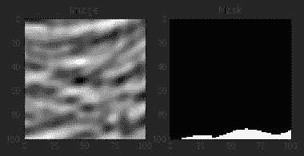
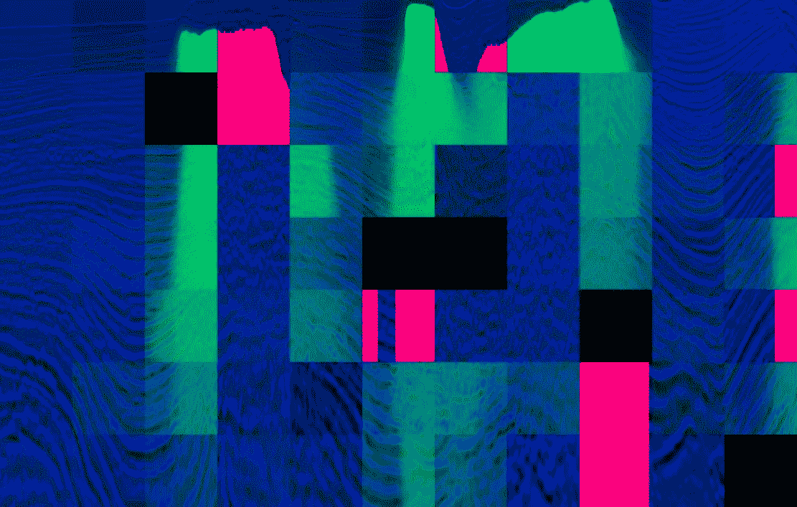
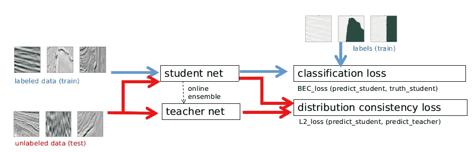

# Kaggle 盐识别挑战或如何分割图像

> 原文：<https://towardsdatascience.com/kaggle-salt-identification-challenge-7fc502d1c3c3?source=collection_archive---------19----------------------->

几周前，我在 Kaggle 上完成了 TGS 盐鉴定挑战赛，这是一个流行的数据科学竞赛平台。任务是在地震图像上准确识别地下目标是否为盐层。

我们的团队: [Insaf Ashrapov](https://www.linkedin.com/in/iashrapov/) ， [Mikhail Karchevskiy](https://www.linkedin.com/in/mikhail-karchevskiy-aa46245a/) ， [Leonid Kozinkin](https://www.linkedin.com/in/lkozinkin/)

我们获得了前 1%第 28 名，并希望分享我们的最终解决方案，该方案基于一个采用 hflip TTA(测试时间增加)的单一 5 重模型。

看看我的机器和深度学习博客[https://diyago.github.io/](https://diyago.github.io/)

# **输入**

Input image and mask as ground truth binary image

最初，我们有尺寸为 101*101 的灰度 1 通道输入图像。为了使其可用于预训练的编码器，我们将它们调整为 128x128，第一个通道通过填充作为源图像，第二个通道使用相对深度:

> *相对深度=(当前深度-最小深度)/(最大深度-最小深度)*

在第三个通道上，我们应用了[coord conv](https://eng.uber.com/coordconv/)【1】。我们尝试了更高的分辨率，但学习和收敛速度慢得多，没有任何改进，但其他一些参与者报告了显著的改进。

# **增强功能**

我们使用了来自伟大的[albumination](https://github.com/albu/albumentations)库中的增强功能:亮度、模糊、hflip、缩放、旋转和对比度。这里重要的是不要使用对所提供的数据集来说不自然或物理上不可能的图像增强，例如，垂直翻转只会产生负面影响。此外，这些增强不是太重，否则，我们会遭受较低的分割质量，甚至训练速度。

# **基本型号**

我们最终的模型是基于 Unet [2]的，和其他人一样做了一些微妙的修改。
SE-ResNeXt-50 [3](其性能优于所有 resnet 和更复杂的 SE-ResNeXt-101)作为获取初始特征图的编码器。然而，我们修改了第一层。首先，我们在没有最大池的情况下使用它，然后通过返回最大池，在 stride = 1 的情况下使用它。上述两种修改都允许使用 128*128 的图像，否则需要更高的图像分辨率。在我看来，缩放图像会给图像和蒙版带来一些不必要的伪影。
ScSE(空间通道压缩&激发)【4】编码器和解码器，超列【5】。
令我们惊讶的是，我们已经清除了所有辍学者。这是实质性的，因为加速了训练，提高了最终结果。我们甚至试图只用 16 个过滤器，但最终用了 32 个。似乎是增加和 5 倍平均足以避免过度拟合。

# **训练**

出于学习目的，我们使用了这样的参数和方法:
批量大小 20(适合 GPU 存储器的最大大小)，Adam [6]，循环学习速率[7]，参数 mode =‘triangular 2’，baslr = 1e-4，maxlr=3e-4，step_size=1500，重快照集合[8](以指数递减的权重对最后 10 个最佳模型进行平均)。使用快照集合会产生无用的混合模型，或者对于这样的 lb 分数较低的模型不会给出任何提升。
对于前 80 个时期，我们使用 BCE(二进制交叉熵)损失进行训练，然后其他多达 420 个时期使用 0.1 BCE + 0.9 Lovasz 作为损失函数[9]。然而，几乎每次训练都被*ealystop*停止。只使用 Lovasz 效果也很好，但是 BCE 加快了初始训练。
我们用 1080ti 和 1070ti 配合 pytorch 进行训练。不幸的是，Keras 不太方便尝试新事物，而且 Pytorch 预训练的编码器库更丰富。

# **后处理**

通过使用[cv2 . connectedcomponentswithstats](https://docs.opencv.org/3.0-beta/modules/imgproc/doc/structural_analysis_and_shape_descriptors.html)(形态学没有那么好)
更高(0.40+)的阈值移除小的遮罩和小的独立遮罩(黑色和白色)在私有 LB 上给了我们更好的分数，但是对于公共 LB，更小的阈值显示了相同的结果。拼图游戏[10]没有对本地验证进行改进，所以我们没有在最终提交中使用它。其他参与者仅在公共排行榜上报告了较高的改进:

Puzzle created by Arthur Kuzin (red-train masks, green-predicted test masks)

在上面的图片中，你可以看到一些垂直的面具，这些有点奇怪。此外，比赛结束后，组织者透露，我们寻找所谓的盐丘，这是封面石油。这就是为什么没有任何全尺寸的面具。

# **还有什么**

我们没有尝试两件大有希望的事情，这两件事可以帮助我们:
1)伪标签。然后，您在训练中使用具有高置信度的预测测试图像[10]。第一名把这个方法作为主要方法，这提高了他的分数。
2)深度半监督学习【12】。这种方法旨在使用标记和未标记的图像。这里，我们应该为不同的视图训练多个深度神经网络，并利用对立的例子来鼓励视图差异，以防止网络相互崩溃。结果，共同训练的网络提供了关于数据的不同的和互补的信息，这对于共同训练框架实现良好的结果是必要的。

Mean teachers are better role models: Weight-averaged consistency targets improve semi-supervised deep learning results. Image provided by Heng CherKeng

# **出版**

为了向更广泛的受众传播我们的解决方案，我们最近在 [arvix](https://arxiv.org/abs/1812.01429) 上发表了文章，并在 [Github](https://github.com/K-Mike/Automatic-salt-deposits-segmentation) 上发布了我们的解决方案。

# **参考文献**

1.  Liu，r .、Lehman，j .、Molino，p .、suther，F.P .、Frank，e .、a .、Yosinski，j .:卷积神经网络和 coordconv 解的一个有趣的失败。arXiv 预印本 arXiv:1807.03247 (2018)
2.  Ronneberger，o .，Fischer，p .，Brox，T.: U-Net:生物医学图像分割的卷积网络。医学图像计算和计算机辅助介入。第 234–241 页(2015 年)。
3.  胡，j，等:压缩和激发网络。arXiv:1709.01507 (2017 年)
4.  [Abhijit G](https://arxiv.org/search/cs?searchtype=author&query=Roy%2C+A+G) 。纳西尔 N。、 [Wachinger](https://arxiv.org/search/cs?searchtype=author&query=Wachinger%2C+C) C .全卷积网络中的并发空间和信道压缩&激励 arXiv:1803.02579 (2018)
5.  B.Hariharan、P. Arbeĺ aez、R. Girshick 和 J. Malik。用于对象分割和细粒度定位的超圆柱。InCVPR，2015 年。
6.  D.P. Kingma 和 J. Ba，“Adam:随机优化方法”，arXiv 预印本 arXiv:1412.6980，2014 年。
7.  莱斯利·史密斯。训练神经网络的循环学习率。《计算机视觉应用》(WACV)，2017 年 IEEE 冬季会议论文集，第 464–472 页。IEEE，2017 年
8.  黄高、黎一萱、杰夫·普莱斯、刘庄、约翰·E·霍普克罗夫特和基利安·Q·温伯格。2017.快照合集:火车 1，免费获得 M。arXiv 预印本 arXiv:1704.00109 (2017)。
9.  Berman，m .，Rannen Triki，A .，Blaschko，m . b .:lovasz-soft max 损失:神经网络中交集-并集度量优化的易处理替代。在:CVPR (2018 年)
10.  D.金，赵迪，刘迪，还有郭怡广。通过完成受损拼图学习图像表征。2018 年在 WACV。
11.  李东贤。伪标签:简单高效的
    深度神经网络半监督学习方法。2013 年，在 ICML 举办的关于表征学习挑战的研讨会。
12.  A.瓦尔波拉·塔尔瓦伊宁。均值老师是更好的榜样:加权平均一致性目标提高半监督深度学习结果 arXiv:1703.01780 (2017)。