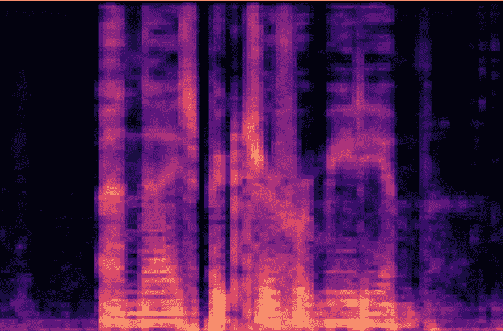
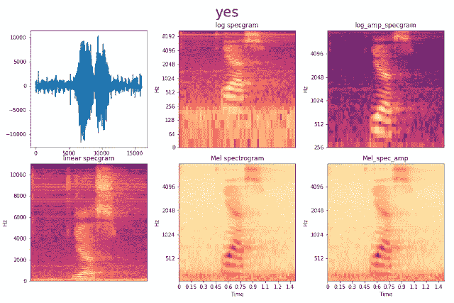
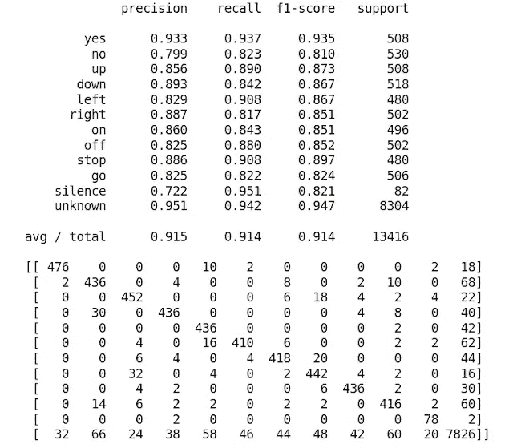
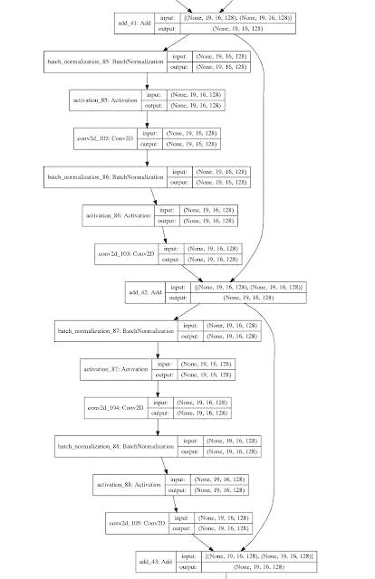
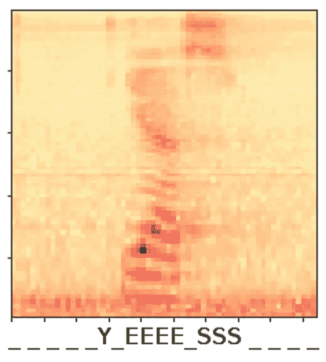

# Kaggle Tensorflow 语音识别挑战

> 原文：<https://towardsdatascience.com/kaggle-tensorflow-speech-recognition-challenge-b46a3bca2501?source=collection_archive---------6----------------------->

## 我的方法概述

从 2017 年 11 月到 2018 年 1 月，谷歌大脑团队在 [Kaggle](https://www.kaggle.com/c/tensorflow-speech-recognition-challenge#) 上举办了一场语音识别挑战赛。这项挑战的目标是编写一个程序，能够正确识别一秒钟长的音频文件中 10 个单词中的一个。刚刚下定决心开始认真学习数据科学，目标是在我的职业生涯中开辟一个新的角落，我决定将此作为我的第一个严峻的 kaggle 挑战。

在这篇文章中，我将谈论 ResNets，RNNs，1D 和 2D 卷积，连接主义者的时间分类等等。我们走吧！

## 探索性数据分析

Google Brain 提供的训练数据由 ca。6 万个 1 秒长的。32 个目录中的 wav 文件，这些目录由文件中的单词命名。其中只有 10 个是你需要识别的类别，其他的应该归入“未知”或“沉默”类别。您可以做几件事情来掌握您正在处理的数据。这个数据集并没有完全清理干净。例如，有些文件的长度不正好是 1 秒。也没有这样的“沉默”文件。你得到的是一些带有“背景”噪音的较长的录音，你可以自己把它们分成 1 秒钟的片段。你也可以在 word 文件中混合背景噪音，为你的声音在训练中提供不同的“环境”。

你需要做的一件重要的事情是清理数据，这在*的一个讨论*中提到:有相当多的文件音量极低。这些中的一些被破坏并且仅包含噪声，而一些基本上是没有任何口语单词的背景噪声。要删除或正确标记这些文件，有助于根据输出音量的动态范围对所有文件进行分类，然后检查是否存在最低声音级别阈值，低于该阈值，所有文件基本上都是无声的。事实证明，输出音量本身不足以将损坏/静音与良好的文件区分开来，所以我最终通过收听可疑文件和查看大量频谱图(见下文)来进行一些手动清理。

## 预处理

当您对音频进行分类时，您可以使用原始 wav 数据本身，也可以将音频转换为频谱图。声谱图是声音的直观表示，具有时间轴和频率轴，以及表示声音在该时刻和该频率的振幅或能量的像素强度。在制作频谱图时，有许多参数可供选择，这些参数会影响从频域或时域提取的信息量。关于深度学习的适用性，我还没有对所有这些参数进行详尽的分析，因为这需要花费很长时间。相反，我为不同的单词绘制了一系列不同维度和强度范围等的光谱图，并选择了看起来最容易在视觉上归类为不同单词的单词。

有人说“是”的音频源的一些不同的可视化。我选择了右下方的声谱图作为我的大多数网络的输入。与原始 wav 数据相比，使用 spectrograms 的优势在于，您可以将其视为一个图像分类问题，这是我们大多数人已经非常熟悉的。我尝试了两种方法。

为了加速网络的最终训练，我决定单独进行大部分预处理，并将单独的训练集和验证集保存为。npy 文件。数据量很小，可以在我的家用电脑上完成。Google Brain 建议您根据他们提供的“validation.txt”和“test.txt”文件中的文件名，将数据拆分为“train”、“validation”和“test”。因为他们还在 Kaggle 上提供了一个用于排行榜评分的测试集，所以我决定将“验证”和“测试”文本文件合并成一个验证集。预处理包括创建光谱图，围绕零进行归一化，为 10 个主要类别加上“沉默”和“未知”创建整数为 0-11 的“标签”或“Y”数组。对于 CTC 模型，我没有使用“未知”标签。所有 32 个班级都被平等对待。

因为我将这个挑战作为深度学习训练练习，所以我实现了一堆不同的网络设计。得到这样的实际训练真是太棒了。我从这个项目中学到的东西比我之前开始的十个 MOOCs 都多。(好吧，我稍微夸张一点)。我将讨论几个我的设计尝试以及实现时需要注意的事项。

## 原始 wav 文件，1D 卷积

使用 spectrograms，您可以使用特定的算法从 wav 文件中提取特征，但您必须微调一系列参数。一个设计良好的神经网络应该能够自己从原始 wav 文件中学习特征，并可能获得比从光谱图中获得的信息更多的特征。这第一个模型就是一个尝试。最初的设计很大程度上受到了用户 ttagu99 的一个 [Kaggle 讨论帖子](https://www.kaggle.com/c/tensorflow-speech-recognition-challenge/discussion/44283#256644)的启发。这是 6 层 1D 卷积网络的早期尝试的结果。

验证集上的网络分数。上图:sklearn 分类报告。下图:sklearn 混淆矩阵。

还不是很有效。它犯的一些错误很容易理解。它经常混淆“不”和“去”,“关”和“上”。这些单词有非常相似的元音，所以可能会混淆。有些错误不太明显:它真的认为‘右’是‘左’16 次吗？也许是结尾的 t？此图还说明了如果将所有的“额外”类合并到一个“未知”类中(大约 500 个样本对大约 8300 个样本)，这些类是多么不平衡。我通过在 Keras fit 函数中使用“class_weight”参数来处理这个问题。此参数接受将类映射到权重浮点的字典，并通过更严厉地惩罚未充分代表的类的错误分类来“重新平衡”训练集。更好地平衡训练集的另一种方法是通过从每个类中创建等量样本的批次。我假设人们会在随后的时代使用剩余的“未知”样本，但我自己没有尝试过。我不知道哪种平衡技巧最好。在对 Conv1D 模型进行了一些调整后，我在 Kaggle 排行榜上的得分达到了 83%左右。还不是很好，但现在我不想在这个模型上做更多的调整，而是想尝试一些其他的网络架构。

## 雷斯内特

残差神经网络，或 [ResNet](/an-overview-of-resnet-and-its-variants-5281e2f56035) ，基本上是一个有快捷方式的深度卷积神经网络。每隔几层，就有一个身份连接回到上一层。这些快捷连接被认为有助于网络更好地推广。这绝对有效:我不再需要任何辍学层。实际情况是，网络深度默认使用尽可能多的快捷连接。这使网络保持较小，因此有助于泛化。快捷方式之间的剩余层仅在需要时更新。

具有两个快捷连接的 ResNet 模型的小子集

具有 BatchNormalization 和 ReLu activation 的两个 Conv2D 层的块由一个连接层分隔，该连接层将先前的连接层添加到块的输出中。然后，每三个这样的模块进一步由跨距为 2 的 Conv2D 层分隔，以便学习更大规模的特征。在 Keras 中，我是这样实现的:

这个模型表现得非常好。它在验证集上达到了近 98%的准确率，在 kaggle 排行榜上达到了 85%。验证集和测试集之间的这种差异令人担忧，我将在下面更深入地讨论这一点，但它与测试集有关，测试集包含许多在训练集中没有给我们的单词。所谓的*未知的未知*。我研究的下一个改进模型的架构是递归神经网络。

## 返回 RNN

声谱图的一个轴代表声音文件的频率，另一个轴代表时间维度。在卷积神经网络中，不能将这两个维度视为相等，这是有道理的。递归神经网络或 RNNs 用于建模序列，例如预测接下来应该发生什么。在我们的例子中，它们可以用来记录先发生了什么，以及之后发生了什么，这是 ResNet 所不能做到的。我的意思是，一个正常的卷积网络可能会认为“yes”和“yes”是同一个词，因为它不知道声音的顺序。我试图做的是添加一个 RNN 层到我的表现非常好的 ResNet 的末尾，并对其进行处理。正如您在上面的代码中看到的，有一个 MaxPooling 层和两个跨距为 2 的 Conv2D 层，它们将网络末端的输入大小从(61，75，1)减少到(8，10，128)。这里的第一维(8)表示时间维，但是 rnn 采用 3D 输入，而(包括批处理)我们的 ResNet 采用 4D。因此，从最终的剩余+快捷方式层到 RNN 层，我们必须使用 Keras 的整形层。你可以这样做:

我们将第二维和第三维组合成一个大向量，产生 8 个时间点，1280 个数字描述卷积的频率分布。需要时间分布式包装层来使 RNN 层(在这种情况下是 LSTM)使用 8 个时间行作为顺序输入。经过几次调整和迭代，一个组合的 ResNet RNN 模型在 Kaggle 排行榜上给出了 87%的准确率。我尽了最大努力，在 1300 名左右中排在第 200 名左右。我认为这对于我的第一个 Kaggle 项目来说相当不错。但我仍然想尝试一些东西，学习更多的深度学习技巧。

## 连接主义时间分类(语音到文本)

在 Kaggle 挑战赛提交截止日期前后，吴恩达 Coursera [深度学习 python 课程](https://www.coursera.org/learn/nlp-sequence-models/home/welcome)关于序列模型的最终模块向公众开放。我在上面的组合模型中应用了一些 RNN 层，但是我并不知道它是如何工作的，所以我参加了这个课程来学习所有关于 RNNs 的知识。这篇文章不是对这门课的回顾，但我想说的是，我会把它推荐给每个对 RNNs 的数学原理感兴趣的人。除了基本的和不太基本的 RNNs 之外，我特别感兴趣的是一种语音转文本的方法，Andrew 提到了这种方法，但没有真正深入研究，这种方法被称为 Connectionist 时态分类，或 CTC。我对此感到非常兴奋，因为我脑海中有一个关于语音到文本的项目的想法已经有一段时间了，但它仍然非常抽象，我根本不知道从哪里开始。但是现在有人给了我一个非常具体的开始。
语音转文本模型以声谱图(或原始 wav 数据)为输入，输出字母或单词。这样一个网络需要做的是识别每个 RNN 输入中所谓的*音素*，将它们翻译成字母，并将字母组合成正确的单词。

因此，对于英语口语单词，您希望网络输出每个时间点长度为 28(字母表加上“空格”和“空白”)的单热点向量，然后以某种方式确定预测的“错误”程度，以便我们可以进行反向预测。这就是反恐委员会的工作。例如，它以输出“_ _ _ Y _ EEEE _ SSS _ _”为例，通过折叠多个字母的连接并忽略不同字母之间的“空白”来将其简化为“是”。如果输出在两个相同的字母(“E _ E”)之间给出一个“空白”，则认为它是两个单独的字母。“空白”不应该与“空格”混淆，但我不必担心这一点，因为我所有的输入都是单个单词。
使用 Keras，您可以使用后端函数 *ctc_batch_cost()* 来实现，但它需要四个参数(y_true、y_pred、input_length 和 label_length)，而不是只有 y_true 和 y_pred，这意味着您不能将它用作常规的损失函数，并将其插入到您的编译语句中。我在 github 上找到了一个 [repo，它是百度的 DeepSpeech 模型的一个工作 Keras 实现，使用了 CTC，并取走了我自己需要的部分。](https://github.com/mlrobsmt/KerasDeepSpeech)

这里 *y_pred* 是长度为 28 (output_dim)的独热码向量的 RNN 的时间分布输出。与其他三个参数一起，它被提供给包装在 Lambda 层中的 *ctc_batch_cost* 函数，然后我创建了一个用于训练的模型(“*模型”*)和一个用于测试/验证的模型(“*测试 _ 模型”*)，其中不包括 Lambda 层。当你运行*模式时。Compile()* 它需要一个损失函数，所以你给它一个以 *y_true* 和 *y_pred* 为参数，简单返回 *y_pred* 的哑函数。然后，训练你给的模型*。fit()* 函数一列四个输入:

1.  训练集，
2.  具有标签的字母索引的数组 *y_true* ，用“空白”索引填充到所有样本的共同长度([25，5，19，27，27，27，27，27]表示“是”)，
3.  一个一维数组 *input_length* ，包含每个样本的“字母表”长度(len(Y_train) 28 作为一个向量)，以及
4.  一维数组 *label_length* 的长度是 *y_true* vectors(对我来说是 8)len(Y _ train)的倍。

*输出*的*参数。fit()* 函数采用长度为 len(Y_train)的零数组，我们的虚拟损失函数对此不做任何处理。我认为我能做到这一点是非常令人兴奋的。使用该模型的原始输出(上游层是 Conv1D 和两个双向 LSTMs)在 Kaggle LB 上达到 83%的分数，但是这是在没有尝试对预测的单词运行某种拼写检查或语言模型的情况下。我看到了很多“*叶*”的和“ *riget* ”的等等。我将更多地使用它，看看我还能从中得到什么。

## 离群点检测

正如我在上面提到的，测试集包含了大量的单词和声音，这些都不在训练集中。这意味着为了得到一个真正好的分数，你的模型必须学习未知的未知的特征。从我在截止日期后的 Kaggle 论坛上读到的内容来看，大多数顶尖的得分者使用了大量的特征工程来创造更多的“未知”样本。例如，您可以剪切和粘贴单词片段来创建新单词，或者您可以使用音高移动或反转样本。我尝试了一下，但不太成功。另一件事，我看到许多得分最高的人做的是在测试集上的无监督训练，以了解什么样的特征存在于那里，而不是在训练集中。这似乎给了分数很大的提高，但对我来说感觉有点像作弊。我自己花了相当多的时间尝试不同形式的异常值或异常检测。这意味着试图让网络拒绝它以前没有听到过的声音，并将它们放在“未知”类别中。我尝试在 10 个主要类别上训练自动编码器和变型自动编码器，但这些模型在解码看不见的光谱图方面总是保持同样好，就像它们在解码我训练的输入时一样。我尝试过[开集识别](https://arxiv.org/pdf/1511.06233.pdf)，但是在尝试了几个星期去理解他们到底是怎么做的之后，我放弃了。最后，如果这些技术能改善我的模型就好了，但如果排行榜上没有一个超级分数，学习这些确实给了我很多新的知识和经验，所以我很高兴我做到了。

## 结论

我离开大学已经 15 年了。在这么短的时间内又学到这么多东西，真是太有趣了。除了更好地了解如何进行语音识别之外，我还学到了更多关于 Kaggle 挑战以及如何获得高分的知识。当我开始的时候，我认为如果我发现了一些其他参与者没有的技巧，那么我会比他们得分更高，但现在我更好地认识到了高分真正需要什么。那些家伙肯定比我知道更多的把戏！

*最初发表于***。**

**ResNet 和 CTC 模型在*[*https://github.com/chrisdinant/speech*](https://github.com/chrisdinant/speech)的实施*