# Kaggle 泰坦尼克号:机器学习模型(前 7%)

> 原文：<https://towardsdatascience.com/kaggle-titanic-machine-learning-model-top-7-fa4523b7c40?source=collection_archive---------5----------------------->

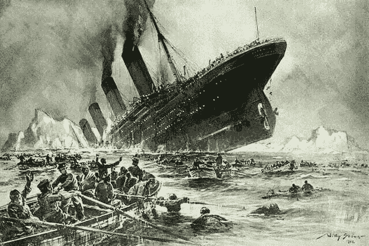

这场 K [aggle 竞赛](https://www.kaggle.com/c/titanic)的目的是根据给定的特征预测给定乘客的生死。这个机器学习模型是使用 scikit-learn 和 fastai 库构建的(感谢[杰里米·霍华德](https://www.linkedin.com/authwall?trk=gf&trkInfo=AQH1NsDUgQbJAwAAAWbiRqbIwGLhcSbGKZ7zOi_usSDEtKTqOv4iVuPDGE3g5jP79Eg3F9l5aIlaLaKsUjjhCllbKY2z1XAvTFQ9UMKh9LR9PJcCiaVsqANQ3ttHlLm60UCyUMU=&originalReferer=https://www.google.co.in/&sessionRedirect=https%3A%2F%2Fwww.linkedin.com%2Fin%2Fhowardjeremy)和[瑞秋·托马斯](https://www.linkedin.com/in/rachel-thomas-942a7923))。对该模型使用集成技术(RandomForestClassifer 算法)。我尝试了其他算法，如逻辑回归，梯度推进分类器与不同的超参数。但是我用这个 RandomFortestClassifer 得到了更好的结果(前 7%)。

完整代码的 Github 链接是[这里是](https://github.com/Msanjayds/Kaggle_Titanic-Survival-Challenge/blob/master/Titanic_Final_to_git.ipynb)。

下面是测试数据集中提供的功能。

*   乘客身份证:发给船上每个乘客的身份证
*   乘客舱:乘客舱。它有三个可能的值:1、2、3(一等、二等和三等)
*   乘客的姓名
*   性
*   年龄
*   SibSp:与乘客同行的兄弟姐妹和配偶的数量
*   Parch:与乘客同行的父母和子女人数
*   机票号码
*   票价
*   机舱号
*   登船。这描述了泰坦尼克号上三个可能的区域。三个可能的值 S，C，Q

**探索性数据分析**:以下是我在数据分析过程中的发现，以及我处理这些发现的方法。

从下表中我们可以看到，在测试数据集中的 891 个观察值中，只有 714 个记录填充了年龄，即大约 177 个值缺失。我们需要用一些值来估算，我们稍后会看到。

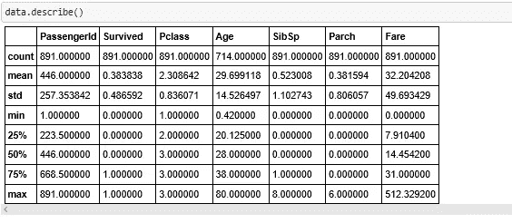

Numerical feature statistics — we can see the number of missing/non-missing

下面的图表显示，男性乘客死亡人数多于女性(性别歧视:-))

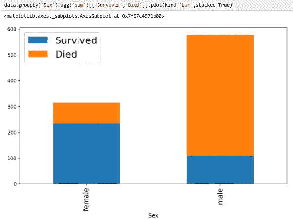

Visualization of Survival based on the Gender

我们还可以看到 20 到 40 岁的男性比年长的男性存活的更多，如绿色直方图所示。另一方面，女性比男性活得更久，在所有年龄组都相对较好。

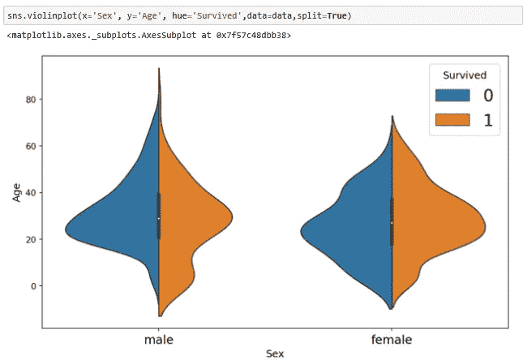

Correlation of Age with the Survival

当我们绘制幸存/死亡乘客的票价时，我们可以看到票价较便宜的乘客更有可能死亡。也就是说，拥有昂贵车票(可能是更重要的社会地位)的乘客似乎被优先营救。x 轴:票价，Y 轴:乘客人数。

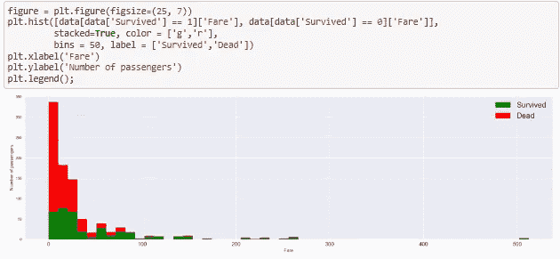

Ticket Fare vs Survival rate

下面是一张图，显示了年龄和费用与存活率的关系。x 轴=年龄，Y 轴=车票 _ 票价，绿点=存活，红点=死亡

x=0 和 x=10 之间的小绿点:幸存的孩子

x=10 & x=45 之间的小红点:死亡的成年人(来自下层阶级)

x=20 & x=45 之间的大绿点:票价较高的成年人幸存下来。

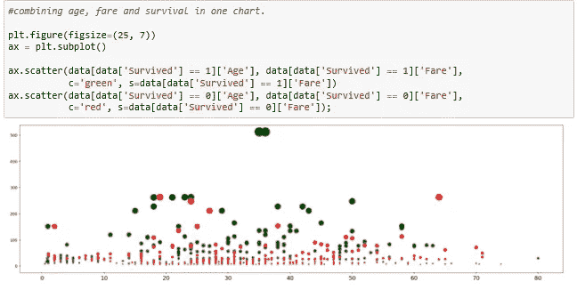

> **现在是特征工程:**

我将训练和测试数据结合起来，对两者都进行了转换。完成后，我分离测试和训练数据，用测试数据训练模型，用验证集(训练数据的小子集)验证模型，评估和调整参数。最后在完整的训练数据上训练模型。然后在测试数据上做预测，提交给 Kaggle。

**处理家庭:**根据家庭的大小创建了一些新的特性(家庭大小，单个，小家庭，大家庭)。这是基于一个假设，即大家庭通常被组织在一起并得到支持，因此他们比那些独自旅行的人更有可能获救。

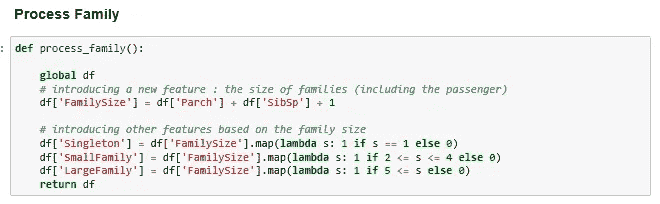

**Process abowed**:用训练集中最频繁的一个“S”填充缺失的装载，并使用 get_dummies 方法对电子标记列进行一键编码。

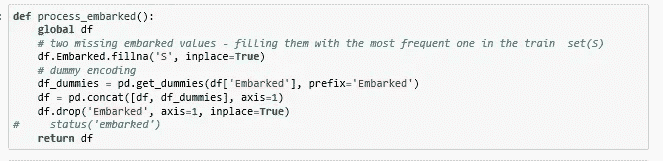

**Process Cabin:** 用 U(表示未知)替换缺失的 cabinet，取 cabinet 的第一个字母，用 get_dummies 方法进行虚拟编码。

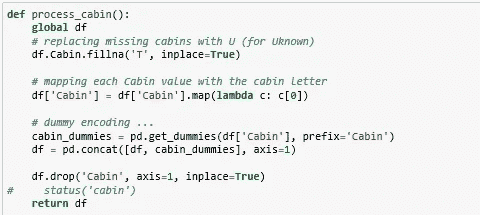

**从名称**中提取乘客标题:通过解析名称并将标题映射到定义的类别，创建了一个新功能“标题”。

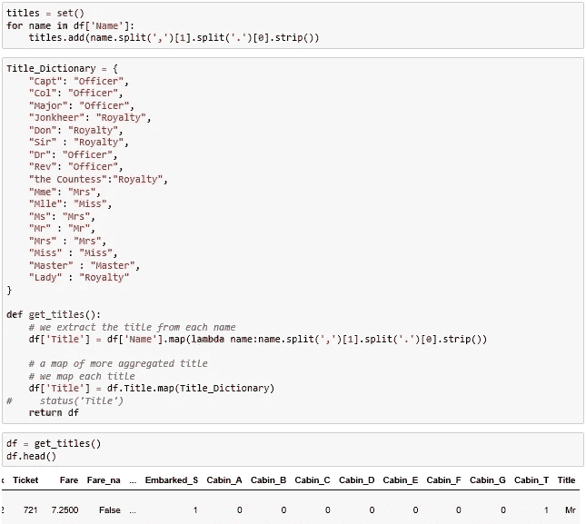

**流程年龄**:正如我们之前看到的，年龄变量有 177 个缺失值，这在 891 个值中是一个巨大的数字。仅仅用平均/中间年龄来代替可能不是最佳解决方案，因为年龄可能因乘客的群体和类别而不同。头衔也有助于计算年龄。首先，我取了按性别、乘客、阶级和头衔分组的平均年龄。

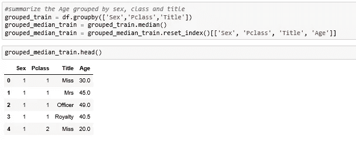

然后，对于所有缺少年龄的记录，基于它们的性别、标题和类别，我们指定年龄。如果完全没有“头衔”,只根据性别和阶级来指定年龄。

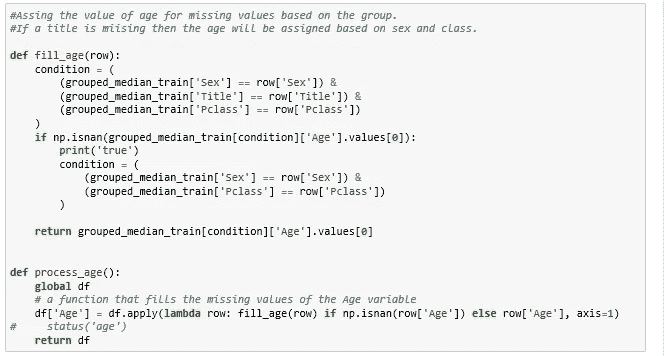

**流程名称**:删除 Name 列，在 Title 列做一个虚拟变量编码。标题列值编码后，数据将如下所示。

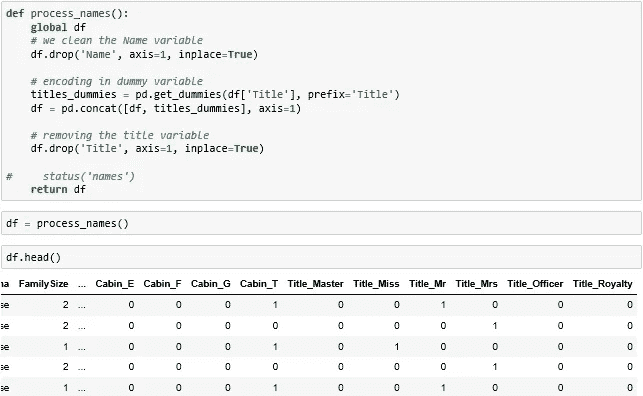

**构建和训练模型:**正如我前面提到的，我将训练集分成训练和验证集(60 个用于验证)，并使用了 RandomForestClassifier。最初，我将树的数量(n_estimators)设置为 20，最终设置为 180，并将分割节点所需的最小样本数设置为 3(min_samples_leaf)。并且还使用 max_features 作为 0.5(在寻找最佳分割时随机考虑 50%的特征)。利用这些参数，该模型在测试数据上获得了 **0.933** 的分数。

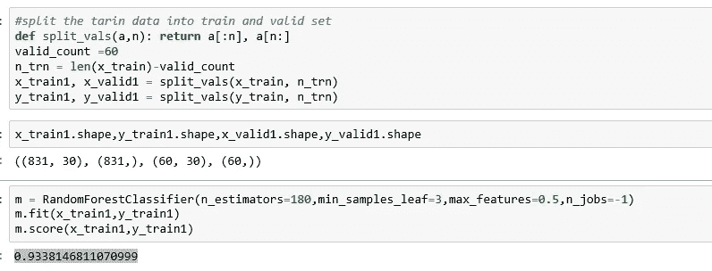

**模型评估**:在验证集上达到 86.67 左右，下面是混淆矩阵和分类报告。

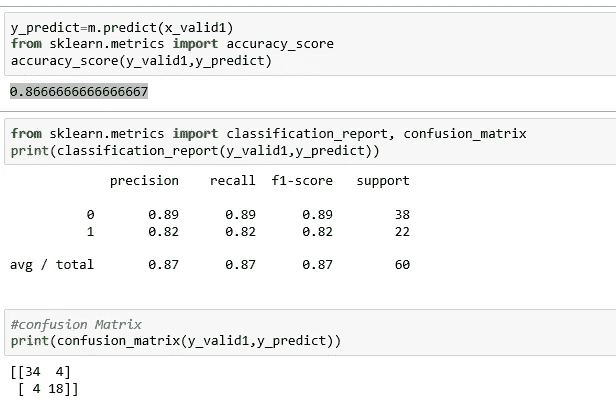

**特性重要性检查**:基于树的评估器可以用来计算特性的重要性，之后我们可以丢弃不相关的特性。以下是最重要的十大特性列表。

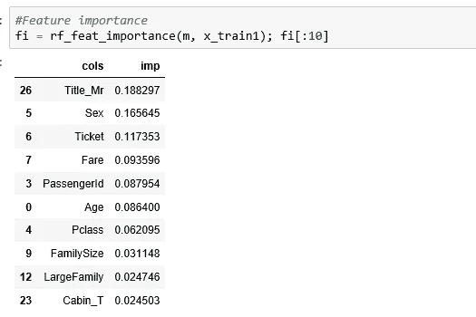

从上表中我们可以看出，头衔、性别、票价、乘客身份、年龄、阶级和家庭规模是更重要的特征。不确定乘客 Id 如何影响预测。下面是相同的图形表示。

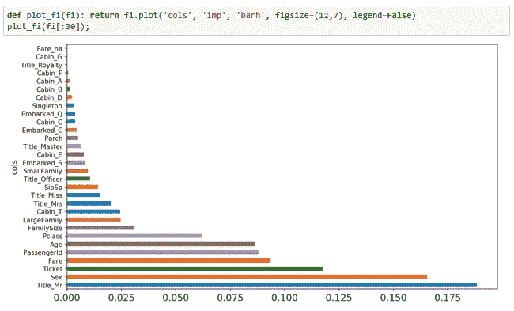

最后，为了最后一次对整个训练数据再次训练模型，我只包括了重要性超过 0.01 的特征。训练后我可以看到分数略有提高，这次是 **0.938** 。

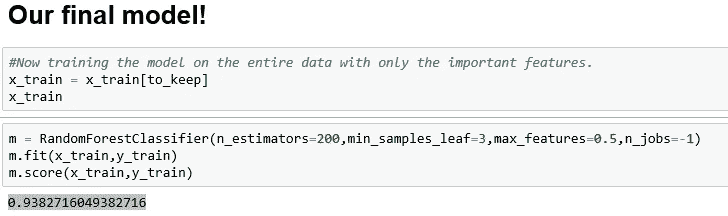

然后我在测试数据上运行模型，提取预测并提交给 Kaggle。它获得了 **0.8133** 的分数，位于**前 7%。**

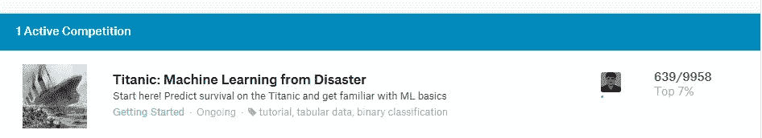

当然，这种模式有很大的改进和修正余地。非常感谢您的阅读，如果您有任何意见、想法和建议，请告诉我。