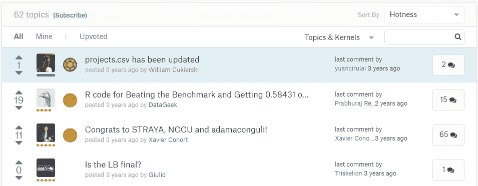
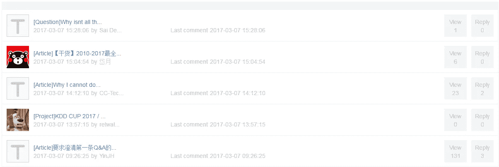
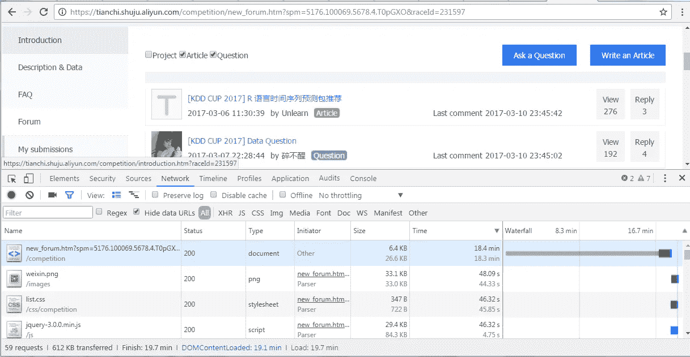
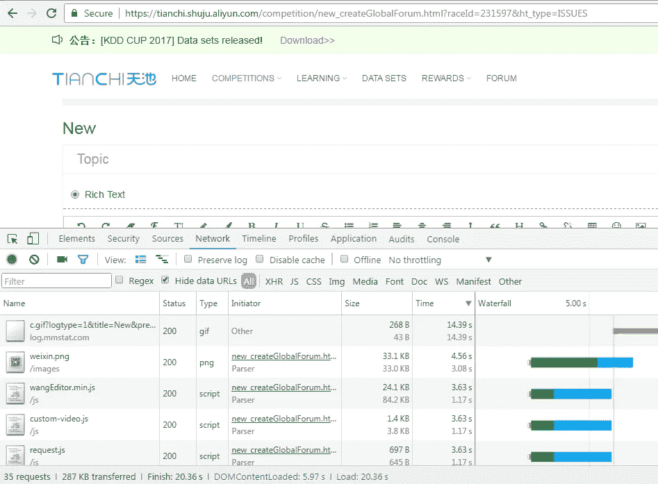
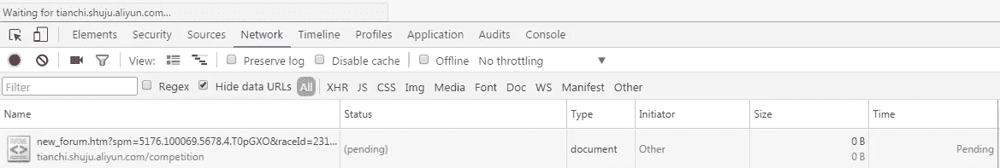

# 数据科学竞赛平台——ka ggle vs 天池

> 原文：<https://towardsdatascience.com/kaggle-vs-tianchi-shuju-fb31403fefeb?source=collection_archive---------5----------------------->

KDD 杯是最负盛名的年度数据挖掘比赛，与 ACM SIGKDD 知识发现和数据挖掘会议同时举行。每年都会征集提案，并根据不同的因素选择组织者。阿里云团队被选中组织 2017 年 KDD 杯。

过去，这些竞赛在 **Kaggle** 上举办，这已经成为数据科学竞赛的同义词。但出于显而易见的原因，阿里巴巴团队选择天池平台举办 2017 年的比赛。但感觉平台还没准备好，缺了很多东西。

*   参与者在下载数据集时遇到困难。必须进行多次尝试才能下载。
*   在 Kaggle 中如此受欢迎的内核在 Tiachi 上却不见了。
*   布局和导航虽然受到 Kaggle 的启发，但看起来毫无创意且半生不熟。例如比较论坛的布局:

**Kaggle**

[**Tianchi.shuju**](https://tianchi.shuju.aliyun.com/competition/new_globalForum.htm)

在天池，我们甚至看不到讨论的完整标题，而且很多讨论都是用中文进行的，而 KDD 杯比赛规则明确提到讨论应该用英文。

*   最后，但并非最不重要的是，该网站非常非常慢。速度可能很快，但一般来说很慢。*举例来说，打开* ***论坛*** *页面有时需要长达 19 分钟。*

Wait, Wait, Wait…

*例如，在论坛中提问可能需要等待 20 秒以上。*

大多数时候，响应是如此之慢，以至于打开一个页面需要很长时间。当您使用开发工具 ***检查*** 时，它的状态为**待定**(如下图*)*。

pending, pending, pending….

看看它如何发展会很有趣。但是第一印象并不好。