# 卡尔曼滤波器:一种理解融合传感器洞察力的算法

> 原文：<https://towardsdatascience.com/kalman-filter-an-algorithm-for-making-sense-from-the-insights-of-various-sensors-fused-together-ddf67597f35e?source=collection_archive---------0----------------------->

你正开车穿过隧道。GPS 信号消失了。然而，你可能想得到通知，你应该在隧道的出口。我们应该如何在隧道内驾驶一辆汽车，只给它最后的位置，它应该知道它现在在哪里？

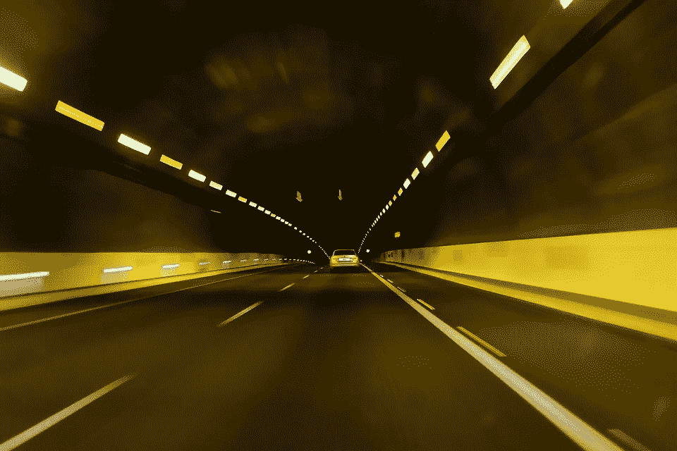

# 关于传感器的简短说明

全球定位系统接收器通过分析它们从卫星接收的信号来计算它们的位置。这些信号不会穿过固体。车辆中的 GPS 可能有一个外部天线，或者它可以从空气中拾取足够的反射信号来工作。如果隧道中的信号太弱，GPS 可能仍会工作，这取决于其质量和功能。

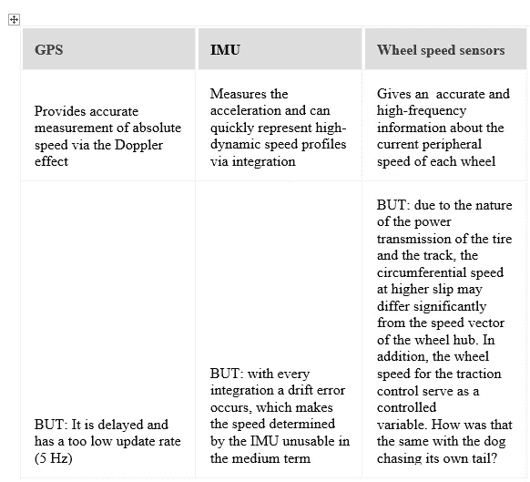

The table explains the pros and cons of each some of the sensors.

> 一种合并车辆传感器的方法可以计算位置。

## 来自传感器的测量值

假设我们在隧道入口，并且我们以 50 公里/小时的速度行驶，那么导航确实可以精确地计算出 1 分钟(t =时间)后我们将在哪里(x =位置)。

两个传感器都有随机误差，传输路径有干扰，CAN 总线或者模数转换器的分辨率都会造成简单语句“速度”的很多不准确。

例如，速度信号看起来像这样:

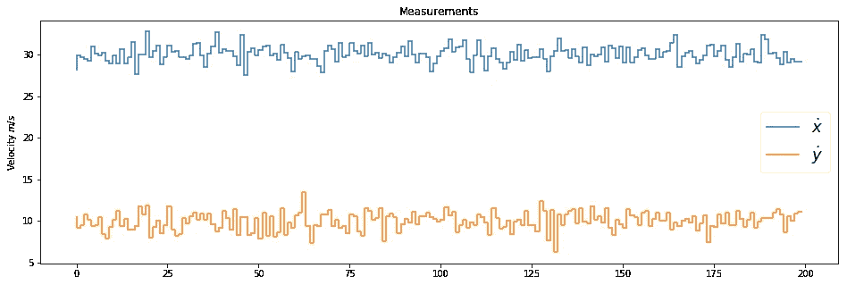

The Velocity is considered to be with a variance on both the axes. ([image source](https://github.com/sharathsrini/Self-Driving-Car/blob/master/Kalman_Filter.ipynb))

平均而言，测得的速度中加入了一些“噪音”,这使它们与地面的真实情况有所不同。如果计算确定的速度的直方图，可以看到确定的值近似服从正态分布。

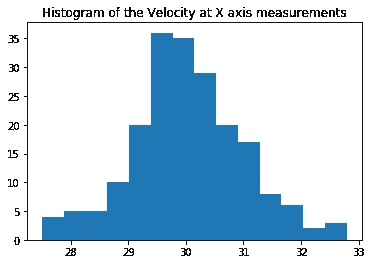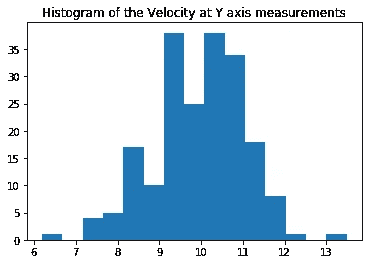

This is the histogram representation of the velocity measurements. ([image-source](https://github.com/sharathsrini/Self-Driving-Car/blob/master/Kalman_Filter.ipynb))

所以有一个，而且真的只有一个，最大值(单峰)和价差(方差)。如果是这种情况，我们仍然可以用一个技巧很好地计算。

# **一维卡尔曼滤波的思想**

我想先解释一下只有一维的卡尔曼滤波器(根据 [Rudolf Emil Kalman](http://en.wikipedia.org/wiki/Rudolf_E._Kalman) )的想法。以下解释借用了*巴斯蒂安·特龙教授*的[*Udacity CS373* 课程](https://www.udacity.com/course/cs373)。

## **计算噪声有助于**

为了在测量噪声的情况下最佳地执行计算，必须知道*“强度”*参数。这个“*有多强”*是用正态分布的方差来表示的。对于正在使用的传感器，这被确定一次，然后仅使用该“不确定性”进行计算。

在下文中，不再用绝对值来计算，而是用正态分布的平均值(μ)和方差σ来计算。正态分布的平均值是我们想要计算的值。方差表示置信水平。正态分布越窄(低方差)，传感器对测量结果越有信心。

> 精确测量 100%的传感器的方差为σ = 0(不存在)。

我们假设 GPS 信号刚刚丢失，导航系统完全不清楚你在哪里。方差高，对应的曲线确实平坦。有一个不确定性。

方差= 20 且均值= 0 的正态分布

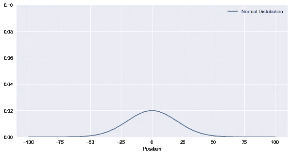

The Uncertainty is High, as the variance is in a large magnitude.([image-source](https://github.com/sharathsrini/Self-Driving-Car/blob/master/Kalman_Filter.ipynb))

现在来自传感器的速度测量值也是“不准确的”,具有适当的方差。这两种不确定性现在必须联系在一起。借助于贝叶斯规则，执行两个高斯函数的相加。Thrun 教授在 Udacity CS373 课程中非常清楚地解释了这一点。

这两条信息(一条用于当前位置，一条用于传感器的测量不确定性)实际上给出了更好的结果！。正态分布越窄，结果越有把握。运动恶化了估计。

当然，车辆也会移动，这不利地影响了位置确定的精度。例如，传感器可以确定车轮的旋转，并假设车轮的半径，还可以得出行驶距离的结论，但这总是有些不准确。这种运动的不精确性也可以用正态分布来描述。这一次，使用当前估计值进行计算的方式略有不同，因为“运动”也可以称为“预测”。你可以在计算后估计，你下一次(测量)时间会在哪里。

在我们的例子中，μ就是 v * dt，它是我们在计算时间内走过的距离。

一个简单的实现是:

```
def predict(mean1, var1, mean2, var2):
 new_mean = mean1 +mean2
 new_var = var1 + var2
 return [new_mean, new_var]
```

# 测量和更新:卡尔曼滤波器

卡尔曼滤波器只是反复计算这两个函数。

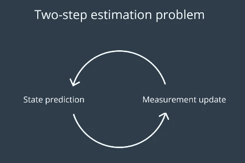

The filter loop that goes on and on.

过滤器循环覆盖结果的平均值和方差。只要读数不偏离预测值太多，过滤器将始终确信其位置。

> *一项新的测量提高了估计值*

> 由于测量值(在更新中)与预测值(通过预测)相对较好地吻合，所以滤波器逐步改进以确保它是正确的(正态分布变得更窄和更高)，即使值是有噪声的。

```
def update(mean1, var1, mean2, var2):

 sum = var1+var2
 pr_s = mean1*var2 + mean2*var1
 #print(pr_s)
 new_mean =1/(sum) * pr_s
 product = var1*var2
 new_var = product/sum
 return [new_mean, new_var]
```

> 没有矩阵，你只能在一个维度上计数，这不足以…

# 多维卡尔曼滤波器

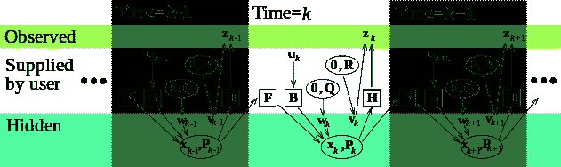

The Picture Illustrates the Kalman Filter ‘s Predition step in various time-stages. ([Image Source](https://www.wikiwand.com/en/Kalman_filter))

我想用一辆带导航装置的汽车进入隧道的例子来再次解释这个过程。最后已知的位置是在失去 GPS 信号之前。之后，只有车辆的速度信息(车轮速度和横摆率)可作为正常分布的噪声测量变量。从这里开始，计算速度。

我们现在转向更复杂的部分。因此，提到的将平均值和方差相乘或相加的过程仅在一维情况下有效。在多维问题中，我们将在一个矩阵中得到均值和方差，所有的运算都在这个矩阵中进行。也就是说，当你想要测量的状态只需要一个变量就可以完全描述。开始时提到的确定车辆在隧道中位置的例子，已经不能完全用变量来描述了。虽然只对位置感兴趣，但这已经是平面上的二维问题了。另外，只能测速度，不能直接测位置。这导致卡尔曼滤波器具有以下状态变量。

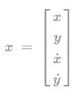

The state matrix consists of position and velocity in the x and y coordinates.

# 初始条件/初始化

## 系统状态 X

开始时，我们必须初始化一个初始状态。在一维情况下，状态是一个矢量。


如果什么都不知道，你可以简单地在这里输入零。如果一些边界条件是已知的，它们可以被传送给过滤器。以下协方差矩阵的选择控制滤波器收敛到正确(测量)值的速度

## 协方差矩阵 P

必须给初始状态一个不确定性。在一维情况下，方差是一个向量，但现在是所有状态的不确定性矩阵。以下是所有四种状态的示例。

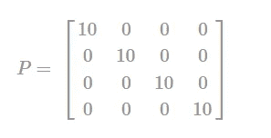

The covariance matrix consists of uncertainty in the position and the velocity in the x and y coordinates.

该矩阵最有可能在过滤过程中被改变。它在预测和校正步骤中都被改变。可以基于传感器精度来初始化矩阵。如果传感器非常精确，这里应该使用小值。如果传感器相对不精确，这里应该使用较大的值，以允许滤波器相对快速地收敛。如果传感器非常精确，这里应该使用小值。

## 动态矩阵 A

然而，过滤器的核心是下面的定义，我们应该在充分理解物理环境的情况下建立这个定义。这对于很多真题来说并不容易。对于我们这个简单的例子(面内运动)，其背后的物理原理来自于平滑运动。对于上面所示的状态矩阵，矩阵符号中的动态如下:


The Dynamic matrix helps us in defining the equations for predicting the Vehicle Motion Model.

这说明了状态向量从一个计算步骤移动到下一个步骤的“位置”。在我们的例子中，这种动态模型是“恒速”模型，因为它假设速度在滤波器的计算步骤( *dt* )中保持恒定。

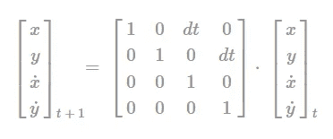

This is the prediction step for the State matrix.

这只是反映了匀速运动的物理关系。更高的形式是恒定加速度模型，它是一个 6-D 滤波器，仍然包括状态向量中的加速度。原则上，这里可以指定其他动力学。

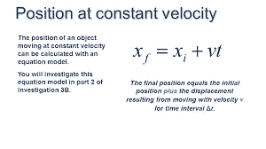

[*(Image Source)*](https://encrypted-tbn0.gstatic.com/images?q=tbn:ANd9GcSjDfiW3kwdlflT4g4Y-ROtNavKqMiq03ge-sv2QgtjIeVHCeju)

## 过程噪声协方差矩阵 Q

由于车辆的运动(在叠加的正态分布噪声的意义上)也可能受到干扰，这就是引入过程噪声协方差矩阵的地方。这个矩阵告诉我们滤波器，以及系统状态如何从一个步骤“跳到”下一个步骤。想象一下自动驾驶的车辆。它可以被一阵风或道路颠簸扰乱，这就产生了力的效应。驾驶员的速度变化也是作用在车辆上的加速度。如果加速度现在影响系统状态，则其物理相关性为 q。该矩阵是一个包含以下元素的协方差矩阵:

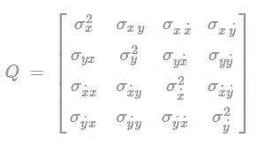

The Process Noise Co-variance matrix consist of the errors caused in the process.

通过放置向量，然后乘以加速度的假设标准偏差，很容易计算出来。

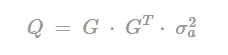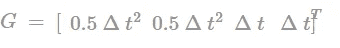

The Equations to set the Q matrix appropriately.

## 控制矩阵 B 和控制输入 u

外部控制变量(如:转向、制动、加速等。)是可能的。u 矩阵将包含系统的机器人输入，可以是瞬时加速度或系统从 IMU 或里程表传感器行进的距离。

## 测量矩阵 H

还必须告诉滤波器测量的是什么以及它与状态向量的关系。在车辆的例子中，汽车进入隧道，在第一点仅测量位置，仅测量速度！这些值可以用系数 1.0 直接测量(即速度直接用正确的单位测量)，这就是为什么在中只有 1.0 被设置到适当的位置。

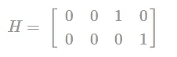

The H-matrix.

> 如果传感器以不同的单位或尺寸进行测量，测量矩阵中的关系必须映射到公式中。

## 测量噪声协方差矩阵 R

与一维情况下的方差一样，测量不确定性也必须在这里说明。

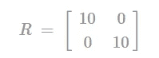

这种测量不确定性表明人们对传感器测量值的信任程度。因为我们测量位置和速度，这是一个 2 × 2 矩阵。如果传感器非常精确，这里应该使用小值。如果传感器相对不准确，这里应该使用较大的值。

## 单位矩阵 I

最后但并非最不重要的是，一个单位矩阵是必要的，这将用于简化卡尔曼方程。

# 过滤步骤预测/预测

卡尔曼滤波器的这一部分现在敢于预测系统未来的状态。另外，在一定条件下，可以用它计算出一个不可测量的状态！太不可思议了，但这正是我们所需要的。我们无法测量车辆的位置，因为导航设备的 GPS 在隧道中没有接收信号。然而，通过用位置初始化状态向量并测量速度，动力学仍然被用于做出关于位置的最佳预测。

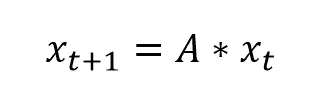

还必须重新计算协方差。在预测步骤中，系统状态的不确定性增加，正如我们在一维情况中所看到的。在多维情况下，测量不确定性增加，因此不确定性变得越来越大。

> P=A⋅P⋅A'+Q

就是这样。卡尔曼滤波器对未来或即将到来的时间步中的预期系统状态做出了预测声明。滤波器现在将测量/校正并检查系统状态的预测是否与新的测量值很好地吻合。

被滤波器选择为较小的协方差说明了确定性，如果不是，那么一定有问题，这使得滤波器更加不确定。

# 过滤步骤测量/校正

> 注:以下数学计算不需要推导。

来自传感器的当前测量值，利用该测量值，通过使用测量值、具有测量矩阵的状态向量来获得新息因子(y)。

> y=Z−(H⋅x)

然后，查看可以进一步计算的方差。为此，不确定度和测量矩阵和测量不确定度是必需的。

> s=(h⋅p⋅h′+r)

这决定了所谓的卡尔曼增益。它说明了应该更熟悉读数还是系统动力学。

> k =p⋅·h

> 如果读数(测量值)与预测的系统状态匹配，卡尔曼增益将降低。如果测量值与此相反，矩阵 K 的元素会变大。

该信息现在用于更新系统状态。

> x = x + ( K⋅ y)

并且还为即将到来的预测步骤确定了新的协方差。

> p = p-(k⋅·惠普)

也就是说，

> ⋅·p

现在回到步预测。图形看起来是这样的:

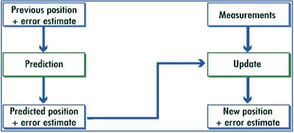

The Kalman filter could be understood as a loop ([image source](http://www.argos-system.org/manual/3-location/32_principle.htm))

> 只要有测量值输入，该过滤器就会永久运行。它也可以是开环的，因此如果没有可用的测量值，则只执行预测步骤。然后不确定性越来越大。

# 工作中的过滤器

当我们驶入隧道时，GPS 会记录下我们最后知道的位置。卡尔曼滤波器仍然可以预测车辆的位置，尽管它不是一直被测量。

现在假设通过 [CAN 总线](https://www.wikiwand.com/en/CAN_bus)可获得大约每 20 米/秒的车速，6 次迭代仅需 0.1 秒。滤波器收敛相对较快，这取决于初始条件的选择。例如，在 100 次迭代(相当于车辆上的 2s)之后，方差已经非常低，因此滤波器对其估计和更新状态有信心。我实现的[线性卡尔曼滤波器](https://github.com/sharathsrini/Self-Driving-Car/blob/master/Kalman_Filter.ipynb)可以在这里找到。结果是:

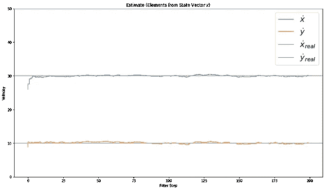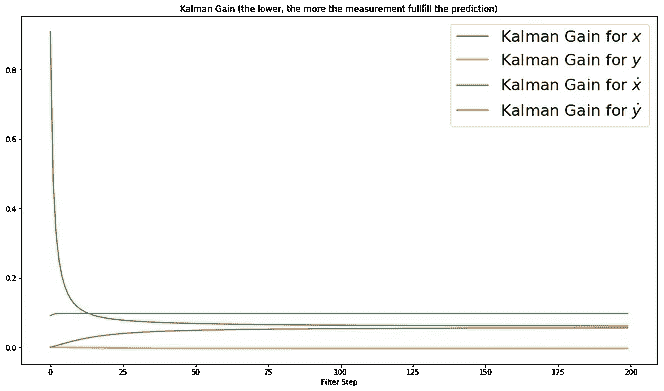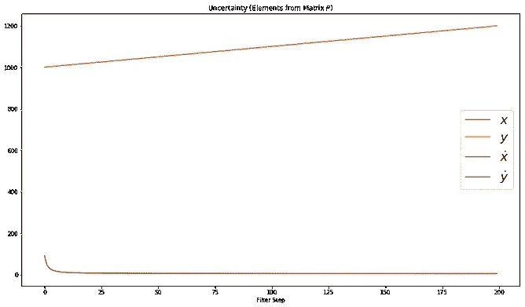

The First Image depicts the Estimated Value of each estimated value of the velocity in the X and Y co-ordinates. The Second Image Illustrates the Kalman gain for each of the parameter in the State Matrix. The Uncertainty Matrix containing the variance in each parameter of the State Matrix. ([https://github.com/sharathsrini/Self-Driving-Car/blob/master/Kalman_Filter.ipynb](https://github.com/sharathsrini/Self-Driving-Car/blob/master/Kalman_Filter.ipynb))

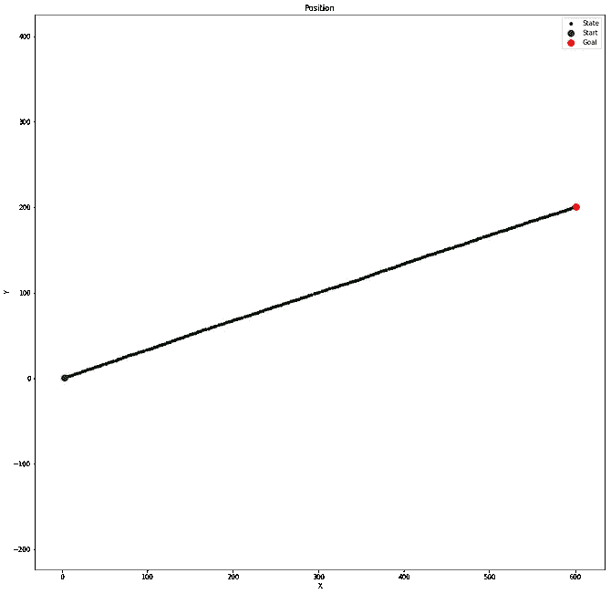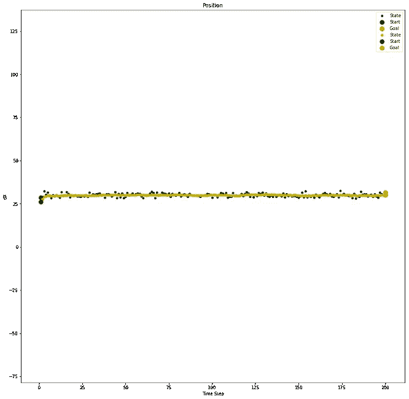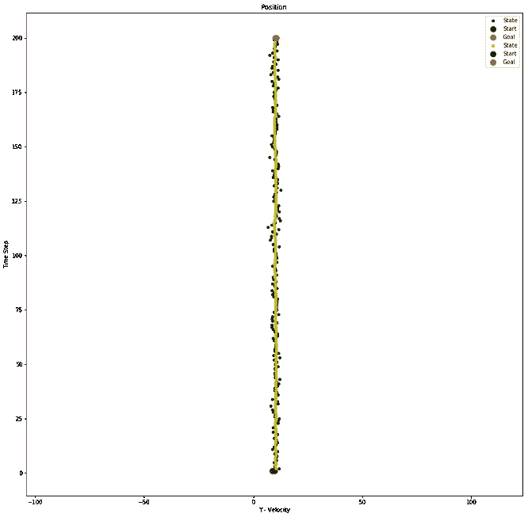

The First Image Plots the position of the vehicle in both X and Y Coordinate. The Second and Third Image Tells us the relationship between the estimated and the actual velocity in the X and Y Co-ordinates. ([https://github.com/sharathsrini/Self-Driving-Car/blob/master/Kalman_Filter.ipynb](https://github.com/sharathsrini/Self-Driving-Car/blob/master/Kalman_Filter.ipynb))

# 卡尔曼滤波器的 Python 实现

```
def Kalman_Filter() :
  for n in range(measurements):
     x = A*x+B*u[n]
     P = A*P*A.T + Q

 # Measurement Update (Correction)
 # ===============================
 # Compute the Kalman Gain
    S = H*P*H.T + R
    K = (P*H.T) * np.linalg.pinv(S)# Update the estimate via z
    Z = mx[n]
    y = Z — (H*x) # Innovation or Residual
    x = x + (K*y)

 # Update the error covariance
    P = (I — (K*H))*P
```

# 滤波器设计:我如何选择 Q 和 R？

总的来说，不管数值有多大，而是比例有多大。如果选择的值大十倍，这几乎不会影响滤波器。**价值观的比例至关重要。**正确的选择将直接关系到滤波器的性能，并构成滤波器设计的基本问题。

这个非此即彼的问题只能在特定应用的基础上决定。在某些情况下:

1.  我们只想为相对稳定的过程过滤测量不佳的传感器。例如，我们可以实现卡尔曼滤波器来优化火箭炉或化学炉中温度控制器。
2.  我们还想合并几个传感器，并应保持动态。因此，应该选择矩阵。当然，可选地，过滤器可以被设计成在操作期间自动适应。

## 卡尔曼滤波器与递归最小二乘法有何不同？

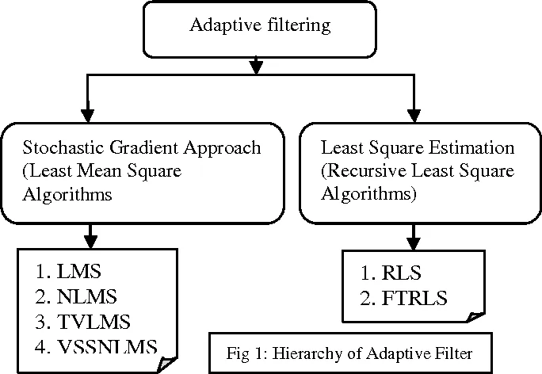

flowchart of adaptive filtering techniques [(image)](https://ai2-s2-public.s3.amazonaws.com/figures/2017-08-08/ae261153face27a228b0ff2697919a3311e3962d/1-Figure1-1.png).

**卡尔曼滤波器**作用于用于线性和时变或时不变系统的预测校正模型。预测模型涉及实际系统和过程噪声。更新模型包括用观测噪声更新预测值或估计值。基于 RLS 算法计算卡尔曼增益，以便在更少的时间内达到最优值。

**递归最小二乘法**基于加权最小二乘法，其中考虑了以前的值以确定未来值。每个权重被指数分配给实际系统的每个先前值。权重基于内存递归更新。

**显著差异:**

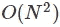

Computational Time complexity of RLS

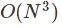

Computational Time complexity of Kalman Filter

1.  RLS 比卡尔曼滤波器快。
2.  卡尔曼滤波器精度高。
3.  卡尔曼滤波器是基于状态空间模型的，我们需要对整个系统建模以达到最优值。

## 卡尔曼滤波器和多项式回归

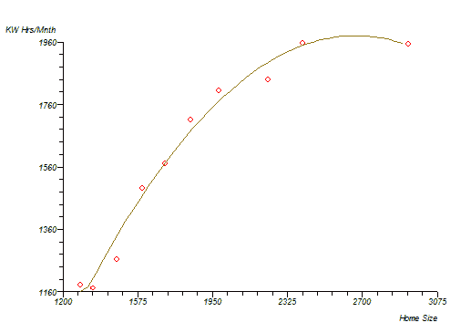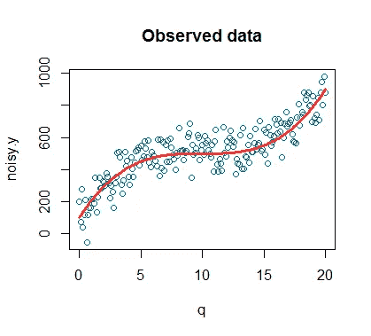

examples of polynomial regression([1](https://www.statsdirect.com/help/resources/images/polynomialcurve.gif))([2](https://www.google.co.in/search?q=polynomial+regression&rlz=1C1CHBF_enIN785IN785&source=lnms&tbm=isch&sa=X&ved=0ahUKEwjn7ZXc7qzaAhUFRo8KHaqPDyEQ_AUICygC&biw=1366&bih=672#imgrc=kCBKN7NVSLkg-M:))

多项式回归是一种函数逼近的方法。我们有一个数据集，我们必须确定函数关系，这通常通过估计概率密度 p(z|x)来表示。在假设这个概率是高斯分布的情况下，我们得到最小二乘解作为最大似然估计量。

由于线性动态系统是状态空间模型，我们假设我们观察到的数据是通过应用线性变换产生的。我们得到的模型是一个时间序列的概率。然后，该过程预测时间序列的下一个值。

> 多项式回归做函数逼近，卡尔曼滤波做时间序列预测。

时间序列预测是函数逼近的特例。这两个模型都是基于他们观察到的数据的不同假设而建模的。

# 结论

卡尔曼滤波器相对快速且易于实现，并且在某些条件下为正态分布的噪声传感器值提供了条件的最佳估计。卡尔曼先生对他的算法深信不疑，以至于他能够启发美国宇航局的一位友好的工程师。因此，这个过滤器第一次帮助了登月的阿波罗导航计算机。

## 有用的链接:


(I[mage source](http://www.columbia.edu/cu/lweb/img/assets/3841/reference.logo.jpg))

1.  [罗杰·拉布](https://github.com/rlabbe/Kalman-and-Bayesian-Filters-in-Python)的 Jupyter 笔记本收藏。
2.  米歇尔·范·比森的惊人视频系列
3.  [画面中的卡尔曼滤波器](http://www.bzarg.com/p/how-a-kalman-filter-works-in-pictures/)。
4.  Vivek Yadav 的[博文](/kalman-filter-intuition-and-discrete-case-derivation-2188f789ec3a)。
5.  由[大卫·西尔弗](https://medium.com/u/8190c86ea791?source=post_page-----ddf67597f35e--------------------------------)撰写的[惊人帖子](https://medium.com/self-driving-cars/all-about-kalman-filters-8924abe3aa88)。