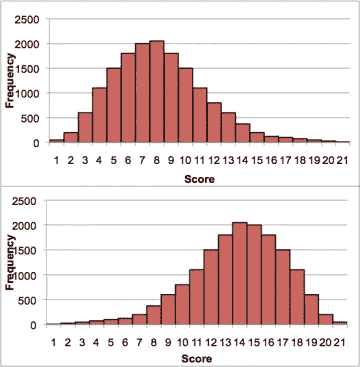
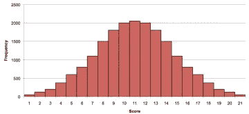
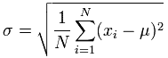
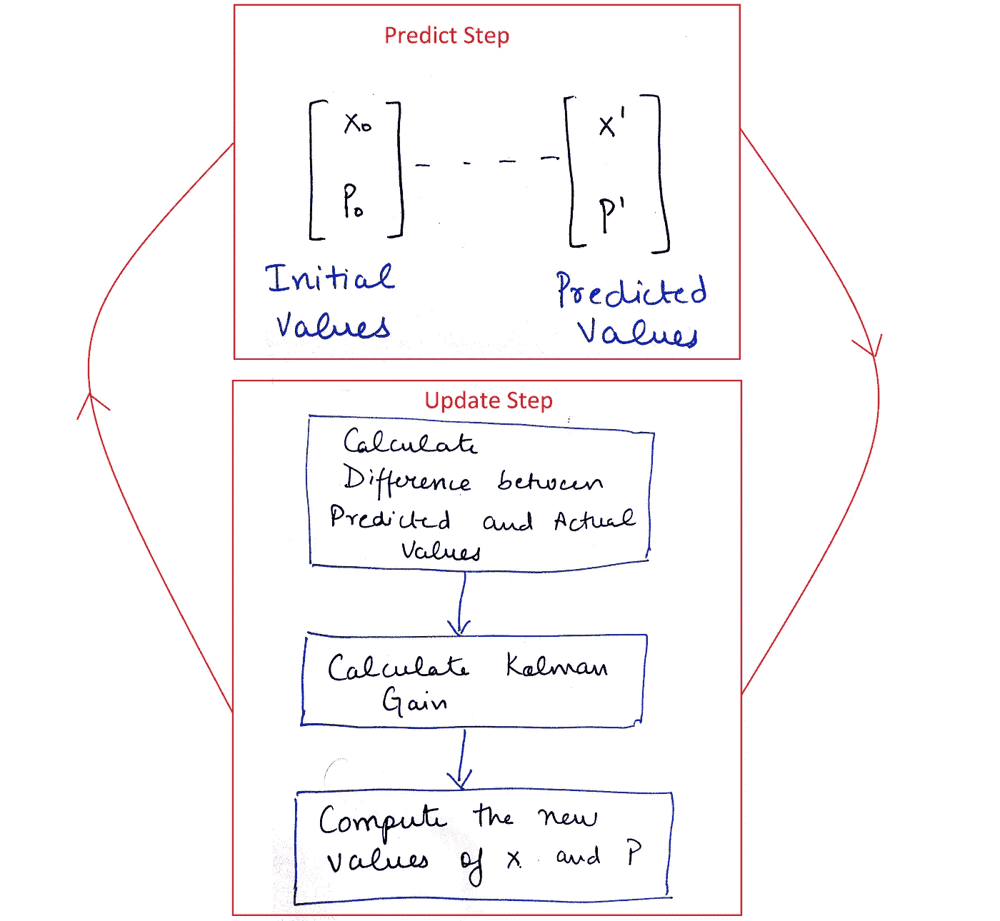
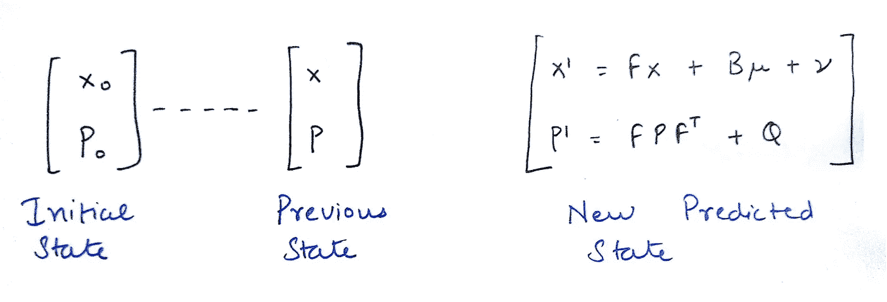
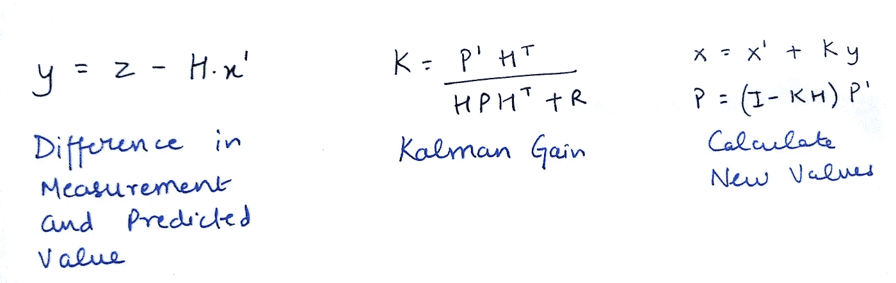
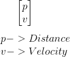
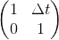
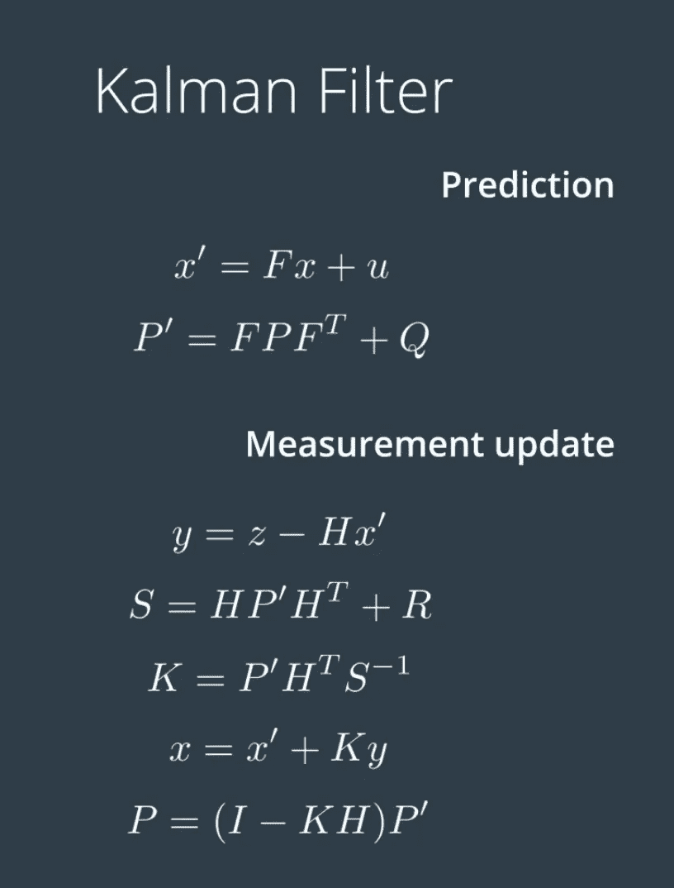

# 卡尔曼滤波面试

> 原文：<https://towardsdatascience.com/kalman-filter-interview-bdc39f3e6cf3?source=collection_archive---------1----------------------->

我目前进入了我的自动驾驶汽车 Nanodegree 的第二学期。最近，我遇到了我的一位同事 Larry，他是一名年轻的开发人员，非常兴奋能够成为自动驾驶汽车行业的一员。他问我对卡尔曼滤波的理解。对话开始了。

拉里:什么是卡尔曼滤波器？
我:卡尔曼滤波器是一种帮助预测数值的工具。

拉里:那太酷了！意味着它是某种占星家？
我:嗯，不完全是。这是一个迭代数学过程，使用一组等式和连续数据输入来快速估计我们感兴趣的与对象**相关的值。基本上都是速算！**

拉里:我的数学没那么好！也许这对我来说听起来有点荒谬。你能继续吗？我:首先，卡尔曼滤波器适用于高斯分布或正态分布。

拉里:正态分布？
Me:在一个连续的图形中，数据可以以不同的方式展开:要么向左展开，要么向右展开，要么杂乱无章地向上展开。

Figure 1\. Example of left skewed and right skewed distribution ([image source](https://en.wikivet.net/Data_description))

但是在许多情况下，数据趋向于围绕一个中心值，没有左右偏差，产生的分布称为正态分布、高斯分布或钟形曲线。

Figure 2\. Example of a normal distribution, looks like a bell hence bell curve. ([image source](https://en.wikivet.net/Data_description))

拉里:知道了！正如你指出的，这是一条连续曲线，而不是离散值。我怎么知道掷骰子得到 5 的概率？我:嗯，好问题，但是为了表示像得到骰子的概率这样的分布，我们使用二项式分布，因为它是离散值的。在正态分布中，你需要定义一个范围。说一下，4.5 到 5.5 厘米之间的降雨概率是多少。在这种情况下，我们有一个正态分布，我们标记这些点，并计算这些点下的面积，这就给出了概率。

拉里:哦！所以完全图的面积是 1，因为概率的最大值是 1？
Me:完全正确，另外在这种分布的情况下，均值、中位数、众数都是相等的。

拉里:但是你没有用数学术语来表示高斯？
我:所以，要定义高斯，我们基本上有两样东西——均值和方差。
均值( *μ)* 你显然知道，方差(σ)基本上讲的是数字散开了多少，离均值有多远。标准差(σ)就是方差(σ)的平方根，由公式给出:

拉里:那么高斯和卡尔曼滤波器有什么关系呢？
我:嗯！卡尔曼滤波器中的高斯表示预测值，在我们的预测中有噪声/误差/不确定性，通常称为方差。预测值以平均值为中心，高斯宽度表示我们的值的不确定性。基本上，它告诉我们有多少把握某个值是真实的。高斯曲线的宽度越大，表示不确定性越大。

拉里:哦！你在这里玩了一点多态性游戏。你之前提到这是一个迭代的过程？我:是的，这基本上是一个两步的过程。预测
2。更新

在预测中，我们只是根据初始值预测称为**预测值**的新值，然后根据系统中存在的各种过程噪声预测我们预测中的不确定性/误差/方差。

在更新中，我们考虑了来自设备的实际测量值，我们称之为**测量值**。这里，我们计算预测值和测量值之间的差异，然后通过计算卡尔曼增益来决定保留哪个值。然后，我们基于由卡尔曼增益做出的决定来计算新的值和新的不确定性/误差/方差。这些计算值将最终成为我们的卡尔曼滤波器在迭代 1 中所做的预测。

更新步骤的输出再次馈入预测状态，循环继续，直到我们的预测值和实际值之间的误差/不确定性趋于零。

赖瑞:嗯，那真是太快了。你能以任何例子或流程图来解释吗？
我:好的，那么从现在开始就按照这些记法来:

> x ->均值
> P - >方差

Figure 3\. A Rough Flowchart for Kalman Filter

拉里:似乎很直观！但是卡尔曼增益是什么鬼？
Me:卡尔曼增益是决定预测值和测量值应占多大权重的参数。它是决定我们的实际值是接近预测值还是实测值的参数。

拉里:但是它怎么知道如何相信预测值或实际值呢？
我:它检查不确定性/错误我的朋友。

> K =预测误差/(预测误差+测量误差)

K 的值范围从 0 到 1。如果我们有一个很大的测量误差，K 更接近 0，这意味着我们的预测值接近实际值。如果我们的预测误差很大，K 更接近 1，这意味着我们的测量值更接近实际值。

拉里:好的，同意！我现在开始兴奋了。你现在能详细说明这些方程式吗？
我:当然。对于预测和更新步骤，我会以不同的方式写下来。记住这些方程是 2D 空间的。

Figure 4\. Equations for Predict Step

Figure 5\. Equations for Update Step

拉里:到了这一步，也许我们应该结束讨论了。什么是 F，B，H？还有各种各样的变量被打乱了。你说这就是卡尔曼滤波器，我理解它的功能，但为什么现在有这些未知的东西？
我:别慌。我现在将详细解释一切。
假设我们想要根据来自不同传感器的测量结果预测汽车的位置和速度。

> x ->包含位置和速度的平均状态向量。
> P - >协方差矩阵(表示误差)。

x vector

# 预测步骤

> 等式 1:
> 
> **x′= f . x+b .μ+ν**
> 
> x′-->预测值
> F - >状态转移矩阵
> B - >控制输入矩阵
> μ - >控制向量
> ν - >过程噪声

## f 矩阵

f 是将矩阵从一种形式转换成另一种形式所需的状态转移矩阵或适应性矩阵。例如，假设我们有一个模型，在这个模型中，我们预测了没有加速的物体的位置和速度。因此，在这种情况下，时间δt 后的新 p 和 v 为:

p′= p+vδt

v′= v
因此，在这种情况下，F 矩阵将为:

F Matrix

## b 矩阵

b 是控制输入矩阵，表示由于内部或任何外力引起的对象状态变化。例如，重力或物体的摩擦力。

## 为什么 B.μ = 0？

大多数情况下，在自动驾驶汽车的情况下，控制产品向量的值等于零，因为我们无法模拟作用于汽车上物体的外力。

## ν

这是过程中的噪音。我们添加了信道中可能存在的随机噪声，以使我们的预测稍微正确一些。

> 等式 2:
> 
> **p′=fpfᵀ+q**
> 
> p′-->预测协方差
> Fᵀ - >状态转移矩阵的转置
> Q - >噪声

## q 矩阵

我们假设物体改变了方向，或者加速或减速。因此，在时间δt 之后，我们的不确定性增加了 Q 倍，这也是噪声。*所以我们在技术上把噪音加到噪音里。*

所以在预测步骤中，我们得到两个预测值 x’和 P’。

# 更新步骤

> 等式 1:
> 
> **y = z-h . x′**
> 
> z ->实际测量
> H - >状态转移矩阵
> x′->预测值
> y - >测量值与实际值之差

## z

这是来自传感器的实际**测量值**。

## H

这又是一个状态转移矩阵。有了 H，我们可以从状态变量中丢弃我们不需要的信息。从技术上讲，H 做的工作和 F 在预测步骤中做的工作是一样的。

> 等式 2:
> 
> **s =hp′hᵀ+r
> k =p′hᵀs⁻**
> 
> R ->测量噪声
> K - >卡尔曼增益
> S- >总误差
> s⁻->s 的逆

## 稀有

r 表示测量中的噪声。*什么？所以那些设备不是 100%准确？*是的，在这个世界上没有什么是完美的，甚至测量价值的设备也是如此。所有设备都带有由制造商给定的 R 参数预定义值，该值在整个周期内始终保持不变。

## K

我们这里有一个复杂的等式，但它非常简单。我们正在计算卡尔曼增益 K，其公式已在前面给出。

## S

这是系统的总误差。我们预测的误差加上测量的误差。

*那么，为什么对于 K 来说如此复杂的方程在早先的公式中却是简单的呢？* 这是因为我们对于矩阵没有除法的概念。因此，我们选择首先计算总误差，然后将预测中的误差乘以总误差的倒数。

> 等式 3:
> 
> x = x′+k . y
> P =(I-KH)P′

## 最后一步

这是最后一步，我们根据卡尔曼增益的计算来更新 x 和 P。注意-在 LHS 上，我们有 x 和 P，而没有 x’和 P’，因为我们现在为下一个预测步骤设置 x 和 P，因此我们需要找到它们的值。

赖瑞:嗯，这需要一些时间来消化！为了完全理解它，我必须通过哪些额外的资源？
我:宇宙感谢[米歇尔·范·比曾](https://www.youtube.com/channel/UCiGxYawhEp4QyFcX0R60YdQ)通过他的 YouTube 频道对卡尔曼滤波器的精彩贡献。观看他的视频，了解更多示例和见解。

总结所有等式:

Figure 6\. Taken from Udacity Nanodegree

> 未完待续…(商店里的 EKF 和 UKF)

给读者的提示——如果你注意到这篇文章中有任何错误，请不吝赐教或留下私信。

> 更新 1- [扩展卡尔曼滤波器](https://medium.com/@harveen54/extended-kalman-filter-43e52b16757d)
> 
> 更新 2- [无味卡尔曼滤波器](https://medium.com/@harveen54/the-unscented-kalman-filter-anything-ekf-can-do-i-can-do-it-better-ce7c773cf88d)