# 卡尔曼滤波器:直觉和离散情况推导

> 原文：<https://towardsdatascience.com/kalman-filter-intuition-and-discrete-case-derivation-2188f789ec3a?source=collection_archive---------1----------------------->

# 介绍

在这篇文章中，我们将回顾离散卡尔曼滤波器的推导过程。我们将首先建立由离散动态控制的系统的方程，然后表达近似系统，计算误差协方差并计算最小化误差协方差的更新规则。由于经由卡尔曼滤波的估计涉及连续的测量和状态传播，所以在离散实现的情况下它们更容易理解。

这部分是我在石溪大学开发的高级控制系统课程的一部分。随着时间的推移，我会继续在 medium 上添加额外的注释，但如果你感兴趣，可以在这里找到完整的注释。相关概率概念的细节可以在介绍性的[课](https://mec560sbu.github.io/2016/10/14/Uncertainity/)中找到。首先，我们将讨论模型可能具有的不确定性类型。

综上所述，根据不确定性的类型，对模型的影响可能会有所不同。由于我们不知道真正的不确定性及其结构，一个安全的做法是假设潜在的误差是零中心高斯过程。这种假设没有错，因为在大多数情况下，我们至少能够使用系统识别方法近似地模拟系统。作为一个例子，考虑这样一种情况，我们得到状态和状态的导数，并对数据拟合一个线性模型。这给了我们一个近似的模型，我们可以假设任何与这个理想化模型的偏离都遵循高斯分布。

**卡尔曼滤波直觉-I**

下面的动画展示了卡尔曼滤波器背后的直觉。状态按照系统动力学传播。因为我们不知道状态的真实值，所以我们基于测量来估计它们。由于这些测量是在不连续的时间进行的，所以真实的状态可能是什么是不确定的。然而，我们知道状态必须遵循一些近似的动力学。在下面的动画中，一个点以恒定的速度移动，因为位置、速度或加速度并不精确。

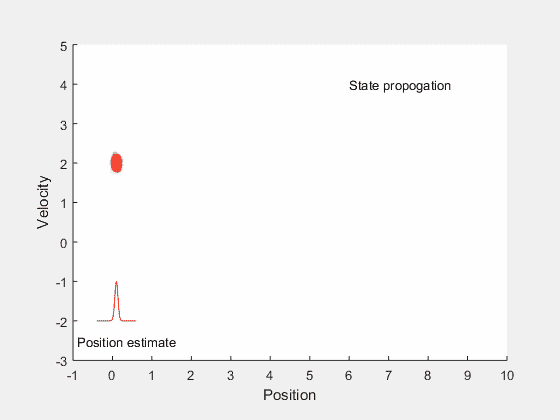

由于不知道确切的位置、速度和加速度，红点的可能位置在一段时间后会发生偏离。这导致真实状态下的估计误差。当一个新的测量值到来时，我们可以使用这个信息来丢弃一些不太可能的值。在进一步描述之前，让我们澄清一些术语，

*   **状态传播**是指在测量到来之前，我们允许系统跟随其动态并计算近似状态值的过程。
*   **先验估计值**是在考虑新测量值之前，使用状态传播计算的值。
*   **后验估计值**是考虑新测量值后计算出的值。
*   误差协方差是真实状态和估计值之间的误差。

使用上面的术语，我们在测量可用之后执行状态传播。我们使用状态传播来计算状态概率分布的先验估计。一旦有了新的度量，我们就执行贝叶斯规则更新以获得更好的概率估计。下面给出了概率贝叶斯规则。这些摘自我关于[不确定性](https://mec560sbu.github.io/2016/10/14/Uncertainity/)的高级控制系统笔记。

执行这个步骤给出了位置和速度的更好的估计，尽管事实上我们只有位置的估计。

**卡尔曼滤波直觉-II**

我们将通过另一个例子来更好地理解卡尔曼滤波器如何将一个状态的测量值和系统动态结合起来，从而对测量状态和不测量状态给出更好的估计。

卡尔曼滤波器在两个主要步骤中执行状态估计。第一步涉及系统动力学的传播，以获得状态的先验概率，一旦获得测量值，就使用贝叶斯理论更新状态变量。下面的例子说明了这一点。考虑一辆汽车以固定速度沿直线行驶的情况。此外，假设我们只有位置的测量，而没有速度。开始时，传感器只知道位置，因此机器人状态可能所在的区域如下图所示，即机器人位于位置 0，但速度可以是沿垂直线的任何值。

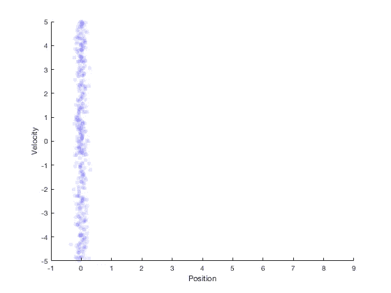

现在考虑机器人移动 1 秒后的场景。当我们移动了 1 s，新的位置就是之前的位置加上速度。所以匀速运动 1 秒后的概率分布就是下图的红点给出的。

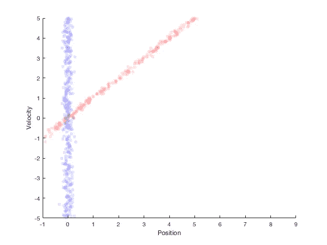

假设机器人以 1 的速度移动，下一个位置估计在 1 左右。通过在该点执行第二次测量，我们得到蓝色区域作为位置估计的可能值。

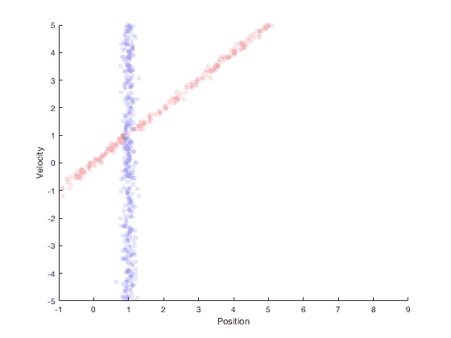

因此，从系统动力学来看，我们期望新的位置在红色区域，从传感器来看，我们期望状态在蓝色区域。这两个分布之间的重叠区域非常小，我们可以说粒子的真实状态将位于这个区域。贝叶斯定理可以用来估计多元状态分布概率。沿着 x 轴和 y 轴呈现速度和位置的相应概率分布。将系统动态与状态测量相结合的过程是卡尔曼滤波器的基本原理。卡尔曼滤波器提供了良好的估计特性，在过程和测量服从高斯分布的特殊情况下是最优的。

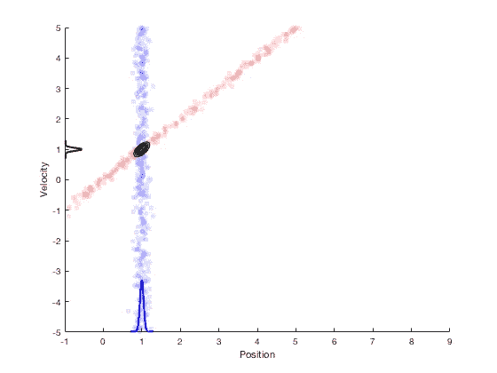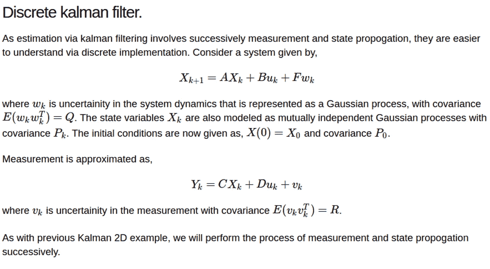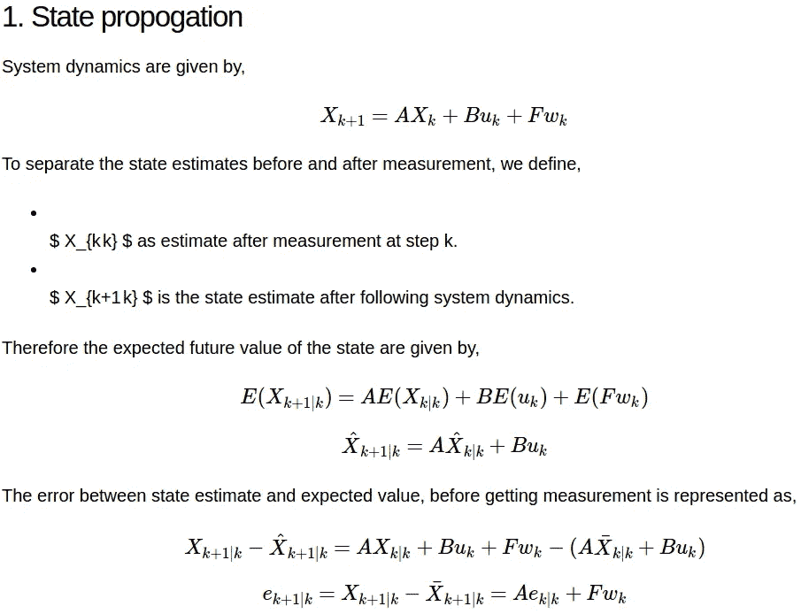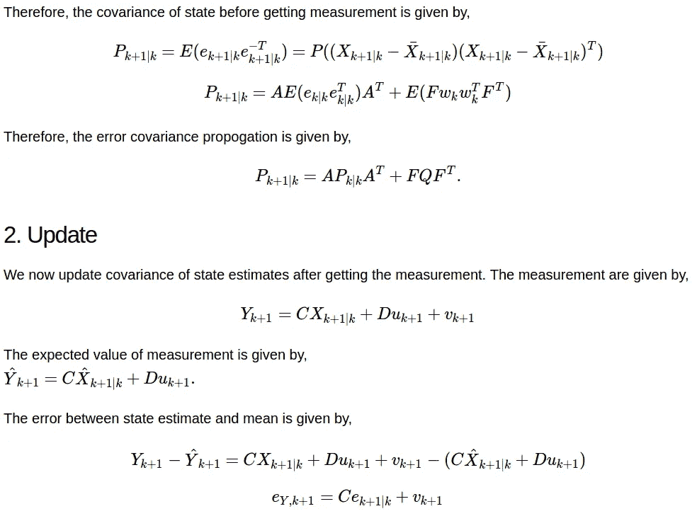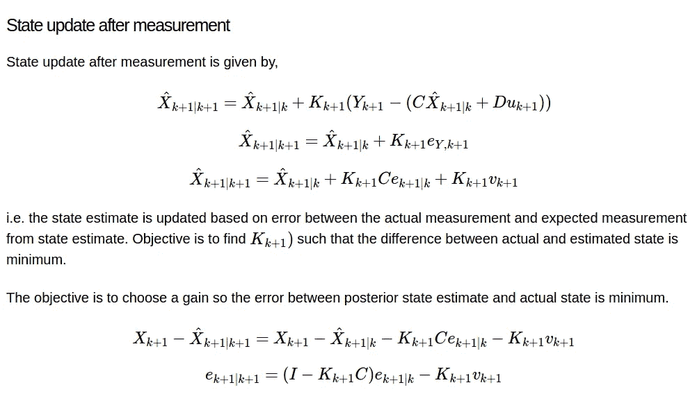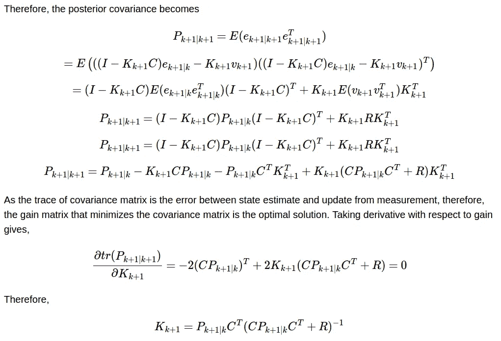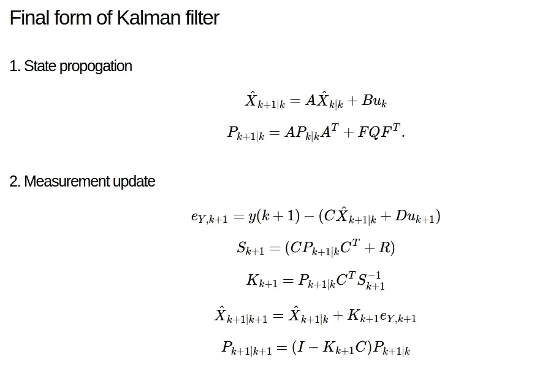

一些更直观的解释:

*   s 是反过来衡量测量误差的灵敏度矩阵。因此，如果传感器噪声过大，R 中的相应条目将会较高，通过求逆，来自该传感器的测量值将会减少。
*   如果 Q 很高，即我们不知道真实的模型，并且我们的近似模型具有大的偏差，则先验协方差估计将会很大，这具有直观意义。
*   对于线性系统，增益项 K 充当来自先验预测的状态估计和基于测量的校正之间的加权因子。

**添加**

**NIS，收敛**

**道歉**

我很抱歉从我的笔记中复制粘贴屏幕截图。我还没有想出一个好的方法来合并介质中的方程。

**参考文献:**

上面所有的截图都来自我在石溪大学开发的一门高级控制系统课程。完整课程的链接是[https://mec560sbu.github.io/](https://mec560sbu.github.io/)。